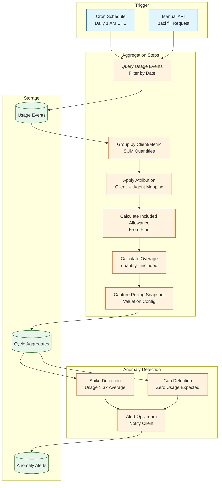

# Usage Aggregation

## Purpose

Compute daily rollups and cycle aggregates from raw usage events, apply attribution, detect anomalies, handle cycle boundaries, and support backfill for billing calculations.

## Aggregation Pipeline



## Daily Rollup Service

### Scheduled Aggregation

```typescript
@Injectable()
export class DailyAggregatorService {
  @Cron('0 1 * * *')  // 1 AM UTC daily
  async aggregateDailyUsage() {
    const yesterday = subDays(new Date(), 1);
    const startOfDay = startOfDay(yesterday);
    const endOfDay = endOfDay(yesterday);
    
    this.logger.info(`Starting daily aggregation for ${startOfDay.toISOString()}`);
    
    // 1. Find all active clients
    const clients = await this.clientRepo.find({ where: { status: 'active' } });
    
    for (const client of clients) {
      await this.aggregateClientUsage(client.id, startOfDay, endOfDay);
    }
    
    // 2. Detect anomalies
    await this.anomalyDetectorService.detectAnomalies(startOfDay);
    
    this.logger.info('Daily aggregation complete');
  }
  
  private async aggregateClientUsage(
    client_id: string,
    period_start: Date,
    period_end: Date,
  ): Promise<void> {
    // 1. Query usage events
    const events = await this.usageEventRepo.find({
      where: {
        client_id,
        occurred_at: Between(period_start, period_end),
      },
      order: { occurred_at: 'ASC' },
    });
    
    if (events.length === 0) {
      this.logger.debug(`No usage for client ${client_id} on ${period_start.toISOString()}`);
      return;
    }
    
    // 2. Group by metric_key and agent_id
    const grouped = this.groupEvents(events);
    
    // 3. Get subscription plan for allowances
    const subscription = await this.subscriptionRepo.findOne({
      where: { client_id, status: 'active' },
      relations: ['plan'],
    });
    
    // 4. Create cycle aggregates
    for (const [key, metrics] of Object.entries(grouped)) {
      const [metric_key, agent_id] = key.split('::');
      
      const includedQuantity = this.getIncludedQuantity(
        subscription?.plan,
        metric_key,
      );
      
      const overageQuantity = Math.max(0, metrics.quantity - includedQuantity);
      
      // 5. Capture pricing snapshot
      const valuationSnapshot = await this.getValuationSnapshot(
        subscription?.plan,
        metric_key,
      );
      
      // 6. Insert or update cycle aggregate (idempotent)
      await this.cycleAggregateRepo.upsert(
        {
          period_start,
          period_end,
          client_id,
          agent_id: agent_id === 'null' ? null : agent_id,
          metric_key,
          quantity: metrics.quantity,
          vendor_cost_cents: metrics.vendor_cost_cents,
          included_quantity: includedQuantity,
          overage_quantity: overageQuantity,
          valuation_snapshot: valuationSnapshot,
        },
        ['period_start', 'period_end', 'client_id', 'metric_key', 'agent_id'],
      );
    }
  }
  
  private groupEvents(events: UsageEvent[]): Record<string, AggregatedMetrics> {
    const grouped: Record<string, AggregatedMetrics> = {};
    
    for (const event of events) {
      const key = `${event.metric_key}::${event.agent_id || 'null'}`;
      
      if (!grouped[key]) {
        grouped[key] = {
          quantity: 0,
          vendor_cost_cents: 0,
        };
      }
      
      grouped[key].quantity += event.quantity;
      grouped[key].vendor_cost_cents += event.vendor_cost_cents;
    }
    
    return grouped;
  }
  
  private getIncludedQuantity(plan: Plan | undefined, metric_key: string): number {
    if (!plan) return 0;
    
    const allowance = plan.allowances?.find(a => a.metric_key === metric_key);
    return allowance?.included_quantity || 0;
  }
  
  private async getValuationSnapshot(
    plan: Plan | undefined,
    metric_key: string,
  ): Promise<Record<string, any>> {
    if (!plan) return {};
    
    const pricing = plan.pricing_rules?.find(r => r.metric_key === metric_key);
    
    if (!pricing) return {};
    
    return {
      unit_rate_cents: pricing.unit_rate_cents,
      cost_plus_markup_percent: pricing.cost_plus_markup_percent,
      cost_plus_markup_fixed_cents: pricing.cost_plus_markup_fixed_cents,
      tiered_rates: pricing.tiered_rates,
    };
  }
}

interface AggregatedMetrics {
  quantity: number;
  vendor_cost_cents: number;
}
```

## Cycle Boundary Handling

### Billing Cycle Alignment

```typescript
@Injectable()
export class CycleBoundaryService {
  async computeCycleAggregate(
    subscription_id: string,
    cycle_start: Date,
    cycle_end: Date,
  ): Promise<CycleAggregate[]> {
    const subscription = await this.subscriptionRepo.findOne({
      where: { id: subscription_id },
      relations: ['customer'],
    });
    
    // 1. Query all usage events in cycle
    const events = await this.usageEventRepo.find({
      where: {
        client_id: subscription.customer.client_id,
        occurred_at: Between(cycle_start, cycle_end),
      },
    });
    
    // 2. Group by metric_key
    const grouped = this.groupEventsByMetric(events);
    
    // 3. Apply plan allowances
    const aggregates: CycleAggregate[] = [];
    
    for (const [metric_key, metrics] of Object.entries(grouped)) {
      const includedQuantity = this.getIncludedQuantity(
        subscription.plan,
        metric_key,
      );
      
      const overageQuantity = Math.max(0, metrics.quantity - includedQuantity);
      
      aggregates.push({
        id: uuidv4(),
        period_start: cycle_start,
        period_end: cycle_end,
        client_id: subscription.customer.client_id,
        metric_key,
        quantity: metrics.quantity,
        vendor_cost_cents: metrics.vendor_cost_cents,
        included_quantity: includedQuantity,
        overage_quantity: overageQuantity,
        valuation_snapshot: await this.getValuationSnapshot(
          subscription.plan,
          metric_key,
        ),
        created_at: new Date(),
      });
    }
    
    return aggregates;
  }
}
```

### Prorated Allowances (Mid-Cycle Changes)

```typescript
async calculateProratedAllowance(
  plan: Plan,
  metric_key: string,
  cycle_start: Date,
  cycle_end: Date,
  change_date: Date,  // Subscription upgraded mid-cycle
): Promise<number> {
  const fullAllowance = this.getIncludedQuantity(plan, metric_key);
  
  // Calculate days remaining in cycle
  const totalDays = differenceInDays(cycle_end, cycle_start);
  const remainingDays = differenceInDays(cycle_end, change_date);
  
  // Prorate allowance
  const proratedAllowance = (fullAllowance / totalDays) * remainingDays;
  
  return Math.floor(proratedAllowance);
}
```

## Attribution Service

### Resolve Client & Agent

```typescript
@Injectable()
export class AttributionService {
  async attributeCall(call_id: string): Promise<Attribution> {
    // 1. Lookup call in Retell metadata
    const call = await this.retellAdapter.getCall(call_id);
    
    // 2. Find deployment by retell_agent_id
    const deployment = await this.deploymentRepo.findOne({
      where: { provider_agent_id: call.agent_id },
    });
    
    if (!deployment) {
      this.logger.error(`Deployment not found for retell agent ${call.agent_id}`);
      return { client_id: null, agent_id: null };
    }
    
    return {
      client_id: deployment.client_id,
      agent_id: deployment.agent_id,
    };
  }
  
  async attributeMessage(message_sid: string): Promise<Attribution> {
    // Twilio messages: lookup by phone number
    const message = await this.twilioAdapter.getMessage(message_sid);
    
    // Find client by phone number mapping
    const phoneMapping = await this.phoneMappingRepo.findOne({
      where: { phone_number: message.to },
    });
    
    if (!phoneMapping) {
      this.logger.error(`Phone mapping not found for ${message.to}`);
      return { client_id: null };
    }
    
    return { client_id: phoneMapping.client_id };
  }
}

interface Attribution {
  client_id: string | null;
  agent_id?: string | null;
}
```

## Anomaly Detection

### Spike Detection

```typescript
@Injectable()
export class AnomalyDetectorService {
  async detectSpikes(date: Date): Promise<Anomaly[]> {
    const anomalies: Anomaly[] = [];
    
    // 1. Get all clients
    const clients = await this.clientRepo.find();
    
    for (const client of clients) {
      // 2. Get current day's usage
      const current = await this.getDailyUsage(client.id, date);
      
      // 3. Get 7-day moving average (excluding today)
      const historical = await this.get7DayAverage(client.id, subDays(date, 1));
      
      // 4. Check for spike (> 3× average)
      for (const [metric_key, quantity] of Object.entries(current)) {
        const avg = historical[metric_key] || 0;
        
        if (avg > 0 && quantity > avg * 3) {
          anomalies.push({
            type: 'spike',
            client_id: client.id,
            metric_key,
            date: date.toISOString(),
            current: quantity,
            baseline: avg,
            severity: quantity > avg * 10 ? 'critical' : 'warning',
          });
        }
      }
    }
    
    return anomalies;
  }
  
  private async getDailyUsage(
    client_id: string,
    date: Date,
  ): Promise<Record<string, number>> {
    const events = await this.usageEventRepo.find({
      where: {
        client_id,
        occurred_at: Between(startOfDay(date), endOfDay(date)),
      },
    });
    
    const usage: Record<string, number> = {};
    
    for (const event of events) {
      usage[event.metric_key] = (usage[event.metric_key] || 0) + event.quantity;
    }
    
    return usage;
  }
  
  private async get7DayAverage(
    client_id: string,
    endDate: Date,
  ): Promise<Record<string, number>> {
    const startDate = subDays(endDate, 7);
    
    const events = await this.usageEventRepo.find({
      where: {
        client_id,
        occurred_at: Between(startDate, endDate),
      },
    });
    
    const totals: Record<string, number> = {};
    
    for (const event of events) {
      totals[event.metric_key] = (totals[event.metric_key] || 0) + event.quantity;
    }
    
    // Average over 7 days
    const averages: Record<string, number> = {};
    for (const [metric, total] of Object.entries(totals)) {
      averages[metric] = total / 7;
    }
    
    return averages;
  }
}
```

### Gap Detection

```typescript
async detectGaps(date: Date): Promise<Anomaly[]> {
  const anomalies: Anomaly[] = [];
  
  const clients = await this.clientRepo.find({ where: { status: 'active' } });
  
  for (const client of clients) {
    const current = await this.getDailyUsage(client.id, date);
    const historical = await this.get7DayAverage(client.id, subDays(date, 1));
    
    // Check for missing usage (expected > 0, actual = 0)
    for (const [metric_key, avg] of Object.entries(historical)) {
      if (avg > 0 && !current[metric_key]) {
        anomalies.push({
          type: 'gap',
          client_id: client.id,
          metric_key,
          date: date.toISOString(),
          current: 0,
          baseline: avg,
          severity: 'warning',
        });
      }
    }
  }
  
  return anomalies;
}
```

### Alert Ops Team

```typescript
async alertAnomalies(anomalies: Anomaly[]): Promise<void> {
  for (const anomaly of anomalies) {
    // 1. Store alert
    await this.alertRepo.save(anomaly);
    
    // 2. Send notification
    await this.notificationService.send({
      channel: 'ops',
      type: 'usage_anomaly',
      severity: anomaly.severity,
      title: `Usage ${anomaly.type} detected`,
      message: this.formatAnomalyMessage(anomaly),
    });
    
    // 3. Update metrics
    await this.metricsService.increment('usage.anomalies_detected', {
      type: anomaly.type,
      severity: anomaly.severity,
    });
  }
}

private formatAnomalyMessage(anomaly: Anomaly): string {
  if (anomaly.type === 'spike') {
    return `Client ${anomaly.client_id} ${anomaly.metric_key} usage spiked to ${anomaly.current} (baseline: ${anomaly.baseline})`;
  } else {
    return `Client ${anomaly.client_id} ${anomaly.metric_key} usage dropped to zero (expected: ${anomaly.baseline})`;
  }
}
```

## Backfill Procedures

### Manual Backfill API

```typescript
@Controller('/billing/aggregate')
export class AggregationController {
  @Post('/backfill')
  @HttpCode(202)
  async backfillAggregates(
    @Body() body: BackfillRequest,
  ): Promise<{ job_id: string }> {
    // 1. Enqueue backfill job
    const job = await this.queue.add('backfill-aggregates', {
      start_date: body.start_date,
      end_date: body.end_date,
      client_id: body.client_id,
    });
    
    return { job_id: job.id };
  }
}

interface BackfillRequest {
  start_date: string;  // ISO 8601
  end_date: string;
  client_id?: string;  // Optional: backfill specific client
}
```

### Backfill Worker

```typescript
@Processor('usage-aggregation')
export class BackfillWorker {
  @Process('backfill-aggregates')
  async backfillAggregates(job: Job<BackfillRequest>) {
    const { start_date, end_date, client_id } = job.data;
    
    const startDate = new Date(start_date);
    const endDate = new Date(end_date);
    
    // 1. Iterate through each day
    let currentDate = startDate;
    
    while (currentDate <= endDate) {
      const dayStart = startOfDay(currentDate);
      const dayEnd = endOfDay(currentDate);
      
      // 2. Aggregate for specific client or all clients
      if (client_id) {
        await this.aggregateClientUsage(client_id, dayStart, dayEnd);
      } else {
        const clients = await this.clientRepo.find();
        for (const client of clients) {
          await this.aggregateClientUsage(client.id, dayStart, dayEnd);
        }
      }
      
      // 3. Update job progress
      const progress = differenceInDays(currentDate, startDate) / differenceInDays(endDate, startDate);
      await job.progress(progress * 100);
      
      currentDate = addDays(currentDate, 1);
    }
    
    this.logger.info(`Backfill complete: ${start_date} to ${end_date}`);
  }
}
```

## Reconciliation

### Compare Webhook vs. API Polling

```typescript
@Injectable()
export class ReconciliationService {
  @Cron('0 2 * * *')  // 2 AM UTC daily
  async reconcileDailyUsage() {
    const yesterday = subDays(new Date(), 1);
    
    // 1. Count events by collection method
    const webhookCount = await this.usageEventRepo.count({
      where: {
        occurred_at: Between(startOfDay(yesterday), endOfDay(yesterday)),
        metadata: { collection_method: 'webhook' },
      },
    });
    
    const apiCount = await this.usageEventRepo.count({
      where: {
        occurred_at: Between(startOfDay(yesterday), endOfDay(yesterday)),
        metadata: { collection_method: 'api_poll' },
      },
    });
    
    // 2. Calculate discrepancy
    const total = webhookCount + apiCount;
    const discrepancy = Math.abs(webhookCount - apiCount) / total;
    
    if (discrepancy > 0.01) {  // > 1% discrepancy
      await this.alertService.send({
        type: 'reconciliation_discrepancy',
        severity: 'warning',
        message: `Webhook vs. API poll count mismatch: ${webhookCount} vs ${apiCount}`,
      });
    }
  }
}
```

## Performance Optimization

### Batch Processing

```typescript
async aggregateInBatches(client_ids: string[], date: Date) {
  const batchSize = 100;
  
  for (let i = 0; i < client_ids.length; i += batchSize) {
    const batch = client_ids.slice(i, i + batchSize);
    
    await Promise.all(
      batch.map(client_id =>
        this.aggregateClientUsage(client_id, startOfDay(date), endOfDay(date)),
      ),
    );
  }
}
```

### Database Indexes

```sql
-- Speed up aggregation queries
CREATE INDEX idx_usage_client_occurred ON usage_events(client_id, occurred_at);
CREATE INDEX idx_usage_metric_occurred ON usage_events(metric_key, occurred_at);
```

## Metrics & Monitoring

```typescript
// Aggregation metrics
usage.aggregation.duration_ms
usage.aggregation.clients_processed
usage.aggregation.events_aggregated

// Anomaly metrics
usage.anomalies.detected{type=spike,severity=critical}
usage.anomalies.detected{type=gap}

// Backfill metrics
usage.backfill.jobs_completed
usage.backfill.duration_ms
```

## Next Steps

Refer to:
- [Reporting](./reporting.md) - Query cycle aggregates for analytics
- [Data Model](./data-model.md) - Aggregate table schema
- [Collectors](./collectors.md) - Source usage events
