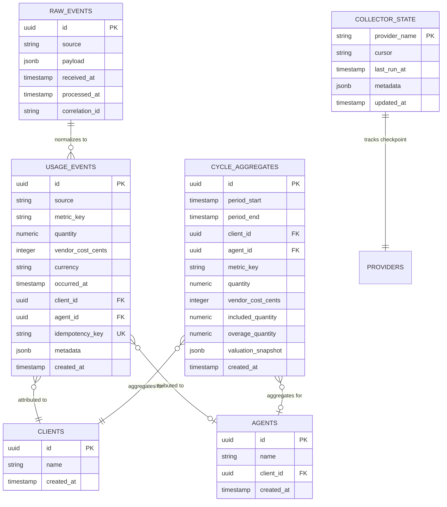

# Billing-Usage Data Model

## Purpose

Define database schema for usage events, cycle aggregates, and collector state. Ensure idempotency, attribution, and efficient queries for billing and analytics.

## Entity Relationship Diagram



## Table Definitions

### raw_events

Store unprocessed provider events for audit and replay.

```sql
CREATE TABLE raw_events (
  id UUID PRIMARY KEY DEFAULT gen_random_uuid(),
  source VARCHAR(50) NOT NULL,  -- 'retell', 'twilio', 'openrouter'
  payload JSONB NOT NULL,        -- Provider-specific JSON
  received_at TIMESTAMPTZ NOT NULL DEFAULT now(),
  processed_at TIMESTAMPTZ,      -- NULL until normalized
  correlation_id VARCHAR(255),   -- For distributed tracing
  created_at TIMESTAMPTZ NOT NULL DEFAULT now()
);

CREATE INDEX idx_raw_events_source ON raw_events(source);
CREATE INDEX idx_raw_events_received_at ON raw_events(received_at);
CREATE INDEX idx_raw_events_processed_at ON raw_events(processed_at) WHERE processed_at IS NULL;
```

**Data Retention**: 13 months. Archive to S3 after 13 months.

### usage_events

Canonical usage events with attribution and idempotency.

```sql
CREATE TABLE usage_events (
  id UUID PRIMARY KEY DEFAULT gen_random_uuid(),
  source VARCHAR(50) NOT NULL,        -- 'retell', 'twilio', 'openrouter'
  metric_key VARCHAR(100) NOT NULL,   -- 'voice_minutes', 'sms_count', 'llm_tokens'
  quantity NUMERIC(20, 6) NOT NULL,   -- Units consumed (supports fractional)
  vendor_cost_cents INTEGER NOT NULL, -- Provider-reported cost
  currency VARCHAR(3) NOT NULL DEFAULT 'USD',
  occurred_at TIMESTAMPTZ NOT NULL,   -- Provider-reported event time
  client_id UUID NOT NULL REFERENCES clients(id),
  agent_id UUID REFERENCES agents(id),  -- Optional (not all usage has agent context)
  idempotency_key VARCHAR(255) NOT NULL UNIQUE,  -- Prevents duplicates
  metadata JSONB,                      -- Provider-specific fields
  created_at TIMESTAMPTZ NOT NULL DEFAULT now(),  -- Collection timestamp
  
  CONSTRAINT chk_quantity_positive CHECK (quantity > 0),
  CONSTRAINT chk_cost_non_negative CHECK (vendor_cost_cents >= 0)
);

-- Performance indexes
CREATE INDEX idx_usage_client_occurred ON usage_events(client_id, occurred_at DESC);
CREATE INDEX idx_usage_metric_occurred ON usage_events(metric_key, occurred_at DESC);
CREATE INDEX idx_usage_agent_occurred ON usage_events(agent_id, occurred_at DESC) WHERE agent_id IS NOT NULL;
CREATE INDEX idx_usage_source_occurred ON usage_events(source, occurred_at DESC);
CREATE INDEX idx_usage_occurred_at ON usage_events(occurred_at DESC);

-- Idempotency constraint (prevent duplicate inserts)
CREATE UNIQUE INDEX idx_usage_idempotency ON usage_events(idempotency_key);
```

**Partitioning** (future optimization):
```sql
-- Partition by occurred_at (monthly)
CREATE TABLE usage_events (
  ...
) PARTITION BY RANGE (occurred_at);

CREATE TABLE usage_events_2025_10 PARTITION OF usage_events
  FOR VALUES FROM ('2025-10-01') TO ('2025-11-01');
```

**Data Retention**: 13 months. Archive to S3 (Parquet) after 13 months.

### cycle_aggregates

Pre-computed rollups for billing cycles.

```sql
CREATE TABLE cycle_aggregates (
  id UUID PRIMARY KEY DEFAULT gen_random_uuid(),
  period_start TIMESTAMPTZ NOT NULL,   -- Cycle start
  period_end TIMESTAMPTZ NOT NULL,     -- Cycle end
  client_id UUID NOT NULL REFERENCES clients(id),
  agent_id UUID REFERENCES agents(id),
  metric_key VARCHAR(100) NOT NULL,
  quantity NUMERIC(20, 6) NOT NULL,    -- Total usage
  vendor_cost_cents INTEGER NOT NULL,   -- Total vendor cost
  included_quantity NUMERIC(20, 6) NOT NULL DEFAULT 0,  -- Allowance from plan
  overage_quantity NUMERIC(20, 6) NOT NULL DEFAULT 0,   -- Billable overage
  valuation_snapshot JSONB,             -- Pricing at time of calculation
  created_at TIMESTAMPTZ NOT NULL DEFAULT now(),
  
  CONSTRAINT chk_period_valid CHECK (period_end > period_start),
  CONSTRAINT chk_aggregate_quantities CHECK (quantity >= 0 AND included_quantity >= 0 AND overage_quantity >= 0)
);

-- Unique constraint: One aggregate per (period, client, metric, agent)
CREATE UNIQUE INDEX idx_cycle_agg_unique ON cycle_aggregates(
  period_start, period_end, client_id, metric_key, COALESCE(agent_id, '00000000-0000-0000-0000-000000000000'::UUID)
);

-- Query indexes
CREATE INDEX idx_cycle_agg_client_period ON cycle_aggregates(client_id, period_start DESC);
CREATE INDEX idx_cycle_agg_period ON cycle_aggregates(period_start DESC);
```

**Data Retention**: Indefinite (used for historical billing analysis).

### collector_state

Track API polling checkpoints (cursor-based pagination).

```sql
CREATE TABLE collector_state (
  provider_name VARCHAR(50) PRIMARY KEY,  -- 'retell', 'twilio', 'openrouter'
  cursor TEXT,                            -- Provider-specific pagination cursor
  last_run_at TIMESTAMPTZ NOT NULL,       -- Last successful collection
  metadata JSONB,                         -- Provider-specific state (e.g., filters)
  updated_at TIMESTAMPTZ NOT NULL DEFAULT now()
);
```

**Example Data**:
```json
{
  "provider_name": "retell",
  "cursor": "eyJsYXN0X2lkIjogIjEyMzQ1In0=",  // Base64-encoded cursor
  "last_run_at": "2025-10-15T14:30:00Z",
  "metadata": {
    "api_version": "v2",
    "filter": "status=completed"
  }
}
```

## Sample Data

### usage_events

```sql
INSERT INTO usage_events (
  source, metric_key, quantity, vendor_cost_cents, currency,
  occurred_at, client_id, agent_id, idempotency_key, metadata
) VALUES
  (
    'retell',
    'voice_minutes',
    12.5,
    375,
    'USD',
    '2025-10-15T10:30:00Z',
    'c1234567-89ab-cdef-0123-456789abcdef',
    'a9876543-210f-edcb-a987-6543210fedcb',
    'retell:call.ended:call_abc123',
    '{"call_id": "call_abc123", "duration_seconds": 750, "llm_tokens": 5000}'
  ),
  (
    'twilio',
    'sms_count',
    1,
    79,
    'USD',
    '2025-10-15T11:00:00Z',
    'c1234567-89ab-cdef-0123-456789abcdef',
    NULL,
    'twilio:message.sent:SM123abc',
    '{"message_sid": "SM123abc", "to": "+1234567890", "status": "delivered"}'
  ),
  (
    'openrouter',
    'llm_tokens',
    50000,
    1000,
    'USD',
    '2025-10-15T12:00:00Z',
    'c1234567-89ab-cdef-0123-456789abcdef',
    'a9876543-210f-edcb-a987-6543210fedcb',
    'openrouter:generation:req_xyz789',
    '{"request_id": "req_xyz789", "model": "anthropic/claude-3-opus", "tokens": 50000}'
  );
```

### cycle_aggregates

```sql
INSERT INTO cycle_aggregates (
  period_start, period_end, client_id, agent_id, metric_key,
  quantity, vendor_cost_cents, included_quantity, overage_quantity, valuation_snapshot
) VALUES
  (
    '2025-10-01T00:00:00Z',
    '2025-10-31T23:59:59Z',
    'c1234567-89ab-cdef-0123-456789abcdef',
    'a9876543-210f-edcb-a987-6543210fedcb',
    'voice_minutes',
    1250.0,
    37500,
    1000.0,
    250.0,
    '{"unit_rate_cents": 50, "cost_plus_markup_percent": 0.25, "included_in_plan": 1000}'
  ),
  (
    '2025-10-01T00:00:00Z',
    '2025-10-31T23:59:59Z',
    'c1234567-89ab-cdef-0123-456789abcdef',
    NULL,
    'sms_count',
    150,
    11850,
    0,
    150,
    '{"unit_rate_cents": 100, "vendor_cost_per_unit_cents": 79}'
  );
```

## Query Patterns

### 1. Get Usage for Client in Period

```sql
SELECT
  metric_key,
  SUM(quantity) AS total_quantity,
  SUM(vendor_cost_cents) AS total_vendor_cost_cents
FROM usage_events
WHERE client_id = $1
  AND occurred_at >= $2
  AND occurred_at < $3
GROUP BY metric_key
ORDER BY total_vendor_cost_cents DESC;
```

### 2. Get Cycle Aggregate for Billing

```sql
SELECT
  client_id,
  metric_key,
  quantity,
  included_quantity,
  overage_quantity,
  vendor_cost_cents,
  valuation_snapshot
FROM cycle_aggregates
WHERE period_start = $1
  AND period_end = $2
  AND client_id = $3;
```

### 3. Detect Unprocessed Raw Events

```sql
SELECT id, source, received_at
FROM raw_events
WHERE processed_at IS NULL
  AND received_at < now() - INTERVAL '15 minutes'
ORDER BY received_at ASC
LIMIT 100;
```

### 4. Check for Duplicate Events

```sql
-- Before inserting, check idempotency
SELECT EXISTS(
  SELECT 1 FROM usage_events WHERE idempotency_key = $1
) AS is_duplicate;
```

### 5. Daily Usage Trend

```sql
SELECT
  DATE(occurred_at) AS usage_date,
  metric_key,
  SUM(quantity) AS daily_total,
  SUM(vendor_cost_cents) AS daily_cost_cents
FROM usage_events
WHERE client_id = $1
  AND occurred_at >= now() - INTERVAL '30 days'
GROUP BY usage_date, metric_key
ORDER BY usage_date DESC, daily_cost_cents DESC;
```

## Idempotency Key Format

### Retell AI

```
Format: retell:<event_type>:<call_id>
Example: retell:call.ended:call_abc123
```

### Twilio

```
Format: twilio:<event_type>:<sid>
Examples:
  twilio:message.sent:SM123abc
  twilio:call.completed:CA456def
```

### OpenRouter

```
Format: openrouter:generation:<request_id>
Example: openrouter:generation:req_xyz789
```

## Data Integrity Rules

### Immutability

Usage events are **append-only**. No updates or deletes allowed (except archival):

```sql
-- Prevent updates/deletes via trigger
CREATE OR REPLACE FUNCTION prevent_usage_event_modification()
RETURNS TRIGGER AS $$
BEGIN
  RAISE EXCEPTION 'usage_events are immutable';
END;
$$ LANGUAGE plpgsql;

CREATE TRIGGER trg_prevent_usage_event_update
  BEFORE UPDATE ON usage_events
  FOR EACH ROW
  EXECUTE FUNCTION prevent_usage_event_modification();

CREATE TRIGGER trg_prevent_usage_event_delete
  BEFORE DELETE ON usage_events
  FOR EACH ROW
  EXECUTE FUNCTION prevent_usage_event_modification();
```

### Attribution Validation

Ensure `client_id` and `agent_id` references are valid:

```sql
-- Foreign key constraints enforce referential integrity
ALTER TABLE usage_events
  ADD CONSTRAINT fk_usage_client
    FOREIGN KEY (client_id) REFERENCES clients(id) ON DELETE RESTRICT;

ALTER TABLE usage_events
  ADD CONSTRAINT fk_usage_agent
    FOREIGN KEY (agent_id) REFERENCES agents(id) ON DELETE SET NULL;
```

## Archival & Retention

### Archival Process

1. **Export to S3** (monthly cron):
```sql
COPY (
  SELECT * FROM usage_events
  WHERE occurred_at >= '2024-09-01' AND occurred_at < '2024-10-01'
) TO PROGRAM 'gzip > /tmp/usage_events_2024_09.csv.gz' WITH CSV HEADER;
```

2. **Upload to S3**:
```bash
aws s3 cp /tmp/usage_events_2024_09.csv.gz s3://max-ai-archives/usage-events/2024/09/
```

3. **Delete from PostgreSQL**:
```sql
DELETE FROM usage_events
WHERE occurred_at >= '2024-09-01' AND occurred_at < '2024-10-01';
```

### Retention Policy

| Table | Retention | Archive Location |
|-------|-----------|------------------|
| `raw_events` | 13 months | S3 (JSON.gz) |
| `usage_events` | 13 months | S3 (CSV.gz or Parquet) |
| `cycle_aggregates` | Indefinite | - |
| `collector_state` | Current only | - |

## Performance Considerations

### Indexing Strategy

- **Composite indexes** for common queries (client_id + occurred_at)
- **Partial indexes** for NULL checks (agent_id, processed_at)
- **BRIN indexes** for time-series data (occurred_at) on partitioned tables

### Partitioning (Future)

When `usage_events` exceeds 10M rows, partition by month:
```sql
CREATE TABLE usage_events_2025_10 PARTITION OF usage_events
  FOR VALUES FROM ('2025-10-01') TO ('2025-11-01');
```

### Aggregation Tables

`cycle_aggregates` provides O(1) lookups for billing calculations, avoiding expensive SUM() queries on millions of rows.

## Migrations

### Initial Schema

```bash
# Create tables
psql -d max_ai_platform -f migrations/001_create_usage_tables.sql

# Add indexes
psql -d max_ai_platform -f migrations/002_create_usage_indexes.sql

# Add triggers
psql -d max_ai_platform -f migrations/003_create_usage_triggers.sql
```

### Rollback Plan

```sql
-- Drop tables (WARNING: Destructive)
DROP TABLE IF EXISTS cycle_aggregates CASCADE;
DROP TABLE IF EXISTS usage_events CASCADE;
DROP TABLE IF EXISTS raw_events CASCADE;
DROP TABLE IF EXISTS collector_state CASCADE;
```

## Next Steps

Refer to:
- [Collectors](./collectors.md) - Populate `raw_events` and `usage_events`
- [Aggregation](./aggregation.md) - Compute `cycle_aggregates`
- [Reporting](./reporting.md) - Query usage data for analytics
