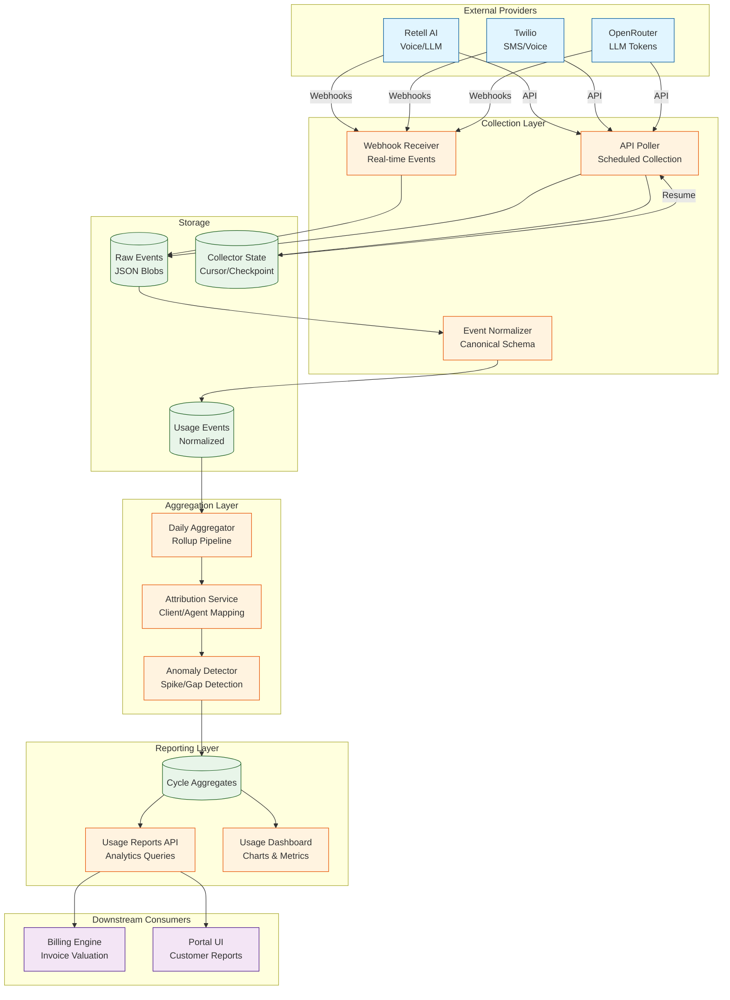
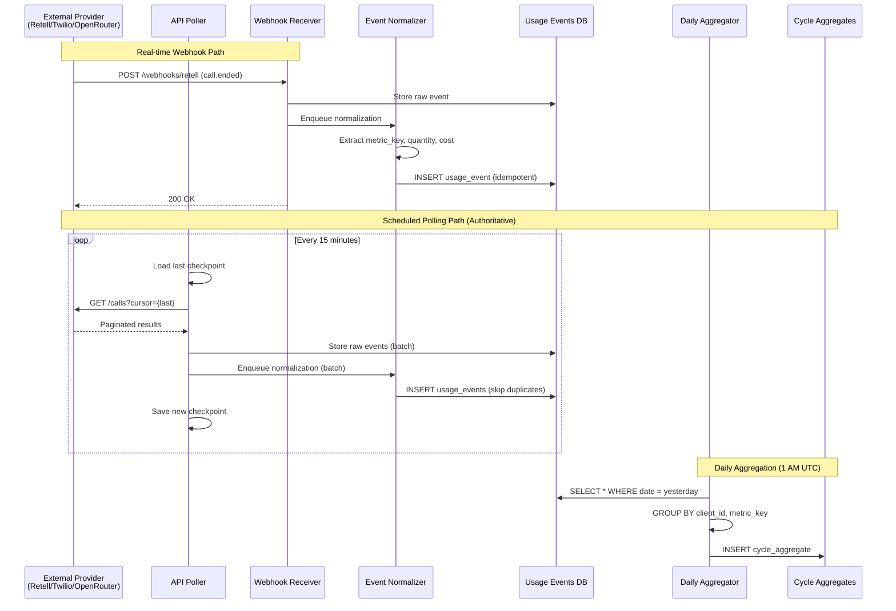

# Billing-Usage Component Overview

## Purpose

Collect billable usage from external providers, normalize into canonical events, attribute to clients/agents, compute cycle aggregates, and expose usage analytics for billing and operational insights.

## Component Architecture



## Design Philosophy

### 1. Dual Collection Strategy

**Webhooks (Real-time)**:
- Low-latency collection (< 1 minute)
- Best-effort delivery from provider
- Used for operational dashboards

**API Polling (Scheduled)**:
- Guaranteed completeness (pagination, retry)
- Runs every 15 minutes with cursor-based pagination
- Used for billing calculations (authoritative)

**Reconciliation**: Compare webhook vs. API poll counts; backfill gaps.

### 2. Idempotency & Deduplication

Every usage event has a unique `idempotency_key` (provider event ID or composite key):
```
idempotency_key = `{provider}:{event_type}:{provider_event_id}`
```

Database UNIQUE constraint prevents duplicate insertion:
```sql
CREATE UNIQUE INDEX idx_usage_idempotency ON usage_events (idempotency_key);
```

### 3. Attribution

Map vendor-specific identifiers to platform entities:
```
Retell call_id → client_id + agent_id (via deployment metadata)
Twilio message_sid → client_id (via webhook context)
OpenRouter request_id → client_id + prompt_id (via correlation_id)
```

Attribution service maintains lookup tables and handles missing mappings.

### 4. Anomaly Detection

Detect usage anomalies:
- **Spike**: Daily usage > 3× 7-day moving average
- **Gap**: Zero usage when historical average > 0
- **Missing Data**: Expected events not collected (compare webhook vs. API)

Alert ops team for investigation.

### 5. Cycle Boundaries

Billing cycles align with subscription periods (monthly, annual):
```
Cycle Start: 2025-10-01T00:00:00Z (customer timezone)
Cycle End: 2025-10-31T23:59:59Z
```

Events timestamped by `occurred_at` (provider-reported time), not collection time.

## Component Responsibilities

### Webhook Receiver

- Receive webhooks from providers (via Webhook Ingress)
- Store raw event JSON (for audit/replay)
- Enqueue for normalization

### API Poller

- Poll provider APIs on schedule (cron: `*/15 * * * *`)
- Paginate through results (cursor-based)
- Store last checkpoint in `collector_state`
- Handle rate limits (429 → backoff)

### Event Normalizer

- Transform provider-specific schemas to canonical `UsageEvent`
- Extract metric type, quantity, vendor cost
- Generate idempotency key
- Validate schema (JSON Schema)

```typescript
interface UsageEvent {
  id: string;                    // UUID
  source: 'retell' | 'twilio' | 'openrouter';
  metric_key: string;            // e.g., 'voice_minutes', 'sms_count', 'llm_tokens'
  quantity: number;              // Units consumed
  vendor_cost_cents: number;     // Provider-reported cost
  currency: 'USD';
  occurred_at: Date;             // Event timestamp
  client_id: string;             // Attributed client
  agent_id?: string;             // Attributed agent (optional)
  idempotency_key: string;       // Unique dedup key
  metadata: Record<string, any>; // Provider-specific fields
  created_at: Date;              // Collection timestamp
}
```

### Daily Aggregator

- Runs daily at 1 AM UTC (`0 1 * * *`)
- Groups events by `client_id`, `metric_key`, `date`
- Computes totals: `SUM(quantity)`, `SUM(vendor_cost_cents)`
- Stores in `cycle_aggregates` table
- Idempotent: Safe to re-run for same date

```typescript
interface CycleAggregate {
  id: string;
  period_start: Date;            // Cycle start
  period_end: Date;              // Cycle end
  client_id: string;
  agent_id?: string;
  metric_key: string;            // e.g., 'voice_minutes'
  quantity: number;              // Total units
  vendor_cost_cents: number;     // Total vendor cost
  included_quantity: number;     // Included allowance (from plan)
  overage_quantity: number;      // Billable overage
  valuation_snapshot: {          // Pricing at time of calculation
    unit_rate_cents?: number;
    cost_plus_markup_percent?: number;
    cost_plus_markup_fixed_cents?: number;
  };
  created_at: Date;
}
```

### Attribution Service

Resolve provider IDs to platform entities:
```typescript
async attributeEvent(raw: RawEvent): Promise<Attribution> {
  if (raw.source === 'retell') {
    // Retell: call_id → deployment_id → client_id + agent_id
    const call = await this.retellAdapter.getCall(raw.call_id);
    const deployment = await this.deploymentService.findByRetellAgentId(call.agent_id);
    return {
      client_id: deployment.client_id,
      agent_id: deployment.agent_id,
    };
  }
  
  if (raw.source === 'twilio') {
    // Twilio: webhook context includes client_id
    return {
      client_id: raw.metadata.client_id,
    };
  }
  
  // ... OpenRouter attribution
}
```

### Anomaly Detector

Compare current usage against historical baseline:
```typescript
async detectAnomalies(date: Date): Promise<Anomaly[]> {
  const clients = await this.getActiveClients();
  const anomalies: Anomaly[] = [];
  
  for (const client of clients) {
    const currentUsage = await this.getUsage(client.id, date);
    const historicalAvg = await this.get7DayAverage(client.id, date);
    
    if (currentUsage > historicalAvg * 3) {
      anomalies.push({
        type: 'spike',
        client_id: client.id,
        date,
        current: currentUsage,
        baseline: historicalAvg,
      });
    } else if (currentUsage === 0 && historicalAvg > 0) {
      anomalies.push({
        type: 'gap',
        client_id: client.id,
        date,
      });
    }
  }
  
  return anomalies;
}
```

### Usage Reports API

Expose aggregated usage for dashboards and billing:
```typescript
GET /billing/usage/reports?client_id={id}&period_start={ts}&period_end={ts}

Response:
{
  "period": {
    "start": "2025-10-01T00:00:00Z",
    "end": "2025-10-31T23:59:59Z"
  },
  "metrics": [
    {
      "metric_key": "voice_minutes",
      "quantity": 1250,
      "vendor_cost_cents": 37500,
      "included_quantity": 1000,
      "overage_quantity": 250
    },
    {
      "metric_key": "llm_tokens",
      "quantity": 500000,
      "vendor_cost_cents": 1000,
      "overage_quantity": 500000
    }
  ],
  "total_vendor_cost_cents": 38500
}
```

## Integration Points

### Upstream Integrations

| System | Direction | Purpose | Protocol |
|--------|-----------|---------|----------|
| Webhook Ingress | Inbound | Real-time events | HTTP POST |
| Retell API | Outbound | Poll call records | REST API |
| Twilio API | Outbound | Poll message/call logs | REST API |
| OpenRouter API | Outbound | Poll generation logs | REST API |

### Downstream Consumers

| System | Data Flow | Purpose |
|--------|-----------|---------|
| Payments/Billing Engine | Cycle aggregates → Invoice line items | Compute invoice charges |
| Portal UI | Usage reports → Dashboards | Customer-facing usage analytics |
| IAM | Client/agent attribution | Authorization context |

## Collection Flow



## Non-Functional Requirements

### Performance
- **Collection Latency**: < 5 min (webhook), < 15 min (polling)
- **Aggregation Latency**: Daily rollups complete by 1:15 AM UTC
- **Query Performance**: Usage reports < 200ms P95
- **Throughput**: 1000 events/second (burst)

### Reliability
- **Coverage**: ≥95% (detect gaps via anomaly detection)
- **Idempotency**: No duplicate charges (unique constraint)
- **Retry Logic**: Exponential backoff for API failures (max 5 retries)
- **Graceful Degradation**: Webhook failures don't block polling

### Data Integrity
- **Reconciliation**: Compare webhook vs. API counts daily
- **Immutability**: Usage events are append-only (no updates)
- **Audit Trail**: Retain raw event JSON for 13 months

### Scalability
- **Sharding**: Partition `usage_events` by `client_id` (future)
- **Archival**: Move events > 13 months to cold storage (S3)
- **Horizontal Scaling**: API pollers run as distributed workers

## Security & Compliance

- **API Credentials**: Store provider API keys in Secret Manager (GCP)
- **RBAC**: Usage reports filtered by user's client scope
- **Encryption**: At-rest (PostgreSQL) and in-transit (TLS)
- **PII Handling**: No PII in usage events (client_id only, no names/emails)

## Error Handling

### API Polling Errors

| Error | Response | Strategy |
|-------|----------|----------|
| 401 Unauthorized | Invalid API key | Alert ops, halt collector |
| 429 Too Many Requests | Rate limit | Exponential backoff (retry after X seconds) |
| 500 Server Error | Provider downtime | Retry 5× with backoff, alert if persistent |
| Network Timeout | Connection failure | Retry 3×, alert if all fail |

### Webhook Failures

- Return 200 OK to provider even if normalization fails
- Store raw event for manual replay
- Log error to observability platform

### Attribution Failures

- Store event with `client_id = null`
- Flag for manual review
- Alert ops if > 1% of events unmapped

## Metrics & Monitoring

```typescript
// Collection metrics
usage.events_collected{source=retell,method=webhook}
usage.events_collected{source=retell,method=api_poll}
usage.collection_duration_ms{source=retell}
usage.collection_errors{source=retell,error_type=429}

// Aggregation metrics
usage.aggregation_duration_ms
usage.anomalies_detected{type=spike}
usage.unmapped_events_count

// API metrics
usage.reports_query_duration_ms
usage.reports_requests_per_minute
```

## Observability

- **Logs**: Structured JSON logs with `correlation_id` for tracing
- **Traces**: OpenTelemetry spans for collection → normalization → aggregation
- **Dashboards**: Grafana dashboards for collection health, anomalies, query performance

## Next Steps

Refer to:
- [Data Model](./data-model.md) - Database schema details
- [Collectors](./collectors.md) - Provider-specific collection logic
- [Aggregation](./aggregation.md) - Daily rollup pipeline
- [Reporting](./reporting.md) - Usage analytics APIs
