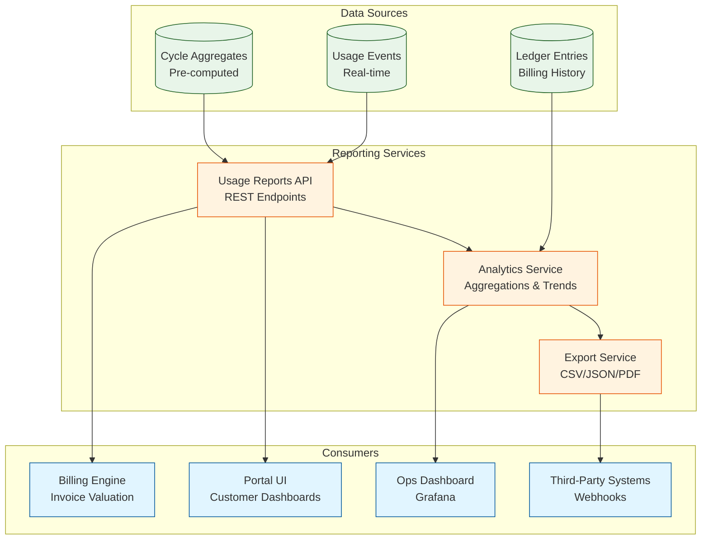

# Usage Reporting & Analytics

## Purpose

Expose usage data via REST APIs and dashboards for billing calculations, customer analytics, operational insights, and cost attribution.

## Reporting Architecture



## Usage Reports API

### Get Cycle Usage

```typescript
GET /billing/usage/reports?client_id={id}&period_start={ts}&period_end={ts}

Query Parameters:
- client_id: UUID (required)
- period_start: ISO 8601 timestamp (required)
- period_end: ISO 8601 timestamp (required)
- agent_id: UUID (optional) - Filter by specific agent
- metric_key: string (optional) - Filter by specific metric

Response:
{
  "period": {
    "start": "2025-10-01T00:00:00Z",
    "end": "2025-10-31T23:59:59Z"
  },
  "client_id": "c1234567-89ab-cdef-0123-456789abcdef",
  "metrics": [
    {
      "metric_key": "voice_minutes",
      "quantity": 1250.0,
      "vendor_cost_cents": 37500,
      "included_quantity": 1000.0,
      "overage_quantity": 250.0,
      "agents": [
        {
          "agent_id": "a9876543-210f-edcb-a987-6543210fedcb",
          "quantity": 800.0,
          "vendor_cost_cents": 24000
        },
        {
          "agent_id": "a1111111-2222-3333-4444-555555555555",
          "quantity": 450.0,
          "vendor_cost_cents": 13500
        }
      ]
    },
    {
      "metric_key": "llm_tokens",
      "quantity": 500000,
      "vendor_cost_cents": 1000,
      "included_quantity": 0,
      "overage_quantity": 500000
    },
    {
      "metric_key": "sms_count",
      "quantity": 150,
      "vendor_cost_cents": 11850,
      "included_quantity": 0,
      "overage_quantity": 150
    }
  ],
  "total_vendor_cost_cents": 50350,
  "total_overage_quantity": {
    "voice_minutes": 250.0,
    "llm_tokens": 500000,
    "sms_count": 150
  }
}
```

### Implementation

```typescript
@Controller('/billing/usage')
export class UsageReportsController {
  @Get('/reports')
  async getUsageReport(
    @Query('client_id') client_id: string,
    @Query('period_start') period_start: string,
    @Query('period_end') period_end: string,
    @Query('agent_id') agent_id?: string,
    @Query('metric_key') metric_key?: string,
  ): Promise<UsageReport> {
    // 1. Query cycle aggregates
    const aggregates = await this.cycleAggregateRepo.find({
      where: {
        client_id,
        period_start: new Date(period_start),
        period_end: new Date(period_end),
        ...(agent_id && { agent_id }),
        ...(metric_key && { metric_key }),
      },
      order: { metric_key: 'ASC' },
    });
    
    // 2. Group by metric_key
    const metricMap: Record<string, MetricSummary> = {};
    
    for (const agg of aggregates) {
      if (!metricMap[agg.metric_key]) {
        metricMap[agg.metric_key] = {
          metric_key: agg.metric_key,
          quantity: 0,
          vendor_cost_cents: 0,
          included_quantity: agg.included_quantity,
          overage_quantity: 0,
          agents: [],
        };
      }
      
      metricMap[agg.metric_key].quantity += agg.quantity;
      metricMap[agg.metric_key].vendor_cost_cents += agg.vendor_cost_cents;
      metricMap[agg.metric_key].overage_quantity += agg.overage_quantity;
      
      if (agg.agent_id) {
        metricMap[agg.metric_key].agents.push({
          agent_id: agg.agent_id,
          quantity: agg.quantity,
          vendor_cost_cents: agg.vendor_cost_cents,
        });
      }
    }
    
    // 3. Calculate totals
    const totalVendorCost = Object.values(metricMap).reduce(
      (sum, m) => sum + m.vendor_cost_cents,
      0,
    );
    
    const totalOverage: Record<string, number> = {};
    for (const [key, metric] of Object.entries(metricMap)) {
      if (metric.overage_quantity > 0) {
        totalOverage[key] = metric.overage_quantity;
      }
    }
    
    return {
      period: {
        start: period_start,
        end: period_end,
      },
      client_id,
      metrics: Object.values(metricMap),
      total_vendor_cost_cents: totalVendorCost,
      total_overage_quantity: totalOverage,
    };
  }
}
```

### Get Daily Trends

```typescript
GET /billing/usage/trends?client_id={id}&days={n}&metric_key={key}

Response:
{
  "client_id": "c1234567-89ab-cdef-0123-456789abcdef",
  "metric_key": "voice_minutes",
  "days": 30,
  "data_points": [
    {
      "date": "2025-10-01",
      "quantity": 45.5,
      "vendor_cost_cents": 1365
    },
    {
      "date": "2025-10-02",
      "quantity": 52.0,
      "vendor_cost_cents": 1560
    },
    ...
  ],
  "summary": {
    "total_quantity": 1250.0,
    "avg_daily_quantity": 41.67,
    "peak_date": "2025-10-15",
    "peak_quantity": 85.0
  }
}
```

### Implementation

```typescript
@Get('/trends')
async getUsageTrends(
  @Query('client_id') client_id: string,
  @Query('days') days: number,
  @Query('metric_key') metric_key: string,
): Promise<UsageTrend> {
  const endDate = new Date();
  const startDate = subDays(endDate, days);
  
  // 1. Query usage events
  const events = await this.usageEventRepo
    .createQueryBuilder('event')
    .select("DATE(event.occurred_at)", 'date')
    .addSelect('SUM(event.quantity)', 'quantity')
    .addSelect('SUM(event.vendor_cost_cents)', 'vendor_cost_cents')
    .where('event.client_id = :client_id', { client_id })
    .andWhere('event.metric_key = :metric_key', { metric_key })
    .andWhere('event.occurred_at >= :startDate', { startDate })
    .andWhere('event.occurred_at <= :endDate', { endDate })
    .groupBy('DATE(event.occurred_at)')
    .orderBy('date', 'ASC')
    .getRawMany();
  
  // 2. Calculate summary stats
  const totalQuantity = events.reduce((sum, e) => sum + parseFloat(e.quantity), 0);
  const avgDaily = totalQuantity / days;
  
  const peak = events.reduce((max, e) =>
    parseFloat(e.quantity) > parseFloat(max.quantity) ? e : max,
  );
  
  return {
    client_id,
    metric_key,
    days,
    data_points: events,
    summary: {
      total_quantity: totalQuantity,
      avg_daily_quantity: avgDaily,
      peak_date: peak.date,
      peak_quantity: parseFloat(peak.quantity),
    },
  };
}
```

## Cost Analytics

### Get Cost Breakdown

```typescript
GET /billing/usage/cost-breakdown?client_id={id}&period_start={ts}&period_end={ts}

Response:
{
  "period": {
    "start": "2025-10-01T00:00:00Z",
    "end": "2025-10-31T23:59:59Z"
  },
  "total_vendor_cost_cents": 50350,
  "cost_by_provider": [
    {
      "provider": "retell",
      "cost_cents": 38500,
      "percentage": 76.5
    },
    {
      "provider": "twilio",
      "cost_cents": 11850,
      "percentage": 23.5
    }
  ],
  "cost_by_metric": [
    {
      "metric_key": "voice_minutes",
      "cost_cents": 37500,
      "percentage": 74.5
    },
    {
      "metric_key": "sms_count",
      "cost_cents": 11850,
      "percentage": 23.5
    },
    {
      "metric_key": "llm_tokens",
      "cost_cents": 1000,
      "percentage": 2.0
    }
  ],
  "cost_by_agent": [
    {
      "agent_id": "a9876543-210f-edcb-a987-6543210fedcb",
      "agent_name": "Voice Agent Alpha",
      "cost_cents": 24000,
      "percentage": 47.7
    },
    {
      "agent_id": "a1111111-2222-3333-4444-555555555555",
      "agent_name": "Voice Agent Beta",
      "cost_cents": 13500,
      "percentage": 26.8
    }
  ]
}
```

### Implementation

```typescript
@Get('/cost-breakdown')
async getCostBreakdown(
  @Query('client_id') client_id: string,
  @Query('period_start') period_start: string,
  @Query('period_end') period_end: string,
): Promise<CostBreakdown> {
  const events = await this.usageEventRepo.find({
    where: {
      client_id,
      occurred_at: Between(new Date(period_start), new Date(period_end)),
    },
  });
  
  const totalCost = events.reduce((sum, e) => sum + e.vendor_cost_cents, 0);
  
  // By provider
  const costByProvider = this.groupBy(events, 'source', totalCost);
  
  // By metric
  const costByMetric = this.groupBy(events, 'metric_key', totalCost);
  
  // By agent
  const costByAgent = await this.getCostByAgent(events, totalCost);
  
  return {
    period: { start: period_start, end: period_end },
    total_vendor_cost_cents: totalCost,
    cost_by_provider: costByProvider,
    cost_by_metric: costByMetric,
    cost_by_agent: costByAgent,
  };
}

private groupBy(
  events: UsageEvent[],
  field: keyof UsageEvent,
  totalCost: number,
): CostItem[] {
  const grouped: Record<string, number> = {};
  
  for (const event of events) {
    const key = event[field] as string;
    grouped[key] = (grouped[key] || 0) + event.vendor_cost_cents;
  }
  
  return Object.entries(grouped)
    .map(([key, cost]) => ({
      [field]: key,
      cost_cents: cost,
      percentage: (cost / totalCost) * 100,
    }))
    .sort((a, b) => b.cost_cents - a.cost_cents);
}
```

## Export Service

### Export to CSV

```typescript
GET /billing/usage/export?client_id={id}&period_start={ts}&period_end={ts}&format=csv

Response Headers:
Content-Type: text/csv
Content-Disposition: attachment; filename="usage_report_2025-10.csv"

CSV Content:
date,metric_key,quantity,vendor_cost_cents,agent_name
2025-10-01,voice_minutes,45.5,1365,Voice Agent Alpha
2025-10-01,sms_count,10,790,
2025-10-02,voice_minutes,52.0,1560,Voice Agent Alpha
...
```

### Implementation

```typescript
@Get('/export')
async exportUsageReport(
  @Query('client_id') client_id: string,
  @Query('period_start') period_start: string,
  @Query('period_end') period_end: string,
  @Query('format') format: 'csv' | 'json' | 'pdf' = 'csv',
  @Res() res: Response,
): Promise<void> {
  const events = await this.usageEventRepo.find({
    where: {
      client_id,
      occurred_at: Between(new Date(period_start), new Date(period_end)),
    },
    relations: ['agent'],
    order: { occurred_at: 'ASC' },
  });
  
  if (format === 'csv') {
    const csv = await this.exportService.generateCSV(events);
    res.setHeader('Content-Type', 'text/csv');
    res.setHeader('Content-Disposition', `attachment; filename="usage_report_${client_id}.csv"`);
    res.send(csv);
  } else if (format === 'json') {
    res.json(events);
  } else if (format === 'pdf') {
    const pdf = await this.exportService.generatePDF(events);
    res.setHeader('Content-Type', 'application/pdf');
    res.send(pdf);
  }
}
```

### CSV Generation

```typescript
@Injectable()
export class ExportService {
  async generateCSV(events: UsageEvent[]): Promise<string> {
    const rows = events.map(event => ({
      date: format(event.occurred_at, 'yyyy-MM-dd'),
      metric_key: event.metric_key,
      quantity: event.quantity,
      vendor_cost_cents: event.vendor_cost_cents,
      agent_name: event.agent?.name || '',
    }));
    
    const csv = parse(rows, {
      fields: ['date', 'metric_key', 'quantity', 'vendor_cost_cents', 'agent_name'],
    });
    
    return csv;
  }
}
```

## Dashboards

### Customer Portal Dashboard

**Components**:
- Current cycle usage (progress bar)
- Usage by metric (pie chart)
- Daily trend (line chart)
- Cost projection (based on current usage rate)

**API Endpoints**:
```typescript
GET /billing/usage/dashboard?client_id={id}

Response:
{
  "current_cycle": {
    "period_start": "2025-10-01T00:00:00Z",
    "period_end": "2025-10-31T23:59:59Z",
    "days_remaining": 16,
    "usage": {
      "voice_minutes": {
        "used": 850,
        "included": 1000,
        "percentage": 85
      },
      "llm_tokens": {
        "used": 300000,
        "included": 0,
        "percentage": 100
      }
    }
  },
  "cost_summary": {
    "month_to_date_cents": 35200,
    "projected_month_end_cents": 50350
  },
  "alerts": [
    {
      "type": "approaching_limit",
      "metric_key": "voice_minutes",
      "message": "You've used 85% of your included minutes"
    }
  ]
}
```

### Ops Dashboard (Grafana)

**Prometheus Metrics**:
```typescript
// Total usage by provider
usage_total_quantity{provider="retell",metric="voice_minutes"}

// Total vendor cost
usage_total_cost_cents{provider="retell"}

// Active clients
usage_active_clients_count

// Anomaly alerts
usage_anomalies_detected{type="spike",severity="critical"}
```

**Grafana Panels**:
- Usage by provider (stacked area chart)
- Cost trends (line chart)
- Active clients (gauge)
- Anomalies (table)

## Real-Time vs. Batch Reporting

### Real-Time (Last 24 Hours)

Query `usage_events` directly for sub-day granularity:
```typescript
GET /billing/usage/realtime?client_id={id}

// Query usage_events (not cycle_aggregates)
SELECT metric_key, SUM(quantity) AS quantity
FROM usage_events
WHERE client_id = $1
  AND occurred_at >= NOW() - INTERVAL '24 hours'
GROUP BY metric_key;
```

### Batch (Historical)

Query `cycle_aggregates` for performance:
```typescript
GET /billing/usage/history?client_id={id}&months=6

// Query cycle_aggregates (pre-computed)
SELECT metric_key, SUM(quantity) AS quantity
FROM cycle_aggregates
WHERE client_id = $1
  AND period_start >= $2
GROUP BY metric_key;
```

## Authorization

### RBAC Filtering

```typescript
@Get('/reports')
@UseGuards(AuthGuard)
async getUsageReport(
  @CurrentUser() user: User,
  @Query('client_id') client_id: string,
  ...
): Promise<UsageReport> {
  // 1. Check user has permission to view this client's usage
  const hasAccess = await this.rbacService.hasPermission(
    user.id,
    'usage:read',
    { client_id },
  );
  
  if (!hasAccess) {
    throw new ForbiddenException('Insufficient permissions');
  }
  
  // 2. Proceed with query
  return this.getUsageReport(client_id, period_start, period_end);
}
```

### Tenant Isolation

```typescript
// Only return usage for clients in user's tenant
const clientIds = await this.tenantService.getClientIds(user.tenant_id);

const aggregates = await this.cycleAggregateRepo.find({
  where: {
    client_id: In(clientIds),
    period_start: Between(start, end),
  },
});
```

## Caching

### Redis Cache

```typescript
@Injectable()
export class UsageReportsService {
  async getUsageReport(
    client_id: string,
    period_start: Date,
    period_end: Date,
  ): Promise<UsageReport> {
    // 1. Check cache
    const cacheKey = `usage_report:${client_id}:${period_start.toISOString()}:${period_end.toISOString()}`;
    const cached = await this.redis.get(cacheKey);
    
    if (cached) {
      return JSON.parse(cached);
    }
    
    // 2. Query database
    const report = await this.computeUsageReport(client_id, period_start, period_end);
    
    // 3. Cache for 1 hour
    await this.redis.set(cacheKey, JSON.stringify(report), 'EX', 3600);
    
    return report;
  }
}
```

## Performance Considerations

### Pagination

```typescript
GET /billing/usage/events?client_id={id}&limit=100&offset=0

// Use cursor-based pagination for large datasets
GET /billing/usage/events?client_id={id}&cursor={last_id}&limit=100
```

### Query Optimization

```sql
-- Use composite indexes
CREATE INDEX idx_usage_client_metric_occurred 
  ON usage_events(client_id, metric_key, occurred_at DESC);

-- Partition large tables by date
CREATE TABLE usage_events_2025_10 PARTITION OF usage_events
  FOR VALUES FROM ('2025-10-01') TO ('2025-11-01');
```

## Metrics & Monitoring

```typescript
// API metrics
usage.reports.requests_per_minute{endpoint="/reports"}
usage.reports.query_duration_ms{endpoint="/reports"}
usage.reports.cache_hit_rate

// Export metrics
usage.exports.generated{format=csv}
usage.exports.duration_ms{format=pdf}
```

## Next Steps

- [Data Model](./data-model.md) - Query schema details
- [Aggregation](./aggregation.md) - Compute cycle aggregates
- [Implementation Spec](../impl/phase-1/billing-usage.md) - Development tasks
