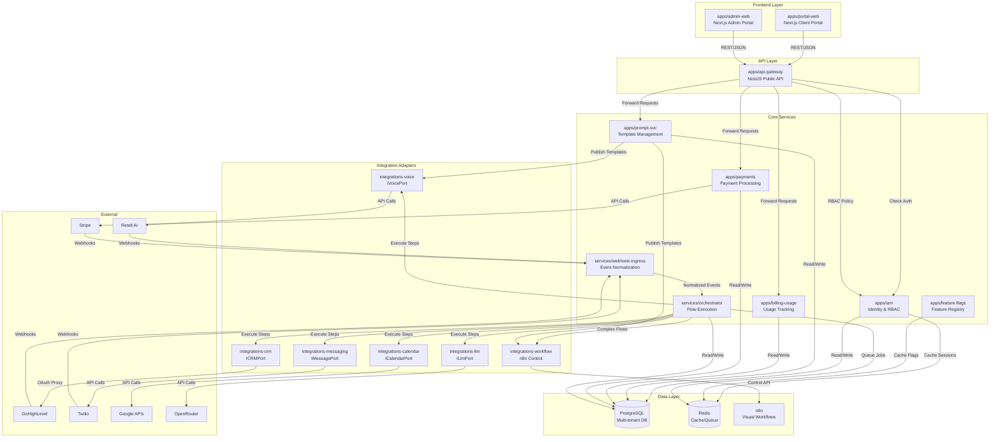
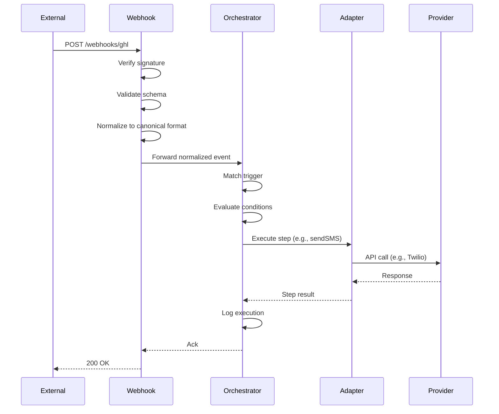

# Container Architecture

**Status**: Active  
**Version**: 1.0  
**Last Updated**: 2025-10-20  
**Owner**: architect.morgan-lee

## Purpose

Define all services (containers) in the MaxAI Platform, their responsibilities, and communication patterns.

## Container Diagram

## Container Responsibilities

### Frontend Layer

#### apps/portal-web
**Purpose**: Client-facing portal for onboarding, configuration, and monitoring

**Key Features**:
- Onboarding wizard (client info → template selection → customize → deploy)
- Connect accounts (GHL, Calendar via OAuth proxy)
- Usage dashboard & billing
- Prompt template customization
- Agent configuration

**Tech Stack**: Next.js 14, React 18, shadcn/ui, Zustand, TanStack Query

**Dependencies**: api-gateway (all requests proxied)

#### apps/admin-web
**Purpose**: Internal operations and support dashboards

**Key Features**:
- Tenant/client management
- Usage analytics & anomaly detection
- Billing reconciliation
- Support tools

**Tech Stack**: Next.js 14, React 18, shadcn/ui

**Dependencies**: api-gateway (admin-scoped endpoints)

### API Layer

#### apps/api-gateway
**Purpose**: Public API facade with authentication, authorization, and request routing

**Responsibilities**:
- OAuth 2.0 + JWT authentication via IAM
- RBAC policy enforcement (check with IAM)
- Request validation (OpenAPI/Swagger)
- Correlation ID injection
- Rate limiting (Redis)
- Audit logging
- Route requests to backend services

**Tech Stack**: NestJS, Passport.js, class-validator

**Communication**: REST JSON to all backend services

### Core Services

#### apps/iam
**Purpose**: Multi-tenant identity, authentication, authorization, and audit

**Responsibilities**:
- Google SSO (OAuth 2.0 server-side flow)
- Service token generation & verification (JWT)
- RBAC policy engine (tenant/client/role/permission)
- Audit trail for sensitive actions

**Ports**: IIdentityProviderPort, ITokenService, IPolicyEnginePort, IAuditWriter

**Data**: users, tenants, clients, roles, permissions, role_assignments, audit

**See**: [IAM Component Spec](./iam/)

#### apps/prompt-svc
**Purpose**: Manage prompt templates and client-specific instances with versioning

**Responsibilities**:
- Template registry (Markdown/JSON base templates)
- Client instance creation (template + variables)
- Version management (draft → active)
- Diff generation (show changes)
- Adapter publishing (Retell, n8n, GHL)

**Ports**: IPromptRegistry, IPromptInstanceService, IPromptDiffService, IAdapterPublisher

**Data**: templates, instances, versions, audit

**See**: [Prompt Service Spec](./prompt-service/)

#### services/webhook-ingress
**Purpose**: Terminate external webhooks, normalize, and forward to orchestrator

**Responsibilities**:
- Webhook signature verification (per provider)
- JSON Schema validation
- Event normalization (provider-specific → canonical format)
- Routing to orchestrator or direct services
- Idempotency & retry handling

**Supported Sources**: GHL, Retell, Twilio, Stripe

**See**: [Webhook Ingress Spec](./webhook-ingress/)

#### services/orchestrator
**Purpose**: Execute declarative flows with triggers, steps, and adapter bindings

**Responsibilities**:
- Flow DSL execution (JSON-based flow definitions)
- Trigger evaluation (webhook, schedule, manual)
- Step execution (adapter calls, conditions, loops)
- Error handling & retries
- State persistence
- Complex flow delegation to n8n

**Ports**: Calls all integration adapter ports

**Data**: flow_definitions, executions, execution_steps

**See**: [Orchestrator Spec](./orchestrator/)

#### apps/billing-usage
**Purpose**: Collect usage from providers, aggregate, and attribute to clients

**Responsibilities**:
- Usage collectors (Retell call minutes, Twilio SMS count, OpenRouter tokens)
- Daily rollups & cycle snapshots
- Anomaly detection
- Cost attribution (tenant → client → agent)

**Data**: usage_events, usage_rollups, cycle_snapshots

**See**: [Billing-Usage Spec](./billing-usage/)

#### apps/payments
**Purpose**: Gateway-agnostic payment processing and subscription management

**Responsibilities**:
- IPaymentProviderPort abstraction (Stripe, PayPal adapters)
- Subscription lifecycle (create, update, cancel)
- Usage-based billing (metered prices, dynamic invoice items)
- Invoice generation & reconciliation
- Ledger as source of truth

**Ports**: IPaymentProviderPort

**Data**: subscriptions, invoices, ledger, payment_methods

**See**: [Payments Spec](./payments/)

#### apps/feature-flags
**Purpose**: Global feature registry with tenant/user allowlists

**Responsibilities**:
- Feature flag definitions (alpha, beta, GA)
- Environment-aware evaluation
- Tenant-level allowlists
- User-level allowlists
- Server-side evaluation only (no client exposure)

**Data**: features, feature_gates (tenant/user allowlists)

### Integration Adapters

All integration adapters follow the **Ports & Adapters pattern**:
- **Port**: Interface defining contract (e.g., ICRMPort)
- **Adapter**: Provider-specific implementation (e.g., GHLAdapter)

#### integrations-crm (ICRMPort)
**Implementations**: GHL (current), HubSpot (future), Dynamics (future)

**Operations**: getContact, createContact, updateContact, listOpportunities

#### integrations-calendar (ICalendarPort)
**Implementations**: Google Calendar, Microsoft Calendar

**Operations**: listEvents, createEvent, updateEvent, checkAvailability

#### integrations-voice (IVoicePort)
**Implementation**: Retell AI

**Operations**: createAgent, updateAgent, getCallAnalysis

#### integrations-messaging (IMessagePort)
**Implementation**: Twilio SMS/Voice

**Operations**: sendSMS, makeCall, getMessageStatus

#### integrations-llm (ILlmPort)
**Implementation**: OpenRouter (default), Direct model APIs

**Operations**: generateText, generateStructured, estimateCost

#### integrations-workflow
**Implementation**: n8n control API

**Operations**: createWorkflow, updateWorkflow, executeWorkflow, getExecutionStatus

**See**: [Integration Adapters Spec](./integrations/)

## Communication Patterns

### Synchronous (REST/JSON)
- **Frontend → Gateway**: User requests
- **Gateway → Services**: API calls with auth context
- **Services → Adapters**: Adapter operations
- **Adapters → External**: Provider API calls

### Asynchronous (Events/Queue)
- **Webhook → Ingress → Orchestrator**: Event-driven flows
- **Service → BullMQ → Worker**: Background jobs
- **Orchestrator → n8n**: Complex flow execution

### Data Flow: Webhook Ingress → Orchestration

## Cross-Cutting Concerns

### Authentication & Authorization
- **Entry Point**: api-gateway validates JWT from IAM
- **Propagation**: Gateway adds auth context (tenant_id, client_id, user_id, roles) to service requests
- **Enforcement**: Services check policies via IAM or local RBAC checks

### Observability
- **Correlation IDs**: Generated at gateway, propagated through all services
- **Structured Logs**: Pino with tenant_id, client_id, user_id, correlation_id
- **Metrics**: Prometheus (request counts, latencies, errors)
- **Traces**: OpenTelemetry (end-to-end request tracing)

### Error Handling
- **Standard Error Format**: RFC 7807 Problem Details
- **Retry Strategy**: Exponential backoff for transient failures
- **Circuit Breakers**: Prevent cascade failures to external providers
- **DLQ**: Dead letter queue for unrecoverable webhook events

### Configuration
- **Environment Variables**: Service-specific config
- **Feature Flags**: Runtime toggles via feature-flags service
- **Secrets**: GCP Secret Manager / AWS Secrets Manager
- **Dynamic Config**: Tenant-specific settings in database

## Deployment Units

| Container | Deployment | Scaling | External Access |
|-----------|-----------|---------|-----------------|
| portal-web | Serverless (Vercel/Cloud Run) | Auto | Public (HTTPS) |
| admin-web | Serverless (Vercel/Cloud Run) | Auto | Private VPN |
| api-gateway | Kubernetes | Horizontal | Public (HTTPS) |
| iam | Kubernetes | Horizontal | Internal |
| prompt-svc | Kubernetes | Horizontal | Internal |
| webhook-ingress | Kubernetes | Horizontal | Public (HTTPS) |
| orchestrator | Kubernetes | Horizontal | Internal |
| billing-usage | Kubernetes | Horizontal | Internal |
| payments | Kubernetes | Horizontal | Internal |
| feature-flags | Kubernetes | Horizontal | Internal |
| integrations-* | Libraries (not separate containers) | N/A | N/A |

## Related Documentation

- [System Overview](./system-overview.md) - High-level architecture
- [Deployment Architecture](./deployment-architecture.md) - Infrastructure
- Component specs linked above

## Revision History

| Date | Version | Changes | Author |
|------|---------|---------|--------|
| 2025-10-20 | 1.0 | Initial container architecture | architect.morgan-lee |

---

**Related Issues**: #148  
**Spec Tracker**: ops/tracker/specs/ARCH-DOC-01.md
