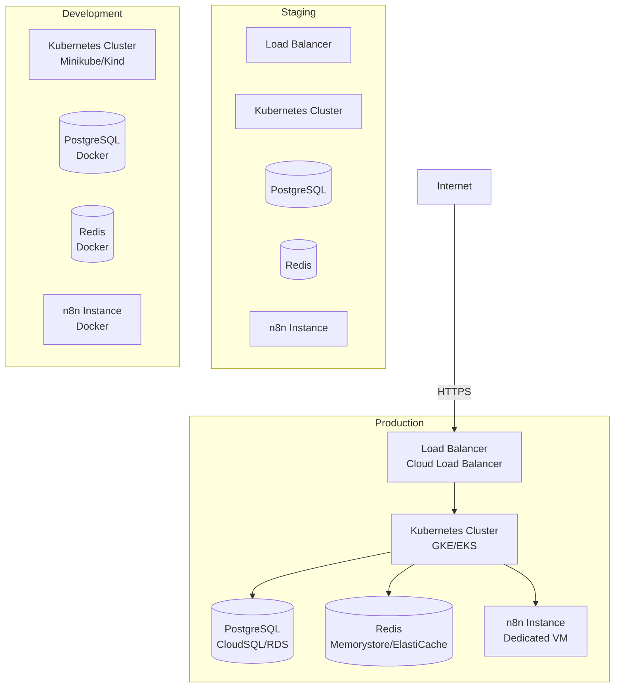

# Deployment Architecture

**Status**: Active  
**Version**: 1.0  
**Last Updated**: 2025-10-20  
**Owner**: architect.morgan-lee

## Purpose

Define infrastructure components, deployment topology, and operational patterns for the MaxAI Platform across environments.

## Environment Topology



## Infrastructure Components

### Compute

#### Kubernetes Clusters
**Purpose**: Container orchestration for all backend services

**Configuration**:
- **Production**: Multi-zone, 3+ nodes, auto-scaling (3-20 nodes)
- **Staging**: Single-zone, 2 nodes, auto-scaling (2-10 nodes)
- **Development**: Local (Minikube/Kind), 1 node

**Node Pools**:
- **api-pool**: API Gateway, public-facing services (2-4 vCPU, 8-16 GB)
- **services-pool**: Backend services (2-4 vCPU, 8-16 GB)
- **jobs-pool**: Background jobs, batch processing (1-2 vCPU, 4-8 GB)

**Namespaces**:
- `prod-frontend`: portal-web, admin-web
- `prod-api`: api-gateway
- `prod-services`: iam, prompt-svc, orchestrator, etc.
- `prod-jobs`: Background job workers

#### Serverless (Frontend)
**Purpose**: Serve Next.js applications with global CDN

**Platform**: Vercel (preferred) or Cloud Run

**Configuration**:
- Auto-scaling based on requests
- Edge caching for static assets
- ISR (Incremental Static Regeneration) for dynamic pages

### Data Layer

#### PostgreSQL (Primary Database)
**Purpose**: Persistent storage for all application data

**Configuration**:
- **Production**: 
  - Instance: db-n1-standard-4 (4 vCPU, 15 GB RAM)
  - Storage: 500 GB SSD, auto-resize enabled
  - High Availability: Multi-zone with automatic failover
  - Backups: Daily automated, 30-day retention
  - Point-in-time recovery enabled
- **Staging**: db-n1-standard-2 (2 vCPU, 7.5 GB RAM)
- **Development**: Docker container (local)

**Connection Pooling**: PgBouncer (100-200 connections)

**Schema Management**: Prisma migrations (version controlled)

#### Redis (Cache & Queue)
**Purpose**: Session cache, feature flags cache, job queue (BullMQ)

**Configuration**:
- **Production**:
  - Instance: 5 GB Standard Tier
  - High Availability: Replicated across zones
  - Eviction Policy: allkeys-lru (cache), noeviction (queue)
- **Staging**: 1 GB Basic Tier
- **Development**: Docker container

**Usage**:
- **Cache**: Sessions (TTL 24h), feature flags (TTL 5m), rate limits (TTL 1m)
- **Queue**: Job queues (webhook processing, usage aggregation)

#### n8n (Visual Workflows)
**Purpose**: Complex workflow orchestration with visual editor

**Configuration**:
- **Production**:
  - Dedicated VM (2 vCPU, 8 GB RAM)
  - PostgreSQL backend (shared with main DB)
  - HTTPS with valid certificate
  - VPN access only (no public internet)
- **Staging/Dev**: Docker container

### Networking

#### Load Balancer
**Type**: Cloud Load Balancer (L7)

**Configuration**:
- HTTPS termination (TLS 1.3)
- SSL certificate (Let's Encrypt or managed cert)
- Health checks on `/health` endpoint
- Session affinity (cookie-based)

**Routing**:
- `/` → portal-web (Vercel)
- `/admin` → admin-web (Vercel)
- `/api/*` → api-gateway (Kubernetes)
- `/webhooks/*` → webhook-ingress (Kubernetes)

#### DNS
- `app.maxai.io` → Production Load Balancer
- `admin.maxai.io` → Admin portal
- `api.maxai.io` → API Gateway
- `staging.maxai.io` → Staging environment

#### Firewall Rules
- **Public Access**: HTTPS (443) only
- **Internal Services**: Kubernetes internal networking (ClusterIP)
- **Database**: Private IP only, VPC peering
- **Redis**: Private IP only, VPC peering
- **n8n**: VPN access only

### Security

#### Secrets Management
**Service**: GCP Secret Manager / AWS Secrets Manager

**Secrets Stored**:
- Database credentials
- OAuth client secrets (Google, GHL, Stripe)
- JWT signing keys
- API keys (Retell, Twilio, OpenRouter)
- Encryption keys

**Access**: Kubernetes service accounts with IAM roles

#### TLS/SSL
- **External**: Load Balancer terminates TLS 1.3
- **Internal**: mTLS between services (optional, via service mesh)

#### Network Policies
- Namespace isolation (no cross-namespace communication without explicit rules)
- Egress filtering (allow only approved external endpoints)

## Scaling Strategy

### Horizontal Scaling (Auto-scaling)

| Service | Metric | Min | Max | Target |
|---------|--------|-----|-----|--------|
| api-gateway | CPU | 2 | 10 | 70% |
| webhook-ingress | CPU | 2 | 10 | 70% |
| iam | CPU | 2 | 5 | 70% |
| prompt-svc | CPU | 1 | 5 | 70% |
| orchestrator | CPU | 2 | 10 | 70% |
| billing-usage | CPU | 1 | 3 | 70% |
| payments | CPU | 1 | 3 | 70% |

### Vertical Scaling

**Node Pools**: Scale up node size when horizontal scaling insufficient

**Database**: Upgrade instance size based on connection pool exhaustion or CPU

### Caching Strategy

**Redis Cache**:
- Session data (JWT verification bypass)
- Feature flags (reduce IAM load)
- Rate limits (prevent DB queries)

**CDN**:
- Static assets (images, fonts, JS/CSS)
- API responses (short TTL for public endpoints)

## Deployment Process

### CI/CD Pipeline

```mermaid
graph LR
    CODE[Code Push] -->|GitHub Actions| BUILD[Build & Test]
    BUILD -->|Lint, Type Check| UNIT[Unit Tests]
    UNIT -->|Coverage ≥95%| CONTRACT[Contract Tests]
    CONTRACT -->|Schema Validation| IMAGE[Build Docker Image]
    IMAGE -->|Push to Registry| DEPLOY_STG[Deploy to Staging]
    DEPLOY_STG -->|Smoke Tests| APPROVE[Manual Approval]
    APPROVE -->|Release Manager| DEPLOY_PROD[Deploy to Production]
    DEPLOY_PROD -->|Health Checks| MONITOR[Monitor & Alert]
```



### Deployment Strategy

**Blue/Green Deployment**:
- Deploy new version alongside old
- Route 10% traffic to new version (canary)
- Monitor metrics (error rate, latency)
- Route 100% traffic if healthy
- Keep old version for 24h (rollback window)

**Database Migrations**:
- Run migrations before deployment
- Backward-compatible changes only
- Multi-step migrations for breaking changes

### Rollback Procedure

1. **Immediate**: Switch load balancer to previous deployment (< 5 min)
2. **Database**: Restore from backup if schema change (15-30 min)
3. **Validation**: Run smoke tests on rolled-back version
4. **Incident Report**: Post-mortem within 24h

## Monitoring & Observability

### Metrics (Prometheus)

**Service Metrics**:
- Request rate (req/sec)
- Error rate (errors/sec, %)
- Latency (P50, P95, P99)
- Saturation (CPU, memory, disk)

**Business Metrics**:
- Active tenants
- Active clients
- API calls by endpoint
- Webhook events processed
- LLM token usage

### Logging (Structured)

**Log Aggregation**: Cloud Logging / ELK Stack

**Log Format**: JSON with standard fields
```json
{
  "timestamp": "2025-10-20T12:00:00Z",
  "level": "info",
  "message": "Request processed",
  "correlation_id": "uuid",
  "tenant_id": "uuid",
  "client_id": "uuid",
  "user_id": "uuid",
  "service": "api-gateway",
  "method": "POST",
  "path": "/api/prompts",
  "status": 201,
  "duration_ms": 45
}
```

### Tracing (OpenTelemetry)

**Distributed Traces**: End-to-end request tracing across services

**Trace Context**: Propagated via HTTP headers (traceparent, tracestate)

**Sampling**: 100% for errors, 10% for successful requests (adjust based on volume)

### Alerting

**Critical Alerts** (PagerDuty):
- Service down (health check fails)
- Error rate > 5% for 5 minutes
- P95 latency > 1s for 5 minutes
- Database connection pool exhausted
- Disk usage > 90%

**Warning Alerts** (Slack):
- Error rate > 1% for 10 minutes
- P95 latency > 500ms for 10 minutes
- Unusual traffic patterns

## Disaster Recovery

### Backup Strategy

**Database**:
- Automated daily backups (retained 30 days)
- Weekly full backups (retained 1 year)
- Point-in-time recovery (7 days)

**Secrets**:
- Encrypted backups in separate storage
- Access logs audited

**Code/Config**:
- Git (source of truth)
- Docker images in registry (retained 90 days)

### Recovery Objectives

- **RTO** (Recovery Time Objective): 4 hours
- **RPO** (Recovery Point Objective): 1 hour

### Disaster Scenarios

1. **Region Outage**: Failover to secondary region (manual)
2. **Database Corruption**: Restore from backup (automated)
3. **Data Loss**: Point-in-time recovery (automated)
4. **Security Breach**: Isolate compromised services, rotate secrets

## Cost Optimization

### Resource Tagging
- Environment (prod, staging, dev)
- Service (iam, prompt-svc, etc.)
- Cost center (engineering, ops)

### Auto-Shutdown
- **Development**: Shutdown non-prod clusters outside business hours
- **Staging**: Scale down to min replicas outside business hours

### Reserved Capacity
- Database instances (1-year commitment for 30% savings)
- Kubernetes node pools (committed use discounts)

## Related Documentation

- [System Overview](./system-overview.md) - High-level architecture
- [Container Architecture](./container-architecture.md) - All services

## Revision History

| Date | Version | Changes | Author |
|------|---------|---------|--------|
| 2025-10-20 | 1.0 | Initial deployment architecture | architect.morgan-lee |

---

**Related Issues**: #148  
**Spec Tracker**: ops/tracker/specs/ARCH-DOC-01.md
