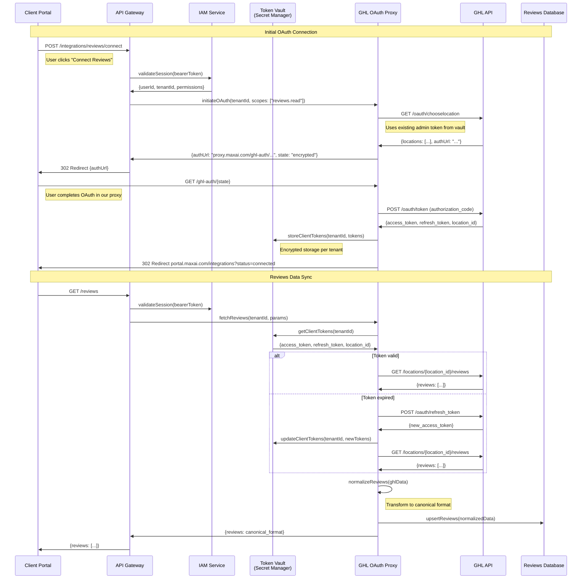
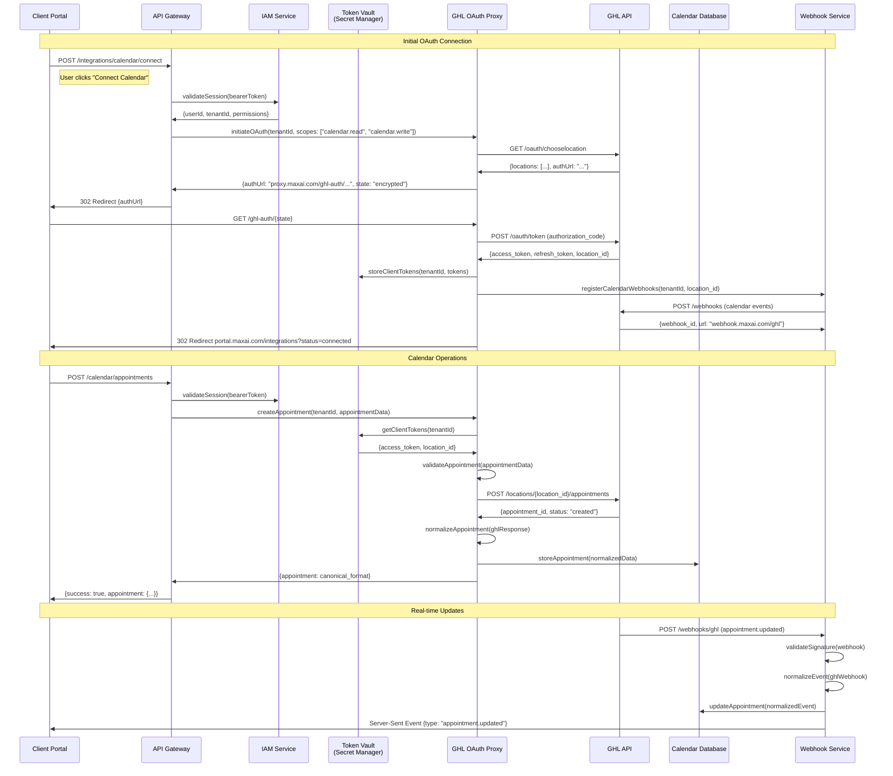
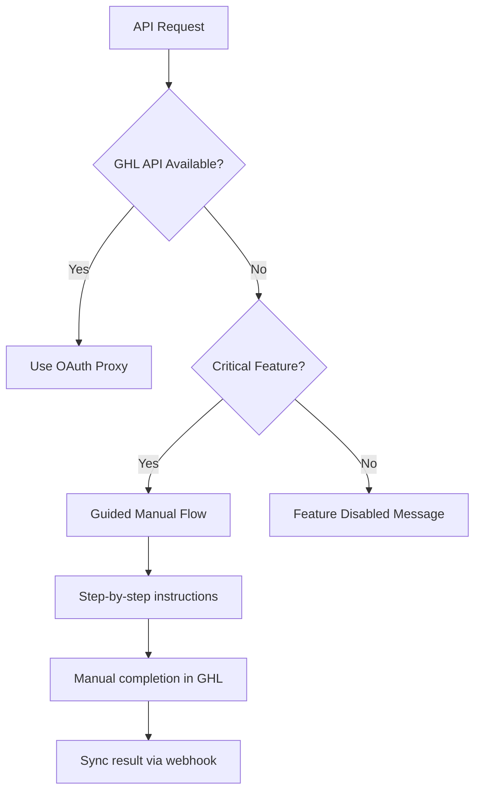

# GHL OAuth Proxy Sequence Diagrams

**Status**: Draft  
**Related**: [ARCH-03 — GHL Encapsulation Strategy](https://github.com/raming/max-ai-platform/issues/56)  
**Linked ADR**: [ADR-0001: GHL Encapsulation Strategy](/ops/docs/adr/adr-0001-ghl-encapsulation.md)

## Overview

Note on abstraction: These flows are implemented via the IGHLAuthPort. The current concrete adapter is AdminUserSeedAuthAdapter (admin-user token as seed). A future AgencyApiKeyAuthAdapter can be swapped in via DI without changes to consumers.

This document defines the OAuth proxy sequence flows for connecting client accounts to GHL services while maintaining server-side token storage and zero client exposure to GHL URLs or credentials.

## Connect Reviews Flow



## Connect Calendar Flow



## Token Management Integration

Both flows leverage the existing [GHL Token Management Architecture](/ops/docs/design/ghl-token-management-architecture.md):

### Token Storage Pattern
```typescript
interface ClientTokenSet {
  tenantId: string;
  locationId: string;
  accessToken: string;
  refreshToken: string;
  expiresAt: Date;
  scopes: string[];
  connectedAt: Date;
}
```

### Automatic Token Refresh
- **50-minute refresh cycle** prevents expiration
- **Exponential backoff** on refresh failures  
- **Re-authentication flow** when refresh fails permanently
- **Health monitoring** with < 10 minute alerts

### Security Considerations

1. **Zero Client Exposure**: No GHL URLs or tokens ever sent to client
2. **Encrypted State**: OAuth state parameters encrypted with tenant-specific keys  
3. **Scoped Access**: Minimum required permissions per integration
4. **Audit Trail**: All OAuth flows and token operations logged
5. **Token Rotation**: Refresh tokens rotated on each use

## Fallback Strategies

### API Gaps Handling


### Degraded Mode Operations
- **Read-only mode**: When write APIs unavailable
- **Cached data**: Serve stale data with staleness indicators
- **Manual sync**: Trigger manual data refresh
- **Feature flags**: Graceful degradation per tenant

## Implementation Notes

### Proxy Endpoints
- `POST /integrations/{service}/connect` - Initiate OAuth
- `GET /ghl-auth/{encrypted_state}` - Handle OAuth callback
- `POST /integrations/{service}/disconnect` - Revoke tokens
- `GET /integrations/{service}/status` - Connection health

### Error Handling
- **401 Unauthorized**: Trigger token refresh
- **403 Forbidden**: Check scope requirements
- **429 Rate Limited**: Implement backoff with jitter
- **500 Server Error**: Fall back to cached data

### Monitoring Metrics
- OAuth success/failure rates per tenant
- Token refresh success rates  
- API response times and error rates
- Client connection status distribution

---

**References:**
- [GHL Token Management Architecture](/ops/docs/design/ghl-token-management-architecture.md)
- [ADR-0001: GHL Encapsulation Strategy](/ops/docs/adr/adr-0001-ghl-encapsulation.md)
- [Authentication Helper Tool](/ops/tools/ghl-token-investigation/authenticate-ghl.js)