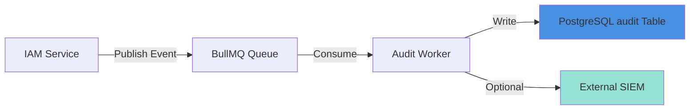

# IAM Audit

## Overview

The IAM audit subsystem provides comprehensive logging of security-sensitive operations for compliance, forensic analysis, and operational monitoring. All authentication, authorization, and administrative events are captured with correlation tracking.

## Audit Events

### Event Categories

**Authentication Events**:
- `auth.login.success` - User successfully logged in
- `auth.login.failed` - Login attempt failed
- `auth.logout` - User logged out
- `auth.session.expired` - Session expired
- `auth.session.revoked` - Session manually revoked

**Authorization Events**:
- `policy.check.allowed` - Permission granted
- `policy.check.denied` - Permission denied
- `token.mint` - Service token created
- `token.verify` - Token validated

**Administrative Events**:
- `role.assign` - Role assigned to user
- `role.revoke` - Role removed from user
- `user.create` - New user provisioned
- `user.update` - User profile updated
- `user.delete` - User deactivated
- `tenant.create`, `tenant.update`, `tenant.delete` - Tenant lifecycle
- `client.create`, `client.update`, `client.delete` - Client lifecycle

### Event Structure

```typescript
interface AuditEvent {
  id: string;                    // UUID
  at: string;                    // ISO 8601 timestamp
  actor_id: string | null;       // User performing action (null for system)
  action: string;                // Event type (e.g., "role.assign")
  resource: string;              // Resource affected (e.g., "user:123")
  metadata: Record<string, any>; // Event-specific details
  correlation_id: string;        // Request correlation ID
  tenant_id: string | null;      // Tenant context (if applicable)
  client_id: string | null;      // Client context (if applicable)
}
```

---

## Event Details

### auth.login.success

**When**: User completes SSO login successfully

**Event Data**:
```json
{
  "id": "audit_550e8400-e29b-41d4-a716-446655440000",
  "at": "2025-10-21T10:15:30.123Z",
  "actor_id": "user_123",
  "action": "auth.login.success",
  "resource": "user:user_123",
  "metadata": {
    "provider": "google",
    "email": "user@example.com",
    "ip_address": "203.0.113.42",
    "user_agent": "Mozilla/5.0 (Macintosh; Intel Mac OS X 10_15_7) ...",
    "session_id": "session_abc123"
  },
  "correlation_id": "req_xyz789",
  "tenant_id": null,
  "client_id": null
}
```

### auth.login.failed

**When**: Login attempt fails (OAuth error, invalid token, etc.)

**Event Data**:
```json
{
  "id": "audit_...",
  "at": "2025-10-21T10:16:15.456Z",
  "actor_id": null,
  "action": "auth.login.failed",
  "resource": "user:unknown",
  "metadata": {
    "provider": "google",
    "email": "user@example.com",
    "reason": "token_exchange_failed",
    "error": "invalid_grant",
    "ip_address": "203.0.113.42",
    "user_agent": "Mozilla/5.0..."
  },
  "correlation_id": "req_xyz790",
  "tenant_id": null,
  "client_id": null
}
```

### policy.check.denied

**When**: Authorization check denies access

**Event Data**:
```json
{
  "id": "audit_...",
  "at": "2025-10-21T10:20:00.789Z",
  "actor_id": "user_456",
  "action": "policy.check.denied",
  "resource": "prompt:789",
  "metadata": {
    "action_attempted": "delete",
    "reason": "Lacks permission 'delete:prompt'",
    "roles": ["agent"],
    "permissions": ["read:prompt", "execute:workflow"]
  },
  "correlation_id": "req_xyz791",
  "tenant_id": "tenant_T1",
  "client_id": "client_C1"
}
```

### role.assign

**When**: Admin assigns role to user

**Event Data**:
```json
{
  "id": "audit_...",
  "at": "2025-10-21T11:00:00.123Z",
  "actor_id": "admin_123",
  "action": "role.assign",
  "resource": "user:user_456",
  "metadata": {
    "role_name": "client_admin",
    "role_id": "role_789",
    "tenant_id": "tenant_T1",
    "client_id": "client_C1",
    "expires_at": null,
    "assignment_id": "assign_abc"
  },
  "correlation_id": "req_xyz792",
  "tenant_id": "tenant_T1",
  "client_id": "client_C1"
}
```

### user.create

**When**: New user is provisioned (first SSO login or admin creation)

**Event Data**:
```json
{
  "id": "audit_...",
  "at": "2025-10-21T09:00:00.000Z",
  "actor_id": null,
  "action": "user.create",
  "resource": "user:user_new_123",
  "metadata": {
    "email": "newuser@example.com",
    "name": "New User",
    "provider": "google",
    "provisioning_method": "sso_auto"
  },
  "correlation_id": "req_xyz788",
  "tenant_id": null,
  "client_id": null
}
```

---

## Audit Processing Pipeline

### Async Processing with BullMQ



### Event Flow

**Step 1: Event Creation** (IAM Service)
```typescript
async function auditEvent(event: Partial<AuditEvent>): Promise<void> {
  const auditEvent: AuditEvent = {
    id: generateUUID(),
    at: new Date().toISOString(),
    actor_id: event.actor_id || null,
    action: event.action,
    resource: event.resource,
    metadata: event.metadata || {},
    correlation_id: event.correlation_id || getCurrentCorrelationId(),
    tenant_id: event.tenant_id || null,
    client_id: event.client_id || null
  };
  
  // Publish to queue (non-blocking)
  await auditQueue.add('audit-event', auditEvent, {
    attempts: 3,
    backoff: { type: 'exponential', delay: 2000 }
  });
}
```

**Step 2: Queue Processing** (Audit Worker)
```typescript
auditQueue.process('audit-event', async (job) => {
  const event = job.data as AuditEvent;
  
  try {
    // Write to PostgreSQL
    await db.insert('audit', event);
    
    // Optional: Forward to external SIEM (future)
    if (config.siem.enabled) {
      await forwardToSIEM(event);
    }
    
    return { success: true, event_id: event.id };
  } catch (error) {
    // Retry on transient errors
    if (isTransientError(error)) {
      throw error; // BullMQ will retry
    }
    
    // Log permanent errors
    logger.error('Audit write failed', { event, error });
    return { success: false, error: error.message };
  }
});
```

**Step 3: Persistence** (PostgreSQL)
```sql
INSERT INTO audit (id, at, actor_id, action, resource, metadata, correlation_id, tenant_id, client_id)
VALUES ($1, $2, $3, $4, $5, $6, $7, $8, $9)
RETURNING id;
```

---

## Audit Queries

### Common Query Patterns

**User Activity Timeline**:
```sql
SELECT at, action, resource, metadata
FROM audit
WHERE actor_id = $1
ORDER BY at DESC
LIMIT 100;
```

**Resource History**:
```sql
SELECT at, actor_id, action, metadata
FROM audit
WHERE resource = $1
  AND at > now() - interval '30 days'
ORDER BY at DESC;
```

**Failed Login Attempts**:
```sql
SELECT at, metadata->>'email' AS email, metadata->>'ip_address' AS ip_address
FROM audit
WHERE action = 'auth.login.failed'
  AND at > now() - interval '1 hour'
ORDER BY at DESC;
```

**Role Assignment Changes**:
```sql
SELECT at, actor_id, resource, metadata->>'role_name' AS role, metadata->>'tenant_id' AS tenant
FROM audit
WHERE action IN ('role.assign', 'role.revoke')
  AND tenant_id = $1
ORDER BY at DESC
LIMIT 100;
```

**Permission Denials by User**:
```sql
SELECT at, resource, metadata->>'action_attempted' AS action, metadata->>'reason' AS reason
FROM audit
WHERE action = 'policy.check.denied'
  AND actor_id = $1
  AND at > now() - interval '7 days'
ORDER BY at DESC;
```

---

## Compliance Features

### HIPAA Compliance

**Required Audit Events**:
- ✅ User authentication (login/logout)
- ✅ Access attempts (policy checks)
- ✅ Administrative actions (role assignments)
- ✅ Data access (read/write/delete operations)

**Audit Log Protection**:
- ✅ Append-only table (no updates/deletes allowed)
- ✅ Database-level permissions restrict access
- ✅ 2-year retention policy
- ✅ Regular backups with encryption

### SOC 2 Compliance

**Control Objectives**:
- **CC6.1**: Logical access controls - Audit all authentication and authorization
- **CC6.2**: Prior to issuing credentials - Audit user provisioning
- **CC6.3**: Periodic review of access rights - Audit role assignments
- **CC7.2**: System monitoring - Continuous audit event capture

**Audit Evidence**:
- User access reports (monthly)
- Failed login analysis (weekly)
- Role assignment changes (daily review)
- Anomaly detection (automated alerts)

### GDPR Considerations

**Right to Access**: Users can request their audit history
```typescript
async function getUserAuditHistory(userId: string): Promise<AuditEvent[]> {
  return db.query('SELECT * FROM audit WHERE actor_id = $1 OR resource = $2', 
    [userId, `user:${userId}`]);
}
```

**Right to Erasure**: Pseudonymize user data on deletion
```typescript
async function pseudonymizeUserAudit(userId: string): Promise<void> {
  // Replace user_id with pseudonym, keep audit trail
  await db.update('audit', 
    { actor_id: `deleted_user_${hash(userId)}` },
    { actor_id: userId }
  );
}
```

---

## Observability

### Structured Logging

**Audit Event Log** (JSON format):
```json
{
  "timestamp": "2025-10-21T10:15:30.123Z",
  "level": "info",
  "service": "iam",
  "component": "audit",
  "action": "audit.event.published",
  "event_id": "audit_123",
  "event_action": "role.assign",
  "actor_id": "admin_456",
  "resource": "user:789",
  "correlation_id": "req_abc",
  "queue_delay_ms": 15
}
```

### Metrics

**Prometheus Metrics**:
- `iam_audit_events_total{action="role.assign|policy.check.denied|..."}` - Event count by type
- `iam_audit_queue_size` - BullMQ queue depth
- `iam_audit_write_duration_ms` - Write latency histogram
- `iam_audit_write_errors_total{reason="db_error|queue_full"}` - Write failures

### Alerting

**Critical Alerts**:
- Audit queue depth > 1000 (backlog building up)
- Audit write failure rate > 1% (durability risk)
- Failed login attempts > 10/min from single IP (brute force attack)
- Unexpected role assignments (e.g., super_admin granted)

**Alert Example**:
```yaml
- alert: AuditQueueBacklog
  expr: iam_audit_queue_size > 1000
  for: 5m
  labels:
    severity: critical
  annotations:
    summary: "Audit queue backlog detected"
    description: "Audit queue has {{ $value }} pending events"
```

---

## Data Retention

### Retention Policy

| Event Category | Retention Period | Storage |
|---------------|------------------|---------|
| **Authentication** | 2 years | PostgreSQL (partitioned) |
| **Authorization** | 1 year | PostgreSQL (partitioned) |
| **Administrative** | 5 years | PostgreSQL + Archive |
| **High-Risk Events** | 7 years | PostgreSQL + Archive |

**High-Risk Events**:
- `role.assign` with `super_admin` role
- `user.delete`, `tenant.delete`, `client.delete`
- `policy.check.denied` for sensitive resources

### Partitioning Strategy

**Monthly Partitions**:
```sql
-- Create partition for October 2025
CREATE TABLE audit_2025_10 PARTITION OF audit
FOR VALUES FROM ('2025-10-01') TO ('2025-11-01');

-- Create partition for November 2025
CREATE TABLE audit_2025_11 PARTITION OF audit
FOR VALUES FROM ('2025-11-01') TO ('2025-12-01');
```

**Automatic Partition Creation** (cron job):
```bash
#!/bin/bash
# Run monthly: Create next month's partition
psql -c "CREATE TABLE audit_$(date -d '+1 month' +%Y_%m) PARTITION OF audit FOR VALUES FROM ('$(date -d '+1 month' +%Y-%m-01)') TO ('$(date -d '+2 months' +%Y-%m-01)');"
```

**Partition Pruning** (after retention period):
```sql
-- Drop partition older than 2 years
DROP TABLE audit_2023_10;
```

### Archival Process

**Step 1: Export to Archive Storage** (before dropping partition)
```bash
# Export partition to compressed JSON
pg_dump -t audit_2023_10 --format=plain | gzip > audit_2023_10.json.gz

# Upload to GCS
gsutil cp audit_2023_10.json.gz gs://maxai-audit-archive/2023/
```

**Step 2: Verify Archive Integrity**
```bash
# Verify file exists and is readable
gsutil ls -l gs://maxai-audit-archive/2023/audit_2023_10.json.gz
```

**Step 3: Drop Partition**
```sql
DROP TABLE audit_2023_10;
```

---

## Security Controls

### Access Restrictions

**Database Permissions**:
```sql
-- Audit writer service account (iam service)
GRANT INSERT ON audit TO iam_service;
REVOKE UPDATE, DELETE ON audit FROM iam_service;

-- Audit reader (admin users)
GRANT SELECT ON audit TO audit_reader;
REVOKE INSERT, UPDATE, DELETE ON audit FROM audit_reader;
```

### Audit Integrity

**Append-Only Enforcement**:
- Database triggers prevent updates/deletes
- Application code never issues UPDATE/DELETE on audit table
- Only INSERT allowed

**Trigger Example**:
```sql
CREATE OR REPLACE FUNCTION prevent_audit_modification()
RETURNS TRIGGER AS $$
BEGIN
  RAISE EXCEPTION 'Audit records are immutable';
END;
$$ LANGUAGE plpgsql;

CREATE TRIGGER prevent_audit_update
BEFORE UPDATE OR DELETE ON audit
FOR EACH ROW EXECUTE FUNCTION prevent_audit_modification();
```

### Sensitive Data Redaction

**Automatic PII Redaction**:
```typescript
function redactSensitiveData(metadata: Record<string, any>): Record<string, any> {
  const redacted = { ...metadata };
  
  // Redact password fields (should never be in metadata, but defensive)
  if (redacted.password) redacted.password = '[REDACTED]';
  
  // Redact full tokens (keep first 8 chars for debugging)
  if (redacted.token) redacted.token = redacted.token.substring(0, 8) + '...[REDACTED]';
  
  // Redact IP address (keep first 2 octets)
  if (redacted.ip_address) {
    const parts = redacted.ip_address.split('.');
    redacted.ip_address = `${parts[0]}.${parts[1]}.x.x`;
  }
  
  return redacted;
}
```

---

## Testing Strategy

### Unit Tests

**Event Creation**:
```typescript
test('creates audit event with correlation ID', async () => {
  const event = await auditEvent({
    action: 'role.assign',
    actor_id: 'admin_123',
    resource: 'user:456',
    metadata: { role: 'client_admin' }
  });
  
  expect(event.id).toMatch(/^audit_/);
  expect(event.correlation_id).toBeDefined();
  expect(event.at).toMatch(/^\d{4}-\d{2}-\d{2}T/);
});
```

**Data Redaction**:
```typescript
test('redacts sensitive fields in metadata', () => {
  const metadata = {
    role: 'admin',
    password: 'secret123',
    token: 'eyJhbGciOiJIUzI1NiIsInR5cCI6IkpXVCJ9...',
    ip_address: '203.0.113.42'
  };
  
  const redacted = redactSensitiveData(metadata);
  
  expect(redacted.password).toBe('[REDACTED]');
  expect(redacted.token).toMatch(/^eyJhbGci\.\.\.\[REDACTED\]$/);
  expect(redacted.ip_address).toBe('203.0.x.x');
  expect(redacted.role).toBe('admin'); // Not redacted
});
```

### Integration Tests

**End-to-End Audit Flow**:
```typescript
test('login event is audited', async () => {
  // Action: User logs in
  const response = await request(app)
    .get('/iam/auth/google/callback')
    .query({ code: 'AUTH_CODE', state: 'STATE_TOKEN' });
  
  expect(response.status).toBe(302);
  
  // Assert: Audit event created
  await delay(100); // Allow async processing
  const auditEvents = await db.query(
    'SELECT * FROM audit WHERE action = $1 ORDER BY at DESC LIMIT 1',
    ['auth.login.success']
  );
  
  expect(auditEvents).toHaveLength(1);
  expect(auditEvents[0].metadata.provider).toBe('google');
});
```

---

## References

- [Overview](./overview.md) - Component architecture
- [Data Model](./data-model.md) - Audit table schema
- [Authentication](./authentication.md) - Auth event definitions
- [Authorization](./authorization.md) - Policy check audit events
- [Security](./security.md) - Audit integrity controls
- ADR-0006: Audit Event Processing (Async Queue)
