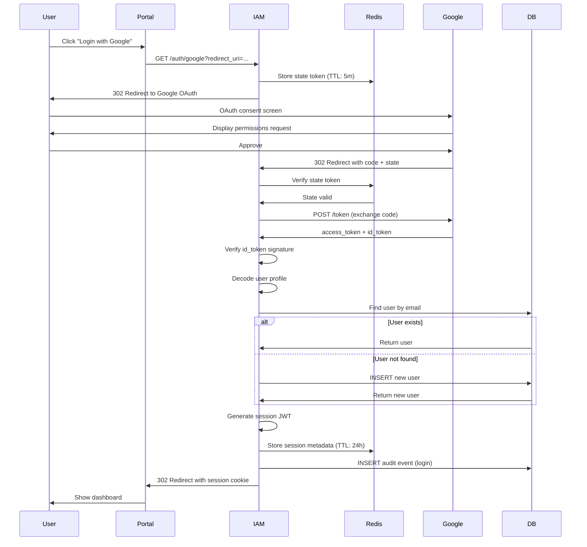

# IAM Authentication

## Overview

Authentication in the IAM component supports multiple identity sources while maintaining a unified user model. Phase 1 implements Google OAuth SSO with extensibility for additional providers.

## Authentication Methods

### Google OAuth 2.0 SSO
Primary authentication method for Phase 1.

**Characteristics**:
- Server-side authorization code flow (most secure)
- PKCE support (future enhancement for mobile/SPA)
- OpenID Connect for user profile retrieval
- Automatic user provisioning on first login

**Scopes Requested**:
- `openid` - OpenID Connect authentication
- `profile` - User name and avatar
- `email` - User email address

### Local Authentication (Future)
Password-based authentication for users without Google accounts.

**Out of Scope for Phase 1**:
- Password hashing (bcrypt, rounds: 12)
- Email verification workflow
- Password reset flow
- Account recovery mechanisms

---

## Google OAuth Flow

### Authorization Request (Step 1)

**User Action**: Clicks "Login with Google" button

**Request**:
```http
GET /iam/auth/google?redirect_uri=https://portal.example.com/dashboard
Host: api.maxai.com
```

**IAM Service Action**:
1. Generate random `state` parameter (anti-CSRF token)
2. Store `state` in Redis with 5-minute TTL
3. Redirect user to Google OAuth consent screen

**Redirect to Google**:
```http
HTTP/1.1 302 Found
Location: https://accounts.google.com/o/oauth2/v2/auth?
  response_type=code&
  client_id=CLIENT_ID&
  redirect_uri=https://api.maxai.com/iam/auth/google/callback&
  scope=openid%20profile%20email&
  state=RANDOM_STATE_TOKEN&
  access_type=offline&
  prompt=consent
```

### User Consent (Step 2)

**Google Action**:
- Display consent screen to user
- Show requested scopes (profile, email)
- User approves or denies

### Authorization Code Exchange (Step 3)

**Google Redirect**:
```http
GET /iam/auth/google/callback?code=AUTH_CODE&state=STATE_TOKEN
Host: api.maxai.com
```

**IAM Service Action**:
1. Verify `state` matches stored value (anti-CSRF)
2. Exchange authorization `code` for tokens

**Token Exchange Request**:
```http
POST /token HTTP/1.1
Host: oauth2.googleapis.com
Content-Type: application/x-www-form-urlencoded

code=AUTH_CODE&
client_id=CLIENT_ID&
client_secret=CLIENT_SECRET&
redirect_uri=https://api.maxai.com/iam/auth/google/callback&
grant_type=authorization_code
```

**Google Response**:
```json
{
  "access_token": "ya29.AHES6ZS...",
  "expires_in": 3600,
  "refresh_token": "1/6BMf...",
  "scope": "openid profile email",
  "token_type": "Bearer",
  "id_token": "eyJhbGciOiJSUzI1NiIsInR5cCI6IkpXVCJ9..."
}
```

### User Profile Retrieval (Step 4)

**IAM Service Action**:
Decode and verify `id_token` (JWT) to extract user profile.

**ID Token Claims**:
```json
{
  "iss": "https://accounts.google.com",
  "sub": "1234567890",
  "azp": "CLIENT_ID",
  "aud": "CLIENT_ID",
  "iat": 1729512000,
  "exp": 1729515600,
  "email": "user@example.com",
  "email_verified": true,
  "name": "Jane Doe",
  "picture": "https://lh3.googleusercontent.com/...",
  "given_name": "Jane",
  "family_name": "Doe"
}
```

**Verification Steps**:
1. Verify signature using Google's public keys (fetched from `https://www.googleapis.com/oauth2/v3/certs`)
2. Verify `iss` claim is `https://accounts.google.com`
3. Verify `aud` claim matches our `CLIENT_ID`
4. Verify `exp` claim (token not expired)
5. Verify `email_verified` is `true`

### User Provisioning (Step 5)

**IAM Service Action**:
Find or create user in database.

**SQL Query**:
```sql
-- Find existing user by email
SELECT id, email, name, provider, created_at, updated_at
FROM users
WHERE email = $1;

-- If not found, create new user
INSERT INTO users (id, email, name, provider)
VALUES (gen_random_uuid(), $1, $2, 'google')
RETURNING id, email, name, provider, created_at, updated_at;
```

**User Profile Mapping**:
| Google Claim | Database Column | Transformation |
|--------------|----------------|----------------|
| `email` | `email` | Lowercase |
| `name` | `name` | As-is |
| `sub` (optional) | `external_id` | Store in metadata JSONB |
| `picture` (optional) | N/A | Store in metadata JSONB |

### Session Creation (Step 6)

**IAM Service Action**:
Generate session token (JWT) and store session metadata.

**Session Token Claims**:
```json
{
  "sub": "user_550e8400-e29b-41d4-a716-446655440000",
  "email": "user@example.com",
  "name": "Jane Doe",
  "iat": 1729512000,
  "exp": 1729598400,
  "jti": "session_abc123"
}
```

**Token Configuration**:
- **Algorithm**: HS256 (symmetric secret)
- **Expiration**: 24 hours (`exp` claim)
- **Issuer**: `iam.maxai.com` (`iss` claim)
- **Audience**: `portal.maxai.com` (`aud` claim)
- **Session ID**: `jti` claim (for revocation)

**Redis Session Storage**:
```redis
SET session:session_abc123 '{"user_id":"user_550e...","created_at":"2025-10-21T10:00:00Z"}' EX 86400
```

### Portal Redirect (Step 7)

**IAM Service Response**:
```http
HTTP/1.1 302 Found
Location: https://portal.example.com/dashboard
Set-Cookie: session=JWT_TOKEN; HttpOnly; Secure; SameSite=Strict; Max-Age=86400; Path=/
```

**Cookie Attributes**:
- `HttpOnly`: Prevent JavaScript access (XSS mitigation)
- `Secure`: Only sent over HTTPS
- `SameSite=Strict`: Prevent CSRF attacks
- `Max-Age=86400`: 24-hour expiration
- `Path=/`: Available to all portal routes

---

## Sequence Diagram



---

## Session Management

### Session Token Structure

**JWT Header**:
```json
{
  "alg": "HS256",
  "typ": "JWT"
}
```

**JWT Payload**:
```json
{
  "sub": "user_550e8400-e29b-41d4-a716-446655440000",
  "email": "user@example.com",
  "name": "Jane Doe",
  "tenant_id": "tenant_123",
  "iat": 1729512000,
  "exp": 1729598400,
  "jti": "session_abc123",
  "iss": "iam.maxai.com",
  "aud": "portal.maxai.com"
}
```

**JWT Signature**:
```
HMACSHA256(
  base64UrlEncode(header) + "." + base64UrlEncode(payload),
  SECRET_KEY
)
```

### Session Validation

**Validation Steps** (on every authenticated request):
1. Extract JWT from `Cookie: session=...`
2. Verify signature using `JWT_SECRET`
3. Verify `exp` claim (not expired)
4. Verify `iss` and `aud` claims
5. Check Redis for session revocation: `EXISTS session:{jti}`

**Fast Path** (95% of requests):
- Valid signature + not expired → Allow
- No Redis lookup unless explicit revocation check needed

**Slow Path** (revocation check):
- Check `session:{jti}` exists in Redis
- If not found, session was revoked → Deny

### Session Revocation

**Logout**:
```redis
DEL session:session_abc123
```

**Revoke All User Sessions**:
```redis
-- Find all sessions for user
SCAN 0 MATCH session:* COUNT 1000
-- Filter by user_id in stored metadata
-- DEL matching keys
```

**Automatic Expiration**:
- Redis TTL handles expiration (24 hours)
- No manual cleanup required

### Session Refresh (Future)

**Out of Scope for Phase 1**:
- Refresh tokens for long-lived sessions
- Silent token renewal before expiration
- "Remember me" functionality

---

## Token Security

### Signing Algorithm

**HS256 (HMAC with SHA-256)**:
- Symmetric secret key
- Faster than asymmetric (RS256)
- Suitable for server-to-server validation

**Secret Key Management**:
- Stored in GCP Secret Manager
- Rotated quarterly (manual process in Phase 1)
- 256-bit random secret

**Future Enhancement**: RS256 (RSA with SHA-256)
- Public/private key pair
- Enables third-party token validation
- Required for federated identity

### Token Expiration

| Token Type | Lifetime | Refresh | Revocation |
|-----------|---------|---------|------------|
| **Session Token** | 24 hours | Manual login | Logout, admin revoke |
| **Service Token** | 1 hour | N/A (stateless) | Not supported in Phase 1 |
| **Refresh Token** | 30 days | Mint new session | Out of scope for Phase 1 |

### Anti-CSRF Protection

**State Parameter Flow**:
1. Generate random 32-byte state token
2. Store in Redis: `oauth_state:{token}` → `{redirect_uri, timestamp}` (TTL: 5m)
3. Include in OAuth authorization URL
4. Verify on callback: `state` param matches Redis value
5. Delete state token after validation (single-use)

**Why This Works**:
- Attacker cannot predict or forge state token
- State token tied to user session
- Short expiration prevents replay attacks

---

## Error Handling

### OAuth Error Responses

**Authorization Denied**:
```http
GET /iam/auth/google/callback?error=access_denied&state=...
```

**Response**:
```http
HTTP/1.1 302 Found
Location: https://portal.example.com/login?error=auth_denied&message=User%20denied%20access
```

**Invalid State Token**:
```http
HTTP/1.1 302 Found
Location: https://portal.example.com/login?error=csrf_error&message=Invalid%20state%20parameter
```

**Token Exchange Failed**:
```http
HTTP/1.1 302 Found
Location: https://portal.example.com/login?error=oauth_error&message=Failed%20to%20exchange%20authorization%20code
```

### Session Validation Errors

**No Session Cookie**:
```json
{
  "error": {
    "code": "unauthorized",
    "message": "No session cookie provided"
  }
}
```
Status: `401 Unauthorized`

**Expired Session**:
```json
{
  "error": {
    "code": "token_expired",
    "message": "Session has expired, please login again"
  }
}
```
Status: `401 Unauthorized`

**Invalid Signature**:
```json
{
  "error": {
    "code": "unauthorized",
    "message": "Invalid session token signature"
  }
}
```
Status: `401 Unauthorized`

**Revoked Session**:
```json
{
  "error": {
    "code": "unauthorized",
    "message": "Session has been revoked"
  }
}
```
Status: `401 Unauthorized`

---

## Observability

### Structured Logs

**Login Success**:
```json
{
  "level": "info",
  "service": "iam",
  "action": "auth.login.success",
  "user_id": "user_550e8400...",
  "email": "user@example.com",
  "provider": "google",
  "ip_address": "203.0.113.42",
  "user_agent": "Mozilla/5.0...",
  "correlation_id": "req_abc123",
  "duration_ms": 450
}
```

**Login Failed**:
```json
{
  "level": "warn",
  "service": "iam",
  "action": "auth.login.failed",
  "email": "user@example.com",
  "provider": "google",
  "reason": "token_exchange_failed",
  "error": "invalid_grant",
  "ip_address": "203.0.113.42",
  "correlation_id": "req_abc123",
  "duration_ms": 320
}
```

### Metrics

**Prometheus Metrics**:
- `iam_sso_logins_total{provider="google",result="success|failed"}` - Login attempts
- `iam_session_validations_total{result="valid|expired|invalid"}` - Session checks
- `iam_oauth_duration_ms{stage="code_exchange|user_provision"}` - OAuth flow latency

### Traces

**OpenTelemetry Spans**:
- `iam.auth.oauth.flow` - Full OAuth flow
  - `iam.auth.oauth.code_exchange` - Google token exchange
  - `iam.auth.user.provision` - User find/create
  - `iam.auth.session.create` - Session token generation

---

## References

- [Overview](./overview.md) - Component architecture
- [API Contracts](./api-contracts.md) - Authentication endpoints
- [Security](./security.md) - Security controls and threat model
- [Google OAuth 2.0 Documentation](https://developers.google.com/identity/protocols/oauth2)
- [OpenID Connect Specification](https://openid.net/connect/)
- ADR-0003: Ports & Adapters for Identity Providers
