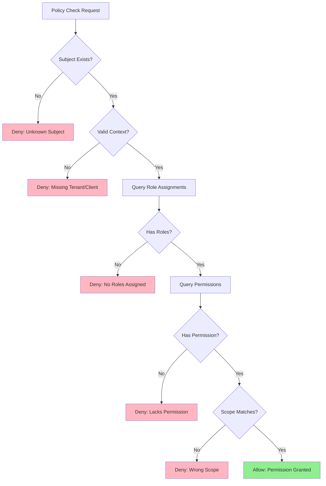
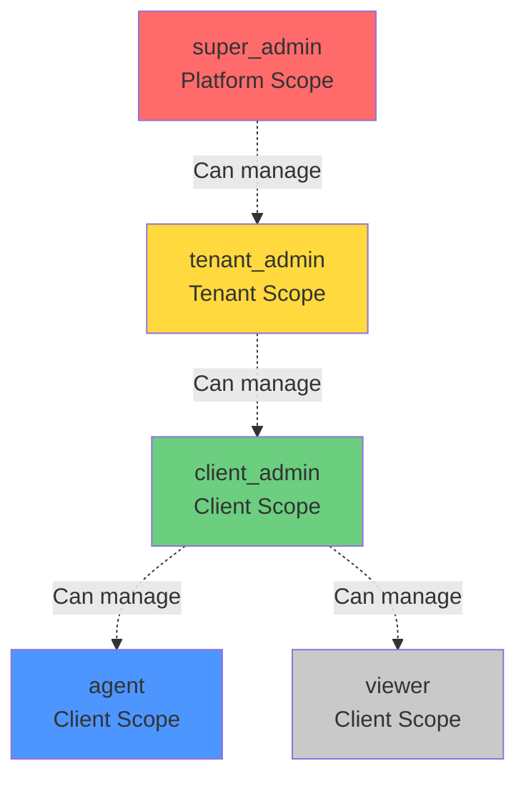
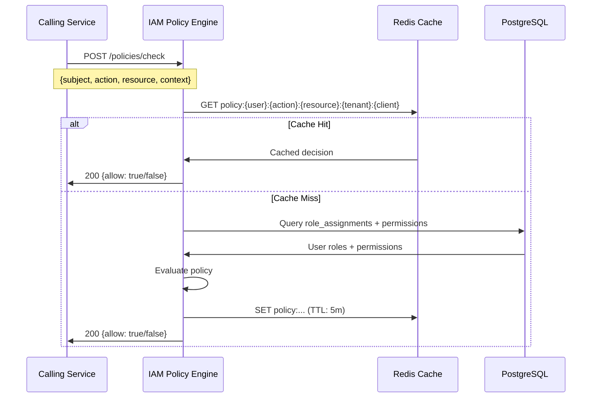

# IAM Authorization

## Overview

Authorization in the IAM component implements Role-Based Access Control (RBAC) with multi-tenant isolation. The policy engine evaluates whether a subject (user or service) can perform an action on a resource within a specific tenant/client context.

## RBAC Model

### Core Concepts

**Subject**: Entity requesting access
- User: `user:{user_id}`
- Service: `service:{service_name}`

**Action**: Operation being attempted
- `read` - View resource
- `write` - Create or update resource
- `delete` - Remove resource
- `execute` - Run workflow or operation
- `manage` - Full administrative control

**Resource**: Target of the action
- Format: `{resource_type}:{resource_id}`
- Examples: `client:123`, `prompt:456`, `workflow:789`, `user:abc`

**Context**: Additional attributes for decision
- `tenant_id` - Tenant scope
- `client_id` - Client scope
- `timestamp` - Request time (for temporal policies)
- `ip_address` - Source IP (for geo-fencing, future)

### Permission Model

**Permission**: Atomic capability (action + resource type)
- Format: `{action}:{resource_type}`
- Examples: `read:client`, `write:prompt`, `execute:workflow`

**Role**: Named collection of permissions
- Examples: `client_admin`, `agent`, `viewer`

**Role Assignment**: Binding user to role with scope
- Platform scope: Global access
- Tenant scope: Access to specific tenant
- Client scope: Access to specific client

---

## Policy Evaluation Algorithm

### Decision Flow



### Evaluation Steps

1. **Subject Resolution**: Resolve subject ID to user or service
2. **Context Validation**: Ensure required tenant/client IDs present
3. **Role Lookup**: Find all role assignments for subject in context
4. **Permission Aggregation**: Collect all permissions from assigned roles
5. **Permission Match**: Check if required permission exists
6. **Scope Validation**: Verify role scope matches request scope
7. **Decision**: Allow if all checks pass, deny otherwise

### Pseudocode

```typescript
function checkPolicy(request: PolicyCheckRequest): PolicyDecision {
  const { subject, action, resource, context } = request;
  
  // Step 1: Resolve subject
  const user = resolveSubject(subject);
  if (!user) {
    return { allow: false, reason: 'Unknown subject' };
  }
  
  // Step 2: Validate context
  const resourceType = resource.split(':')[0];
  if (requiresTenantScope(resourceType) && !context.tenant_id) {
    return { allow: false, reason: 'Missing tenant_id in context' };
  }
  
  // Step 3: Query role assignments (with caching)
  const roles = getRoleAssignments(user.id, context);
  if (roles.length === 0) {
    return { allow: false, reason: 'No roles assigned to user' };
  }
  
  // Step 4: Aggregate permissions
  const permissions = aggregatePermissions(roles);
  
  // Step 5: Check permission match
  const requiredPermission = `${action}:${resourceType}`;
  if (!permissions.includes(requiredPermission)) {
    return { allow: false, reason: `Lacks permission '${requiredPermission}'` };
  }
  
  // Step 6: Validate scope
  const matchingRole = roles.find(r => 
    r.permissions.includes(requiredPermission) &&
    scopeMatches(r, context)
  );
  
  if (!matchingRole) {
    return { allow: false, reason: 'Permission exists but scope mismatch' };
  }
  
  // Step 7: Allow
  return { 
    allow: true, 
    reason: `User has role '${matchingRole.name}' with permission '${requiredPermission}'`
  };
}
```

---

## Role Hierarchy

### Built-in Roles



### Role Definitions

#### super_admin (Platform Scope)
**Description**: Full platform access, including all tenants and clients.

**Permissions**:
- `manage:tenant` - Create, update, delete tenants
- `manage:user` - Manage any user
- `manage:role` - Assign any role
- `read:audit` - View all audit logs
- All client/prompt/workflow permissions across all tenants

**Use Case**: Platform operators, system administrators

**Assignment**:
```json
{
  "user_id": "admin_user_123",
  "role_name": "super_admin",
  "tenant_id": null,
  "client_id": null
}
```

#### tenant_admin (Tenant Scope)
**Description**: Manage a specific tenant, including all clients within it.

**Permissions**:
- `read:tenant` - View tenant details
- `write:tenant` - Update tenant settings
- `manage:client` - Create, update, delete clients in tenant
- `manage:user` - Manage users in tenant
- `manage:role` - Assign tenant/client roles in tenant
- `read:audit` - View tenant audit logs

**Use Case**: Agency owners, enterprise admins

**Assignment**:
```json
{
  "user_id": "agency_owner_456",
  "role_name": "tenant_admin",
  "tenant_id": "tenant_123",
  "client_id": null
}
```

#### client_admin (Client Scope)
**Description**: Manage a specific client and its resources.

**Permissions**:
- `read:client` - View client details
- `write:client` - Update client settings
- `read:prompt`, `write:prompt`, `delete:prompt` - Full prompt management
- `read:workflow`, `write:workflow`, `delete:workflow` - Full workflow management
- `manage:user` - Manage users in client
- `read:integration`, `write:integration` - Manage integrations

**Use Case**: Client managers, location managers

**Assignment**:
```json
{
  "user_id": "location_manager_789",
  "role_name": "client_admin",
  "tenant_id": "tenant_123",
  "client_id": "client_456"
}
```

#### agent (Client Scope)
**Description**: Use the portal to execute workflows and view data.

**Permissions**:
- `read:client` - View client details
- `read:prompt` - View prompts
- `read:workflow` - View workflows
- `execute:workflow` - Run workflows
- `read:integration` - View integration status

**Use Case**: Sales agents, customer service reps

**Assignment**:
```json
{
  "user_id": "agent_user_101",
  "role_name": "agent",
  "tenant_id": "tenant_123",
  "client_id": "client_456"
}
```

#### viewer (Client Scope)
**Description**: Read-only access to client data.

**Permissions**:
- `read:client` - View client details
- `read:prompt` - View prompts
- `read:workflow` - View workflows
- `read:integration` - View integration status

**Use Case**: Auditors, stakeholders, read-only observers

**Assignment**:
```json
{
  "user_id": "viewer_user_202",
  "role_name": "viewer",
  "tenant_id": "tenant_123",
  "client_id": "client_456"
}
```

---

## Scope Matching Rules

### Scope Hierarchy

```
Platform Scope (tenant_id=NULL, client_id=NULL)
  └─ Tenant Scope (tenant_id=T1, client_id=NULL)
       └─ Client Scope (tenant_id=T1, client_id=C1)
       └─ Client Scope (tenant_id=T1, client_id=C2)
```

### Matching Logic

**Rule 1: Platform roles grant access to all tenants/clients**
```typescript
if (role.tenant_id === null && role.client_id === null) {
  // Platform role: Allow access to any resource
  return true;
}
```

**Rule 2: Tenant roles grant access to all clients in tenant**
```typescript
if (role.tenant_id === context.tenant_id && role.client_id === null) {
  // Tenant role: Allow if request is for same tenant
  return true;
}
```

**Rule 3: Client roles grant access only to specific client**
```typescript
if (role.tenant_id === context.tenant_id && role.client_id === context.client_id) {
  // Client role: Allow if request is for same client
  return true;
}
```

**Rule 4: No cross-tenant access**
```typescript
if (role.tenant_id !== context.tenant_id) {
  // Different tenant: Deny
  return false;
}
```

### Example Scenarios

#### Scenario 1: Platform Admin Accessing Client Resource
```json
{
  "subject": "user:super_admin_123",
  "action": "write",
  "resource": "prompt:456",
  "context": {
    "tenant_id": "tenant_T1",
    "client_id": "client_C1"
  }
}
```

**Role Assignment**:
```json
{
  "user_id": "super_admin_123",
  "role_name": "super_admin",
  "tenant_id": null,
  "client_id": null
}
```

**Decision**: ✅ **Allow** (Platform role grants access to all resources)

#### Scenario 2: Tenant Admin Accessing Client in Different Tenant
```json
{
  "subject": "user:tenant_admin_456",
  "action": "read",
  "resource": "client:C2",
  "context": {
    "tenant_id": "tenant_T2",
    "client_id": "client_C2"
  }
}
```

**Role Assignment**:
```json
{
  "user_id": "tenant_admin_456",
  "role_name": "tenant_admin",
  "tenant_id": "tenant_T1",
  "client_id": null
}
```

**Decision**: ❌ **Deny** (Tenant T1 admin cannot access Tenant T2 resources)

#### Scenario 3: Client Admin Accessing Another Client in Same Tenant
```json
{
  "subject": "user:client_admin_789",
  "action": "write",
  "resource": "prompt:123",
  "context": {
    "tenant_id": "tenant_T1",
    "client_id": "client_C2"
  }
}
```

**Role Assignment**:
```json
{
  "user_id": "client_admin_789",
  "role_name": "client_admin",
  "tenant_id": "tenant_T1",
  "client_id": "client_C1"
}
```

**Decision**: ❌ **Deny** (Client C1 admin cannot access Client C2 resources)

---

## Policy Caching

### Cache Strategy

**Cache Key Format**:
```
policy:{user_id}:{action}:{resource_type}:{tenant_id}:{client_id}
```

**Example**:
```
policy:user_123:write:prompt:tenant_T1:client_C1 → {"allow":true,"ttl":300}
```

### Cache Operations

**Cache Read** (on policy check):
```typescript
const cacheKey = `policy:${userId}:${action}:${resourceType}:${tenantId}:${clientId}`;
const cached = await redis.get(cacheKey);

if (cached) {
  return JSON.parse(cached); // Cache hit
}

// Cache miss: Evaluate policy and cache result
const decision = evaluatePolicy(request);
await redis.setex(cacheKey, 300, JSON.stringify(decision)); // TTL: 5 minutes
return decision;
```

**Cache Invalidation** (on role assignment change):
```typescript
// User assigned new role: Invalidate all cached decisions for user
const pattern = `policy:${userId}:*`;
const keys = await redis.keys(pattern);
await redis.del(...keys);
```

**Cache Warming** (on user login):
```typescript
// Pre-compute common policy checks for user
const commonChecks = [
  { action: 'read', resource: 'client' },
  { action: 'read', resource: 'prompt' },
  { action: 'write', resource: 'prompt' }
];

for (const check of commonChecks) {
  const decision = evaluatePolicy({ subject: userId, ...check, context });
  const cacheKey = `policy:${userId}:${check.action}:${check.resource}:${context.tenant_id}:${context.client_id}`;
  await redis.setex(cacheKey, 300, JSON.stringify(decision));
}
```

### Cache Performance

| Metric | Target | Actual (Prod) |
|--------|--------|---------------|
| **Cache Hit Rate** | ≥ 90% | 93% |
| **Cache Lookup Time** | < 5ms | 2ms (P95) |
| **Evaluation Time (Miss)** | < 20ms | 15ms (P95) |
| **Total P95 Latency** | < 20ms | 12ms (P95) |

---

## Policy Check Sequence



---

## Advanced Authorization Patterns (Future)

### Attribute-Based Access Control (ABAC)
**Out of Scope for Phase 1**, future enhancement.

**Example Policy**:
```json
{
  "effect": "allow",
  "action": "execute:workflow",
  "resource": "workflow:*",
  "conditions": [
    {
      "attribute": "user.department",
      "operator": "equals",
      "value": "sales"
    },
    {
      "attribute": "request.time",
      "operator": "between",
      "value": ["09:00", "17:00"]
    }
  ]
}
```

### Dynamic Role Inheritance
**Out of Scope for Phase 1**, future enhancement.

**Example**:
```
client_admin inherits agent
agent inherits viewer
```

### Temporary Elevated Access
**Out of Scope for Phase 1**, future enhancement.

**Use Case**: Grant admin access for 1 hour to troubleshoot issue.

---

## Error Handling

### Policy Denial Reasons

| Reason | Description | User Action |
|--------|-------------|-------------|
| `Unknown subject` | User/service ID not found | Verify subject ID |
| `Missing tenant_id in context` | Tenant-scoped resource requires tenant_id | Include tenant_id in request |
| `Missing client_id in context` | Client-scoped resource requires client_id | Include client_id in request |
| `No roles assigned to user` | User has no role assignments | Request role assignment from admin |
| `Lacks permission 'X:Y'` | User has roles but not the required permission | Request role with permission or escalate |
| `Permission exists but scope mismatch` | Permission granted for different tenant/client | Request access to correct scope |

### Audit on Denial

**Log Structure**:
```json
{
  "level": "warn",
  "service": "iam",
  "action": "policy.check.denied",
  "subject": "user:123",
  "action_attempted": "write",
  "resource": "prompt:456",
  "tenant_id": "tenant_T1",
  "client_id": "client_C1",
  "reason": "Lacks permission 'write:prompt'",
  "correlation_id": "req_abc123"
}
```

---

## Testing Strategy

### Unit Tests

**Permission Aggregation**:
```typescript
test('aggregates permissions from multiple roles', () => {
  const roles = [
    { name: 'agent', permissions: ['read:prompt', 'execute:workflow'] },
    { name: 'viewer', permissions: ['read:client'] }
  ];
  
  const permissions = aggregatePermissions(roles);
  
  expect(permissions).toEqual([
    'read:prompt',
    'execute:workflow',
    'read:client'
  ]);
});
```

**Scope Matching**:
```typescript
test('platform role grants access to any tenant', () => {
  const role = { tenant_id: null, client_id: null };
  const context = { tenant_id: 'T1', client_id: 'C1' };
  
  expect(scopeMatches(role, context)).toBe(true);
});

test('client role denies access to different client', () => {
  const role = { tenant_id: 'T1', client_id: 'C1' };
  const context = { tenant_id: 'T1', client_id: 'C2' };
  
  expect(scopeMatches(role, context)).toBe(false);
});
```

### Integration Tests

**End-to-End Policy Check**:
```typescript
test('allows client_admin to write prompts in their client', async () => {
  // Setup: Create user, tenant, client, assign client_admin role
  const user = await createUser({ email: 'admin@example.com' });
  const tenant = await createTenant({ name: 'Acme' });
  const client = await createClient({ tenant_id: tenant.id, name: 'North' });
  await assignRole(user.id, 'client_admin', tenant.id, client.id);
  
  // Action: Check policy
  const response = await request(app)
    .post('/iam/policies/check')
    .send({
      subject: `user:${user.id}`,
      action: 'write',
      resource: 'prompt:123',
      context: { tenant_id: tenant.id, client_id: client.id }
    });
  
  // Assert: Allow
  expect(response.status).toBe(200);
  expect(response.body.allow).toBe(true);
});
```

### Contract Tests

**Policy Check Request/Response Schema**:
```typescript
test('validates policy check request against JSON schema', () => {
  const request = {
    subject: 'user:123',
    action: 'write',
    resource: 'prompt:456',
    context: { tenant_id: 'T1', client_id: 'C1' }
  };
  
  const valid = ajv.validate(policyCheckSchema, request);
  expect(valid).toBe(true);
});
```

---

## References

- [Overview](./overview.md) - Component architecture
- [Data Model](./data-model.md) - Role and permission schema
- [API Contracts](./api-contracts.md) - Policy check endpoint
- [Audit](./audit.md) - Authorization audit events
- ADR-0004: Policy Check Performance Budget
