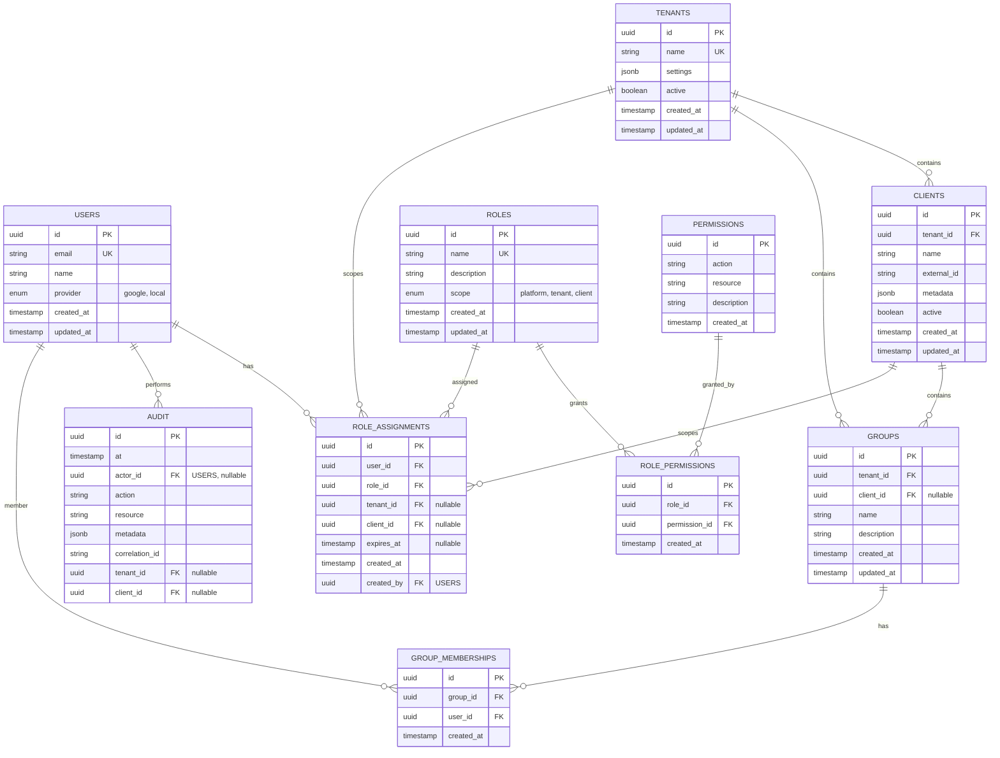

# IAM Data Model

## Overview

The IAM data model supports multi-tenant identity, role-based access control (RBAC), and comprehensive audit trails. The model enforces tenant isolation while enabling flexible role assignments at tenant and client levels.

## Entity Relationship Diagram



## Core Entities

### users
Represents platform users authenticated via SSO or local credentials.

| Column | Type | Constraints | Description |
|--------|------|-------------|-------------|
| `id` | `uuid` | `PK` | Unique user identifier |
| `email` | `varchar(255)` | `UNIQUE NOT NULL` | User email (identity key) |
| `name` | `varchar(255)` | `NOT NULL` | Display name |
| `provider` | `enum` | `NOT NULL DEFAULT 'google'` | Identity provider: `google`, `local` |
| `created_at` | `timestamp` | `NOT NULL DEFAULT now()` | Record creation time |
| `updated_at` | `timestamp` | `NOT NULL DEFAULT now()` | Last update time |

**Indexes**:
- `idx_users_email` on `(email)` - Fast login lookups
- `idx_users_provider` on `(provider)` - Provider-based queries

**Constraints**:
- Email format validation (application-level)
- Provider enum enforced at DB level

### tenants
Top-level organizational units (e.g., agencies, enterprises).

| Column | Type | Constraints | Description |
|--------|------|-------------|-------------|
| `id` | `uuid` | `PK` | Unique tenant identifier |
| `name` | `varchar(255)` | `UNIQUE NOT NULL` | Tenant name |
| `settings` | `jsonb` | `NOT NULL DEFAULT '{}'` | Tenant-specific config |
| `active` | `boolean` | `NOT NULL DEFAULT true` | Tenant enabled status |
| `created_at` | `timestamp` | `NOT NULL DEFAULT now()` | Record creation time |
| `updated_at` | `timestamp` | `NOT NULL DEFAULT now()` | Last update time |

**Indexes**:
- `idx_tenants_name` on `(name)` - Name lookups
- `idx_tenants_active` on `(active)` - Active tenant filtering

**Settings Schema** (JSONB):
```json
{
  "billing": {
    "plan": "pro",
    "seats_limit": 50
  },
  "branding": {
    "logo_url": "https://...",
    "primary_color": "#0066cc"
  },
  "features": {
    "multi_client": true,
    "api_access": true
  }
}
```

### clients
Sub-organizations within tenants (e.g., business units, locations).

| Column | Type | Constraints | Description |
|--------|------|-------------|-------------|
| `id` | `uuid` | `PK` | Unique client identifier |
| `tenant_id` | `uuid` | `FK tenants(id) NOT NULL` | Owning tenant |
| `name` | `varchar(255)` | `NOT NULL` | Client name |
| `external_id` | `varchar(255)` | `NULL` | CRM/external system ID |
| `metadata` | `jsonb` | `NOT NULL DEFAULT '{}'` | Client-specific data |
| `active` | `boolean` | `NOT NULL DEFAULT true` | Client enabled status |
| `created_at` | `timestamp` | `NOT NULL DEFAULT now()` | Record creation time |
| `updated_at` | `timestamp` | `NOT NULL DEFAULT now()` | Last update time |

**Indexes**:
- `idx_clients_tenant_id` on `(tenant_id)` - Tenant-scoped queries
- `idx_clients_external_id` on `(external_id)` - CRM sync lookups
- `idx_clients_tenant_name` on `(tenant_id, name)` - Unique per tenant

**Constraints**:
- `UNIQUE (tenant_id, name)` - Unique client names within tenant
- `ON DELETE CASCADE` on `tenant_id` - Cascade tenant deletion

### roles
Named collections of permissions (e.g., "admin", "agent", "viewer").

| Column | Type | Constraints | Description |
|--------|------|-------------|-------------|
| `id` | `uuid` | `PK` | Unique role identifier |
| `name` | `varchar(100)` | `UNIQUE NOT NULL` | Role name |
| `description` | `text` | `NULL` | Human-readable description |
| `scope` | `enum` | `NOT NULL` | Scope: `platform`, `tenant`, `client` |
| `created_at` | `timestamp` | `NOT NULL DEFAULT now()` | Record creation time |
| `updated_at` | `timestamp` | `NOT NULL DEFAULT now()` | Last update time |

**Indexes**:
- `idx_roles_name` on `(name)` - Role lookups
- `idx_roles_scope` on `(scope)` - Scope filtering

**Scope Semantics**:
- `platform`: Global admin roles (e.g., "super_admin")
- `tenant`: Tenant-scoped roles (e.g., "tenant_admin")
- `client`: Client-scoped roles (e.g., "agent", "viewer")

**Built-in Roles** (seeded at bootstrap):
- `super_admin` (platform): Full platform access
- `tenant_admin` (tenant): Manage tenant users, clients, settings
- `client_admin` (client): Manage client users, prompts, workflows
- `agent` (client): Use portal, execute workflows
- `viewer` (client): Read-only access to client data

### permissions
Atomic capabilities (action + resource combinations).

| Column | Type | Constraints | Description |
|--------|------|-------------|-------------|
| `id` | `uuid` | `PK` | Unique permission identifier |
| `action` | `varchar(50)` | `NOT NULL` | Action verb (e.g., `read`, `write`) |
| `resource` | `varchar(100)` | `NOT NULL` | Resource type (e.g., `client`, `prompt`) |
| `description` | `text` | `NULL` | Human-readable description |
| `created_at` | `timestamp` | `NOT NULL DEFAULT now()` | Record creation time |

**Indexes**:
- `idx_permissions_action_resource` on `(action, resource)` - Unique permission lookup

**Constraints**:
- `UNIQUE (action, resource)` - One permission per action+resource pair

**Permission Naming Convention**:
- Format: `{action}:{resource}` (e.g., `read:client`, `write:prompt`, `delete:workflow`)
- Actions: `read`, `write`, `delete`, `execute`, `manage`
- Resources: `client`, `prompt`, `workflow`, `integration`, `user`, `role`, `audit`

**Built-in Permissions** (examples, seeded at bootstrap):
- `read:client`, `write:client`, `delete:client`
- `read:prompt`, `write:prompt`, `delete:prompt`
- `read:workflow`, `write:workflow`, `execute:workflow`
- `manage:user`, `manage:role` (admin operations)

### role_permissions
Join table linking roles to permissions.

| Column | Type | Constraints | Description |
|--------|------|-------------|-------------|
| `id` | `uuid` | `PK` | Unique assignment identifier |
| `role_id` | `uuid` | `FK roles(id) NOT NULL` | Role being granted permission |
| `permission_id` | `uuid` | `FK permissions(id) NOT NULL` | Permission being granted |
| `created_at` | `timestamp` | `NOT NULL DEFAULT now()` | Grant time |

**Indexes**:
- `idx_role_permissions_role` on `(role_id)` - Role-to-permissions lookup
- `idx_role_permissions_permission` on `(permission_id)` - Permission-to-roles lookup

**Constraints**:
- `UNIQUE (role_id, permission_id)` - No duplicate grants
- `ON DELETE CASCADE` on both FKs

### role_assignments
Assigns roles to users with optional tenant/client scope.

| Column | Type | Constraints | Description |
|--------|------|-------------|-------------|
| `id` | `uuid` | `PK` | Unique assignment identifier |
| `user_id` | `uuid` | `FK users(id) NOT NULL` | User receiving role |
| `role_id` | `uuid` | `FK roles(id) NOT NULL` | Role being assigned |
| `tenant_id` | `uuid` | `FK tenants(id) NULL` | Tenant scope (if applicable) |
| `client_id` | `uuid` | `FK clients(id) NULL` | Client scope (if applicable) |
| `expires_at` | `timestamp` | `NULL` | Optional expiration time |
| `created_at` | `timestamp` | `NOT NULL DEFAULT now()` | Assignment time |
| `created_by` | `uuid` | `FK users(id) NULL` | User who granted assignment |

**Indexes**:
- `idx_role_assignments_user` on `(user_id)` - User's roles lookup
- `idx_role_assignments_tenant` on `(tenant_id)` - Tenant-scoped assignments
- `idx_role_assignments_client` on `(client_id)` - Client-scoped assignments
- `idx_role_assignments_expires` on `(expires_at)` - Expiration cleanup

**Constraints**:
- `UNIQUE (user_id, role_id, tenant_id, client_id)` - No duplicate assignments
- `CHECK`: If role.scope = 'tenant', `tenant_id NOT NULL AND client_id IS NULL`
- `CHECK`: If role.scope = 'client', `tenant_id NOT NULL AND client_id NOT NULL`
- `CHECK`: If role.scope = 'platform', `tenant_id IS NULL AND client_id IS NULL`

**Assignment Semantics**:
- Platform role: `tenant_id=NULL, client_id=NULL` (global access)
- Tenant role: `tenant_id=T1, client_id=NULL` (access to tenant T1)
- Client role: `tenant_id=T1, client_id=C1` (access to client C1 only)

### groups
Logical user collections for batch role assignments (future).

| Column | Type | Constraints | Description |
|--------|------|-------------|-------------|
| `id` | `uuid` | `PK` | Unique group identifier |
| `tenant_id` | `uuid` | `FK tenants(id) NOT NULL` | Owning tenant |
| `client_id` | `uuid` | `FK clients(id) NULL` | Optional client scope |
| `name` | `varchar(255)` | `NOT NULL` | Group name |
| `description` | `text` | `NULL` | Human-readable description |
| `created_at` | `timestamp` | `NOT NULL DEFAULT now()` | Record creation time |
| `updated_at` | `timestamp` | `NOT NULL DEFAULT now()` | Last update time |

**Indexes**:
- `idx_groups_tenant` on `(tenant_id)` - Tenant-scoped groups
- `idx_groups_client` on `(client_id)` - Client-scoped groups

**Constraints**:
- `UNIQUE (tenant_id, client_id, name)` - Unique group names per scope
- `ON DELETE CASCADE` on `tenant_id` and `client_id`

### group_memberships
Join table linking users to groups.

| Column | Type | Constraints | Description |
|--------|------|-------------|-------------|
| `id` | `uuid` | `PK` | Unique membership identifier |
| `group_id` | `uuid` | `FK groups(id) NOT NULL` | Group |
| `user_id` | `uuid` | `FK users(id) NOT NULL` | User |
| `created_at` | `timestamp` | `NOT NULL DEFAULT now()` | Membership start time |

**Indexes**:
- `idx_group_memberships_group` on `(group_id)` - Group members lookup
- `idx_group_memberships_user` on `(user_id)` - User's groups lookup

**Constraints**:
- `UNIQUE (group_id, user_id)` - No duplicate memberships
- `ON DELETE CASCADE` on both FKs

### audit
Immutable log of security-sensitive operations.

| Column | Type | Constraints | Description |
|--------|------|-------------|-------------|
| `id` | `uuid` | `PK` | Unique event identifier |
| `at` | `timestamp` | `NOT NULL DEFAULT now()` | Event timestamp |
| `actor_id` | `uuid` | `FK users(id) NULL` | User performing action (NULL for system) |
| `action` | `varchar(100)` | `NOT NULL` | Action performed (e.g., `role.assign`) |
| `resource` | `varchar(255)` | `NOT NULL` | Resource affected (e.g., `user:123`) |
| `metadata` | `jsonb` | `NOT NULL DEFAULT '{}'` | Additional event details |
| `correlation_id` | `varchar(100)` | `NULL` | Request correlation ID |
| `tenant_id` | `uuid` | `FK tenants(id) NULL` | Tenant context (if applicable) |
| `client_id` | `uuid` | `FK clients(id) NULL` | Client context (if applicable) |

**Indexes**:
- `idx_audit_at` on `(at DESC)` - Chronological queries
- `idx_audit_actor` on `(actor_id)` - User activity audit
- `idx_audit_resource` on `(resource)` - Resource history
- `idx_audit_correlation` on `(correlation_id)` - Trace event chain
- `idx_audit_tenant` on `(tenant_id)` - Tenant audit trails
- `idx_audit_client` on `(client_id)` - Client audit trails

**Constraints**:
- Partition by `at` (monthly partitions for performance)
- No delete/update allowed (append-only via DB permissions)

**Metadata Schema** (JSONB examples):
```json
{
  "old_value": {"role": "agent"},
  "new_value": {"role": "client_admin"},
  "ip_address": "203.0.113.42",
  "user_agent": "Mozilla/5.0...",
  "result": "success",
  "error": null
}
```

## Query Patterns

### Check User Permission
```sql
-- Does user U have permission P in client C?
SELECT EXISTS (
  SELECT 1
  FROM role_assignments ra
  JOIN role_permissions rp ON ra.role_id = rp.role_id
  JOIN permissions p ON rp.permission_id = p.id
  WHERE ra.user_id = $user_id
    AND p.action = $action
    AND p.resource = $resource
    AND (ra.client_id = $client_id OR ra.tenant_id = $tenant_id OR (ra.tenant_id IS NULL AND ra.client_id IS NULL))
    AND (ra.expires_at IS NULL OR ra.expires_at > now())
) AS has_permission;
```

### Get User Roles in Context
```sql
-- Get all roles for user U in client C
SELECT r.name, ra.tenant_id, ra.client_id
FROM role_assignments ra
JOIN roles r ON ra.role_id = r.id
WHERE ra.user_id = $user_id
  AND (ra.client_id = $client_id OR ra.tenant_id = $tenant_id OR (ra.tenant_id IS NULL AND ra.client_id IS NULL))
  AND (ra.expires_at IS NULL OR ra.expires_at > now());
```

### Audit Trail by Resource
```sql
-- Get audit events for resource R in last 30 days
SELECT at, actor_id, action, metadata
FROM audit
WHERE resource = $resource
  AND at > now() - interval '30 days'
ORDER BY at DESC
LIMIT 100;
```

## Migration Strategy

### Schema Versioning
- Use TypeORM migrations (auto-generated from entities)
- Migration files: `migrations/{timestamp}-{description}.ts`
- Apply migrations on service startup (production: manual review + apply)

### Initial Schema (Phase 1)
1. Create core tables: `users`, `tenants`, `clients`, `roles`, `permissions`
2. Create join tables: `role_permissions`, `role_assignments`
3. Create audit table with partitioning
4. Seed built-in roles and permissions
5. Create indexes for common query patterns

### Data Seeding
```typescript
// Seed built-in roles
const roles = [
  { name: 'super_admin', scope: 'platform', description: 'Full platform access' },
  { name: 'tenant_admin', scope: 'tenant', description: 'Manage tenant' },
  { name: 'client_admin', scope: 'client', description: 'Manage client' },
  { name: 'agent', scope: 'client', description: 'Use portal' },
  { name: 'viewer', scope: 'client', description: 'Read-only access' }
];

// Seed built-in permissions
const permissions = [
  { action: 'read', resource: 'client' },
  { action: 'write', resource: 'client' },
  { action: 'delete', resource: 'client' },
  { action: 'manage', resource: 'user' },
  { action: 'manage', resource: 'role' },
  // ... (full list in seed script)
];
```

### Future Enhancements (Out of Scope for Phase 1)
- `sessions` table for explicit session tracking (currently in Redis)
- `api_keys` table for programmatic access (future)
- `mfa_settings` table for multi-factor auth (future)
- `login_history` table for security monitoring (future)
- `password_resets` table for local auth (future)

## Data Retention

| Table | Retention | Policy |
|-------|-----------|--------|
| `users` | Indefinite | Soft delete (inactive flag) |
| `tenants` | Indefinite | Soft delete (active flag) |
| `clients` | Indefinite | Soft delete (active flag) |
| `role_assignments` | Until revoked | Explicit revocation |
| `audit` | 2 years | Partition drop after 2 years |
| `sessions` (Redis) | 24 hours | TTL expiration |
| `policy_cache` (Redis) | 5 minutes | TTL expiration |

## Performance Considerations

### Database Optimization
- **Connection Pool**: Min 5, Max 20 connections per replica
- **Prepared Statements**: All queries use parameterized queries (SQL injection prevention)
- **Read Replicas**: Policy checks routed to read replicas (eventual consistency acceptable)
- **Partitioning**: Audit table partitioned by month (automatic partition creation)

### Caching Strategy
- **Policy Decisions**: Cache allow/deny decisions for 5 minutes (Redis)
- **Role Assignments**: Cache user roles for 5 minutes (invalidate on assignment change)
- **Permissions**: In-memory cache of role-permission mappings (invalidate on permission change)

### Index Maintenance
- Rebuild indexes monthly (low-traffic window)
- Monitor index usage and remove unused indexes
- Add covering indexes for hot query patterns

## References

- [Overview](./overview.md) - Component architecture
- [API Contracts](./api-contracts.md) - REST endpoints using this schema
- [Authorization](./authorization.md) - RBAC engine implementation
- [Audit](./audit.md) - Audit event processing
- ADR-0002: Multi-Tenant Data Isolation
- ADR-0004: Policy Check Performance Budget
