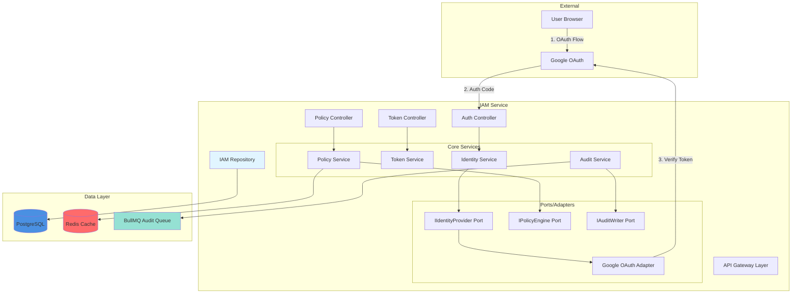
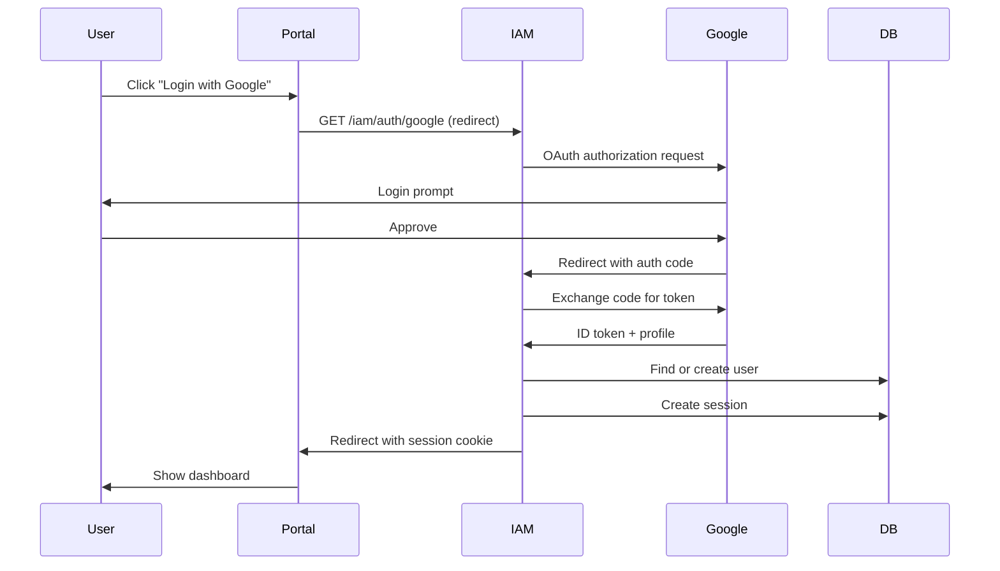
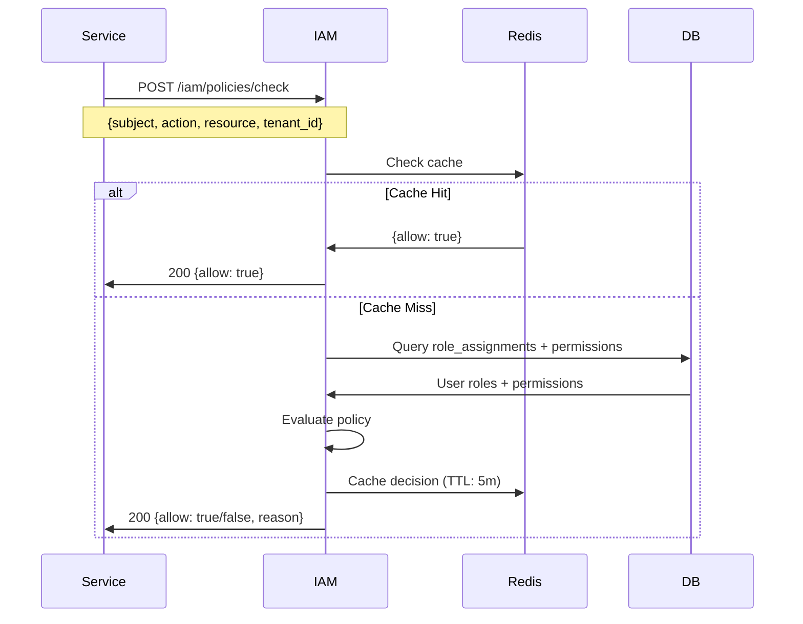

# IAM Component Overview

## Purpose

The Identity and Access Management (IAM) component is the security foundation of the MaxAI Platform, providing:

- **Multi-tenant Identity**: User authentication with tenant/client isolation
- **Single Sign-On (SSO)**: Google OAuth integration with extensibility for other providers
- **Service Authentication**: JWT tokens for inter-service communication
- **RBAC Authorization**: Role-Based Access Control with fine-grained permissions
- **Audit Trails**: Comprehensive logging of security-sensitive operations

## Component Architecture



## Component Responsibilities

### Identity Service
- **User Lifecycle**: Create, read, update user records
- **SSO Integration**: Exchange OAuth authorization codes for user profiles
- **Provider Abstraction**: Abstract multiple identity providers via port interface
- **Session Management**: Create and validate user sessions

**Key Features**:
- Multi-provider support (Google, extensible to Microsoft, Okta)
- User profile normalization across providers
- Email-based user identity resolution
- Automatic user provisioning on first login

### Token Service
- **Service Tokens**: Mint JWT tokens for inter-service authentication
- **Token Validation**: Verify token signatures and claims
- **Scope Management**: Enforce token scopes and expiration
- **Key Rotation**: Support key rotation without downtime

**Token Types**:
- **Session Tokens**: User browser sessions (HttpOnly cookies)
- **Service Tokens**: Inter-service API calls (Bearer tokens)
- **Refresh Tokens**: Long-lived token renewal (future)

### Policy Service
- **RBAC Engine**: Evaluate role-based access control policies
- **Permission Checks**: Determine if subject can perform action on resource
- **Tenant Isolation**: Enforce multi-tenant boundaries
- **Policy Caching**: Cache policy decisions for performance

**Policy Model**:
- **Subject**: User or service making the request
- **Action**: Operation being attempted (e.g., `read`, `write`, `delete`)
- **Resource**: Target resource (e.g., `client:123`, `prompt:456`)
- **Context**: Additional attributes (tenant_id, client_id, role assignments)

### Audit Service
- **Event Recording**: Log all security-sensitive operations
- **Correlation Tracking**: Link related events via correlation IDs
- **Compliance**: Support audit requirements (HIPAA, SOC2)
- **Query Interface**: Retrieve audit logs for investigation

## Technology Stack

| Layer | Technology | Purpose |
|-------|-----------|---------|
| **Framework** | NestJS | Modular architecture, DI, decorators |
| **Language** | TypeScript | Type safety, developer experience |
| **Database** | PostgreSQL 14+ | ACID transactions, JSON support |
| **Caching** | Redis 7+ | Policy decision caching, session metadata |
| **Queue** | BullMQ | Async audit event processing |
| **Validation** | class-validator, AJV | DTO validation, JSON Schema contracts |
| **Testing** | Jest, Supertest | Unit, integration, contract tests |
| **OAuth** | Passport.js | SSO strategy abstraction |
| **JWT** | jsonwebtoken | Token signing/verification |

## Key Design Decisions

### ADR-0002: Multi-Tenant Data Isolation
- **Decision**: Use `tenant_id` foreign keys with Row-Level Security (RLS) policies
- **Rationale**: Balance security, performance, and operational simplicity
- **Trade-off**: Schema-per-tenant rejected (operational complexity), DB-per-tenant rejected (cost)

### ADR-0003: Ports & Adapters for Identity Providers
- **Decision**: Abstract identity providers behind `IIdentityProviderPort` interface
- **Rationale**: Enable provider switching without core logic changes
- **Trade-off**: Additional abstraction layer vs vendor lock-in risk

### ADR-0004: Policy Check Performance Budget
- **Decision**: P95 latency < 20ms for policy checks
- **Rationale**: Authorization checks are in critical path for all requests
- **Implementation**: Redis caching, deny-by-default, optimized queries

### ADR-0006: Audit Event Processing
- **Decision**: Async audit writes via BullMQ queue
- **Rationale**: Don't block request processing on audit writes
- **Trade-off**: Eventual consistency vs synchronous durability (chose eventual)

## Integration Points

### Inbound (Consumers of IAM)
- **API Gateway**: Validates sessions, enforces RBAC before routing
- **Portal Web**: User login/logout, profile management
- **Admin Web**: User/role/permission management
- **All Services**: Policy checks for authorization, service token validation

### Outbound (IAM Dependencies)
- **Google OAuth**: Authorization code exchange, token verification
- **PostgreSQL**: User, tenant, role, permission persistence
- **Redis**: Policy decision caching, session metadata
- **BullMQ**: Async audit event processing

## Data Flow Examples

### User Login Flow


### Policy Check Flow


## Non-Functional Requirements

| Requirement | Target | Measurement |
|------------|--------|-------------|
| **Policy Check Latency** | P95 < 20ms | Prometheus histogram |
| **Token Mint Latency** | P95 < 100ms | Prometheus histogram |
| **Session Creation** | P95 < 500ms | Prometheus histogram |
| **Availability** | ≥ 99.9% | Uptime monitoring |
| **Cache Hit Rate** | ≥ 90% | Redis INFO stats |
| **Audit Write Success** | ≥ 99.99% | BullMQ job success rate |
| **Test Coverage** | ≥ 95% | Jest coverage report |

## Error Handling

### Error Taxonomy
| Code | Error | Meaning | Recovery |
|------|-------|---------|----------|
| `400` | `invalid_request` | Malformed request | Fix request format |
| `401` | `unauthorized` | No valid credentials | Login required |
| `401` | `token_expired` | Session/token expired | Refresh or re-login |
| `403` | `forbidden` | Lacks permission | Request access or escalate |
| `409` | `role_assignment_conflict` | Duplicate assignment | Use existing assignment |
| `422` | `validation_error` | Invalid entity data | Fix validation errors |
| `500` | `identity_provider_error` | Google OAuth failed | Retry, fallback provider |
| `500` | `audit_write_failed` | Audit queue error | Retry with backoff |
| `503` | `service_unavailable` | DB/Redis unavailable | Circuit breaker, retry |

### Retry Strategy
- **Transient errors** (503, 500.identity_provider_error): Exponential backoff, max 3 retries
- **Auth errors** (401, 403): No retry, return to caller
- **Validation errors** (400, 422): No retry, return to caller

## Security Controls

### Authentication
- **OAuth 2.0**: Server-side flow with state parameter (anti-CSRF)
- **PKCE**: Code challenge/verifier for public clients (future)
- **Session Cookies**: HttpOnly, Secure, SameSite=Strict

### Authorization
- **Deny-by-Default**: All requests denied unless explicit permission
- **RBAC**: Role-based with permission inheritance
- **Tenant Isolation**: Enforce tenant_id in all queries
- **Admin Separation**: Admin roles cannot access tenant data without explicit assignment

### Token Security
- **JWT Signing**: HS256 (shared secret) or RS256 (public/private key)
- **Short Expiration**: Service tokens expire in 1 hour
- **Key Rotation**: Support multiple active signing keys
- **No Sensitive Data**: Tokens contain only user_id, tenant_id, scopes

### Audit
- **All Mutations**: Log all create/update/delete operations
- **Sensitive Reads**: Log role assignments, permission grants
- **No PII in Logs**: Redact sensitive fields (passwords, tokens)
- **Immutable Logs**: Audit records are append-only

## Observability

### Structured Logs
```json
{
  "timestamp": "2025-10-21T10:15:30Z",
  "level": "info",
  "service": "iam",
  "correlation_id": "abc123",
  "actor_id": "user_456",
  "tenant_id": "tenant_789",
  "action": "policy.check",
  "resource": "client:123",
  "decision": "allow",
  "duration_ms": 12
}
```

### Metrics (Prometheus)
- `iam_policy_checks_total{decision="allow|deny"}` - Policy check decisions
- `iam_policy_check_duration_ms` - Policy check latency histogram
- `iam_token_mints_total{type="session|service"}` - Token mint count
- `iam_sso_logins_total{provider="google"}` - SSO login count
- `iam_cache_hits_total`, `iam_cache_misses_total` - Cache effectiveness
- `iam_audit_events_total{status="success|failed"}` - Audit write status

### Traces (OpenTelemetry)
- Span: `iam.session.create` - Full SSO flow
- Span: `iam.policy.check` - Policy evaluation
- Span: `iam.token.mint` - Token generation
- Link: Correlation ID ties related spans across services

## Deployment

### Scaling
- **Horizontal**: Stateless, scale pods based on CPU (target: 70%)
- **Database**: Read replicas for policy checks (read-heavy workload)
- **Cache**: Redis cluster for high availability

### Configuration
- **Environment Variables**: `GOOGLE_CLIENT_ID`, `GOOGLE_CLIENT_SECRET`, `JWT_SECRET`
- **Secrets**: Stored in GCP Secret Manager, mounted as env vars
- **Feature Flags**: `iam.rbac.cache.enabled`, `iam.audit.async.enabled`

## Future Enhancements (Out of Scope for Phase 1)

- Multi-factor authentication (MFA)
- Refresh tokens for long-lived sessions
- OAuth scopes for fine-grained API access
- SAML integration for enterprise SSO
- Attribute-Based Access Control (ABAC)
- Dynamic role hierarchy (role inheritance)
- Self-service user registration
- Password-based local authentication

## References

- [Data Model](./data-model.md) - Entity relationships and schema
- [API Contracts](./api-contracts.md) - REST endpoints and DTOs
- [Authentication](./authentication.md) - SSO implementation details
- [Authorization](./authorization.md) - RBAC engine details
- [Audit](./audit.md) - Audit trail implementation
- [Security](./security.md) - Threat model and mitigations
- [Phase 1 Implementation](../impl/phase-1/iam.md) - MVP acceptance criteria
- ADR-0002, ADR-0003, ADR-0004, ADR-0006 - Architecture decisions
