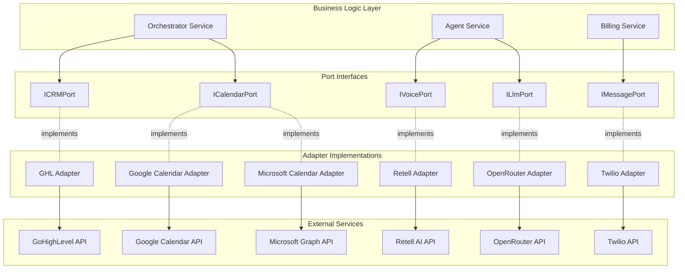
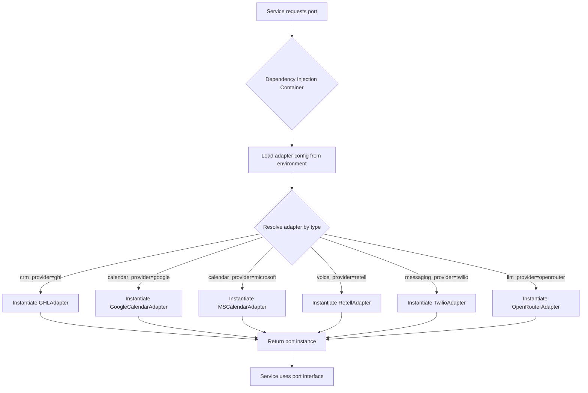

# Integration Adapters - Architecture Overview

**Related Issue**: #156 (ARCH-DOC-09: Integration Adapters Architecture Spec)

## Purpose

The Integration Adapters component implements the **Ports & Adapters (Hexagonal Architecture)** pattern to integrate with external services (CRM, Calendar, Voice, Messaging, LLM providers) while maintaining vendor independence, swappability, and testability.

## Design Philosophy

### Core Principles

1. **Vendor Independence**
   - Business logic depends on port interfaces, never concrete adapters
   - Domain models are platform-agnostic
   - Switching vendors requires only adapter replacement, no business logic changes

2. **Swappability**
   - Adapters can be hot-swapped via configuration
   - Multiple adapters can coexist for A/B testing or migration
   - Adapter selection resolved at runtime via dependency injection

3. **Testability**
   - Port interfaces enable mock adapters for unit testing
   - Integration tests use real adapters against sandbox environments
   - Contract tests validate adapter compliance with port interface

4. **Observability**
   - All adapter operations emit structured logs with correlation IDs
   - Metrics track latency, error rates, rate limit usage per adapter
   - Distributed tracing spans adapter calls for end-to-end visibility

5. **Resilience**
   - Adapters implement exponential backoff retry logic
   - Circuit breakers prevent cascading failures
   - Graceful degradation when external services unavailable

## Ports & Adapters Pattern

### Architecture Diagram



### Port Interface Structure

All port interfaces follow a consistent pattern:

```typescript
// Port interface (in @platform/integration-ports)
export interface ICRMPort {
  // Core operations
  getContact(contactId: string): Promise<Contact>;
  createContact(data: CreateContactDTO): Promise<Contact>;
  updateContact(contactId: string, data: UpdateContactDTO): Promise<Contact>;
  
  // Metadata
  getProviderName(): string;
  isHealthy(): Promise<boolean>;
}

// Domain model (vendor-agnostic)
export interface Contact {
  id: string;
  firstName: string;
  lastName: string;
  email: string;
  phone?: string;
  customFields?: Record<string, unknown>;
  createdAt: Date;
  updatedAt: Date;
}
```

### Adapter Implementation Structure

```typescript
// Adapter implementation (in @platform/ghl-adapter)
export class GHLCRMAdapter implements ICRMPort {
  constructor(
    private readonly httpClient: AxiosInstance,
    private readonly config: GHLConfig,
    private readonly logger: Logger,
    private readonly metrics: MetricsService
  ) {}
  
  async getContact(contactId: string): Promise<Contact> {
    const span = this.startSpan('ghl.getContact');
    try {
      // Make API call
      const response = await this.httpClient.get(`/contacts/${contactId}`);
      
      // Map vendor response to domain model
      const contact = this.mapGHLContactToDomain(response.data);
      
      // Emit metrics
      this.metrics.increment('ghl.api.success', { operation: 'getContact' });
      
      return contact;
    } catch (error) {
      // Map vendor error to domain error
      throw this.mapError(error);
    } finally {
      span.end();
    }
  }
  
  getProviderName(): string {
    return 'GoHighLevel';
  }
  
  async isHealthy(): Promise<boolean> {
    try {
      await this.httpClient.get('/health');
      return true;
    } catch {
      return false;
    }
  }
  
  private mapGHLContactToDomain(ghlContact: any): Contact {
    // Transform GHL-specific structure to domain model
    return {
      id: ghlContact.id,
      firstName: ghlContact.firstName,
      lastName: ghlContact.lastName,
      email: ghlContact.email,
      phone: ghlContact.phone,
      customFields: ghlContact.customFields,
      createdAt: new Date(ghlContact.dateAdded),
      updatedAt: new Date(ghlContact.dateUpdated),
    };
  }
  
  private mapError(error: unknown): Error {
    // Map vendor-specific errors to domain errors
    if (axios.isAxiosError(error)) {
      if (error.response?.status === 429) {
        return new RateLimitError('GHL rate limit exceeded');
      }
      if (error.response?.status === 404) {
        return new NotFoundError('Contact not found');
      }
    }
    return new IntegrationError('GHL API error', { cause: error });
  }
}
```

## Adapter Selection Flow



### Configuration Example

```typescript
// config/adapters.ts
export const adapterConfig = {
  crm: {
    provider: process.env.CRM_PROVIDER || 'ghl', // 'ghl' | 'salesforce' | 'hubspot'
    config: {
      apiUrl: process.env.GHL_API_URL,
      oauth: {
        clientId: process.env.GHL_CLIENT_ID,
        clientSecret: process.env.GHL_CLIENT_SECRET,
      },
    },
  },
  calendar: {
    provider: process.env.CALENDAR_PROVIDER || 'google', // 'google' | 'microsoft'
    config: {
      oauth: {
        clientId: process.env.GOOGLE_CLIENT_ID,
        clientSecret: process.env.GOOGLE_CLIENT_SECRET,
      },
    },
  },
  voice: {
    provider: process.env.VOICE_PROVIDER || 'retell', // 'retell' | 'vapi'
    config: {
      apiKey: process.env.RETELL_API_KEY,
      webhookSecret: process.env.RETELL_WEBHOOK_SECRET,
    },
  },
  messaging: {
    provider: process.env.MESSAGING_PROVIDER || 'twilio', // 'twilio' | 'telnyx'
    config: {
      accountSid: process.env.TWILIO_ACCOUNT_SID,
      authToken: process.env.TWILIO_AUTH_TOKEN,
    },
  },
  llm: {
    provider: process.env.LLM_PROVIDER || 'openrouter', // 'openrouter' | 'openai' | 'anthropic'
    config: {
      apiKey: process.env.OPENROUTER_API_KEY,
      defaultModel: process.env.LLM_DEFAULT_MODEL || 'anthropic/claude-3.5-sonnet',
    },
  },
};
```

## Integration Points

### With Orchestrator Component

The Orchestrator uses adapters to execute workflow steps:

- **CRM Port**: Create/update contacts, opportunities, tasks during lead qualification
- **Calendar Port**: Schedule appointments, check availability, send invites
- **Voice Port**: Initiate calls, retrieve call recordings, get transcripts
- **Message Port**: Send SMS notifications, delivery confirmations
- **LLM Port**: Generate responses, summarize conversations, classify intent

### With Webhook Ingress Component

Webhook Ingress routes inbound webhooks to appropriate adapters:

- **GHL webhooks** → CRM Port webhook handler
- **Google Calendar webhooks** → Calendar Port webhook handler
- **Retell webhooks** → Voice Port webhook handler (call status updates)
- **Twilio webhooks** → Message Port webhook handler (delivery receipts)

### With Billing-Usage Component

Adapters report billable usage to Billing-Usage:

- **Voice Port**: Call duration, recording storage
- **Message Port**: SMS/MMS sent, segment count
- **LLM Port**: Token usage, model type, cost calculation

## Error Handling Strategy

### Error Type Hierarchy

```typescript
// Domain errors (in @platform/integration-ports)
export class IntegrationError extends Error {
  constructor(message: string, public cause?: unknown) {
    super(message);
    this.name = 'IntegrationError';
  }
}

export class RateLimitError extends IntegrationError {
  constructor(message: string, public retryAfter?: number) {
    super(message);
    this.name = 'RateLimitError';
  }
}

export class AuthenticationError extends IntegrationError {
  constructor(message: string) {
    super(message);
    this.name = 'AuthenticationError';
  }
}

export class NotFoundError extends IntegrationError {
  constructor(message: string) {
    super(message);
    this.name = 'NotFoundError';
  }
}

export class ValidationError extends IntegrationError {
  constructor(message: string, public fields?: Record<string, string[]>) {
    super(message);
    this.name = 'ValidationError';
  }
}
```

### Retry Logic

All adapters implement exponential backoff with jitter:

```typescript
const retryConfig = {
  maxRetries: 3,
  initialDelay: 1000, // 1 second
  maxDelay: 30000,    // 30 seconds
  backoffFactor: 2,
  jitter: true,
  retryableErrors: [
    'ECONNRESET',
    'ETIMEDOUT',
    'ENOTFOUND',
    'RateLimitError',
  ],
};
```

## Non-Functional Requirements (NFRs)

### Performance

- **Response Time**: P95 latency < 500ms for synchronous operations (excluding external API latency)
- **Throughput**: Support 1000 requests/second per adapter type
- **Concurrency**: Handle 100 concurrent requests per adapter instance

### Reliability

- **Availability**: 99.9% uptime for adapter layer (external service availability separate)
- **Circuit Breaker**: Open after 5 consecutive failures, half-open after 30 seconds
- **Retry Success Rate**: 80% of retryable errors resolved within 3 attempts

### Observability

- **Logging**: Structured JSON logs with correlation IDs, request/response bodies (sanitized)
- **Metrics**: Prometheus metrics for latency, error rate, rate limit usage per adapter
- **Tracing**: OpenTelemetry spans for adapter operations with parent service context

### Security

- **Secrets Management**: All API keys, tokens stored in GCP Secret Manager
- **Token Rotation**: OAuth tokens refreshed automatically before expiration
- **Audit Logging**: All adapter operations logged with user context for compliance
- **Data Sanitization**: PII redacted from logs, traces, metrics

## Testing Strategy

### Unit Tests
- Mock port interfaces for business logic tests
- Test adapter error mapping and retry logic
- Validate domain model transformations

### Integration Tests
- Use real adapters against sandbox environments
- Test OAuth flows end-to-end
- Validate webhook signature verification

### Contract Tests
- Verify adapter compliance with port interface
- Test all required operations implemented
- Validate domain model structure

### E2E Tests
- Test complete workflows through Orchestrator
- Validate multi-adapter coordination
- Test failure scenarios and recovery

---

**Next**: See individual port documentation for detailed specifications:
- [crm-port.md](./crm-port.md)
- [calendar-port.md](./calendar-port.md)
- [voice-port.md](./voice-port.md)
- [messaging-port.md](./messaging-port.md)
- [llm-port.md](./llm-port.md)
