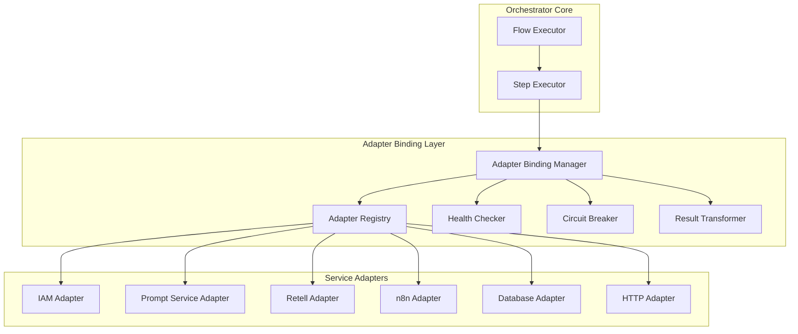

# Orchestrator - Adapter Binding

**Version**: 1.0  
**Last Updated**: 2025-10-21  
**Status**: Specification  

## Purpose

This document defines how the Orchestrator dynamically discovers, binds, and invokes service adapters at runtime using the ports and adapters pattern.

## Architecture



## Adapter Port Interface

### Base Adapter Contract

```typescript
interface IAdapter {
  // Metadata
  readonly id: string;
  readonly name: string;
  readonly version: string;
  readonly capabilities: string[];
  
  // Lifecycle
  initialize(config: AdapterConfig): Promise<void>;
  healthCheck(): Promise<HealthStatus>;
  shutdown(): Promise<void>;
  
  // Execution (adapter-specific methods defined in concrete implementations)
  [method: string]: any;
}

interface AdapterConfig {
  tenant_id?: string;
  credentials?: Record<string, string>;
  endpoints?: Record<string, string>;
  timeout_ms?: number;
  retry_config?: RetryConfig;
}

interface HealthStatus {
  status: 'healthy' | 'degraded' | 'unhealthy';
  checks: {
    [check_name: string]: {
      status: 'pass' | 'fail';
      message?: string;
      timestamp: string;
    };
  };
  last_check: string;
}
```

## Adapter Registry

### Registry Implementation

```typescript
class AdapterRegistry {
  private adapters: Map<string, IAdapter> = new Map();
  private metadata: Map<string, AdapterMetadata> = new Map();
  
  async register(adapter: IAdapter): Promise<void> {
    // Validate adapter implements required interface
    this.validateAdapter(adapter);
    
    // Initialize adapter
    await adapter.initialize(this.getAdapterConfig(adapter.id));
    
    // Store in registry
    this.adapters.set(adapter.id, adapter);
    
    // Store metadata
    this.metadata.set(adapter.id, {
      id: adapter.id,
      name: adapter.name,
      version: adapter.version,
      capabilities: adapter.capabilities,
      registered_at: new Date().toISOString(),
      health_status: 'unknown'
    });
    
    logger.info('Adapter registered', {
      adapter_id: adapter.id,
      name: adapter.name,
      version: adapter.version
    });
  }
  
  async unregister(adapter_id: string): Promise<void> {
    const adapter = this.adapters.get(adapter_id);
    
    if (adapter) {
      await adapter.shutdown();
      this.adapters.delete(adapter_id);
      this.metadata.delete(adapter_id);
      
      logger.info('Adapter unregistered', { adapter_id });
    }
  }
  
  get(adapter_id: string): IAdapter | undefined {
    return this.adapters.get(adapter_id);
  }
  
  getAll(): IAdapter[] {
    return Array.from(this.adapters.values());
  }
  
  getByCapability(capability: string): IAdapter[] {
    return this.getAll().filter(adapter =>
      adapter.capabilities.includes(capability)
    );
  }
  
  private validateAdapter(adapter: IAdapter): void {
    if (!adapter.id || !adapter.name || !adapter.version) {
      throw new Error('Adapter must have id, name, and version');
    }
    
    if (typeof adapter.initialize !== 'function' ||
        typeof adapter.healthCheck !== 'function' ||
        typeof adapter.shutdown !== 'function') {
      throw new Error('Adapter must implement lifecycle methods');
    }
  }
  
  private getAdapterConfig(adapter_id: string): AdapterConfig {
    // Load config from environment, database, or config service
    return {
      credentials: process.env[`${adapter_id.toUpperCase()}_CREDENTIALS`],
      endpoints: this.loadEndpoints(adapter_id),
      timeout_ms: 30000,
      retry_config: {
        attempts: 3,
        backoff: 'exponential'
      }
    };
  }
}
```

### Adapter Discovery

```typescript
class AdapterDiscovery {
  async discoverAdapters(paths: string[]): Promise<IAdapter[]> {
    const discovered: IAdapter[] = [];
    
    for (const path of paths) {
      try {
        const files = await fs.readdir(path);
        
        for (const file of files) {
          if (file.endsWith('.adapter.js') || file.endsWith('.adapter.ts')) {
            const modulePath = join(path, file);
            const module = await import(modulePath);
            
            // Convention: default export is adapter instance or factory
            const adapter = typeof module.default === 'function'
              ? module.default()
              : module.default;
            
            if (this.isAdapter(adapter)) {
              discovered.push(adapter);
            }
          }
        }
      } catch (error) {
        logger.warn('Failed to discover adapters in path', {
          path,
          error: error.message
        });
      }
    }
    
    return discovered;
  }
  
  private isAdapter(obj: any): obj is IAdapter {
    return obj &&
      typeof obj.id === 'string' &&
      typeof obj.initialize === 'function' &&
      typeof obj.healthCheck === 'function';
  }
}
```

## Adapter Binding Manager

### Dynamic Binding

```typescript
class AdapterBindingManager {
  constructor(
    private registry: AdapterRegistry,
    private circuitBreaker: CircuitBreakerService,
    private resultTransformer: ResultTransformer
  ) {}
  
  async invoke(
    adapter_id: string,
    method: string,
    params: any,
    options: InvocationOptions = {}
  ): Promise<any> {
    // 1. Get adapter from registry
    const adapter = this.registry.get(adapter_id);
    
    if (!adapter) {
      throw new AdapterNotFoundError(adapter_id);
    }
    
    // 2. Validate method exists
    if (typeof adapter[method] !== 'function') {
      throw new MethodNotFoundError(adapter_id, method);
    }
    
    // 3. Check circuit breaker
    if (this.circuitBreaker.isOpen(adapter_id)) {
      throw new CircuitBreakerOpenError(adapter_id);
    }
    
    // 4. Execute with circuit breaker protection
    try {
      const result = await this.circuitBreaker.execute(
        adapter_id,
        () => adapter[method](params)
      );
      
      // 5. Transform result if needed
      return options.transform
        ? this.resultTransformer.transform(result, options.transform)
        : result;
        
    } catch (error) {
      // Record failure
      this.circuitBreaker.recordFailure(adapter_id, error);
      
      // Apply fallback if configured
      if (options.fallback) {
        logger.warn('Adapter invocation failed, using fallback', {
          adapter_id,
          method,
          error: error.message
        });
        
        return this.executeFallback(options.fallback, params);
      }
      
      throw error;
    }
  }
  
  private async executeFallback(
    fallback: FallbackConfig,
    params: any
  ): Promise<any> {
    switch (fallback.type) {
      case 'adapter':
        // Fallback to alternative adapter
        return this.invoke(
          fallback.adapter_id!,
          fallback.method!,
          params
        );
        
      case 'static':
        // Return static value
        return fallback.value;
        
      case 'function':
        // Execute fallback function
        return fallback.fn!(params);
        
      default:
        throw new Error(`Unknown fallback type: ${fallback.type}`);
    }
  }
}

interface InvocationOptions {
  timeout_ms?: number;
  retry_config?: RetryConfig;
  transform?: TransformConfig;
  fallback?: FallbackConfig;
}

interface FallbackConfig {
  type: 'adapter' | 'static' | 'function';
  adapter_id?: string;
  method?: string;
  value?: any;
  fn?: (params: any) => any;
}
```

## Health Checking

### Health Check Service

```typescript
class HealthCheckService {
  private healthStatus: Map<string, HealthStatus> = new Map();
  private checkInterval: number = 60000; // 1 minute
  private timers: Map<string, NodeJS.Timeout> = new Map();
  
  startHealthChecks(registry: AdapterRegistry): void {
    for (const adapter of registry.getAll()) {
      this.scheduleHealthCheck(adapter);
    }
  }
  
  private scheduleHealthCheck(adapter: IAdapter): void {
    const check = async () => {
      try {
        const status = await adapter.healthCheck();
        this.healthStatus.set(adapter.id, status);
        
        if (status.status === 'unhealthy') {
          logger.error('Adapter health check failed', {
            adapter_id: adapter.id,
            checks: status.checks
          });
          
          // Emit alert
          this.emitAlert(adapter.id, status);
        }
        
      } catch (error) {
        logger.error('Health check error', {
          adapter_id: adapter.id,
          error: error.message
        });
        
        this.healthStatus.set(adapter.id, {
          status: 'unhealthy',
          checks: {},
          last_check: new Date().toISOString()
        });
      }
    };
    
    // Initial check
    check();
    
    // Schedule recurring checks
    const timer = setInterval(check, this.checkInterval);
    this.timers.set(adapter.id, timer);
  }
  
  stopHealthChecks(): void {
    for (const timer of this.timers.values()) {
      clearInterval(timer);
    }
    this.timers.clear();
  }
  
  getHealth(adapter_id: string): HealthStatus | undefined {
    return this.healthStatus.get(adapter_id);
  }
  
  getAllHealth(): Map<string, HealthStatus> {
    return new Map(this.healthStatus);
  }
  
  private emitAlert(adapter_id: string, status: HealthStatus): void {
    // Emit to monitoring system, Slack, PagerDuty, etc.
    eventEmitter.emit('adapter.health.failed', {
      adapter_id,
      status,
      timestamp: new Date().toISOString()
    });
  }
}
```

## Circuit Breaker

### Circuit Breaker Implementation

```typescript
class CircuitBreakerService {
  private breakers: Map<string, CircuitBreaker> = new Map();
  
  getBreaker(adapter_id: string): CircuitBreaker {
    if (!this.breakers.has(adapter_id)) {
      this.breakers.set(adapter_id, new CircuitBreaker({
        failure_threshold: 5,
        timeout_ms: 60000,
        reset_timeout_ms: 30000
      }));
    }
    
    return this.breakers.get(adapter_id)!;
  }
  
  isOpen(adapter_id: string): boolean {
    return this.getBreaker(adapter_id).isOpen();
  }
  
  async execute<T>(
    adapter_id: string,
    fn: () => Promise<T>
  ): Promise<T> {
    return this.getBreaker(adapter_id).execute(fn);
  }
  
  recordFailure(adapter_id: string, error: Error): void {
    this.getBreaker(adapter_id).recordFailure(error);
  }
}

class CircuitBreaker {
  private state: 'closed' | 'open' | 'half-open' = 'closed';
  private failures: number = 0;
  private lastFailureTime?: number;
  private resetTimer?: NodeJS.Timeout;
  
  constructor(private config: CircuitBreakerConfig) {}
  
  isOpen(): boolean {
    return this.state === 'open';
  }
  
  async execute<T>(fn: () => Promise<T>): Promise<T> {
    if (this.state === 'open') {
      throw new CircuitBreakerOpenError('Circuit breaker is open');
    }
    
    try {
      const result = await fn();
      
      // Success - reset if in half-open state
      if (this.state === 'half-open') {
        this.reset();
      }
      
      return result;
      
    } catch (error) {
      this.recordFailure(error);
      throw error;
    }
  }
  
  recordFailure(error: Error): void {
    this.failures++;
    this.lastFailureTime = Date.now();
    
    logger.warn('Circuit breaker recorded failure', {
      failures: this.failures,
      threshold: this.config.failure_threshold,
      error: error.message
    });
    
    if (this.failures >= this.config.failure_threshold) {
      this.trip();
    }
  }
  
  private trip(): void {
    this.state = 'open';
    
    logger.error('Circuit breaker opened', {
      failures: this.failures,
      threshold: this.config.failure_threshold
    });
    
    // Schedule reset attempt
    this.resetTimer = setTimeout(() => {
      this.state = 'half-open';
      this.failures = 0;
      
      logger.info('Circuit breaker half-open, attempting reset');
    }, this.config.reset_timeout_ms);
  }
  
  private reset(): void {
    this.state = 'closed';
    this.failures = 0;
    
    if (this.resetTimer) {
      clearTimeout(this.resetTimer);
      this.resetTimer = undefined;
    }
    
    logger.info('Circuit breaker reset to closed');
  }
}

interface CircuitBreakerConfig {
  failure_threshold: number;
  timeout_ms: number;
  reset_timeout_ms: number;
}
```

## Result Transformation

### Result Transformer

```typescript
class ResultTransformer {
  transform(result: any, config: TransformConfig): any {
    let transformed = result;
    
    // Apply transformations in order
    for (const operation of config.operations) {
      transformed = this.applyOperation(transformed, operation);
    }
    
    return transformed;
  }
  
  private applyOperation(data: any, operation: TransformOperation): any {
    switch (operation.type) {
      case 'select':
        return this.select(data, operation.fields!);
        
      case 'rename':
        return this.rename(data, operation.mapping!);
        
      case 'map':
        return this.map(data, operation.fn!);
        
      case 'filter':
        return this.filter(data, operation.condition!);
        
      case 'flatten':
        return this.flatten(data, operation.path);
        
      default:
        return data;
    }
  }
  
  private select(data: any, fields: string[]): any {
    if (Array.isArray(data)) {
      return data.map(item => this.selectFields(item, fields));
    }
    return this.selectFields(data, fields);
  }
  
  private selectFields(obj: any, fields: string[]): any {
    const result: any = {};
    
    for (const field of fields) {
      if (field.includes('.')) {
        // Nested field
        const value = this.getNestedValue(obj, field);
        this.setNestedValue(result, field, value);
      } else {
        result[field] = obj[field];
      }
    }
    
    return result;
  }
  
  private rename(data: any, mapping: Record<string, string>): any {
    const result: any = Array.isArray(data) ? [] : {};
    
    if (Array.isArray(data)) {
      return data.map(item => this.rename(item, mapping));
    }
    
    for (const [oldKey, newKey] of Object.entries(mapping)) {
      result[newKey] = data[oldKey];
    }
    
    // Copy unmapped fields
    for (const key of Object.keys(data)) {
      if (!mapping[key]) {
        result[key] = data[key];
      }
    }
    
    return result;
  }
  
  private map(data: any[], fn: string): any[] {
    // fn is a string expression like "item => item.value * 2"
    const mapFn = new Function('item', `return ${fn}`);
    return data.map(mapFn);
  }
  
  private filter(data: any[], condition: string): any[] {
    // condition is a string expression like "item => item.value > 10"
    const filterFn = new Function('item', `return ${condition}`);
    return data.filter(filterFn);
  }
  
  private flatten(data: any, path?: string): any {
    if (path) {
      const nested = this.getNestedValue(data, path);
      return Array.isArray(nested) ? nested.flat() : nested;
    }
    
    return Array.isArray(data) ? data.flat() : data;
  }
  
  private getNestedValue(obj: any, path: string): any {
    return path.split('.').reduce((current, key) => current?.[key], obj);
  }
  
  private setNestedValue(obj: any, path: string, value: any): void {
    const keys = path.split('.');
    const lastKey = keys.pop()!;
    const target = keys.reduce((current, key) => {
      if (!current[key]) current[key] = {};
      return current[key];
    }, obj);
    target[lastKey] = value;
  }
}

interface TransformConfig {
  operations: TransformOperation[];
}

interface TransformOperation {
  type: 'select' | 'rename' | 'map' | 'filter' | 'flatten';
  fields?: string[];
  mapping?: Record<string, string>;
  fn?: string;
  condition?: string;
  path?: string;
}
```

### Transformation Examples

**Select Fields**:
```yaml
transform:
  operations:
    - type: select
      fields:
        - id
        - name
        - email
```

**Rename Fields**:
```yaml
transform:
  operations:
    - type: rename
      mapping:
        user_id: id
        user_name: name
        user_email: email
```

**Map Array**:
```yaml
transform:
  operations:
    - type: map
      fn: "item => ({ id: item.user_id, total: item.amount * 1.1 })"
```

**Filter Array**:
```yaml
transform:
  operations:
    - type: filter
      condition: "item => item.status === 'active' && item.balance > 0"
```

**Flatten Nested**:
```yaml
transform:
  operations:
    - type: flatten
      path: data.results
```

## Concrete Adapter Examples

### IAM Adapter

```typescript
export class IAMAdapter implements IAdapter {
  readonly id = 'iam';
  readonly name = 'Identity & Access Management';
  readonly version = '1.0.0';
  readonly capabilities = ['auth', 'permissions'];
  
  private config?: AdapterConfig;
  private client?: IAMClient;
  
  async initialize(config: AdapterConfig): Promise<void> {
    this.config = config;
    this.client = new IAMClient({
      endpoint: config.endpoints?.iam,
      credentials: config.credentials
    });
  }
  
  async healthCheck(): Promise<HealthStatus> {
    try {
      await this.client.ping();
      return {
        status: 'healthy',
        checks: {
          connectivity: { status: 'pass', timestamp: new Date().toISOString() }
        },
        last_check: new Date().toISOString()
      };
    } catch (error) {
      return {
        status: 'unhealthy',
        checks: {
          connectivity: { 
            status: 'fail', 
            message: error.message,
            timestamp: new Date().toISOString()
          }
        },
        last_check: new Date().toISOString()
      };
    }
  }
  
  async shutdown(): Promise<void> {
    await this.client?.close();
  }
  
  // Adapter-specific methods
  async verify_token(params: { token: string }): Promise<TokenVerificationResult> {
    return this.client.verifyToken(params.token);
  }
  
  async check_permission(params: {
    user_id: string;
    permission: string;
  }): Promise<PermissionCheckResult> {
    return this.client.checkPermission(params.user_id, params.permission);
  }
}
```

### HTTP Adapter

```typescript
export class HTTPAdapter implements IAdapter {
  readonly id = 'http';
  readonly name = 'HTTP Client';
  readonly version = '1.0.0';
  readonly capabilities = ['http', 'rest'];
  
  async initialize(config: AdapterConfig): Promise<void> {
    // No initialization needed for HTTP adapter
  }
  
  async healthCheck(): Promise<HealthStatus> {
    return {
      status: 'healthy',
      checks: {},
      last_check: new Date().toISOString()
    };
  }
  
  async shutdown(): Promise<void> {
    // No cleanup needed
  }
  
  async request(params: {
    method: string;
    url: string;
    headers?: Record<string, string>;
    body?: any;
    timeout?: number;
  }): Promise<any> {
    const response = await fetch(params.url, {
      method: params.method,
      headers: params.headers,
      body: params.body ? JSON.stringify(params.body) : undefined,
      signal: AbortSignal.timeout(params.timeout || 30000)
    });
    
    if (!response.ok) {
      throw new Error(`HTTP ${response.status}: ${response.statusText}`);
    }
    
    return response.json();
  }
}
```

## Related Documentation

- [Overview](./overview.md) - Component architecture
- [Flow Schema](./flow-schema.md) - DSL specification
- [Execution Engine](./execution-engine.md) - Runtime behavior
- [n8n Integration](./n8n-integration.md) - Complex workflows
