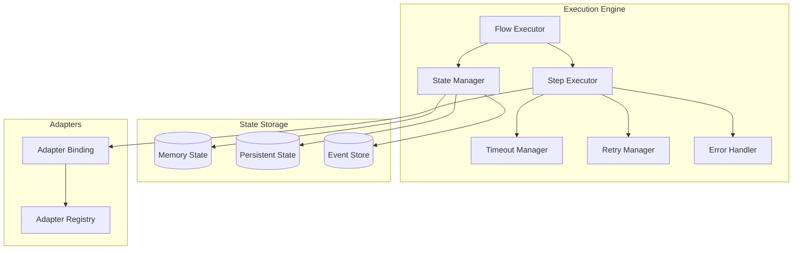
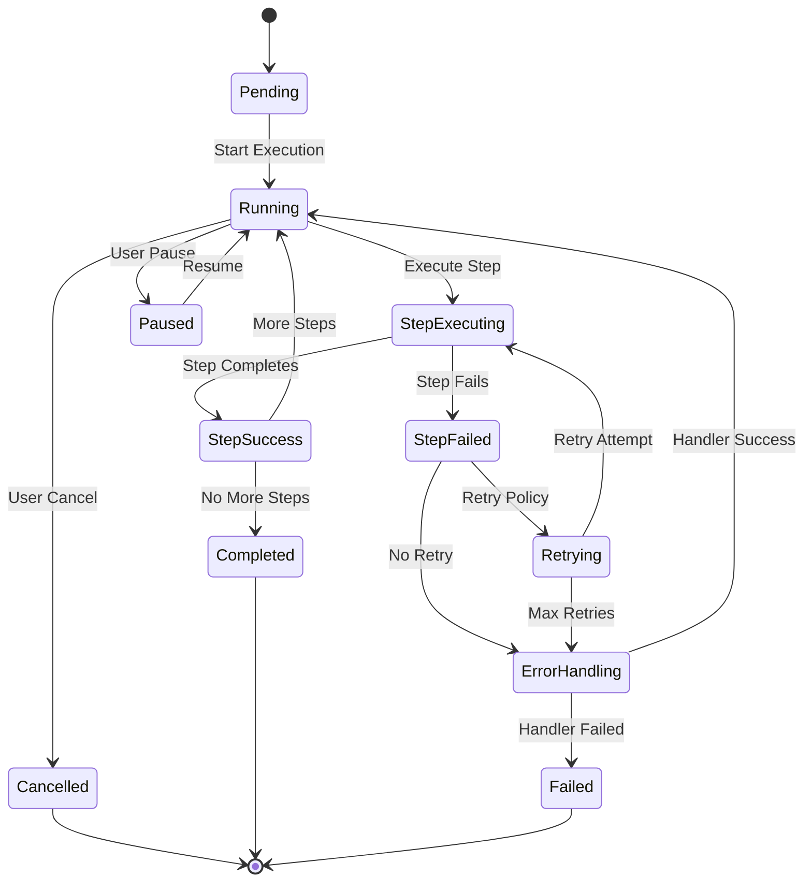

# Orchestrator - Execution Engine

**Version**: 1.0  
**Last Updated**: 2025-10-21  
**Status**: Specification  

## Purpose

This document defines the runtime behavior of the Orchestrator Execution Engine, including state management, retry logic, error handling, and async operation coordination.

## Architecture



## Flow Execution Lifecycle

### State Machine



### State Definitions

**Pending**:
- Flow created but not yet started
- Trigger evaluated but not fired
- Waiting for prerequisites

**Running**:
- Flow actively executing steps
- State being mutated
- Resources locked

**StepExecuting**:
- Individual step in progress
- Adapter call made
- Waiting for response

**StepSuccess**:
- Step completed successfully
- Result captured in state
- Ready for next step

**StepFailed**:
- Step encountered error
- Retry or error handling needed
- Temporary state

**Retrying**:
- Step being retried
- Backoff delay applied
- Attempt counter incremented

**ErrorHandling**:
- Error handler steps executing
- Attempting recovery
- May transition to Failed

**Paused**:
- Flow execution suspended
- State persisted
- Resumable

**Cancelled**:
- Flow execution aborted
- Cleanup performed
- Terminal state

**Completed**:
- All steps successful
- Final state persisted
- Resources released

**Failed**:
- Unrecoverable error
- Final state persisted
- Resources released

## State Management

### State Structure

```typescript
interface FlowExecutionState {
  flow_id: string;
  execution_id: string;
  tenant_id: string;
  status: FlowStatus;
  
  trigger: {
    type: string;
    payload: any;
    timestamp: string;
  };
  
  variables: Record<string, any>;
  
  steps: {
    [step_id: string]: StepState;
  };
  
  metadata: {
    started_at: string;
    updated_at: string;
    completed_at?: string;
    duration_ms?: number;
  };
  
  errors: ExecutionError[];
}

interface StepState {
  step_id: string;
  status: StepStatus;
  attempts: number;
  started_at: string;
  completed_at?: string;
  duration_ms?: number;
  result?: any;
  error?: StepError;
}

type FlowStatus = 
  | 'pending'
  | 'running'
  | 'step_executing'
  | 'step_success'
  | 'step_failed'
  | 'retrying'
  | 'error_handling'
  | 'paused'
  | 'cancelled'
  | 'completed'
  | 'failed';

type StepStatus = 
  | 'pending'
  | 'running'
  | 'success'
  | 'failed'
  | 'retrying'
  | 'skipped';
```

### State Persistence

**In-Memory State**:
- Active execution state
- Fast access during execution
- Lost on restart

**Persistent State**:
- Checkpoint snapshots
- Enables recovery
- Database/file storage

**Event Store**:
- Immutable event log
- Full execution history
- Audit trail

**Persistence Strategy**:
```typescript
class StateManager {
  async saveState(state: FlowExecutionState): Promise<void> {
    // 1. Update in-memory cache
    this.cache.set(state.execution_id, state);
    
    // 2. Persist to database (async)
    await this.db.upsert('flow_executions', {
      execution_id: state.execution_id,
      state: JSON.stringify(state),
      updated_at: new Date()
    });
    
    // 3. Append to event store (async)
    await this.events.append({
      execution_id: state.execution_id,
      event_type: 'state_updated',
      state_snapshot: state,
      timestamp: new Date()
    });
  }
  
  async checkpoint(execution_id: string): Promise<void> {
    const state = this.cache.get(execution_id);
    
    // Create recovery checkpoint
    await this.db.insert('execution_checkpoints', {
      execution_id,
      checkpoint_id: generateId(),
      state: JSON.stringify(state),
      created_at: new Date()
    });
  }
  
  async recover(execution_id: string): Promise<FlowExecutionState> {
    // Try memory cache first
    let state = this.cache.get(execution_id);
    if (state) return state;
    
    // Try persistent storage
    const record = await this.db.query(
      'SELECT state FROM flow_executions WHERE execution_id = ?',
      [execution_id]
    );
    
    if (record) {
      state = JSON.parse(record.state);
      this.cache.set(execution_id, state);
      return state;
    }
    
    // Reconstruct from event store
    const events = await this.events.query({
      execution_id,
      order: 'asc'
    });
    
    state = this.replayEvents(events);
    this.cache.set(execution_id, state);
    return state;
  }
}
```

## Step Execution

### Execution Flow

```typescript
class StepExecutor {
  async executeStep(
    step: StepDefinition,
    state: FlowExecutionState
  ): Promise<StepResult> {
    const stepState: StepState = {
      step_id: step.id,
      status: 'running',
      attempts: 0,
      started_at: new Date().toISOString()
    };
    
    // 1. Evaluate condition
    if (step.condition && !this.evaluateCondition(step.condition, state)) {
      stepState.status = 'skipped';
      return { state: stepState, skip: true };
    }
    
    // 2. Resolve parameters
    const params = this.resolveParams(step.params, state);
    
    // 3. Get adapter binding
    const adapter = await this.adapterRegistry.get(step.adapter);
    if (!adapter) {
      throw new Error(`Adapter not found: ${step.adapter}`);
    }
    
    // 4. Execute with timeout
    const timeoutMs = this.parseTimeout(step.timeout || '30s');
    
    try {
      const result = await this.executeWithTimeout(
        () => adapter[step.action](params),
        timeoutMs
      );
      
      stepState.status = 'success';
      stepState.result = result;
      stepState.completed_at = new Date().toISOString();
      stepState.duration_ms = Date.now() - new Date(stepState.started_at).getTime();
      
      return { state: stepState, result };
      
    } catch (error) {
      stepState.status = 'failed';
      stepState.error = {
        message: error.message,
        code: error.code,
        stack: error.stack
      };
      stepState.completed_at = new Date().toISOString();
      stepState.duration_ms = Date.now() - new Date(stepState.started_at).getTime();
      
      throw new StepExecutionError(stepState, error);
    }
  }
  
  private async executeWithTimeout<T>(
    fn: () => Promise<T>,
    timeoutMs: number
  ): Promise<T> {
    return Promise.race([
      fn(),
      new Promise<T>((_, reject) => 
        setTimeout(() => reject(new TimeoutError()), timeoutMs)
      )
    ]);
  }
}
```

### Parallel Execution

```typescript
async executeParallel(
  steps: StepDefinition[],
  state: FlowExecutionState
): Promise<StepResult[]> {
  // Execute all steps concurrently
  const promises = steps.map(step => 
    this.executeStep(step, state)
      .catch(error => ({ error, step: step.id }))
  );
  
  const results = await Promise.allSettled(promises);
  
  // Check if any failed
  const failures = results.filter(r => r.status === 'rejected');
  
  if (failures.length > 0) {
    throw new ParallelExecutionError(failures);
  }
  
  return results.map(r => r.value);
}
```

### Sequential Execution

```typescript
async executeSequential(
  steps: StepDefinition[],
  state: FlowExecutionState
): Promise<StepResult[]> {
  const results: StepResult[] = [];
  
  for (const step of steps) {
    const result = await this.executeStep(step, state);
    results.push(result);
    
    // Update state with step result
    state.steps[step.id] = result.state;
    
    // Stop on failure (unless continue_on_error)
    if (result.state.status === 'failed' && !step.continue_on_error) {
      throw new StepExecutionError(result.state);
    }
  }
  
  return results;
}
```

## Retry Logic

### Retry Configuration

```typescript
interface RetryConfig {
  attempts: number;        // Max retry attempts (default: 3)
  backoff: 'fixed' | 'linear' | 'exponential';
  delay_ms?: number;       // Initial delay (default: 1000)
  max_delay_ms?: number;   // Max delay cap (default: 30000)
  backoff_multiplier?: number; // For exponential (default: 2)
  retry_on?: string[];     // Error codes to retry
}
```

### Backoff Strategies

**Fixed Delay**:
```typescript
function fixedBackoff(attempt: number, config: RetryConfig): number {
  return config.delay_ms || 1000;
}
```

**Linear Backoff**:
```typescript
function linearBackoff(attempt: number, config: RetryConfig): number {
  const delay = (config.delay_ms || 1000) * attempt;
  return Math.min(delay, config.max_delay_ms || 30000);
}
```

**Exponential Backoff**:
```typescript
function exponentialBackoff(attempt: number, config: RetryConfig): number {
  const multiplier = config.backoff_multiplier || 2;
  const delay = (config.delay_ms || 1000) * Math.pow(multiplier, attempt - 1);
  return Math.min(delay, config.max_delay_ms || 30000);
}
```

### Retry Manager

```typescript
class RetryManager {
  async executeWithRetry<T>(
    fn: () => Promise<T>,
    config: RetryConfig,
    stepId: string
  ): Promise<T> {
    let lastError: Error;
    
    for (let attempt = 1; attempt <= config.attempts; attempt++) {
      try {
        const result = await fn();
        
        // Log successful retry
        if (attempt > 1) {
          logger.info('Step retry successful', {
            step_id: stepId,
            attempt,
            total_attempts: config.attempts
          });
        }
        
        return result;
        
      } catch (error) {
        lastError = error;
        
        // Check if error is retryable
        if (config.retry_on && !config.retry_on.includes(error.code)) {
          throw error; // Not retryable
        }
        
        // Log retry attempt
        logger.warn('Step failed, retrying', {
          step_id: stepId,
          attempt,
          total_attempts: config.attempts,
          error: error.message
        });
        
        // Don't delay after last attempt
        if (attempt < config.attempts) {
          const delay = this.calculateBackoff(attempt, config);
          await sleep(delay);
        }
      }
    }
    
    // All retries exhausted
    throw new MaxRetriesExceededError(stepId, config.attempts, lastError);
  }
  
  private calculateBackoff(attempt: number, config: RetryConfig): number {
    switch (config.backoff) {
      case 'fixed':
        return fixedBackoff(attempt, config);
      case 'linear':
        return linearBackoff(attempt, config);
      case 'exponential':
        return exponentialBackoff(attempt, config);
      default:
        return config.delay_ms || 1000;
    }
  }
}
```

## Error Handling

### Error Types

```typescript
class StepExecutionError extends Error {
  constructor(
    public stepState: StepState,
    public originalError?: Error
  ) {
    super(`Step ${stepState.step_id} failed`);
  }
}

class TimeoutError extends Error {
  constructor(public timeoutMs: number) {
    super(`Operation timed out after ${timeoutMs}ms`);
  }
}

class MaxRetriesExceededError extends Error {
  constructor(
    public stepId: string,
    public attempts: number,
    public lastError: Error
  ) {
    super(`Max retries (${attempts}) exceeded for step ${stepId}`);
  }
}

class AdapterNotFoundError extends Error {
  constructor(public adapterId: string) {
    super(`Adapter not found: ${adapterId}`);
  }
}

class ValidationError extends Error {
  constructor(
    public field: string,
    public value: any,
    public constraint: string
  ) {
    super(`Validation failed for ${field}: ${constraint}`);
  }
}
```

### Error Handler Execution

```typescript
class ErrorHandler {
  async handleError(
    error: Error,
    step: StepDefinition,
    state: FlowExecutionState
  ): Promise<ErrorHandlerResult> {
    // 1. Find matching error handler
    const handler = this.findHandler(error, step);
    
    if (!handler) {
      // No handler, propagate error
      return {
        handled: false,
        error
      };
    }
    
    // 2. Execute handler steps
    try {
      const handlerSteps = handler.steps;
      const results = await this.executeSequential(handlerSteps, {
        ...state,
        error: {
          message: error.message,
          code: error.code,
          step: step.id
        }
      });
      
      return {
        handled: true,
        results
      };
      
    } catch (handlerError) {
      // Handler itself failed
      logger.error('Error handler failed', {
        original_error: error.message,
        handler_error: handlerError.message
      });
      
      return {
        handled: false,
        error: handlerError
      };
    }
  }
  
  private findHandler(
    error: Error,
    step: StepDefinition
  ): ErrorHandlerDefinition | null {
    // Check step-level handlers first
    if (step.on_error) {
      return { steps: step.on_error };
    }
    
    // Check flow-level handlers
    const flowHandlers = step.flow.error_handlers || [];
    
    for (const handler of flowHandlers) {
      if (this.matchesCondition(handler.condition, error, step)) {
        return handler;
      }
    }
    
    return null;
  }
  
  private matchesCondition(
    condition: string,
    error: Error,
    step: StepDefinition
  ): boolean {
    // Evaluate condition expression
    // e.g., "${error.step} == 'charge_card'"
    const context = {
      error: {
        message: error.message,
        code: error.code,
        step: step.id
      }
    };
    
    return this.expressionEvaluator.evaluate(condition, context);
  }
}
```

## Timeout Management

### Timeout Configuration

```typescript
interface TimeoutConfig {
  step_timeout?: string;    // Per-step timeout (e.g., "30s")
  flow_timeout?: string;    // Total flow timeout (e.g., "5m")
  idle_timeout?: string;    // Max time between steps (e.g., "1m")
}
```

### Timeout Manager

```typescript
class TimeoutManager {
  private timers: Map<string, NodeJS.Timeout> = new Map();
  
  startFlowTimeout(
    execution_id: string,
    timeout_ms: number,
    onTimeout: () => void
  ): void {
    const timer = setTimeout(() => {
      logger.warn('Flow timeout exceeded', {
        execution_id,
        timeout_ms
      });
      onTimeout();
    }, timeout_ms);
    
    this.timers.set(`flow:${execution_id}`, timer);
  }
  
  startStepTimeout(
    execution_id: string,
    step_id: string,
    timeout_ms: number,
    onTimeout: () => void
  ): void {
    const timer = setTimeout(() => {
      logger.warn('Step timeout exceeded', {
        execution_id,
        step_id,
        timeout_ms
      });
      onTimeout();
    }, timeout_ms);
    
    this.timers.set(`step:${execution_id}:${step_id}`, timer);
  }
  
  clearStepTimeout(execution_id: string, step_id: string): void {
    const key = `step:${execution_id}:${step_id}`;
    const timer = this.timers.get(key);
    
    if (timer) {
      clearTimeout(timer);
      this.timers.delete(key);
    }
  }
  
  clearFlowTimeout(execution_id: string): void {
    const key = `flow:${execution_id}`;
    const timer = this.timers.get(key);
    
    if (timer) {
      clearTimeout(timer);
      this.timers.delete(key);
    }
  }
}
```

## Async Operation Handling

### Long-Running Operations

**Pattern**: Callback-based completion

```typescript
interface AsyncStepResult {
  execution_id: string;
  step_id: string;
  status: 'pending' | 'completed' | 'failed';
  callback_url?: string;
  poll_url?: string;
}

class AsyncStepExecutor {
  async executeAsync(
    step: StepDefinition,
    state: FlowExecutionState
  ): Promise<AsyncStepResult> {
    // 1. Start async operation
    const adapter = await this.adapterRegistry.get(step.adapter);
    const asyncResult = await adapter[step.action](step.params);
    
    if (asyncResult.callback_url) {
      // 2. Register callback handler
      await this.registerCallback(
        asyncResult.execution_id,
        asyncResult.callback_url,
        (result) => this.resumeFlow(state.execution_id, step.id, result)
      );
      
      // 3. Pause flow execution
      state.status = 'paused';
      state.steps[step.id].status = 'pending';
      await this.stateManager.saveState(state);
      
      return asyncResult;
    }
    
    if (asyncResult.poll_url) {
      // Start polling
      this.startPolling(
        state.execution_id,
        step.id,
        asyncResult.poll_url
      );
      
      return asyncResult;
    }
    
    throw new Error('Async operation must provide callback_url or poll_url');
  }
  
  async resumeFlow(
    execution_id: string,
    step_id: string,
    result: any
  ): Promise<void> {
    // 1. Load flow state
    const state = await this.stateManager.recover(execution_id);
    
    // 2. Update step result
    state.steps[step_id].status = 'success';
    state.steps[step_id].result = result;
    state.steps[step_id].completed_at = new Date().toISOString();
    
    // 3. Resume execution
    state.status = 'running';
    await this.stateManager.saveState(state);
    
    // 4. Continue to next step
    await this.flowExecutor.continueExecution(state);
  }
}
```

### Polling Strategy

```typescript
class PollingManager {
  async startPolling(
    execution_id: string,
    step_id: string,
    poll_url: string,
    config: PollingConfig = {}
  ): Promise<void> {
    const {
      interval_ms = 5000,
      max_attempts = 60,
      timeout_ms = 300000
    } = config;
    
    let attempt = 0;
    const startTime = Date.now();
    
    const poll = async () => {
      attempt++;
      
      // Check timeout
      if (Date.now() - startTime > timeout_ms) {
        throw new TimeoutError(timeout_ms);
      }
      
      // Check max attempts
      if (attempt > max_attempts) {
        throw new Error(`Max poll attempts (${max_attempts}) exceeded`);
      }
      
      // Poll endpoint
      const response = await fetch(poll_url);
      const result = await response.json();
      
      if (result.status === 'completed') {
        // Operation complete
        await this.asyncExecutor.resumeFlow(execution_id, step_id, result);
        return;
      }
      
      if (result.status === 'failed') {
        throw new Error(result.error || 'Async operation failed');
      }
      
      // Still pending, schedule next poll
      setTimeout(poll, interval_ms);
    };
    
    // Start polling
    poll().catch(error => {
      logger.error('Polling failed', {
        execution_id,
        step_id,
        error: error.message
      });
      
      // Mark flow as failed
      this.asyncExecutor.failFlow(execution_id, step_id, error);
    });
  }
}
```

## Performance Optimization

### Execution Metrics

```typescript
interface ExecutionMetrics {
  execution_id: string;
  total_duration_ms: number;
  step_count: number;
  step_durations: { [step_id: string]: number };
  retry_count: number;
  error_count: number;
  cache_hits: number;
  cache_misses: number;
}

class MetricsCollector {
  recordStepExecution(
    execution_id: string,
    step_id: string,
    duration_ms: number,
    status: StepStatus
  ): void {
    this.metrics.increment('orchestrator.step.executions', {
      step_id,
      status
    });
    
    this.metrics.histogram('orchestrator.step.duration', duration_ms, {
      step_id
    });
  }
  
  recordFlowExecution(
    execution_id: string,
    duration_ms: number,
    status: FlowStatus,
    step_count: number
  ): void {
    this.metrics.increment('orchestrator.flow.executions', {
      status
    });
    
    this.metrics.histogram('orchestrator.flow.duration', duration_ms);
    this.metrics.histogram('orchestrator.flow.steps', step_count);
  }
}
```

## Related Documentation

- [Overview](./overview.md) - Component architecture
- [Flow Schema](./flow-schema.md) - DSL specification
- [Adapter Binding](./adapter-binding.md) - Adapter integration
- [n8n Integration](./n8n-integration.md) - Complex workflows
