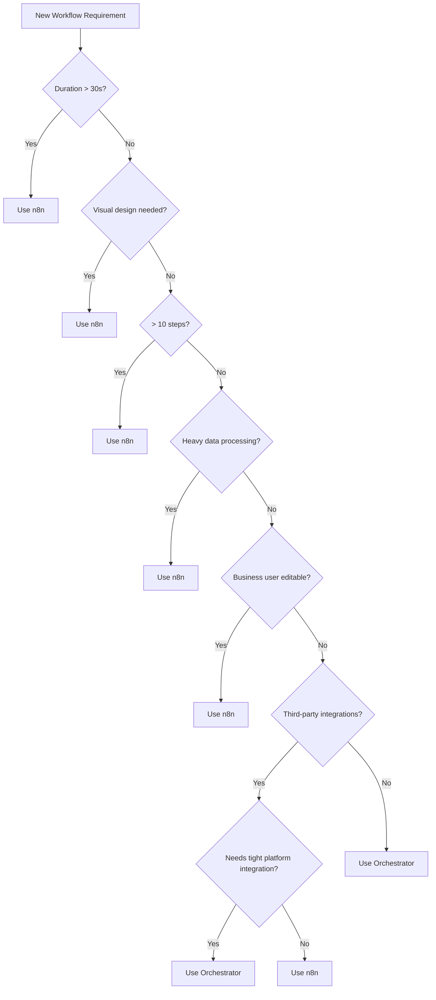

# Orchestrator - n8n Integration

**Version**: 1.0  
**Last Updated**: 2025-10-21  
**Status**: Specification  

## Purpose

This document defines when and how to delegate workflow execution to n8n vs. handling in the Orchestrator, and hybrid patterns for combining both.

## Decision Framework

### When to Use Orchestrator

✅ **Use Orchestrator for**:
- Simple, linear workflows (< 10 steps)
- Fast, synchronous operations (< 30 seconds)
- Workflows requiring tight integration with platform services
- High-frequency, low-latency operations
- Strong typing and validation requirements
- Workflows that need programmatic generation/modification
- When flow logic needs to be stored in version control as code

**Examples**:
- Customer inquiry routing
- Real-time authentication flows
- Prompt template loading and variable substitution
- Simple data transformations
- Quick API orchestration

### When to Use n8n

✅ **Use n8n for**:
- Complex, long-running workflows (> 30 seconds)
- Visual workflow design requirements (human-created flows)
- Heavy data processing or transformation
- Integration with 100+ third-party services
- Workflows requiring scheduled/cron triggers
- Business user-configurable workflows
- When non-technical users need to modify flows

**Examples**:
- Complex multi-step data pipelines
- Batch processing jobs
- Email marketing campaigns
- CRM data synchronization
- Report generation workflows
- Business intelligence aggregations

### Decision Tree



## Hybrid Patterns

### Pattern 1: Orchestrator Triggers n8n

**Use Case**: Simple orchestration that delegates heavy processing to n8n

```yaml
flow:
  id: customer-data-enrichment
  name: Customer Data Enrichment
  
  steps:
    # Orchestrator handles auth and validation
    - authenticate:
        adapter: iam
        action: verify_token
        params:
          token: ${trigger.token}
          
    - validate_customer:
        adapter: database
        action: query
        params:
          table: customers
          where:
            id: ${trigger.customer_id}
            
    # Delegate complex enrichment to n8n
    - trigger_enrichment:
        adapter: n8n
        action: trigger
        params:
          workflow_id: customer-enrichment-v2
          payload:
            customer_id: ${trigger.customer_id}
            data: ${validate_customer.result}
          wait_for_completion: false
          
    # Continue with other orchestrator steps
    - send_notification:
        adapter: email
        action: send
        params:
          to: ${validate_customer.result.email}
          subject: Data update in progress
```

**Execution Flow**:
1. Orchestrator handles fast auth/validation
2. Triggers n8n workflow asynchronously
3. Continues with notification
4. n8n runs heavy enrichment in background

### Pattern 2: n8n Calls Back to Orchestrator

**Use Case**: n8n workflow needs platform services mid-execution

```yaml
# In n8n workflow
nodes:
  - name: Start
    type: webhook
    
  - name: Process Data
    type: function
    
  - name: Call Orchestrator
    type: http-request
    parameters:
      url: https://platform.example.com/api/orchestrator/execute
      method: POST
      body:
        flow_id: validate-and-store
        params:
          data: "={{$json.processed_data}}"
      authentication: bearer-token
      
  - name: Continue Processing
    type: function
```

**Execution Flow**:
1. n8n receives webhook trigger
2. Does heavy data processing
3. Calls Orchestrator for validation/storage (platform-specific logic)
4. Orchestrator returns result
5. n8n continues with remaining steps

### Pattern 3: Orchestrator Coordinates Multiple n8n Workflows

**Use Case**: Parent orchestration of parallel n8n workflows

```yaml
flow:
  id: multi-channel-campaign
  name: Multi-Channel Marketing Campaign
  
  steps:
    - load_campaign:
        adapter: database
        action: query
        params:
          table: campaigns
          where:
            id: ${trigger.campaign_id}
            
    # Trigger multiple n8n workflows in parallel
    - parallel:
        - trigger_email_campaign:
            adapter: n8n
            action: trigger
            params:
              workflow_id: email-campaign-v3
              payload:
                campaign: ${load_campaign.result}
                channel: email
              wait_for_completion: true
              
        - trigger_sms_campaign:
            adapter: n8n
            action: trigger
            params:
              workflow_id: sms-campaign-v2
              payload:
                campaign: ${load_campaign.result}
                channel: sms
              wait_for_completion: true
              
        - trigger_push_campaign:
            adapter: n8n
            action: trigger
            params:
              workflow_id: push-notification-v1
              payload:
                campaign: ${load_campaign.result}
                channel: push
              wait_for_completion: true
              
    # Aggregate results
    - aggregate_results:
        adapter: database
        action: insert
        params:
          table: campaign_results
          data:
            campaign_id: ${trigger.campaign_id}
            email_sent: ${trigger_email_campaign.result.count}
            sms_sent: ${trigger_sms_campaign.result.count}
            push_sent: ${trigger_push_campaign.result.count}
```

**Execution Flow**:
1. Orchestrator loads campaign data
2. Triggers three n8n workflows in parallel
3. Waits for all to complete
4. Aggregates results in platform database

### Pattern 4: n8n Workflow with Orchestrator Steps

**Use Case**: Embedding Orchestrator calls within n8n flow

```yaml
# In n8n workflow
nodes:
  - name: Webhook Trigger
    type: webhook
    
  - name: Get Prompt Template
    type: http-request
    parameters:
      url: https://platform.example.com/api/orchestrator/execute
      method: POST
      body:
        flow_id: load-prompt-template
        params:
          template_id: "={{$json.template_id}}"
          version: latest
          
  - name: Substitute Variables
    type: function
    code: |
      const template = $items[0].json.result.template;
      const variables = $items[0].json.variables;
      
      // Variable substitution logic
      return items.map(item => ({
        json: {
          rendered: substituteVariables(template, variables)
        }
      }));
      
  - name: Heavy Data Processing
    type: code
    
  - name: Store Results
    type: http-request
    parameters:
      url: https://platform.example.com/api/orchestrator/execute
      method: POST
      body:
        flow_id: store-processing-results
        params:
          data: "={{$json.processed}}"
```

## n8n Adapter Implementation

### n8n Adapter

```typescript
export class N8NAdapter implements IAdapter {
  readonly id = 'n8n';
  readonly name = 'n8n Workflow Automation';
  readonly version = '1.0.0';
  readonly capabilities = ['workflow', 'automation'];
  
  private config?: AdapterConfig;
  private baseUrl: string;
  private apiKey: string;
  
  async initialize(config: AdapterConfig): Promise<void> {
    this.config = config;
    this.baseUrl = config.endpoints?.n8n || process.env.N8N_BASE_URL;
    this.apiKey = config.credentials?.api_key || process.env.N8N_API_KEY;
  }
  
  async healthCheck(): Promise<HealthStatus> {
    try {
      const response = await fetch(`${this.baseUrl}/healthz`);
      
      if (response.ok) {
        return {
          status: 'healthy',
          checks: {
            connectivity: { status: 'pass', timestamp: new Date().toISOString() }
          },
          last_check: new Date().toISOString()
        };
      }
      
      return {
        status: 'unhealthy',
        checks: {
          connectivity: { 
            status: 'fail',
            message: `HTTP ${response.status}`,
            timestamp: new Date().toISOString()
          }
        },
        last_check: new Date().toISOString()
      };
      
    } catch (error) {
      return {
        status: 'unhealthy',
        checks: {
          connectivity: { 
            status: 'fail',
            message: error.message,
            timestamp: new Date().toISOString()
          }
        },
        last_check: new Date().toISOString()
      };
    }
  }
  
  async shutdown(): Promise<void> {
    // No cleanup needed
  }
  
  /**
   * Trigger n8n workflow execution
   */
  async trigger(params: {
    workflow_id: string;
    payload: any;
    wait_for_completion?: boolean;
    timeout_ms?: number;
  }): Promise<N8NExecutionResult> {
    const { workflow_id, payload, wait_for_completion = false, timeout_ms = 300000 } = params;
    
    // Trigger workflow
    const response = await fetch(
      `${this.baseUrl}/webhook/${workflow_id}`,
      {
        method: 'POST',
        headers: {
          'Content-Type': 'application/json',
          'X-N8N-API-KEY': this.apiKey
        },
        body: JSON.stringify(payload)
      }
    );
    
    if (!response.ok) {
      throw new Error(`Failed to trigger n8n workflow: ${response.statusText}`);
    }
    
    const result = await response.json();
    
    if (!wait_for_completion) {
      // Return immediately with execution ID
      return {
        execution_id: result.executionId,
        status: 'running',
        workflow_id
      };
    }
    
    // Poll for completion
    return this.waitForCompletion(result.executionId, timeout_ms);
  }
  
  /**
   * Get execution status
   */
  async get_execution(params: {
    execution_id: string;
  }): Promise<N8NExecutionResult> {
    const response = await fetch(
      `${this.baseUrl}/api/v1/executions/${params.execution_id}`,
      {
        headers: {
          'X-N8N-API-KEY': this.apiKey
        }
      }
    );
    
    if (!response.ok) {
      throw new Error(`Failed to get execution: ${response.statusText}`);
    }
    
    const data = await response.json();
    
    return {
      execution_id: data.id,
      workflow_id: data.workflowId,
      status: this.mapStatus(data.status),
      started_at: data.startedAt,
      finished_at: data.finishedAt,
      data: data.data,
      error: data.error
    };
  }
  
  /**
   * List available workflows
   */
  async list_workflows(): Promise<N8NWorkflow[]> {
    const response = await fetch(
      `${this.baseUrl}/api/v1/workflows`,
      {
        headers: {
          'X-N8N-API-KEY': this.apiKey
        }
      }
    );
    
    if (!response.ok) {
      throw new Error(`Failed to list workflows: ${response.statusText}`);
    }
    
    const data = await response.json();
    
    return data.data.map((wf: any) => ({
      id: wf.id,
      name: wf.name,
      active: wf.active,
      tags: wf.tags,
      created_at: wf.createdAt,
      updated_at: wf.updatedAt
    }));
  }
  
  private async waitForCompletion(
    execution_id: string,
    timeout_ms: number
  ): Promise<N8NExecutionResult> {
    const startTime = Date.now();
    const pollInterval = 2000; // 2 seconds
    
    while (Date.now() - startTime < timeout_ms) {
      const status = await this.get_execution({ execution_id });
      
      if (status.status === 'success' || status.status === 'failed') {
        return status;
      }
      
      await sleep(pollInterval);
    }
    
    throw new TimeoutError(timeout_ms);
  }
  
  private mapStatus(n8nStatus: string): ExecutionStatus {
    switch (n8nStatus) {
      case 'success':
        return 'success';
      case 'error':
      case 'crashed':
        return 'failed';
      case 'running':
      case 'new':
        return 'running';
      case 'waiting':
        return 'waiting';
      default:
        return 'unknown';
    }
  }
}

interface N8NExecutionResult {
  execution_id: string;
  workflow_id: string;
  status: ExecutionStatus;
  started_at?: string;
  finished_at?: string;
  data?: any;
  error?: any;
}

interface N8NWorkflow {
  id: string;
  name: string;
  active: boolean;
  tags: string[];
  created_at: string;
  updated_at: string;
}

type ExecutionStatus = 'running' | 'success' | 'failed' | 'waiting' | 'unknown';
```

## Integration Patterns

### Sync Pattern (Wait for n8n)

```yaml
- execute_workflow:
    adapter: n8n
    action: trigger
    params:
      workflow_id: data-enrichment-v1
      payload:
        customer_id: ${customer_id}
      wait_for_completion: true
      timeout_ms: 60000
      
- use_result:
    adapter: database
    action: insert
    params:
      table: enriched_customers
      data: ${execute_workflow.result.data}
```

**Use when**:
- Result needed immediately
- Workflow is fast (< 60 seconds)
- Errors should block flow

### Async Pattern (Fire and Forget)

```yaml
- trigger_workflow:
    adapter: n8n
    action: trigger
    params:
      workflow_id: long-running-report
      payload:
        report_id: ${report_id}
      wait_for_completion: false
      
- send_confirmation:
    adapter: email
    action: send
    params:
      to: ${user.email}
      subject: Report generation started
```

**Use when**:
- Long-running workflow (> 60 seconds)
- Result not needed immediately
- Orchestrator should continue

### Callback Pattern (n8n Notifies Back)

```yaml
# Orchestrator flow
- trigger_workflow:
    adapter: n8n
    action: trigger
    params:
      workflow_id: async-processing
      payload:
        data: ${data}
        callback_url: https://platform.example.com/webhooks/n8n-callback
      wait_for_completion: false
      
# Separate webhook flow for callback
flow:
  id: n8n-callback-handler
  trigger:
    type: webhook
    config:
      path: /webhooks/n8n-callback
      
  steps:
    - process_result:
        adapter: database
        action: update
        params:
          table: processing_jobs
          where:
            id: ${trigger.payload.job_id}
          set:
            status: completed
            result: ${trigger.payload.result}
```

**Use when**:
- Very long workflow (> 5 minutes)
- Result needed but not blocking
- Want to handle completion separately

### Polling Pattern (Check Status Later)

```yaml
- trigger_workflow:
    adapter: n8n
    action: trigger
    params:
      workflow_id: batch-processing
      payload:
        batch_id: ${batch_id}
      wait_for_completion: false
      
- store_execution_id:
    adapter: database
    action: insert
    params:
      table: workflow_executions
      data:
        execution_id: ${trigger_workflow.result.execution_id}
        batch_id: ${batch_id}
        status: running

# Separate scheduled flow to check status
flow:
  id: check-n8n-executions
  trigger:
    type: schedule
    config:
      cron: "*/5 * * * *"  # Every 5 minutes
      
  steps:
    - get_running:
        adapter: database
        action: query
        params:
          query: SELECT * FROM workflow_executions WHERE status = 'running'
          
    - foreach:
        items: ${get_running.result}
        item_var: execution
        steps:
          - check_status:
              adapter: n8n
              action: get_execution
              params:
                execution_id: ${execution.execution_id}
                
          - conditional:
              - if: ${check_status.result.status} != 'running'
                then:
                  - update_status:
                      adapter: database
                      action: update
                      params:
                        table: workflow_executions
                        where:
                          execution_id: ${execution.execution_id}
                        set:
                          status: ${check_status.result.status}
                          result: ${check_status.result.data}
```

**Use when**:
- Very long workflows
- Status checks needed at regular intervals
- Want to track multiple executions

## Best Practices

### 1. Clear Separation of Concerns

**Orchestrator**:
- Platform service integration
- Authentication/authorization
- Data validation
- Business rule enforcement
- Fast operations

**n8n**:
- Third-party integrations
- Heavy data processing
- Visual workflow design
- Business user configuration
- Complex transformations

### 2. Error Handling

**Orchestrator catches n8n errors**:
```yaml
- trigger_workflow:
    adapter: n8n
    action: trigger
    params:
      workflow_id: risky-workflow
    retry:
      attempts: 3
      backoff: exponential
    on_error:
      - log_error:
          adapter: logger
          action: error
      - notify_admin:
          adapter: email
          action: send
```

### 3. Timeout Management

**Set realistic timeouts**:
```yaml
# Short timeout for fast workflows
- quick_workflow:
    adapter: n8n
    action: trigger
    params:
      workflow_id: quick-task
      wait_for_completion: true
      timeout_ms: 10000  # 10 seconds
      
# Long timeout for heavy processing
- heavy_workflow:
    adapter: n8n
    action: trigger
    params:
      workflow_id: data-pipeline
      wait_for_completion: true
      timeout_ms: 300000  # 5 minutes
```

### 4. Result Transformation

**Transform n8n results to platform format**:
```yaml
- get_workflow_result:
    adapter: n8n
    action: trigger
    params:
      workflow_id: customer-lookup
    transform:
      operations:
        - type: select
          fields:
            - data.customer.id
            - data.customer.email
            - data.customer.name
        - type: rename
          mapping:
            data.customer.id: customer_id
            data.customer.email: email
            data.customer.name: full_name
```

### 5. Monitoring

**Track n8n executions**:
```typescript
class N8NMonitor {
  async trackExecution(execution_id: string, metadata: any): Promise<void> {
    await this.db.insert('n8n_executions', {
      execution_id,
      workflow_id: metadata.workflow_id,
      triggered_by: metadata.flow_id,
      triggered_at: new Date(),
      status: 'running'
    });
  }
  
  async updateExecution(execution_id: string, result: any): Promise<void> {
    await this.db.update('n8n_executions', {
      where: { execution_id },
      set: {
        status: result.status,
        finished_at: new Date(),
        duration_ms: result.duration_ms,
        error: result.error
      }
    });
  }
}
```

## Migration Strategy

### Phase 1: Coexistence
- Keep existing n8n workflows running
- Build new simple flows in Orchestrator
- Identify candidates for migration

### Phase 2: Hybrid Integration
- Connect Orchestrator and n8n via adapters
- Implement callback/webhook patterns
- Monitor performance and errors

### Phase 3: Selective Migration
- Migrate simple n8n workflows to Orchestrator
- Keep complex workflows in n8n
- Optimize integration points

### Phase 4: Optimization
- Consolidate duplicate logic
- Optimize cross-platform calls
- Improve monitoring and observability

## Related Documentation

- [Overview](./overview.md) - Component architecture
- [Flow Schema](./flow-schema.md) - DSL specification
- [Execution Engine](./execution-engine.md) - Runtime behavior
- [Adapter Binding](./adapter-binding.md) - Adapter integration
