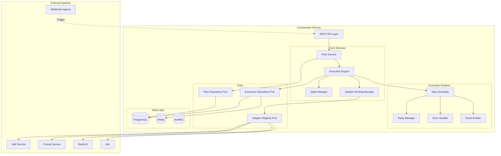
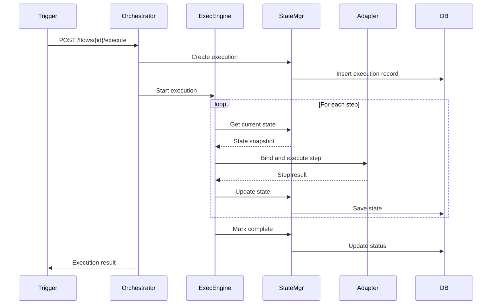
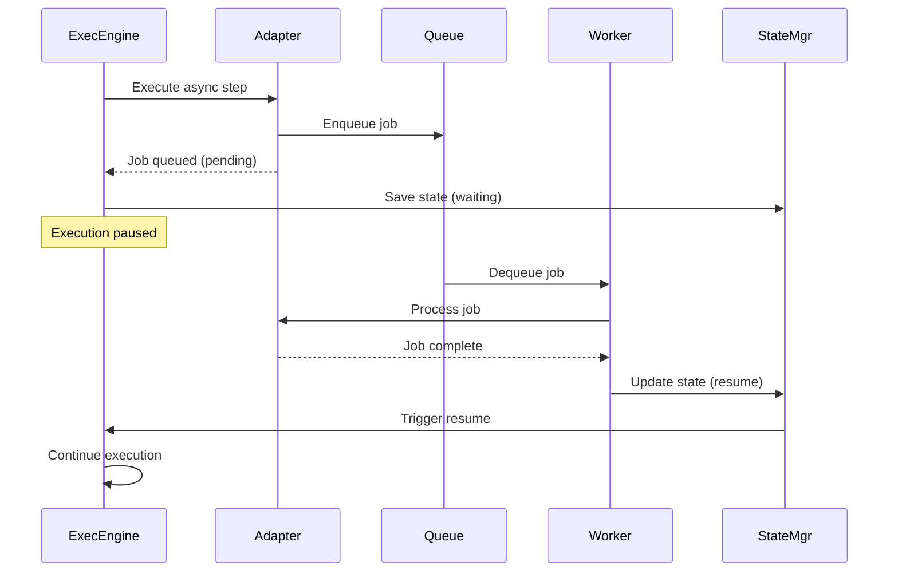

# Orchestrator - Component Overview

**Version**: 1.0  
**Last Updated**: 2025-10-21  
**Status**: Specification  

## Purpose

The Orchestrator manages declarative AI agent workflows, enabling business users to define conversation flows, decision trees, and automation sequences without code. It executes flows by binding to service adapters (IAM, Prompt Service, external platforms) and maintains execution state across async operations.

## Design Philosophy

### Declarative over Imperative

**Declarative** (what we do):
```yaml
flow: customer-support
trigger: webhook.received
steps:
  - authenticate_user:
      adapter: iam
      action: verify_token
  - load_prompt:
      adapter: prompt_service
      action: get_template
      params:
        templateId: "support-agent-v1"
  - send_to_retell:
      adapter: retell
      action: start_call
```

**Imperative** (what we avoid):
```typescript
// Anti-pattern: hardcoded business logic
const response = await fetch('/iam/verify', { token });
if (response.ok) {
  const prompt = await fetch('/prompts/support-agent-v1');
  await fetch('/retell/call', { prompt });
}
```

### Benefits of Declarative Flows

1. **Business User Empowerment**: Non-developers can create/modify flows
2. **Version Control**: Flows are data, stored in Git or database
3. **Testability**: Flows can be validated without execution
4. **Reusability**: Steps and flows can be composed and shared
5. **Portability**: Flows are independent of adapter implementations
6. **Auditability**: Clear execution trail for compliance

## Component Architecture



## Component Responsibilities

### Flow Service
**Responsibility**: Manage flow definitions (CRUD, versioning, validation)

**Capabilities**:
- Create, read, update, delete flow definitions
- Validate flow schema against DSL spec
- Version flow definitions (semantic versioning)
- Flow categorization and tagging
- Flow search and discovery
- Flow cloning and templating

**Dependencies**:
- Flow Repository Port
- Execution Engine (for validation dry-run)
- IAM Service (for permission checks)

### Execution Engine
**Responsibility**: Execute flow instances from trigger to completion

**Capabilities**:
- Parse flow definition into execution plan
- Schedule steps in order (sequential, parallel, conditional)
- Bind steps to adapters at runtime
- Maintain execution context (variables, state)
- Handle async operations (webhooks, long-running tasks)
- Emit execution events for monitoring
- Coordinate with n8n for complex workflows

**Dependencies**:
- Adapter Binding Manager
- State Manager
- Execution Repository Port
- Retry Manager
- Error Handler

### State Manager
**Responsibility**: Track execution state across async boundaries

**Capabilities**:
- Store execution state snapshots
- Resume executions after interruptions
- Manage execution context (variables, step results)
- Handle state timeouts and expiration
- Provide state query interface
- Support rollback to previous states

**Dependencies**:
- Execution Repository Port (PostgreSQL for persistence)
- Redis (for fast state access)

### Adapter Binding Manager
**Responsibility**: Resolve and bind flow steps to service adapters

**Capabilities**:
- Adapter discovery (registry lookup)
- Dynamic adapter binding at runtime
- Adapter health checking
- Fallback adapter selection
- Adapter result transformation
- Circuit breaker pattern for adapter calls

**Dependencies**:
- Adapter Registry Port
- Service Mesh (for adapter discovery)

## Technology Stack

| Layer | Technology | Purpose |
|-------|-----------|---------|
| **Runtime** | Node.js 18+ | JavaScript runtime |
| **Framework** | NestJS | Application framework, DI |
| **Language** | TypeScript 5+ | Type-safe development |
| **Database** | PostgreSQL 15+ | Flow definitions, execution state |
| **ORM** | TypeORM | Entity mapping, migrations |
| **Cache** | Redis 7+ | Execution state, fast lookups |
| **Queue** | BullMQ | Async step execution, retries |
| **Flow DSL** | YAML/JSON | Flow definition format |
| **Validation** | JSON Schema, Joi | Flow validation |
| **Execution** | State Machine Pattern | Step orchestration |

## Integration Points

### Inbound Dependencies

| Source | Purpose | Protocol |
|--------|---------|----------|
| **Webhook Ingress** | Trigger flows from external events | HTTP POST, Event |
| **Portal UI** | Flow management interface | REST API |
| **IAM Service** | Authentication, authorization | REST API |
| **Scheduler** | Cron-based flow triggers | Internal |

### Outbound Dependencies

| Target | Purpose | Protocol |
|--------|---------|----------|
| **IAM Service** | User auth, permission checks | REST API |
| **Prompt Service** | Retrieve prompt templates | REST API |
| **Retell AI** | Voice agent operations | REST API |
| **n8n** | Complex workflow delegation | REST API, Webhook |
| **GoHighLevel** | CRM operations | REST API |
| **PostgreSQL** | State persistence | TCP (5432) |
| **Redis** | State caching | TCP (6379) |

## Data Flow Diagrams

### Flow Execution Lifecycle



### Async Step Handling



## Flow Execution Model

### Sequential Execution
```yaml
flow: onboarding
steps:
  - step1: authenticate
  - step2: create_account
  - step3: send_welcome_email
```

**Execution**: `step1 → step2 → step3` (serial)

### Parallel Execution
```yaml
flow: multi-channel-notify
steps:
  - parallel:
      - send_email
      - send_sms
      - update_crm
```

**Execution**: All three steps run concurrently

### Conditional Execution
```yaml
flow: support-routing
steps:
  - classify_issue:
      adapter: ai
  - conditional:
      if: $classify_issue.category == 'billing'
      then:
        - route_to_finance
      else:
        - route_to_support
```

**Execution**: Branch based on condition

### Error Handling
```yaml
flow: payment-processing
steps:
  - charge_card:
      adapter: stripe
      retry:
        attempts: 3
        backoff: exponential
      on_error:
        - log_failure
        - notify_admin
        - fallback_to_manual
```

**Execution**: Retry on failure, then execute error handlers

## Non-Functional Requirements

| Aspect | Target | Measurement |
|--------|--------|-------------|
| **Availability** | 99.9% | Uptime monitoring |
| **Latency (Trigger → Start)** | p95 < 200ms | Execution initiation |
| **Latency (Step Execution)** | p95 < 500ms | Single step (sync) |
| **Throughput** | 1000 executions/min | Concurrent flows |
| **State Recovery** | < 5s | Resume after failure |
| **Execution Retention** | 90 days | State snapshots |
| **Max Flow Complexity** | 50 steps | Per flow definition |

## Security & Compliance

### Authentication & Authorization
- **Authentication**: OAuth 2.0 via IAM Service
- **Authorization**: RBAC with flow-level permissions
  - `flow:read` - View flows
  - `flow:create` - Create flows
  - `flow:update` - Edit flows
  - `flow:delete` - Delete flows
  - `flow:execute` - Trigger executions
  - `flow:admin` - Manage all flows

### Data Protection
- **Encryption at Rest**: PostgreSQL TDE
- **Encryption in Transit**: TLS 1.3
- **PII Handling**: Execution context may contain PII; mask in logs
- **Secret Management**: Adapter credentials in secret manager

### Audit Trail
- Flow lifecycle events (create, update, delete)
- Execution events (start, step, complete, fail)
- Adapter bindings and results
- State transitions
- Retention: 7 years

## Observability

### Logging
- **Structured Logs**: JSON with correlation IDs
- **Log Levels**: DEBUG (steps), INFO (lifecycle), WARN (retries), ERROR (failures)
- **Key Events**:
  - Flow CRUD operations
  - Execution start/complete/fail
  - Step execution (adapter, duration, result)
  - State transitions
  - Retry attempts

### Metrics
- Flow count by category/status
- Execution count (total, success, failed)
- Execution duration (p50, p95, p99)
- Step execution duration by adapter
- Retry rate per adapter
- Queue depth (pending steps)
- State recovery count

### Tracing
- Distributed tracing with OpenTelemetry
- Trace execution from trigger through all steps
- Trace adapter calls
- Correlate with external service traces

## Error Handling

| Error Scenario | Response | Recovery Strategy |
|---------------|----------|-------------------|
| Flow not found | 404 | Return error |
| Invalid flow schema | 400 | Return validation errors |
| Unauthorized | 403 | Redirect to IAM |
| Adapter unavailable | 503 | Retry with backoff |
| Adapter error | Depends | Execute error handlers |
| State corruption | 500 | Rollback to last valid state |
| Timeout | 408 | Cancel or retry (configurable) |

## Scalability Considerations

### Horizontal Scaling
- **Stateless API**: Scale API pods independently
- **Queue Workers**: Scale execution workers based on queue depth
- **State Storage**: Redis cluster for distributed state

### Database Optimization
- **Indexes**: tenant_id, flow_id, execution_status, created_at
- **Partitioning**: Executions by month
- **Read Replicas**: For execution history queries

### Caching Strategy
- **Flow Definitions**: TTL 5 minutes
- **Execution State**: TTL based on execution timeout
- **Adapter Registry**: TTL 1 minute

## Deployment Architecture

### Development Environment
- Single pod
- PostgreSQL (shared dev instance)
- Redis (shared dev instance)
- BullMQ (local)

### Production Environment
- 3+ API pods (auto-scaling)
- 5+ execution worker pods (based on queue depth)
- PostgreSQL cluster (primary + replica)
- Redis cluster (3-node)
- BullMQ (distributed queue)

## Migration Strategy

### Phase 1: Core Execution
- Simple sequential flows
- Basic adapters (IAM, Prompt Service)
- Sync step execution only

### Phase 2: Advanced Features
- Parallel and conditional execution
- Async step support
- Retry and error handling
- State persistence and recovery

### Phase 3: Enterprise
- n8n integration for complex workflows
- Flow versioning and rollback
- A/B testing flows
- Analytics and optimization

## Related Documentation

- [Flow Schema](./flow-schema.md) - DSL specification, triggers, steps, conditions
- [Execution Engine](./execution-engine.md) - Runtime behavior, state management
- [Adapter Binding](./adapter-binding.md) - Binding flows to service adapters
- [n8n Integration](./n8n-integration.md) - Hybrid workflow patterns
- [Implementation Spec](../impl/phase-1/orchestrator.md) - Phase 1 implementation
- [ADR-0005](../../adr/adr-0005-declarative-flows.md) - Declarative flow decision rationale
