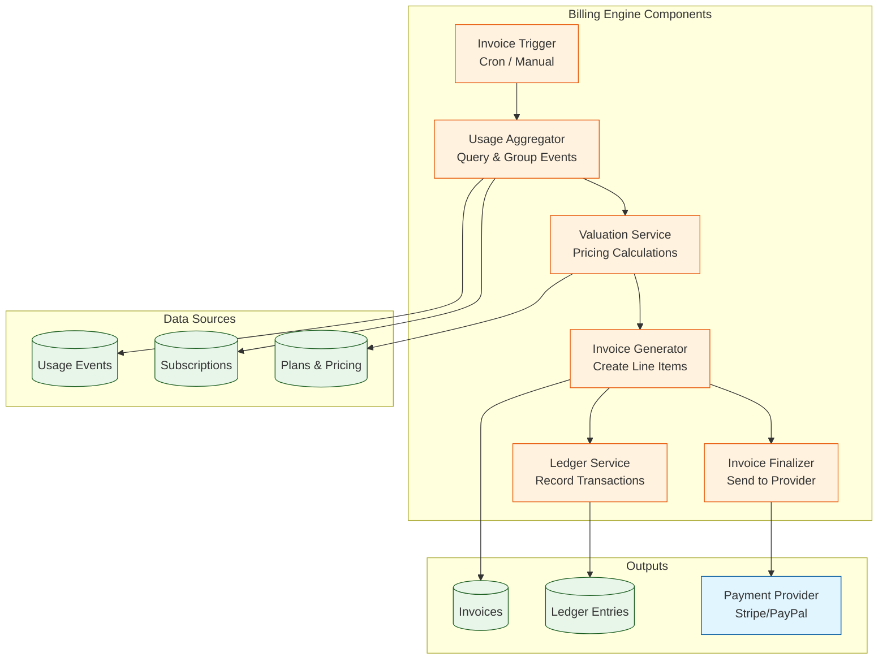

# Billing Engine

## Purpose

Generate invoices by aggregating usage events, applying pricing rules (subscription base, included allowances, cost-plus markup, tiered overage, caps), and recording ledger entries for financial transactions.

## Architecture



## Invoice Generation Flow

### 1. Trigger Invoice Generation

**Scheduled (Cron)**:
```typescript
@Injectable()
export class InvoiceCronService {
  @Cron('0 0 1 * *')  // 1st of every month at midnight
  async generateMonthlyInvoices() {
    const subscriptions = await this.subscriptionService.findActiveSubscriptions();
    
    for (const subscription of subscriptions) {
      const period = this.calculateBillingPeriod(subscription);
      
      await this.billingEngine.generateInvoice({
        subscription_id: subscription.id,
        period_start: period.start,
        period_end: period.end,
      });
    }
  }
}
```

**Manual (API)**:
```typescript
POST /payments/invoices/finalize
{
  "subscription_id": "sub-uuid",
  "period_start": "2025-10-01T00:00:00Z",
  "period_end": "2025-10-31T23:59:59Z"
}
```

### 2. Aggregate Usage Events

```typescript
@Injectable()
export class UsageAggregatorService {
  async aggregateUsage(
    subscription_id: string,
    period_start: Date,
    period_end: Date,
  ): Promise<AggregatedUsage[]> {
    const usageEvents = await this.usageRepository.find({
      where: {
        subscription_id,
        event_time: Between(period_start, period_end),
        processed: false,
      },
    });
    
    // Group by metric_key
    const aggregated = usageEvents.reduce((acc, event) => {
      if (!acc[event.metric_key]) {
        acc[event.metric_key] = {
          metric_key: event.metric_key,
          total_quantity: 0,
          total_vendor_cost_cents: 0,
          event_count: 0,
        };
      }
      
      acc[event.metric_key].total_quantity += event.quantity;
      acc[event.metric_key].total_vendor_cost_cents += event.vendor_cost_cents;
      acc[event.metric_key].event_count += 1;
      
      return acc;
    }, {} as Record<string, AggregatedUsage>);
    
    return Object.values(aggregated);
  }
}

interface AggregatedUsage {
  metric_key: string;
  total_quantity: number;
  total_vendor_cost_cents: number;
  event_count: number;
}
```

### 3. Apply Pricing Rules (Valuation)

```typescript
@Injectable()
export class ValuationService implements IInvoiceValuation {
  async valuate(
    subscription: Subscription,
    aggregatedUsage: AggregatedUsage[],
  ): Promise<LineItemDto[]> {
    const plan = await this.planService.findById(subscription.plan_id);
    const lineItems: LineItemDto[] = [];
    
    // 1. Subscription base charge
    lineItems.push({
      metric_key: null,
      quantity: null,
      unit_price_cents: plan.base_price_cents,
      total_cents: plan.base_price_cents,
      type: 'subscription',
      metadata: {
        plan_name: plan.name,
        billing_period: plan.billing_interval,
      },
    });
    
    // 2. Usage-based charges
    for (const usage of aggregatedUsage) {
      const metricConfig = plan.overage_rates[usage.metric_key];
      const includedQty = plan.included_allowances[usage.metric_key] || 0;
      
      // Deduct included allowance
      const billableQty = Math.max(0, usage.total_quantity - includedQty);
      
      if (billableQty > 0) {
        const lineItem = await this.calculateUsageLineItem(
          usage,
          billableQty,
          metricConfig,
        );
        lineItems.push(lineItem);
      }
    }
    
    return lineItems;
  }
  
  private async calculateUsageLineItem(
    usage: AggregatedUsage,
    billableQty: number,
    config: MetricPricingConfig,
  ): Promise<LineItemDto> {
    if (config.type === 'cost_plus') {
      return this.calculateCostPlusLineItem(usage, billableQty, config);
    } else if (config.type === 'fixed_rate') {
      return this.calculateFixedRateLineItem(usage, billableQty, config);
    } else if (config.type === 'tiered') {
      return this.calculateTieredLineItem(usage, billableQty, config);
    }
  }
  
  private calculateCostPlusLineItem(
    usage: AggregatedUsage,
    billableQty: number,
    config: CostPlusConfig,
  ): LineItemDto {
    // Cost-plus: vendor_cost × (1 + markup_percent) + markup_fixed
    const avgVendorCostPerUnit = usage.total_vendor_cost_cents / usage.total_quantity;
    const markupMultiplier = 1 + config.markup_percent;
    const unitPrice = Math.ceil(
      avgVendorCostPerUnit * markupMultiplier + config.markup_fixed_cents,
    );
    
    const total = unitPrice * billableQty;
    
    return {
      metric_key: usage.metric_key,
      quantity: billableQty,
      unit_price_cents: unitPrice,
      total_cents: total,
      type: 'usage',
      metadata: {
        included_quantity: 0,
        overage_quantity: billableQty,
        vendor_cost_cents: usage.total_vendor_cost_cents,
        markup_percent: config.markup_percent,
        markup_fixed_cents: config.markup_fixed_cents,
        pricing_model: 'cost_plus',
      },
    };
  }
  
  private calculateFixedRateLineItem(
    usage: AggregatedUsage,
    billableQty: number,
    config: FixedRateConfig,
  ): LineItemDto {
    const total = config.rate_cents * billableQty;
    
    return {
      metric_key: usage.metric_key,
      quantity: billableQty,
      unit_price_cents: config.rate_cents,
      total_cents: total,
      type: 'usage',
      metadata: {
        pricing_model: 'fixed_rate',
      },
    };
  }
  
  private calculateTieredLineItem(
    usage: AggregatedUsage,
    billableQty: number,
    config: TieredConfig,
  ): LineItemDto {
    let total = 0;
    let remainingQty = billableQty;
    
    for (const tier of config.tiers) {
      const tierQty = tier.up_to 
        ? Math.min(remainingQty, tier.up_to)
        : remainingQty;
      
      total += tierQty * tier.rate_cents;
      remainingQty -= tierQty;
      
      if (remainingQty <= 0) break;
    }
    
    const avgUnitPrice = Math.ceil(total / billableQty);
    
    return {
      metric_key: usage.metric_key,
      quantity: billableQty,
      unit_price_cents: avgUnitPrice,
      total_cents: total,
      type: 'usage',
      metadata: {
        pricing_model: 'tiered',
        tiers_applied: config.tiers.length,
      },
    };
  }
}
```

### 4. Generate Invoice

```typescript
@Injectable()
export class InvoiceGeneratorService {
  async generateInvoice(dto: GenerateInvoiceDto): Promise<Invoice> {
    const subscription = await this.subscriptionService.findById(dto.subscription_id);
    const aggregatedUsage = await this.usageAggregator.aggregateUsage(
      dto.subscription_id,
      dto.period_start,
      dto.period_end,
    );
    
    // Calculate line items
    const lineItems = await this.valuationService.valuate(subscription, aggregatedUsage);
    
    // Apply caps if configured
    const cappedLineItems = this.applyCaps(lineItems, subscription.plan);
    
    // Calculate total
    const total = cappedLineItems.reduce((sum, item) => sum + item.total_cents, 0);
    
    // Create invoice record
    const invoice = await this.invoiceRepository.save({
      subscription_id: dto.subscription_id,
      total_cents: total,
      currency: subscription.plan.currency,
      status: 'draft',
      period_start: dto.period_start,
      period_end: dto.period_end,
      due_date: this.calculateDueDate(dto.period_end),
    });
    
    // Create line items
    for (const itemDto of cappedLineItems) {
      await this.lineItemRepository.save({
        invoice_id: invoice.id,
        ...itemDto,
      });
    }
    
    // Record ledger entry (debit: customer owes money)
    await this.ledgerService.recordDebit({
      customer_id: subscription.customer_id,
      invoice_id: invoice.id,
      amount_cents: total,
      ref_type: 'invoice',
      ref_id: invoice.id,
      metadata: {
        description: `Invoice for ${dto.period_start.toISOString().slice(0, 7)}`,
      },
    });
    
    return invoice;
  }
  
  private applyCaps(lineItems: LineItemDto[], plan: Plan): LineItemDto[] {
    if (!plan.caps) return lineItems;
    
    const usageTotal = lineItems
      .filter(item => item.type === 'usage')
      .reduce((sum, item) => sum + item.total_cents, 0);
    
    if (plan.caps.max_usage_cents && usageTotal > plan.caps.max_usage_cents) {
      // Apply maximum cap: scale down usage charges proportionally
      const scaleFactor = plan.caps.max_usage_cents / usageTotal;
      return lineItems.map(item => {
        if (item.type === 'usage') {
          return {
            ...item,
            total_cents: Math.ceil(item.total_cents * scaleFactor),
            metadata: {
              ...item.metadata,
              capped: true,
              original_total_cents: item.total_cents,
            },
          };
        }
        return item;
      });
    }
    
    if (plan.caps.min_usage_cents && usageTotal < plan.caps.min_usage_cents) {
      // Apply minimum: add adjustment line item
      lineItems.push({
        metric_key: null,
        quantity: null,
        unit_price_cents: plan.caps.min_usage_cents - usageTotal,
        total_cents: plan.caps.min_usage_cents - usageTotal,
        type: 'adjustment',
        metadata: {
          description: 'Minimum usage charge',
          minimum_usage_cents: plan.caps.min_usage_cents,
        },
      });
    }
    
    return lineItems;
  }
}
```

### 5. Finalize Invoice

```typescript
@Injectable()
export class InvoiceFinalizerService {
  async finalizeInvoice(invoice_id: string): Promise<Invoice> {
    const invoice = await this.invoiceRepository.findOne({
      where: { id: invoice_id },
      relations: ['subscription', 'line_items'],
    });
    
    if (invoice.status !== 'draft') {
      throw new ConflictException(`Invoice ${invoice_id} is already finalized`);
    }
    
    // 1. Send to payment provider (Stripe)
    const providerInvoice = await this.paymentProvider.createInvoice({
      provider_customer_id: invoice.subscription.customer.provider_customer_id,
      provider_subscription_id: invoice.subscription.provider_subscription_id,
      line_items: invoice.line_items,
      auto_finalize: true,
    });
    
    // 2. Update invoice with provider reference
    invoice.provider_invoice_id = providerInvoice.provider_invoice_id;
    invoice.status = 'open';
    invoice.finalized_at = new Date();
    
    await this.invoiceRepository.save(invoice);
    
    // 3. Mark usage events as processed
    await this.usageRepository.update(
      {
        subscription_id: invoice.subscription_id,
        event_time: Between(invoice.period_start, invoice.period_end),
      },
      { processed: true },
    );
    
    // 4. Emit event for notifications
    await this.eventBus.publish(new InvoiceGeneratedEvent({
      invoice_id: invoice.id,
      customer_id: invoice.subscription.customer_id,
      total_cents: invoice.total_cents,
    }));
    
    return invoice;
  }
}
```

## Pricing Configuration Examples

### Cost-Plus Pricing

```typescript
const plan: Plan = {
  id: 'plan-uuid',
  name: 'Professional',
  base_price_cents: 9900,  // $99/month
  billing_interval: 'monthly',
  included_allowances: {
    llm_tokens: 1000000,      // 1M tokens included
    voice_minutes: 500,       // 500 minutes included
    sms_count: 1000,          // 1000 SMS included
  },
  overage_rates: {
    llm_tokens: {
      type: 'cost_plus',
      markup_percent: 0.25,   // 25% markup
      markup_fixed_cents: 0,
    },
    voice_minutes: {
      type: 'cost_plus',
      markup_percent: 0.30,   // 30% markup
      markup_fixed_cents: 1,  // + $0.01 per minute
    },
    sms_count: {
      type: 'fixed_rate',
      rate_cents: 5,          // $0.05 per SMS
    },
  },
  caps: {
    max_usage_cents: 50000,   // Cap at $500/month
  },
};
```

### Tiered Pricing

```typescript
const plan: Plan = {
  id: 'plan-uuid',
  name: 'Enterprise',
  base_price_cents: 49900,  // $499/month
  billing_interval: 'monthly',
  included_allowances: {
    api_calls: 10000000,    // 10M API calls included
  },
  overage_rates: {
    api_calls: {
      type: 'tiered',
      tiers: [
        { up_to: 5000000, rate_cents: 1 },   // First 5M: $0.01 each
        { up_to: 10000000, rate_cents: 0.5 }, // Next 10M: $0.005 each
        { up_to: null, rate_cents: 0.25 },    // Above 15M: $0.0025 each
      ],
    },
  },
};
```

## Example Invoice Calculation

**Scenario**:
- Plan: Professional ($99/month)
- Included: 1M LLM tokens, 500 voice minutes, 1000 SMS
- Usage: 1.5M LLM tokens (cost: $12), 600 voice minutes (cost: $48), 1200 SMS
- Pricing: LLM (25% markup), Voice (30% markup + $0.01), SMS ($0.05 flat)

**Calculation**:

```typescript
// 1. Subscription base
lineItems.push({
  type: 'subscription',
  total_cents: 9900,  // $99.00
});

// 2. LLM tokens overage
// Overage: 1.5M - 1M = 500K tokens
// Vendor cost: $12 for 1.5M = $0.000008 per token
// Avg cost per overage token: $12 / 1.5M × 500K = $4
// Markup: $4 × 1.25 = $5
lineItems.push({
  metric_key: 'llm_tokens',
  quantity: 500000,
  unit_price_cents: 0.001,  // $0.00001 per token
  total_cents: 500,  // $5.00
  type: 'usage',
});

// 3. Voice minutes overage
// Overage: 600 - 500 = 100 minutes
// Vendor cost: $48 for 600 minutes = $0.08 per minute
// Avg cost per overage minute: $48 / 600 × 100 = $8
// Markup: $8 × 1.30 + ($0.01 × 100) = $10.40 + $1 = $11.40
lineItems.push({
  metric_key: 'voice_minutes',
  quantity: 100,
  unit_price_cents: 11,  // $0.11 per minute
  total_cents: 1140,  // $11.40
  type: 'usage',
});

// 4. SMS overage
// Overage: 1200 - 1000 = 200 SMS
// Fixed rate: $0.05 per SMS
lineItems.push({
  metric_key: 'sms_count',
  quantity: 200,
  unit_price_cents: 5,  // $0.05 per SMS
  total_cents: 1000,  // $10.00
  type: 'usage',
});

// Total: $99 + $5 + $11.40 + $10 = $125.40
```

## Performance Optimization

### Batch Processing

```typescript
@Injectable()
export class BatchInvoiceService {
  async generateBatchInvoices(subscription_ids: string[]): Promise<void> {
    const batchSize = 100;
    
    for (let i = 0; i < subscription_ids.length; i += batchSize) {
      const batch = subscription_ids.slice(i, i + batchSize);
      
      await Promise.all(
        batch.map(id => this.billingEngine.generateInvoice({ subscription_id: id })),
      );
      
      this.logger.info(`Processed batch ${i / batchSize + 1}, ${batch.length} invoices`);
    }
  }
}
```

### Database Indexing

```sql
-- Optimize usage aggregation queries
CREATE INDEX idx_usage_subscription_time 
  ON usage_events(subscription_id, event_time) 
  WHERE processed = FALSE;

CREATE INDEX idx_usage_metric_processed 
  ON usage_events(metric_key, processed);

-- Optimize invoice queries
CREATE INDEX idx_invoices_subscription_period 
  ON invoices(subscription_id, period_start, period_end);
```

## Testing

### Valuation Unit Tests

```typescript
describe('ValuationService', () => {
  let service: ValuationService;
  
  it('should apply cost-plus pricing correctly', () => {
    const usage: AggregatedUsage = {
      metric_key: 'llm_tokens',
      total_quantity: 500000,
      total_vendor_cost_cents: 400,  // $4.00
      event_count: 10,
    };
    
    const config: CostPlusConfig = {
      type: 'cost_plus',
      markup_percent: 0.25,  // 25%
      markup_fixed_cents: 0,
    };
    
    const lineItem = service.calculateCostPlusLineItem(usage, 500000, config);
    
    // Avg vendor cost: $4 / 500K = $0.000008 per token
    // With 25% markup: $0.00001 per token
    // Total: 500K × $0.00001 = $5.00
    expect(lineItem.total_cents).toBe(500);
    expect(lineItem.metadata.vendor_cost_cents).toBe(400);
    expect(lineItem.metadata.markup_percent).toBe(0.25);
  });
  
  it('should apply tiered pricing correctly', () => {
    const usage: AggregatedUsage = {
      metric_key: 'api_calls',
      total_quantity: 12000000,  // 12M calls
      total_vendor_cost_cents: 0,
      event_count: 1000,
    };
    
    const config: TieredConfig = {
      type: 'tiered',
      tiers: [
        { up_to: 5000000, rate_cents: 1 },    // 5M × $0.01 = $50K
        { up_to: 10000000, rate_cents: 0.5 }, // 5M × $0.005 = $25K
        { up_to: null, rate_cents: 0.25 },    // 2M × $0.0025 = $5K
      ],
    };
    
    const lineItem = service.calculateTieredLineItem(usage, 12000000, config);
    
    // Total: $50K + $25K + $5K = $80K
    expect(lineItem.total_cents).toBe(80000);
  });
});
```

## Next Steps

Proceed to:
- **[Reconciliation](./reconciliation.md)** - Payment matching and dispute handling
