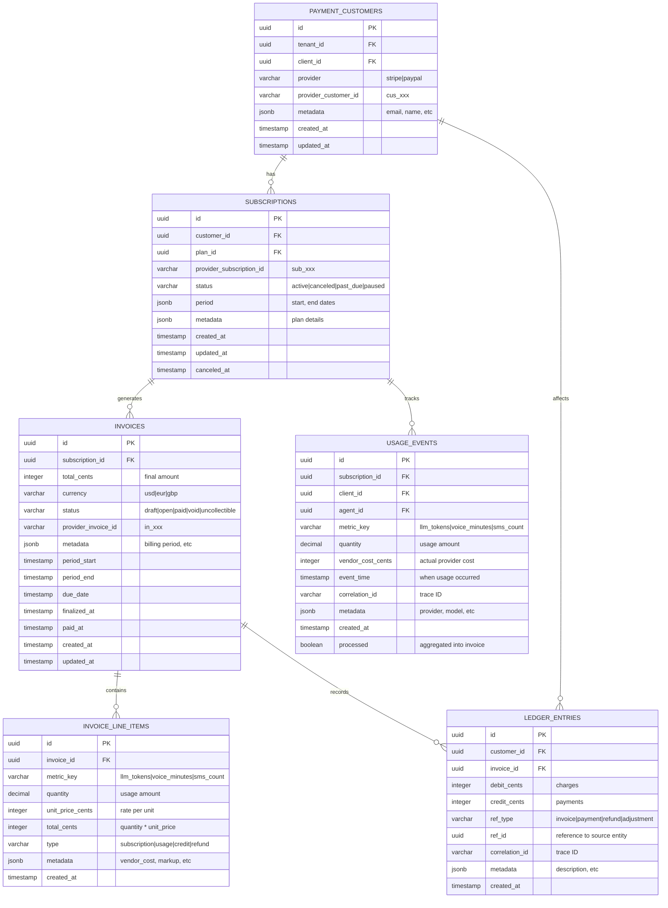

# Payments Data Model

## Purpose

Define the database schema for payment processing, including customers, subscriptions, usage events, invoices, and immutable ledger entries.

## Database Schema

### Entity-Relationship Diagram



## Table Definitions

### payment_customers

**Purpose**: Map tenant/client entities to payment provider customer records

```sql
CREATE TABLE payment_customers (
    id UUID PRIMARY KEY DEFAULT gen_random_uuid(),
    tenant_id UUID NOT NULL REFERENCES tenants(id) ON DELETE CASCADE,
    client_id UUID NOT NULL REFERENCES clients(id) ON DELETE CASCADE,
    provider VARCHAR(50) NOT NULL CHECK (provider IN ('stripe', 'paypal')),
    provider_customer_id VARCHAR(255) NOT NULL,
    metadata JSONB DEFAULT '{}',
    created_at TIMESTAMP WITH TIME ZONE DEFAULT NOW(),
    updated_at TIMESTAMP WITH TIME ZONE DEFAULT NOW(),
    
    -- Ensure one customer per tenant/client/provider combination
    CONSTRAINT uq_customer_tenant_client_provider 
        UNIQUE (tenant_id, client_id, provider),
    
    -- Ensure provider customer ID is unique per provider
    CONSTRAINT uq_provider_customer_id 
        UNIQUE (provider, provider_customer_id)
);

CREATE INDEX idx_payment_customers_tenant ON payment_customers(tenant_id);
CREATE INDEX idx_payment_customers_client ON payment_customers(client_id);
CREATE INDEX idx_payment_customers_provider ON payment_customers(provider, provider_customer_id);
```

**Columns**:
- `id`: Internal UUID primary key
- `tenant_id`: Reference to tenant (multi-tenant isolation)
- `client_id`: Reference to client entity (end customer)
- `provider`: Payment provider identifier (stripe, paypal)
- `provider_customer_id`: Provider's customer ID (cus_xxx for Stripe)
- `metadata`: JSON blob for email, name, address, etc.
- `created_at`, `updated_at`: Audit timestamps

**Constraints**:
- UNIQUE (tenant_id, client_id, provider): Prevent duplicate customer records
- UNIQUE (provider, provider_customer_id): Ensure provider IDs are unique per provider

**Metadata Example**:
```json
{
  "email": "client@example.com",
  "name": "Acme Corp",
  "address": {
    "line1": "123 Main St",
    "city": "San Francisco",
    "state": "CA",
    "postal_code": "94102",
    "country": "US"
  },
  "tax_ids": [
    {"type": "us_ein", "value": "12-3456789"}
  ]
}
```

### subscriptions

**Purpose**: Track recurring subscription relationships and lifecycle

```sql
CREATE TABLE subscriptions (
    id UUID PRIMARY KEY DEFAULT gen_random_uuid(),
    customer_id UUID NOT NULL REFERENCES payment_customers(id) ON DELETE CASCADE,
    plan_id UUID NOT NULL REFERENCES plans(id),
    provider_subscription_id VARCHAR(255),
    status VARCHAR(50) NOT NULL DEFAULT 'active' 
        CHECK (status IN ('active', 'canceled', 'past_due', 'paused', 'incomplete')),
    period JSONB NOT NULL,
    metadata JSONB DEFAULT '{}',
    created_at TIMESTAMP WITH TIME ZONE DEFAULT NOW(),
    updated_at TIMESTAMP WITH TIME ZONE DEFAULT NOW(),
    canceled_at TIMESTAMP WITH TIME ZONE,
    
    -- Ensure provider subscription ID is unique when present
    CONSTRAINT uq_provider_subscription_id 
        UNIQUE (provider_subscription_id)
        WHERE provider_subscription_id IS NOT NULL
);

CREATE INDEX idx_subscriptions_customer ON subscriptions(customer_id);
CREATE INDEX idx_subscriptions_status ON subscriptions(status) WHERE status = 'active';
CREATE INDEX idx_subscriptions_provider ON subscriptions(provider_subscription_id) 
    WHERE provider_subscription_id IS NOT NULL;
```

**Columns**:
- `id`: Internal UUID primary key
- `customer_id`: Reference to payment_customers
- `plan_id`: Reference to plan definition (subscription tier)
- `provider_subscription_id`: Provider's subscription ID (sub_xxx for Stripe)
- `status`: Subscription state (active, canceled, past_due, paused, incomplete)
- `period`: JSON blob for current billing period start/end
- `metadata`: JSON blob for plan details, proration settings, etc.
- `created_at`, `updated_at`, `canceled_at`: Audit timestamps

**Status Values**:
- `active`: Subscription is active and billing normally
- `canceled`: Subscription has been canceled (no future billing)
- `past_due`: Payment failed, grace period active
- `paused`: Temporarily paused (no billing, but can resume)
- `incomplete`: Created but not yet active (payment pending)

**Period Example**:
```json
{
  "start": "2025-10-01T00:00:00Z",
  "end": "2025-10-31T23:59:59Z",
  "billing_cycle": "monthly",
  "trial_end": null
}
```

**Metadata Example**:
```json
{
  "plan_name": "Professional",
  "base_price_cents": 9900,
  "currency": "usd",
  "included_allowances": {
    "llm_tokens": 1000000,
    "voice_minutes": 500,
    "sms_count": 1000
  },
  "proration_behavior": "create_prorations",
  "collection_method": "charge_automatically"
}
```

### invoices

**Purpose**: Generated invoices for billing periods (subscription + usage)

```sql
CREATE TABLE invoices (
    id UUID PRIMARY KEY DEFAULT gen_random_uuid(),
    subscription_id UUID NOT NULL REFERENCES subscriptions(id) ON DELETE CASCADE,
    total_cents INTEGER NOT NULL DEFAULT 0 CHECK (total_cents >= 0),
    currency VARCHAR(3) NOT NULL DEFAULT 'usd',
    status VARCHAR(50) NOT NULL DEFAULT 'draft' 
        CHECK (status IN ('draft', 'open', 'paid', 'void', 'uncollectible')),
    provider_invoice_id VARCHAR(255),
    metadata JSONB DEFAULT '{}',
    period_start TIMESTAMP WITH TIME ZONE NOT NULL,
    period_end TIMESTAMP WITH TIME ZONE NOT NULL,
    due_date TIMESTAMP WITH TIME ZONE,
    finalized_at TIMESTAMP WITH TIME ZONE,
    paid_at TIMESTAMP WITH TIME ZONE,
    created_at TIMESTAMP WITH TIME ZONE DEFAULT NOW(),
    updated_at TIMESTAMP WITH TIME ZONE DEFAULT NOW(),
    
    -- Ensure provider invoice ID is unique when present
    CONSTRAINT uq_provider_invoice_id 
        UNIQUE (provider_invoice_id)
        WHERE provider_invoice_id IS NOT NULL,
    
    -- Ensure period_end > period_start
    CONSTRAINT chk_invoice_period 
        CHECK (period_end > period_start)
);

CREATE INDEX idx_invoices_subscription ON invoices(subscription_id);
CREATE INDEX idx_invoices_status ON invoices(status);
CREATE INDEX idx_invoices_period ON invoices(period_start, period_end);
CREATE INDEX idx_invoices_provider ON invoices(provider_invoice_id) 
    WHERE provider_invoice_id IS NOT NULL;
```

**Columns**:
- `id`: Internal UUID primary key
- `subscription_id`: Reference to subscription
- `total_cents`: Final invoice total in cents (sum of line items)
- `currency`: ISO 4217 currency code (usd, eur, gbp)
- `status`: Invoice lifecycle state
- `provider_invoice_id`: Provider's invoice ID (in_xxx for Stripe)
- `metadata`: JSON blob for tax, discounts, etc.
- `period_start`, `period_end`: Billing period covered by invoice
- `due_date`: Payment due date
- `finalized_at`: When invoice was finalized (locked for payment)
- `paid_at`: When payment was received
- `created_at`, `updated_at`: Audit timestamps

**Status Values**:
- `draft`: Invoice is being built (can be modified)
- `open`: Invoice finalized and sent to customer (awaiting payment)
- `paid`: Payment received successfully
- `void`: Invoice canceled (no payment expected)
- `uncollectible`: Payment failed repeatedly (sent to collections)

**Metadata Example**:
```json
{
  "subtotal_cents": 15000,
  "tax_cents": 1200,
  "discount_cents": 500,
  "total_cents": 15700,
  "tax_rate": 0.08,
  "discount_code": "WELCOME10",
  "notes": "Thank you for your business"
}
```

### invoice_line_items

**Purpose**: Individual line items comprising an invoice (subscription, usage, credits, refunds)

```sql
CREATE TABLE invoice_line_items (
    id UUID PRIMARY KEY DEFAULT gen_random_uuid(),
    invoice_id UUID NOT NULL REFERENCES invoices(id) ON DELETE CASCADE,
    metric_key VARCHAR(100),
    quantity DECIMAL(15, 4),
    unit_price_cents INTEGER NOT NULL CHECK (unit_price_cents >= 0),
    total_cents INTEGER NOT NULL,
    type VARCHAR(50) NOT NULL 
        CHECK (type IN ('subscription', 'usage', 'credit', 'refund', 'adjustment')),
    metadata JSONB DEFAULT '{}',
    created_at TIMESTAMP WITH TIME ZONE DEFAULT NOW(),
    
    -- Ensure quantity is positive for usage/subscription
    CONSTRAINT chk_quantity_positive 
        CHECK (type IN ('credit', 'refund', 'adjustment') OR quantity > 0)
);

CREATE INDEX idx_line_items_invoice ON invoice_line_items(invoice_id);
CREATE INDEX idx_line_items_type ON invoice_line_items(type);
CREATE INDEX idx_line_items_metric ON invoice_line_items(metric_key);
```

**Columns**:
- `id`: Internal UUID primary key
- `invoice_id`: Reference to parent invoice
- `metric_key`: Usage metric identifier (llm_tokens, voice_minutes, sms_count) or NULL for subscription
- `quantity`: Usage quantity (decimal for fractional usage)
- `unit_price_cents`: Rate per unit in cents
- `total_cents`: quantity * unit_price_cents (may be negative for credits/refunds)
- `type`: Line item classification
- `metadata`: JSON blob for vendor costs, markup details, etc.
- `created_at`: Timestamp

**Type Values**:
- `subscription`: Base recurring charge
- `usage`: Metered usage charge (overage)
- `credit`: Promotional credit or adjustment (negative)
- `refund`: Refund for prior charge (negative)
- `adjustment`: Manual correction (positive or negative)

**Metadata Example (Usage)**:
```json
{
  "vendor_cost_cents": 800,
  "markup_percent": 0.25,
  "markup_fixed_cents": 0,
  "included_quantity": 100000,
  "overage_quantity": 50000,
  "tier": "standard",
  "description": "LLM API calls (GPT-4)"
}
```

**Metadata Example (Subscription)**:
```json
{
  "plan_name": "Professional",
  "billing_period": "monthly",
  "proration": false,
  "description": "Monthly subscription fee"
}
```

### usage_events

**Purpose**: Raw usage data collected during billing period, aggregated into invoices

```sql
CREATE TABLE usage_events (
    id UUID PRIMARY KEY DEFAULT gen_random_uuid(),
    subscription_id UUID NOT NULL REFERENCES subscriptions(id) ON DELETE CASCADE,
    client_id UUID NOT NULL REFERENCES clients(id),
    agent_id UUID REFERENCES agents(id),
    metric_key VARCHAR(100) NOT NULL,
    quantity DECIMAL(15, 4) NOT NULL CHECK (quantity > 0),
    vendor_cost_cents INTEGER NOT NULL DEFAULT 0 CHECK (vendor_cost_cents >= 0),
    event_time TIMESTAMP WITH TIME ZONE NOT NULL,
    correlation_id VARCHAR(255),
    metadata JSONB DEFAULT '{}',
    created_at TIMESTAMP WITH TIME ZONE DEFAULT NOW(),
    processed BOOLEAN NOT NULL DEFAULT FALSE,
    
    -- Ensure event_time is not in the future
    CONSTRAINT chk_event_time_past 
        CHECK (event_time <= NOW())
);

CREATE INDEX idx_usage_events_subscription ON usage_events(subscription_id);
CREATE INDEX idx_usage_events_client ON usage_events(client_id);
CREATE INDEX idx_usage_events_metric ON usage_events(metric_key);
CREATE INDEX idx_usage_events_time ON usage_events(event_time);
CREATE INDEX idx_usage_events_processed ON usage_events(processed) WHERE processed = FALSE;
CREATE INDEX idx_usage_events_correlation ON usage_events(correlation_id);
```

**Columns**:
- `id`: Internal UUID primary key
- `subscription_id`: Reference to active subscription
- `client_id`: Reference to client (for multi-agent scenarios)
- `agent_id`: Reference to specific agent (optional, for attribution)
- `metric_key`: Usage metric (llm_tokens, voice_minutes, sms_count)
- `quantity`: Usage amount (decimal for fractional usage)
- `vendor_cost_cents`: Actual cost incurred from upstream provider
- `event_time`: When usage occurred (may differ from created_at for late-arriving data)
- `correlation_id`: Trace ID for distributed tracing
- `metadata`: JSON blob for provider, model, additional context
- `created_at`: When event was recorded
- `processed`: Whether event has been aggregated into an invoice

**Metadata Example**:
```json
{
  "provider": "openai",
  "model": "gpt-4-turbo",
  "prompt_tokens": 1200,
  "completion_tokens": 350,
  "total_tokens": 1550,
  "request_id": "req_abc123",
  "user_message": "Summarize this document"
}
```

**Metric Keys** (examples):
- `llm_tokens`: LLM API usage (tokens)
- `voice_minutes`: Voice call duration (minutes)
- `sms_count`: SMS messages sent (count)
- `email_count`: Emails sent (count)
- `storage_gb`: Storage usage (gigabytes)
- `api_calls`: API requests (count)

### ledger_entries

**Purpose**: Immutable audit trail of all financial transactions (double-entry bookkeeping)

```sql
CREATE TABLE ledger_entries (
    id UUID PRIMARY KEY DEFAULT gen_random_uuid(),
    customer_id UUID NOT NULL REFERENCES payment_customers(id),
    invoice_id UUID REFERENCES invoices(id),
    debit_cents INTEGER NOT NULL DEFAULT 0 CHECK (debit_cents >= 0),
    credit_cents INTEGER NOT NULL DEFAULT 0 CHECK (credit_cents >= 0),
    ref_type VARCHAR(50) NOT NULL 
        CHECK (ref_type IN ('invoice', 'payment', 'refund', 'adjustment', 'chargeback')),
    ref_id UUID NOT NULL,
    correlation_id VARCHAR(255),
    metadata JSONB DEFAULT '{}',
    created_at TIMESTAMP WITH TIME ZONE DEFAULT NOW(),
    
    -- Ensure exactly one of debit or credit is non-zero
    CONSTRAINT chk_debit_or_credit 
        CHECK ((debit_cents > 0 AND credit_cents = 0) OR (debit_cents = 0 AND credit_cents > 0))
);

-- Ledger is append-only: no updates or deletes allowed
CREATE RULE ledger_no_update AS ON UPDATE TO ledger_entries DO INSTEAD NOTHING;
CREATE RULE ledger_no_delete AS ON DELETE TO ledger_entries DO INSTEAD NOTHING;

CREATE INDEX idx_ledger_customer ON ledger_entries(customer_id);
CREATE INDEX idx_ledger_invoice ON ledger_entries(invoice_id);
CREATE INDEX idx_ledger_ref ON ledger_entries(ref_type, ref_id);
CREATE INDEX idx_ledger_created ON ledger_entries(created_at);
CREATE INDEX idx_ledger_correlation ON ledger_entries(correlation_id);
```

**Columns**:
- `id`: Internal UUID primary key
- `customer_id`: Reference to payment customer (required)
- `invoice_id`: Reference to invoice (optional, for invoice-related entries)
- `debit_cents`: Amount owed by customer (charges)
- `credit_cents`: Amount owed to customer (payments, refunds)
- `ref_type`: Type of source transaction
- `ref_id`: ID of source entity (invoice_id, payment_id, etc.)
- `correlation_id`: Trace ID for distributed tracing
- `metadata`: JSON blob for description, additional context
- `created_at`: Timestamp (immutable, no updated_at)

**Ref Types**:
- `invoice`: Debit for invoice generation
- `payment`: Credit for payment received
- `refund`: Credit for refund issued
- `adjustment`: Debit or credit for manual correction
- `chargeback`: Debit for chargeback reversal

**Double-Entry Examples**:

**Invoice Generated** (Debit: customer owes money):
```json
{
  "customer_id": "cust-uuid",
  "invoice_id": "inv-uuid",
  "debit_cents": 15000,
  "credit_cents": 0,
  "ref_type": "invoice",
  "ref_id": "inv-uuid",
  "metadata": {"description": "October 2025 invoice"}
}
```

**Payment Received** (Credit: customer paid):
```json
{
  "customer_id": "cust-uuid",
  "invoice_id": "inv-uuid",
  "debit_cents": 0,
  "credit_cents": 15000,
  "ref_type": "payment",
  "ref_id": "payment-uuid",
  "metadata": {"description": "Stripe payment ch_abc123"}
}
```

**Refund Issued** (Credit: customer receives refund):
```json
{
  "customer_id": "cust-uuid",
  "invoice_id": "inv-uuid",
  "debit_cents": 0,
  "credit_cents": 5000,
  "ref_type": "refund",
  "ref_id": "refund-uuid",
  "metadata": {"description": "Partial refund for service outage"}
}
```

## Supporting Tables

### plans

**Purpose**: Define subscription plan tiers and pricing

```sql
CREATE TABLE plans (
    id UUID PRIMARY KEY DEFAULT gen_random_uuid(),
    name VARCHAR(255) NOT NULL,
    description TEXT,
    base_price_cents INTEGER NOT NULL CHECK (base_price_cents >= 0),
    currency VARCHAR(3) NOT NULL DEFAULT 'usd',
    billing_interval VARCHAR(20) NOT NULL 
        CHECK (billing_interval IN ('monthly', 'quarterly', 'yearly')),
    included_allowances JSONB DEFAULT '{}',
    overage_rates JSONB DEFAULT '{}',
    metadata JSONB DEFAULT '{}',
    active BOOLEAN NOT NULL DEFAULT TRUE,
    created_at TIMESTAMP WITH TIME ZONE DEFAULT NOW(),
    updated_at TIMESTAMP WITH TIME ZONE DEFAULT NOW()
);

CREATE INDEX idx_plans_active ON plans(active) WHERE active = TRUE;
```

**Included Allowances Example**:
```json
{
  "llm_tokens": 1000000,
  "voice_minutes": 500,
  "sms_count": 1000
}
```

**Overage Rates Example**:
```json
{
  "llm_tokens": {
    "type": "cost_plus",
    "markup_percent": 0.25,
    "markup_fixed_cents": 0,
    "tiers": [
      {"up_to": 5000000, "markup_percent": 0.25},
      {"up_to": null, "markup_percent": 0.20}
    ]
  },
  "voice_minutes": {
    "type": "fixed_rate",
    "rate_cents": 10
  },
  "sms_count": {
    "type": "cost_plus",
    "markup_percent": 0.30,
    "markup_fixed_cents": 1
  }
}
```

### metric_definitions

**Purpose**: Define available usage metrics and their properties

```sql
CREATE TABLE metric_definitions (
    id UUID PRIMARY KEY DEFAULT gen_random_uuid(),
    metric_key VARCHAR(100) NOT NULL UNIQUE,
    name VARCHAR(255) NOT NULL,
    description TEXT,
    unit VARCHAR(50) NOT NULL,
    pricing_model VARCHAR(50) NOT NULL 
        CHECK (pricing_model IN ('cost_plus', 'fixed_rate', 'tiered')),
    metadata JSONB DEFAULT '{}',
    active BOOLEAN NOT NULL DEFAULT TRUE,
    created_at TIMESTAMP WITH TIME ZONE DEFAULT NOW(),
    updated_at TIMESTAMP WITH TIME ZONE DEFAULT NOW()
);

CREATE INDEX idx_metric_definitions_active ON metric_definitions(active) WHERE active = TRUE;
```

**Example Metrics**:
```sql
INSERT INTO metric_definitions (metric_key, name, description, unit, pricing_model) VALUES
('llm_tokens', 'LLM API Tokens', 'OpenAI GPT API token usage', 'tokens', 'cost_plus'),
('voice_minutes', 'Voice Call Minutes', 'Twilio voice call duration', 'minutes', 'cost_plus'),
('sms_count', 'SMS Messages', 'SMS messages sent via Twilio', 'count', 'cost_plus'),
('api_calls', 'API Requests', 'Platform API requests', 'count', 'fixed_rate');
```

## Data Retention and Archival

### Retention Policies

| Table | Retention | Archive Strategy |
|-------|-----------|------------------|
| **payment_customers** | Indefinite | Soft-delete (archived flag) after subscription cancellation + 7 years |
| **subscriptions** | Indefinite | Keep all subscription history for audit |
| **invoices** | Indefinite | Keep all invoices for tax/audit compliance |
| **invoice_line_items** | Indefinite | Keep all line items with invoices |
| **usage_events** | 13 months | Archive events older than 13 months to cold storage (S3/Glacier) |
| **ledger_entries** | Indefinite | Never delete (immutable audit trail) |

### Archival Process

**Usage Events Archival** (monthly job):
```sql
-- Archive usage events older than 13 months to S3
COPY (
    SELECT * FROM usage_events 
    WHERE event_time < NOW() - INTERVAL '13 months'
    AND processed = TRUE
) TO '/archive/usage_events_2024-09.csv' WITH CSV HEADER;

-- Delete archived events (after verification)
DELETE FROM usage_events 
WHERE event_time < NOW() - INTERVAL '13 months'
AND processed = TRUE;
```

## Database Migrations

### Initial Schema Migration

```sql
-- Migration: 001_create_payments_schema.sql

BEGIN;

-- Create ENUM types
CREATE TYPE payment_provider AS ENUM ('stripe', 'paypal');
CREATE TYPE subscription_status AS ENUM ('active', 'canceled', 'past_due', 'paused', 'incomplete');
CREATE TYPE invoice_status AS ENUM ('draft', 'open', 'paid', 'void', 'uncollectible');
CREATE TYPE line_item_type AS ENUM ('subscription', 'usage', 'credit', 'refund', 'adjustment');
CREATE TYPE ledger_ref_type AS ENUM ('invoice', 'payment', 'refund', 'adjustment', 'chargeback');

-- Create tables (as defined above)
CREATE TABLE payment_customers (...);
CREATE TABLE subscriptions (...);
CREATE TABLE invoices (...);
CREATE TABLE invoice_line_items (...);
CREATE TABLE usage_events (...);
CREATE TABLE ledger_entries (...);
CREATE TABLE plans (...);
CREATE TABLE metric_definitions (...);

-- Create indexes (as defined above)

-- Create updated_at trigger function
CREATE OR REPLACE FUNCTION update_updated_at_column()
RETURNS TRIGGER AS $$
BEGIN
    NEW.updated_at = NOW();
    RETURN NEW;
END;
$$ language 'plpgsql';

-- Apply updated_at triggers
CREATE TRIGGER update_payment_customers_updated_at 
    BEFORE UPDATE ON payment_customers 
    FOR EACH ROW EXECUTE FUNCTION update_updated_at_column();

CREATE TRIGGER update_subscriptions_updated_at 
    BEFORE UPDATE ON subscriptions 
    FOR EACH ROW EXECUTE FUNCTION update_updated_at_column();

CREATE TRIGGER update_invoices_updated_at 
    BEFORE UPDATE ON invoices 
    FOR EACH ROW EXECUTE FUNCTION update_updated_at_column();

COMMIT;
```

### Ledger Immutability Enforcement

```sql
-- Migration: 002_enforce_ledger_immutability.sql

BEGIN;

-- Prevent updates to ledger entries
CREATE RULE ledger_no_update AS 
    ON UPDATE TO ledger_entries 
    DO INSTEAD NOTHING;

-- Prevent deletes from ledger entries
CREATE RULE ledger_no_delete AS 
    ON DELETE TO ledger_entries 
    DO INSTEAD NOTHING;

-- Alternatively, use triggers for better error messages
CREATE OR REPLACE FUNCTION prevent_ledger_modification()
RETURNS TRIGGER AS $$
BEGIN
    RAISE EXCEPTION 'Ledger entries are immutable and cannot be modified or deleted';
END;
$$ LANGUAGE plpgsql;

CREATE TRIGGER prevent_ledger_update 
    BEFORE UPDATE ON ledger_entries 
    FOR EACH ROW EXECUTE FUNCTION prevent_ledger_modification();

CREATE TRIGGER prevent_ledger_delete 
    BEFORE DELETE ON ledger_entries 
    FOR EACH ROW EXECUTE FUNCTION prevent_ledger_modification();

COMMIT;
```

## Database Constraints Summary

### Uniqueness Constraints

| Table | Constraint | Purpose |
|-------|-----------|---------|
| payment_customers | (tenant_id, client_id, provider) | One customer per tenant/client/provider |
| payment_customers | (provider, provider_customer_id) | Provider IDs unique per provider |
| subscriptions | (provider_subscription_id) | Provider subscription IDs unique |
| invoices | (provider_invoice_id) | Provider invoice IDs unique |

### Check Constraints

| Table | Constraint | Purpose |
|-------|-----------|---------|
| invoices | total_cents >= 0 | No negative invoice totals |
| invoices | period_end > period_start | Valid billing periods |
| invoice_line_items | unit_price_cents >= 0 | No negative unit prices |
| invoice_line_items | quantity > 0 for usage/subscription | Positive quantities for charges |
| usage_events | quantity > 0 | Positive usage amounts |
| usage_events | vendor_cost_cents >= 0 | No negative vendor costs |
| usage_events | event_time <= NOW() | No future-dated events |
| ledger_entries | debit_cents >= 0 AND credit_cents >= 0 | No negative amounts |
| ledger_entries | (debit > 0 XOR credit > 0) | Exactly one side non-zero |

### Foreign Key Cascades

| Parent Table | Child Table | ON DELETE |
|-------------|-------------|-----------|
| payment_customers | subscriptions | CASCADE |
| subscriptions | invoices | CASCADE |
| invoices | invoice_line_items | CASCADE |
| subscriptions | usage_events | CASCADE |

**Rationale**: Deleting a customer cascades to all related records. In practice, customers should be soft-deleted (archived flag) rather than hard-deleted to preserve audit trail.

## Query Patterns

### Get Customer Balance

```sql
-- Calculate customer balance (positive = owed by customer, negative = owed to customer)
SELECT 
    customer_id,
    SUM(debit_cents) - SUM(credit_cents) AS balance_cents
FROM ledger_entries
WHERE customer_id = :customer_id
GROUP BY customer_id;
```

### Get Subscription Usage Summary

```sql
-- Aggregate usage for current billing period
SELECT 
    metric_key,
    SUM(quantity) AS total_quantity,
    SUM(vendor_cost_cents) AS total_vendor_cost_cents,
    COUNT(*) AS event_count
FROM usage_events
WHERE subscription_id = :subscription_id
    AND event_time >= :period_start
    AND event_time < :period_end
    AND processed = FALSE
GROUP BY metric_key;
```

### Get Invoice Details with Line Items

```sql
-- Retrieve full invoice with line items
SELECT 
    i.id AS invoice_id,
    i.total_cents,
    i.currency,
    i.status,
    i.period_start,
    i.period_end,
    i.finalized_at,
    i.paid_at,
    json_agg(
        json_build_object(
            'id', li.id,
            'metric_key', li.metric_key,
            'quantity', li.quantity,
            'unit_price_cents', li.unit_price_cents,
            'total_cents', li.total_cents,
            'type', li.type
        )
    ) AS line_items
FROM invoices i
LEFT JOIN invoice_line_items li ON li.invoice_id = i.id
WHERE i.id = :invoice_id
GROUP BY i.id;
```

### Get Customer Invoice History

```sql
-- List all invoices for a customer (via subscriptions)
SELECT 
    i.id,
    i.total_cents,
    i.currency,
    i.status,
    i.period_start,
    i.period_end,
    i.finalized_at,
    i.paid_at,
    s.provider_subscription_id
FROM invoices i
JOIN subscriptions s ON s.id = i.subscription_id
JOIN payment_customers pc ON pc.id = s.customer_id
WHERE pc.customer_id = :customer_id
ORDER BY i.created_at DESC;
```

## Next Steps

Proceed to:
- **[API Contracts](./api-contracts.md)** - REST endpoints and webhook schemas
- **[Stripe Adapter](./stripe-adapter.md)** - Stripe-specific implementation details
- **[Billing Engine](./billing-engine.md)** - Invoice generation and usage valuation logic
