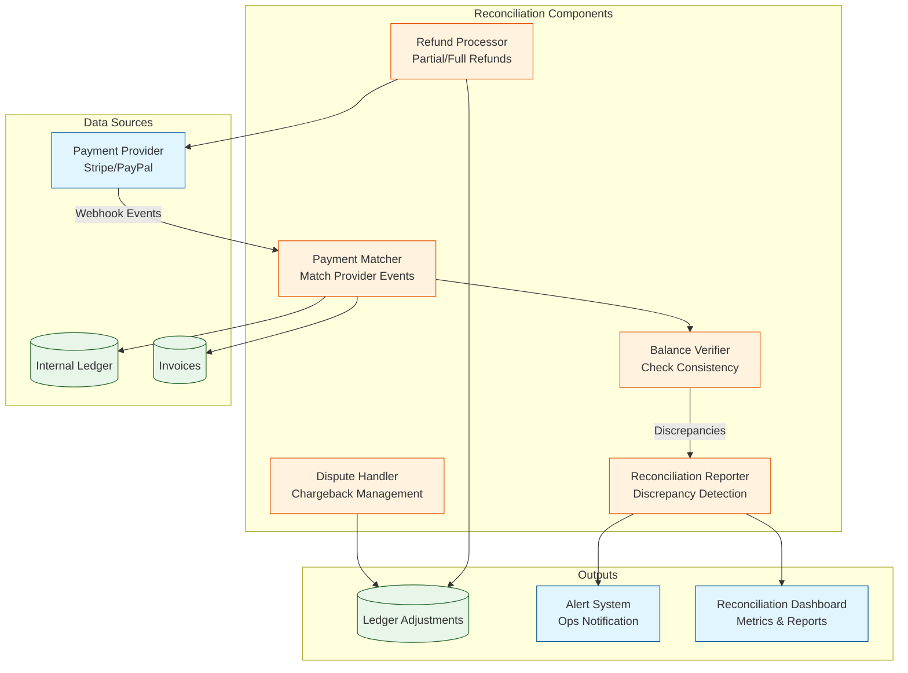

# Payment Reconciliation

## Purpose

Reconcile payments between internal ledger and payment provider state, handle disputes/chargebacks, process refunds, and ensure financial accuracy through automated matching and manual review workflows.

## Reconciliation Architecture



## Payment Matching

### Webhook-Driven Matching

```typescript
@Injectable()
export class PaymentMatcherService {
  async matchPayment(event: PaymentEvent): Promise<void> {
    if (event.type === PaymentEventType.INVOICE_PAYMENT_SUCCEEDED) {
      await this.matchInvoicePayment(event);
    } else if (event.type === PaymentEventType.INVOICE_PAYMENT_FAILED) {
      await this.handlePaymentFailure(event);
    }
  }
  
  private async matchInvoicePayment(event: PaymentEvent): Promise<void> {
    // 1. Find invoice by provider invoice ID
    const invoice = await this.invoiceRepository.findOne({
      where: { provider_invoice_id: event.data.invoice.provider_invoice_id },
      relations: ['subscription', 'subscription.customer'],
    });
    
    if (!invoice) {
      this.logger.error(`Invoice not found for payment event: ${event.provider_invoice_id}`);
      await this.createReconciliationAlert({
        type: 'invoice_not_found',
        provider_invoice_id: event.data.invoice.provider_invoice_id,
        event_id: event.id,
      });
      return;
    }
    
    // 2. Verify payment amount matches invoice total
    if (event.data.payment.amount_cents !== invoice.total_cents) {
      this.logger.warn(`Payment amount mismatch: expected ${invoice.total_cents}, got ${event.data.payment.amount_cents}`);
      await this.createReconciliationAlert({
        type: 'amount_mismatch',
        invoice_id: invoice.id,
        expected_cents: invoice.total_cents,
        actual_cents: event.data.payment.amount_cents,
      });
    }
    
    // 3. Update invoice status
    invoice.status = 'paid';
    invoice.paid_at = new Date(event.timestamp);
    await this.invoiceRepository.save(invoice);
    
    // 4. Record ledger credit (payment received)
    await this.ledgerService.recordCredit({
      customer_id: invoice.subscription.customer_id,
      invoice_id: invoice.id,
      amount_cents: event.data.payment.amount_cents,
      ref_type: 'payment',
      ref_id: event.data.payment.provider_payment_id,
      correlation_id: event.correlation_id,
      metadata: {
        description: `Payment received for invoice ${invoice.id}`,
        provider_payment_id: event.data.payment.provider_payment_id,
      },
    });
    
    // 5. Verify ledger balance
    const balance = await this.ledgerService.getBalance(invoice.subscription.customer_id);
    if (balance !== 0) {
      this.logger.warn(`Customer balance is non-zero after payment: ${balance}`);
    }
  }
  
  private async handlePaymentFailure(event: PaymentEvent): Promise<void> {
    const invoice = await this.invoiceRepository.findOne({
      where: { provider_invoice_id: event.data.invoice.provider_invoice_id },
    });
    
    if (!invoice) return;
    
    // Update invoice status
    invoice.status = 'open';  // Keep open for retry
    await this.invoiceRepository.save(invoice);
    
    // Send notification to customer
    await this.notificationService.send({
      type: 'payment_failed',
      customer_id: invoice.subscription.customer_id,
      invoice_id: invoice.id,
      retry_url: invoice.hosted_invoice_url,
    });
  }
}
```

### Batch Reconciliation (Daily)

```typescript
@Injectable()
export class DailyReconciliationService {
  @Cron('0 2 * * *')  // 2 AM daily
  async reconcileDailyPayments() {
    const yesterday = subDays(new Date(), 1);
    const startOfDay = startOfDay(yesterday);
    const endOfDay = endOfDay(yesterday);
    
    // 1. Get all invoices finalized yesterday
    const invoices = await this.invoiceRepository.find({
      where: {
        finalized_at: Between(startOfDay, endOfDay),
      },
      relations: ['subscription', 'subscription.customer'],
    });
    
    // 2. Fetch payment data from provider
    const stripePayments = await this.stripeAdapter.listPayments({
      created: {
        gte: Math.floor(startOfDay.getTime() / 1000),
        lte: Math.floor(endOfDay.getTime() / 1000),
      },
    });
    
    // 3. Match invoices to payments
    const unmatched: string[] = [];
    
    for (const invoice of invoices) {
      const payment = stripePayments.find(
        p => p.invoice === invoice.provider_invoice_id,
      );
      
      if (!payment) {
        unmatched.push(invoice.id);
      } else if (payment.amount !== invoice.total_cents) {
        await this.createReconciliationAlert({
          type: 'amount_mismatch',
          invoice_id: invoice.id,
          expected_cents: invoice.total_cents,
          actual_cents: payment.amount,
        });
      }
    }
    
    // 4. Report unmatched invoices
    if (unmatched.length > 0) {
      await this.createReconciliationAlert({
        type: 'unmatched_invoices',
        invoice_ids: unmatched,
        date: yesterday.toISOString(),
      });
    }
    
    this.logger.info(`Daily reconciliation complete: ${invoices.length} invoices, ${unmatched.length} unmatched`);
  }
}
```

## Balance Verification

### Customer Balance Check

```typescript
@Injectable()
export class BalanceVerifierService {
  async verifyCustomerBalance(customer_id: string): Promise<BalanceReport> {
    // 1. Calculate balance from ledger
    const ledgerBalance = await this.ledgerService.getBalance(customer_id);
    
    // 2. Calculate expected balance from invoices
    const invoices = await this.invoiceRepository.find({
      where: { subscription: { customer_id } },
    });
    
    const expectedBalance = invoices.reduce((sum, invoice) => {
      if (invoice.status === 'open') {
        return sum + invoice.total_cents;  // Unpaid invoices
      } else if (invoice.status === 'paid') {
        return sum;  // Paid invoices = balanced
      }
      return sum;
    }, 0);
    
    // 3. Check for discrepancy
    const discrepancy = ledgerBalance - expectedBalance;
    
    if (Math.abs(discrepancy) > 0) {
      this.logger.warn(`Balance discrepancy for customer ${customer_id}: ledger=${ledgerBalance}, expected=${expectedBalance}`);
      
      return {
        customer_id,
        ledger_balance_cents: ledgerBalance,
        expected_balance_cents: expectedBalance,
        discrepancy_cents: discrepancy,
        status: 'discrepancy',
      };
    }
    
    return {
      customer_id,
      ledger_balance_cents: ledgerBalance,
      expected_balance_cents: expectedBalance,
      discrepancy_cents: 0,
      status: 'balanced',
    };
  }
}

interface BalanceReport {
  customer_id: string;
  ledger_balance_cents: number;
  expected_balance_cents: number;
  discrepancy_cents: number;
  status: 'balanced' | 'discrepancy';
}
```

## Dispute & Chargeback Handling

### Chargeback Processing

```typescript
@Injectable()
export class DisputeHandlerService {
  async handleChargeback(event: PaymentEvent): Promise<void> {
    // 1. Find related payment and invoice
    const payment = await this.findPaymentByProviderId(
      event.data.payment.provider_payment_id,
    );
    
    if (!payment) {
      this.logger.error(`Payment not found for chargeback: ${event.data.payment.provider_payment_id}`);
      return;
    }
    
    // 2. Record ledger debit (chargeback reversal)
    await this.ledgerService.recordDebit({
      customer_id: payment.customer_id,
      invoice_id: payment.invoice_id,
      amount_cents: event.data.payment.amount_cents,
      ref_type: 'chargeback',
      ref_id: event.id,
      correlation_id: event.correlation_id,
      metadata: {
        description: 'Chargeback reversal',
        provider_payment_id: event.data.payment.provider_payment_id,
        dispute_reason: event.metadata.dispute?.reason,
      },
    });
    
    // 3. Update invoice status
    const invoice = await this.invoiceRepository.findById(payment.invoice_id);
    invoice.status = 'uncollectible';
    await this.invoiceRepository.save(invoice);
    
    // 4. Alert ops team
    await this.alertService.send({
      type: 'chargeback_created',
      severity: 'high',
      customer_id: payment.customer_id,
      invoice_id: payment.invoice_id,
      amount_cents: event.data.payment.amount_cents,
      reason: event.metadata.dispute?.reason,
    });
    
    // 5. Suspend customer account (optional)
    await this.customerService.suspend(payment.customer_id, {
      reason: 'chargeback',
      invoice_id: payment.invoice_id,
    });
  }
  
  async resolveDispute(dispute_id: string, outcome: 'won' | 'lost'): Promise<void> {
    const dispute = await this.disputeRepository.findById(dispute_id);
    
    if (outcome === 'won') {
      // Dispute won: reverse the chargeback, restore payment
      await this.ledgerService.recordCredit({
        customer_id: dispute.customer_id,
        invoice_id: dispute.invoice_id,
        amount_cents: dispute.amount_cents,
        ref_type: 'adjustment',
        ref_id: dispute_id,
        metadata: {
          description: 'Dispute won - chargeback reversed',
        },
      });
      
      // Update invoice back to paid
      const invoice = await this.invoiceRepository.findById(dispute.invoice_id);
      invoice.status = 'paid';
      await this.invoiceRepository.save(invoice);
    } else {
      // Dispute lost: write off the invoice
      this.logger.warn(`Dispute lost for invoice ${dispute.invoice_id}`);
    }
    
    dispute.status = outcome;
    dispute.resolved_at = new Date();
    await this.disputeRepository.save(dispute);
  }
}
```

## Refund Processing

### Full Refund

```typescript
@Injectable()
export class RefundProcessorService {
  async processFullRefund(invoice_id: string, reason: string): Promise<Refund> {
    const invoice = await this.invoiceRepository.findOne({
      where: { id: invoice_id },
      relations: ['subscription', 'subscription.customer'],
    });
    
    if (invoice.status !== 'paid') {
      throw new BadRequestException('Cannot refund unpaid invoice');
    }
    
    // 1. Issue refund via payment provider
    const providerRefund = await this.paymentProvider.refund({
      provider_payment_id: invoice.provider_payment_id,
      amount_cents: invoice.total_cents,
      reason,
    });
    
    // 2. Record ledger credit (refund issued)
    await this.ledgerService.recordCredit({
      customer_id: invoice.subscription.customer_id,
      invoice_id: invoice.id,
      amount_cents: invoice.total_cents,
      ref_type: 'refund',
      ref_id: providerRefund.provider_refund_id,
      metadata: {
        description: `Full refund: ${reason}`,
        provider_refund_id: providerRefund.provider_refund_id,
      },
    });
    
    // 3. Add refund line item to invoice
    await this.lineItemRepository.save({
      invoice_id: invoice.id,
      metric_key: null,
      quantity: null,
      unit_price_cents: -invoice.total_cents,
      total_cents: -invoice.total_cents,
      type: 'refund',
      metadata: {
        reason,
        provider_refund_id: providerRefund.provider_refund_id,
      },
    });
    
    // 4. Update invoice status
    invoice.status = 'void';
    await this.invoiceRepository.save(invoice);
    
    // 5. Create refund record
    const refund = await this.refundRepository.save({
      invoice_id: invoice.id,
      customer_id: invoice.subscription.customer_id,
      amount_cents: invoice.total_cents,
      reason,
      provider_refund_id: providerRefund.provider_refund_id,
      status: 'completed',
    });
    
    return refund;
  }
}
```

### Partial Refund

```typescript
async processPartialRefund(
  invoice_id: string,
  amount_cents: number,
  reason: string,
): Promise<Refund> {
  const invoice = await this.invoiceRepository.findOne({
    where: { id: invoice_id },
    relations: ['subscription', 'subscription.customer'],
  });
  
  if (amount_cents > invoice.total_cents) {
    throw new BadRequestException('Refund amount exceeds invoice total');
  }
  
  // 1. Issue partial refund via provider
  const providerRefund = await this.paymentProvider.refund({
    provider_payment_id: invoice.provider_payment_id,
    amount_cents,
    reason,
  });
  
  // 2. Record ledger credit
  await this.ledgerService.recordCredit({
    customer_id: invoice.subscription.customer_id,
    invoice_id: invoice.id,
    amount_cents,
    ref_type: 'refund',
    ref_id: providerRefund.provider_refund_id,
    metadata: {
      description: `Partial refund: ${reason}`,
    },
  });
  
  // 3. Add refund line item
  await this.lineItemRepository.save({
    invoice_id: invoice.id,
    metric_key: null,
    quantity: null,
    unit_price_cents: -amount_cents,
    total_cents: -amount_cents,
    type: 'refund',
    metadata: { reason },
  });
  
  // 4. Update invoice total
  invoice.total_cents -= amount_cents;
  await this.invoiceRepository.save(invoice);
  
  return await this.refundRepository.save({
    invoice_id: invoice.id,
    customer_id: invoice.subscription.customer_id,
    amount_cents,
    reason,
    provider_refund_id: providerRefund.provider_refund_id,
    status: 'completed',
  });
}
```

## Reconciliation Reports

### Discrepancy Report

```typescript
@Injectable()
export class ReconciliationReporterService {
  async generateDiscrepancyReport(date: Date): Promise<DiscrepancyReport> {
    const startOfDay = startOfDay(date);
    const endOfDay = endOfDay(date);
    
    // 1. Find all invoices finalized on this date
    const invoices = await this.invoiceRepository.find({
      where: {
        finalized_at: Between(startOfDay, endOfDay),
      },
    });
    
    // 2. Check for discrepancies
    const discrepancies: DiscrepancyItem[] = [];
    
    for (const invoice of invoices) {
      const balanceReport = await this.balanceVerifier.verifyCustomerBalance(
        invoice.subscription.customer_id,
      );
      
      if (balanceReport.status === 'discrepancy') {
        discrepancies.push({
          invoice_id: invoice.id,
          customer_id: invoice.subscription.customer_id,
          expected_cents: balanceReport.expected_balance_cents,
          actual_cents: balanceReport.ledger_balance_cents,
          difference_cents: balanceReport.discrepancy_cents,
        });
      }
    }
    
    return {
      date: date.toISOString(),
      total_invoices: invoices.length,
      discrepancies_count: discrepancies.length,
      discrepancies,
    };
  }
}

interface DiscrepancyReport {
  date: string;
  total_invoices: number;
  discrepancies_count: number;
  discrepancies: DiscrepancyItem[];
}

interface DiscrepancyItem {
  invoice_id: string;
  customer_id: string;
  expected_cents: number;
  actual_cents: number;
  difference_cents: number;
}
```

### Monthly Settlement Report

```typescript
async generateSettlementReport(month: Date): Promise<SettlementReport> {
  const startOfMonth = startOfMonth(month);
  const endOfMonth = endOfMonth(month);
  
  // 1. Aggregate payments
  const payments = await this.ledgerRepository.find({
    where: {
      ref_type: 'payment',
      created_at: Between(startOfMonth, endOfMonth),
    },
  });
  
  const totalPayments = payments.reduce((sum, p) => sum + p.credit_cents, 0);
  
  // 2. Aggregate refunds
  const refunds = await this.ledgerRepository.find({
    where: {
      ref_type: 'refund',
      created_at: Between(startOfMonth, endOfMonth),
    },
  });
  
  const totalRefunds = refunds.reduce((sum, r) => sum + r.credit_cents, 0);
  
  // 3. Aggregate chargebacks
  const chargebacks = await this.ledgerRepository.find({
    where: {
      ref_type: 'chargeback',
      created_at: Between(startOfMonth, endOfMonth),
    },
  });
  
  const totalChargebacks = chargebacks.reduce((sum, c) => sum + c.debit_cents, 0);
  
  // 4. Calculate net settlement
  const netSettlement = totalPayments - totalRefunds - totalChargebacks;
  
  return {
    month: month.toISOString().slice(0, 7),
    total_payments_cents: totalPayments,
    total_refunds_cents: totalRefunds,
    total_chargebacks_cents: totalChargebacks,
    net_settlement_cents: netSettlement,
    payment_count: payments.length,
    refund_count: refunds.length,
    chargeback_count: chargebacks.length,
  };
}
```

## Alerts & Notifications

### Reconciliation Alerts

```typescript
@Injectable()
export class ReconciliationAlertService {
  async createAlert(alert: ReconciliationAlert): Promise<void> {
    // 1. Store alert
    await this.alertRepository.save(alert);
    
    // 2. Send to ops team
    await this.notificationService.send({
      channel: 'ops',
      type: 'reconciliation_alert',
      severity: this.getSeverity(alert.type),
      title: this.getAlertTitle(alert.type),
      message: this.formatAlertMessage(alert),
    });
    
    // 3. Update metrics
    await this.metricsService.increment('reconciliation.alerts', {
      type: alert.type,
    });
  }
  
  private getSeverity(type: string): 'low' | 'medium' | 'high' {
    const severityMap: Record<string, 'low' | 'medium' | 'high'> = {
      amount_mismatch: 'medium',
      invoice_not_found: 'high',
      unmatched_invoices: 'medium',
      balance_discrepancy: 'high',
      chargeback_created: 'high',
    };
    
    return severityMap[type] || 'medium';
  }
}

interface ReconciliationAlert {
  type: 'amount_mismatch' | 'invoice_not_found' | 'unmatched_invoices' | 'balance_discrepancy' | 'chargeback_created';
  data: Record<string, any>;
  created_at: Date;
}
```

## Metrics & Monitoring

```typescript
// Reconciliation metrics
reconciliation.discrepancies_count
reconciliation.unmatched_invoices_count
reconciliation.chargebacks_count
reconciliation.refunds_total_cents
reconciliation.payments_total_cents
reconciliation.balance_verification_duration_ms

// Alerts
reconciliation.alerts{type=amount_mismatch}
reconciliation.alerts{type=invoice_not_found}
reconciliation.alerts{type=chargeback_created}
```

## Next Steps

This completes the Payments Component Architecture documentation. All 7 documents created:
1. README.md - Navigation index
2. overview.md - Component architecture and design philosophy
3. data-model.md - Database schema and ERD
4. api-contracts.md - REST endpoints and webhook schemas
5. stripe-adapter.md - Stripe integration implementation
6. billing-engine.md - Invoice generation and valuation
7. reconciliation.md - Payment matching and dispute handling

Refer to [Implementation Spec](../impl/phase-1/payments.md) for development tasks.
