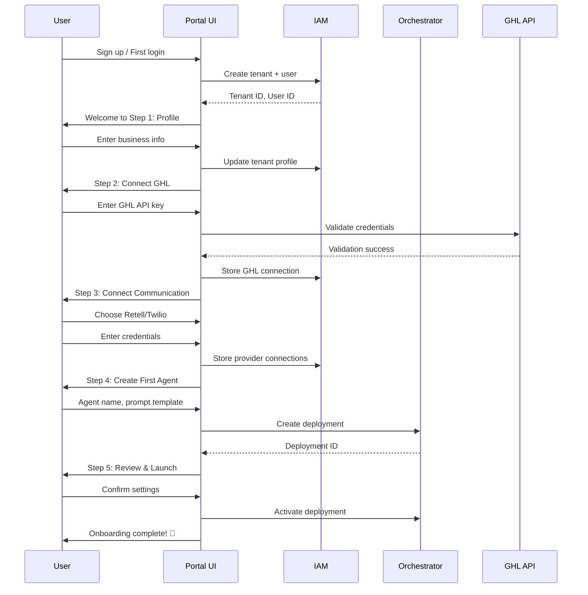

# Portal UI Component — Features

**Tracker**: Issue #155  
**Related**: [Overview](./overview.md), [IAM Component](../iam/README.md), [Orchestrator Component](../orchestrator/README.md)

## Purpose

This document specifies the detailed features and user workflows for the Portal UI Component. Each feature includes functional requirements, user flows, UI patterns, and integration points with backend services.

---

## Feature Overview

The Portal UI provides five core feature areas:

1. **Onboarding Wizard** — Guided setup for new clients
2. **Client Connections** — Integration management (GHL, Retell, Twilio)
3. **Usage Dashboards** — Real-time and historical usage monitoring
4. **Billing Portal** — Invoice history, payment methods, subscription management
5. **Settings & Account Management** — Profile, preferences, API keys, team management

---

## 1. Onboarding Wizard

### Purpose
Guide new clients through initial platform setup, from account creation to first agent deployment.

### User Flow



### Steps Breakdown

#### Step 1: Profile Setup
**Objective**: Collect basic business information

**Fields**:
- Business name (required)
- Industry (dropdown: Real Estate, Healthcare, Legal, etc.)
- Time zone (auto-detected, editable)
- Phone number (optional, for support)

**Validation**:
- Business name: 2-100 characters, no special characters
- Industry: Must select from predefined list
- Time zone: IANA time zone string

**Backend Call**:
- `PATCH /api/v1/tenants/{tenantId}`
- Body: `{ name, industry, timezone, phone }`

**UI Pattern**: 
- Card layout with form fields
- "Save & Continue" button (disabled until valid)
- Progress indicator (Step 1 of 5)

---

#### Step 2: Connect GoHighLevel (GHL)
**Objective**: Establish GHL integration for CRM/calendar access

**Fields**:
- GHL API Key (text input, masked)
- GHL Location ID (text input)
- Test connection button

**Validation**:
- API Key: 32-64 character alphanumeric string
- Location ID: Valid GHL location ID format

**Backend Call**:
- `POST /api/v1/integrations/ghl/validate`
- Body: `{ apiKey, locationId }`
- Response: `{ valid: boolean, locationName?: string }`

**Success Flow**:
1. User enters API key and location ID
2. Clicks "Test Connection"
3. Portal validates with GHL API
4. On success: Display location name, enable "Save & Continue"
5. On failure: Show error message, suggest troubleshooting link

**Error Handling**:
- Invalid API key: "API key is invalid. Please check your GHL settings."
- Network error: "Unable to connect. Please try again."
- Rate limit: "Too many attempts. Please wait 1 minute."

**UI Pattern**:
- Masked input for API key (show/hide toggle)
- Loading spinner during validation
- Green checkmark icon on success
- Inline error message on failure

---

#### Step 3: Connect Communication Providers
**Objective**: Configure voice/SMS providers (Retell, Twilio, or both)

**Provider Options**:
- Retell AI (voice calls with LLM)
- Twilio (SMS and voice)
- Both (recommended for full coverage)

**Retell Configuration**:
- Retell API Key (masked input)
- Agent ID (optional, for pre-configured agents)

**Twilio Configuration**:
- Account SID (text input)
- Auth Token (masked input)
- Phone number (optional, for SMS)

**Validation**:
- Retell API Key: 40-64 character string
- Twilio Account SID: 34 characters starting with "AC"
- Twilio Auth Token: 32 characters

**Backend Call**:
- `POST /api/v1/integrations/retell/validate`
- `POST /api/v1/integrations/twilio/validate`

**Success Flow**:
1. User selects provider(s)
2. Enters credentials
3. Clicks "Test Connection" for each
4. Portal validates with provider APIs
5. On success: Save credentials, enable "Save & Continue"

**UI Pattern**:
- Checkbox to select providers
- Conditional form fields based on selection
- Separate validation for each provider
- Summary card showing connected providers

---

#### Step 4: Create First Agent
**Objective**: Generate initial AI agent deployment

**Fields**:
- Agent name (required, 2-50 characters)
- Prompt template (dropdown: Sales, Support, Booking, Custom)
- Voice provider (Retell or Twilio, based on Step 3)
- Voice settings: Language, voice ID, speed (optional advanced)

**Prompt Templates**:
- **Sales**: "You are a friendly sales assistant helping customers..."
- **Support**: "You are a helpful support agent resolving issues..."
- **Booking**: "You assist customers with scheduling appointments..."
- **Custom**: Blank template for user to define

**Validation**:
- Agent name: Unique within tenant
- Prompt template: Must select one (or provide custom)
- Voice provider: Must have configured in Step 3

**Backend Call**:
- `POST /api/v1/deployments`
- Body: `{ name, promptTemplate, voiceProvider, voiceSettings }`

**Success Flow**:
1. User enters agent name
2. Selects prompt template (preview shown)
3. Chooses voice provider
4. (Optional) Customizes voice settings
5. Clicks "Create Agent"
6. Portal creates deployment in Orchestrator
7. Deployment ID returned, saved for Step 5

**UI Pattern**:
- Text input for agent name
- Radio buttons for prompt templates
- Expandable section for advanced voice settings
- Preview panel showing final prompt
- Loading state during creation

---

#### Step 5: Review & Launch
**Objective**: Confirm setup and activate agent

**Summary Display**:
- Business profile (name, industry, time zone)
- Connected integrations (GHL, Retell, Twilio)
- Agent details (name, prompt template, voice provider)
- Next steps guidance

**Actions**:
- "Launch Agent" — Activate deployment, mark onboarding complete
- "Go to Dashboard" — Skip activation, go to main dashboard

**Backend Call**:
- `PATCH /api/v1/deployments/{deploymentId}/activate`
- `PATCH /api/v1/tenants/{tenantId}/onboarding-complete`

**Success Flow**:
1. User reviews summary
2. Clicks "Launch Agent"
3. Portal activates deployment
4. Onboarding status updated to `completed`
5. Redirect to dashboard with success toast

**UI Pattern**:
- Card layout with summary sections
- Primary CTA: "Launch Agent" (green button)
- Secondary CTA: "Go to Dashboard" (text link)
- Confetti animation on successful launch 🎉

---

### Onboarding State Management

**Zustand Store** (`useOnboardingStore`):
```typescript
interface OnboardingState {
  currentStep: number
  completedSteps: number[]
  profile: { name: string; industry: string; timezone: string }
  integrations: { ghl?: GHLConfig; retell?: RetellConfig; twilio?: TwilioConfig }
  agent: { name: string; promptTemplate: string; voiceProvider: string }
  
  setStep: (step: number) => void
  markStepComplete: (step: number) => void
  updateProfile: (profile: Partial<Profile>) => void
  updateIntegrations: (provider: string, config: any) => void
  updateAgent: (agent: Partial<Agent>) => void
  reset: () => void
}
```

**Persistence**:
- Save state to `localStorage` after each step
- Resume onboarding if user refreshes or leaves midway
- Clear state on completion

---

### Accessibility

**Keyboard Navigation**:
- Tab through form fields in logical order
- Enter key submits current step
- Escape key cancels and returns to dashboard (with confirmation)

**Screen Reader**:
- Progress indicator announced: "Step 2 of 5: Connect GoHighLevel"
- Validation errors read aloud when field loses focus
- Success messages announced in live region

**ARIA Attributes**:
- `role="progressbar"` for step indicator
- `aria-live="polite"` for validation messages
- `aria-describedby` linking labels to help text

---

### Edge Cases

**User Abandons Onboarding**:
- Save progress in `localStorage`
- Show "Resume Onboarding" banner on next login
- Option to skip onboarding (mark as incomplete, allow manual setup)

**Invalid Credentials**:
- Show specific error messages (not generic "invalid")
- Provide troubleshooting links (e.g., "How to find GHL API key")
- Allow retry without losing other entered data

**Network Failure During Validation**:
- Retry automatically (up to 3 times)
- Show "Connection lost. Retrying..." message
- If all retries fail, allow user to save and continue later

---

## 2. Client Connections

### Purpose
Manage integrations with external platforms (GHL, Retell, Twilio) after initial onboarding.

### UI Layout

**Connections Page** (`/connections`):
- Grid of connection cards (3 columns on desktop, 1 on mobile)
- Each card shows:
  - Provider logo and name
  - Connection status (Connected, Disconnected, Error)
  - Last sync time
  - Actions: Edit, Test, Disconnect

**Card States**:
- **Connected**: Green checkmark icon, "Connected" badge, last sync timestamp
- **Disconnected**: Gray icon, "Not Connected" badge, "Connect" button
- **Error**: Red warning icon, "Connection Error" badge, error message, "Reconnect" button

---

### Connection Management Workflows

#### Add New Connection
1. User clicks "Connect" on provider card
2. Modal opens with credentials form
3. User enters credentials
4. Clicks "Test Connection"
5. Portal validates with provider API
6. On success: Save credentials, close modal, update card
7. On failure: Show error, allow retry

#### Edit Existing Connection
1. User clicks "Edit" on connected provider card
2. Modal opens with current credentials (masked)
3. User updates credentials
4. Clicks "Test Connection"
5. Portal validates
6. On success: Update credentials, close modal
7. On failure: Keep old credentials, show error

#### Disconnect Provider
1. User clicks "Disconnect"
2. Confirmation modal: "Are you sure? Active agents using this provider will stop working."
3. User confirms or cancels
4. If confirmed:
   - Portal deletes credentials
   - Updates card to "Disconnected"
   - Shows warning banner if agents are affected

#### Test Connection
1. User clicks "Test" on connected provider card
2. Portal makes test API call
3. On success: Show "Connection is healthy" toast
4. On failure: Show error message, offer reconnect

---

### GHL Connection Management

**Fields**:
- API Key (masked, show/hide toggle)
- Location ID
- Webhook URL (read-only, auto-generated)

**Advanced Settings** (expandable):
- Sync interval (default: 15 minutes, range: 5-60 minutes)
- Contact sync enabled (toggle, default: true)
- Appointment sync enabled (toggle, default: true)
- Custom field mapping (future enhancement)

**Backend Calls**:
- `GET /api/v1/integrations/ghl` — Fetch current config
- `PUT /api/v1/integrations/ghl` — Update config
- `POST /api/v1/integrations/ghl/test` — Test connection
- `DELETE /api/v1/integrations/ghl` — Disconnect

**Validation**:
- API Key: Required, 32-64 characters
- Location ID: Required, valid GHL format
- Sync interval: 5-60 minutes

---

### Retell Connection Management

**Fields**:
- API Key (masked, show/hide toggle)
- Default Agent ID (optional, for fallback)

**Advanced Settings**:
- Voice language (dropdown: en-US, es-ES, etc.)
- Default voice ID (dropdown, fetched from Retell API)
- LLM provider (dropdown: OpenAI, Anthropic, etc.)

**Backend Calls**:
- `GET /api/v1/integrations/retell` — Fetch current config
- `PUT /api/v1/integrations/retell` — Update config
- `POST /api/v1/integrations/retell/test` — Test connection
- `DELETE /api/v1/integrations/retell` — Disconnect

**Validation**:
- API Key: Required, 40-64 characters
- Agent ID: Optional, valid UUID format

---

### Twilio Connection Management

**Fields**:
- Account SID (text input)
- Auth Token (masked, show/hide toggle)
- Phone Number (optional, for SMS)

**Advanced Settings**:
- SMS enabled (toggle, default: true)
- Voice enabled (toggle, default: true)
- Webhook URL (read-only, auto-generated)

**Backend Calls**:
- `GET /api/v1/integrations/twilio` — Fetch current config
- `PUT /api/v1/integrations/twilio` — Update config
- `POST /api/v1/integrations/twilio/test` — Test connection
- `DELETE /api/v1/integrations/twilio` — Disconnect

**Validation**:
- Account SID: Required, 34 characters starting with "AC"
- Auth Token: Required, 32 characters
- Phone Number: Optional, E.164 format (e.g., +14155551234)

---

### Connection Health Monitoring

**Health Check**:
- Run automatically every 15 minutes (background job)
- Test API call to each connected provider
- Update connection status based on result

**Status Indicators**:
- **Healthy**: Last check < 15 minutes ago, successful
- **Warning**: Last check 15-60 minutes ago, successful (might be stale)
- **Error**: Last check failed or > 60 minutes ago

**Notifications**:
- Email alert if connection fails (after 2 consecutive failures)
- In-app banner: "GHL connection is down. Please check your credentials."
- Toast notification when connection recovers

---

### State Management

**TanStack Query**:
```typescript
// Fetch all connections
const { data: connections } = useQuery({
  queryKey: ['integrations'],
  queryFn: fetchIntegrations,
  staleTime: 5 * 60 * 1000, // 5 minutes
})

// Update connection
const updateMutation = useMutation({
  mutationFn: (provider, config) => updateIntegration(provider, config),
  onSuccess: () => {
    queryClient.invalidateQueries(['integrations'])
    toast.success('Connection updated successfully')
  },
  onError: (error) => {
    toast.error(`Failed to update: ${error.message}`)
  },
})
```

---

### Accessibility

**Keyboard Navigation**:
- Tab through connection cards
- Enter key opens edit modal
- Escape key closes modal

**Screen Reader**:
- Card status announced: "GoHighLevel connection is healthy, last synced 5 minutes ago"
- Modal title announced when opened
- Form validation errors read aloud

**ARIA Attributes**:
- `role="region"` for each connection card
- `aria-label` for action buttons
- `aria-live="polite"` for status updates

---

## 3. Usage Dashboards

### Purpose
Provide real-time and historical visibility into platform usage metrics (calls, messages, LLM tokens, costs).

### UI Layout

**Usage Dashboard** (`/usage`):
- Header with date range selector (Last 7 days, Last 30 days, Custom range)
- Key metrics cards (4 columns on desktop, 1 on mobile):
  1. Total Calls (count, trend)
  2. Total Messages (count, trend)
  3. LLM Tokens (count, trend)
  4. Estimated Cost (dollars, trend)
- Time-series chart (line chart for trends)
- Usage breakdown table (by agent, provider, metric)
- Export button (CSV, PDF)

---

### Key Metrics Cards

**Design**:
- Card with large number (current period total)
- Trend indicator: ↑ 12% vs previous period (green if usage up, neutral)
- Sparkline chart (mini time-series)

**Metrics**:
1. **Total Calls**: Sum of all voice calls (Retell + Twilio)
2. **Total Messages**: Sum of all SMS messages (Twilio)
3. **LLM Tokens**: Sum of all tokens across calls (Retell LLM + OpenRouter)
4. **Estimated Cost**: Sum of all usage costs (based on cost-plus pricing)

**Data Source**:
- `GET /api/v1/billing/usage/summary?period={period}`
- Response: `{ calls, messages, tokens, cost, trends }`

**Update Frequency**:
- Real-time updates via WebSocket for current day
- Historical data cached for 1 minute

---

### Time-Series Chart

**Purpose**: Visualize usage trends over selected period

**Chart Type**: Line chart with multiple series

**Series**:
- Calls (blue line)
- Messages (green line)
- LLM Tokens (purple line, scaled to secondary Y-axis)
- Cost (orange line, scaled to secondary Y-axis)

**Interactions**:
- Hover to see exact values for each day
- Click legend to toggle series visibility
- Zoom/pan for large date ranges

**Library**: Recharts (React chart library)

**Data Source**:
- `GET /api/v1/billing/usage/daily-trends?start={start}&end={end}`
- Response: `{ dates: [], calls: [], messages: [], tokens: [], costs: [] }`

---

### Usage Breakdown Table

**Columns**:
- Agent Name
- Provider (Retell, Twilio, OpenRouter)
- Metric (Calls, Messages, Tokens)
- Quantity (count)
- Cost (dollars)
- Percentage of Total (bar chart)

**Sorting**:
- Default: Sort by Cost descending
- Clickable column headers to sort by any field

**Filtering**:
- Filter by agent (multi-select dropdown)
- Filter by provider (multi-select dropdown)
- Filter by metric (multi-select dropdown)

**Pagination**:
- 20 rows per page
- "Load More" button (infinite scroll on mobile)

**Data Source**:
- `GET /api/v1/billing/usage/breakdown?period={period}&agent={agent}&provider={provider}&metric={metric}`
- Response: `{ items: [...], total: 150 }`

---

### Real-Time Updates (WebSocket)

**Connection**:
- Establish WebSocket on page mount
- Subscribe to `usage-events` channel for tenant

**Events**:
```typescript
interface UsageEvent {
  type: 'call' | 'message' | 'token'
  provider: 'retell' | 'twilio' | 'openrouter'
  quantity: number
  cost: number
  timestamp: string
}
```

**Handling**:
1. Receive usage event via WebSocket
2. Invalidate TanStack Query cache for summary and trends
3. Trigger refetch (background, no loading spinner)
4. Update UI with new data

**Fallback**:
- If WebSocket disconnects, fall back to polling every 30 seconds
- Show "Live updates paused" banner when offline

---

### Date Range Selector

**Presets**:
- Today
- Yesterday
- Last 7 days
- Last 30 days
- This month
- Last month
- Custom range (date picker)

**Custom Range**:
- Start date (date picker)
- End date (date picker)
- Max range: 90 days
- Apply button to update dashboard

**State Management**:
- Zustand store for selected range
- Persist to `localStorage`
- URL query params: `?start=2025-10-01&end=2025-10-23`

---

### Export Functionality

**Formats**:
- CSV (usage breakdown table)
- PDF (full dashboard snapshot with charts)

**CSV Export**:
- Includes all columns from breakdown table
- Filename: `usage-export-{start}-{end}.csv`
- Backend endpoint: `GET /api/v1/billing/usage/export/csv?start={start}&end={end}`

**PDF Export**:
- Generated server-side (Puppeteer or similar)
- Includes key metrics, chart image, and breakdown table
- Filename: `usage-report-{start}-{end}.pdf`
- Backend endpoint: `GET /api/v1/billing/usage/export/pdf?start={start}&end={end}`

**Loading State**:
- Show "Generating export..." toast
- Download link appears when ready
- Error handling if export fails

---

### State Management

**TanStack Query**:
```typescript
// Summary metrics
const { data: summary } = useQuery({
  queryKey: ['usage', 'summary', period],
  queryFn: () => fetchUsageSummary(period),
  staleTime: 60_000, // 1 minute
  refetchInterval: 60_000, // Refresh every minute
})

// Daily trends
const { data: trends } = useQuery({
  queryKey: ['usage', 'trends', start, end],
  queryFn: () => fetchDailyTrends(start, end),
  staleTime: 60_000,
})

// Breakdown table
const { data: breakdown } = useQuery({
  queryKey: ['usage', 'breakdown', period, filters],
  queryFn: () => fetchUsageBreakdown(period, filters),
  staleTime: 60_000,
})
```

**Zustand Store** (`useUsageStore`):
```typescript
interface UsageState {
  dateRange: { start: string; end: string }
  filters: { agents: string[]; providers: string[]; metrics: string[] }
  
  setDateRange: (range: { start: string; end: string }) => void
  updateFilters: (filters: Partial<Filters>) => void
  resetFilters: () => void
}
```

---

### Accessibility

**Keyboard Navigation**:
- Tab through date range presets
- Arrow keys navigate chart data points
- Enter key toggles chart series
- Table rows focusable with keyboard

**Screen Reader**:
- Metrics cards announced: "Total calls: 1,234, up 12% from last period"
- Chart data table (hidden visually, accessible to screen readers)
- Table pagination announced

**ARIA Attributes**:
- `role="region"` for dashboard sections
- `aria-label` for chart and table
- `aria-live="polite"` for real-time updates

---

## 4. Billing Portal

### Purpose
Provide visibility into billing history, manage payment methods, and review subscription details.

### UI Layout

**Billing Portal** (`/billing`):
- Current billing cycle card:
  - Cycle dates (e.g., Oct 1 - Oct 31)
  - Usage-to-date (calls, messages, tokens)
  - Estimated cost-to-date
  - Included allowances (e.g., "500 / 1,000 calls used")
- Invoice history table (sorted by date descending)
- Payment methods section
- Subscription details (plan, pricing, renewal date)

---

### Current Billing Cycle Card

**Fields**:
- Cycle period: "October 1 - October 31, 2025"
- Days remaining: "8 days left in cycle"
- Usage summary:
  - Calls: 734 / 1,000 included (progress bar)
  - Messages: 1,245 / 1,000 included (overage indicated)
  - Tokens: 2.3M / 5M included
- Estimated cost:
  - Base fee: $99.00
  - Overage charges: $12.25 (245 messages × $0.05)
  - Total: $111.25

**Data Source**:
- `GET /api/v1/billing/current-cycle`
- Response: `{ cycle, usage, allowances, costs }`

**Update Frequency**:
- Refresh every 5 minutes
- Real-time updates via WebSocket (optional)

**UI Pattern**:
- Card layout with sections
- Progress bars for allowances
- Warning indicator if nearing limit (> 90%)
- Overage amounts in red

---

### Invoice History Table

**Columns**:
- Invoice Number (e.g., INV-2025-10-001)
- Billing Period (e.g., Oct 1 - Oct 31, 2025)
- Amount (e.g., $111.25)
- Status (Paid, Pending, Overdue, Failed)
- Issued Date
- Due Date
- Actions (View PDF, Download)

**Sorting**:
- Default: Issued Date descending (most recent first)
- Clickable column headers to sort

**Filtering**:
- Filter by status (multi-select: Paid, Pending, Overdue, Failed)
- Filter by date range (date picker)

**Pagination**:
- 10 invoices per page
- "Load More" button

**Data Source**:
- `GET /api/v1/billing/invoices?page={page}&limit={limit}&status={status}`
- Response: `{ invoices: [...], total: 24 }`

**Invoice Actions**:
- **View PDF**: Opens invoice PDF in new tab
  - Endpoint: `GET /api/v1/billing/invoices/{invoiceId}/pdf`
- **Download**: Downloads PDF to device
- **Pay Now** (if pending/overdue): Redirects to payment flow

---

### Invoice Details Modal

**Trigger**: Click on invoice row

**Content**:
- Invoice metadata (number, dates, status)
- Line items table:
  - Description (e.g., "Base subscription fee", "Message overage (245 × $0.05)")
  - Quantity
  - Unit price
  - Total
- Subtotal, taxes (if applicable), total amount
- Payment details (method, date paid, transaction ID)

**Actions**:
- Close modal
- Download PDF
- Pay Now (if unpaid)

**Data Source**:
- `GET /api/v1/billing/invoices/{invoiceId}`
- Response: `{ invoice: {...}, lineItems: [...], payment: {...} }`

---

### Payment Methods Section

**Purpose**: Manage credit/debit cards for automatic billing

**UI Layout**:
- List of saved payment methods (cards)
- Each card shows:
  - Card brand (Visa, Mastercard, Amex) with icon
  - Last 4 digits (e.g., "•••• 4242")
  - Expiration date (e.g., "Expires 12/2026")
  - Default badge (if primary method)
  - Actions: Set as Default, Remove
- "Add Payment Method" button

**Add Payment Method Flow**:
1. User clicks "Add Payment Method"
2. Modal opens with Stripe card element (embedded iframe)
3. User enters card details
4. Clicks "Add Card"
5. Portal creates payment method via Stripe
6. Card saved, modal closes, list updates

**Backend Integration**:
- Stripe.js embedded form (PCI SAQ-A compliance)
- `POST /api/v1/billing/payment-methods` — Create payment method
- `PATCH /api/v1/billing/payment-methods/{id}/default` — Set default
- `DELETE /api/v1/billing/payment-methods/{id}` — Remove

**Validation**:
- Card number: Validated by Stripe
- Expiration: Future date required
- CVV: Required, 3-4 digits

**Security**:
- No card data stored in portal database
- Stripe handles tokenization
- Portal stores payment method ID only

---

### Subscription Details Section

**Fields**:
- Plan name (e.g., "Professional")
- Base fee (e.g., "$99.00 / month")
- Included allowances:
  - 1,000 voice calls
  - 1,000 SMS messages
  - 5M LLM tokens
- Overage pricing:
  - Voice calls: $0.10 / call
  - SMS messages: $0.05 / message
  - LLM tokens: $0.02 / 1,000 tokens
- Renewal date (e.g., "Renews on November 1, 2025")
- Cancellation policy (link to terms)

**Actions**:
- **Upgrade Plan** (future enhancement)
- **Cancel Subscription**: Opens confirmation modal
  - Warning: "Your subscription will end on {date}. You'll lose access to all features."
  - Reason dropdown (optional feedback)
  - Confirm cancellation

**Data Source**:
- `GET /api/v1/billing/subscription`
- Response: `{ plan, pricing, allowances, renewalDate }`

**Cancellation**:
- `DELETE /api/v1/billing/subscription`
- Backend marks subscription as `canceled`, sets end date

---

### Payment Flow (Pay Invoice)

**Trigger**: Click "Pay Now" on pending/overdue invoice

**Flow**:
1. Modal opens with invoice summary
2. Select payment method (dropdown of saved cards)
3. Review total amount
4. Click "Pay {amount}"
5. Portal processes payment via Stripe
6. On success:
   - Invoice status updated to "Paid"
   - Confirmation toast
   - Email receipt sent
7. On failure:
   - Error message (e.g., "Card declined. Please try another method.")
   - Retry option

**Backend Calls**:
- `POST /api/v1/billing/invoices/{invoiceId}/pay`
- Body: `{ paymentMethodId }`
- Response: `{ success: boolean, transactionId?: string, error?: string }`

---

### State Management

**TanStack Query**:
```typescript
// Current cycle
const { data: currentCycle } = useQuery({
  queryKey: ['billing', 'current-cycle'],
  queryFn: fetchCurrentCycle,
  staleTime: 5 * 60 * 1000, // 5 minutes
  refetchInterval: 5 * 60 * 1000,
})

// Invoice history
const { data: invoices } = useQuery({
  queryKey: ['billing', 'invoices', page, filters],
  queryFn: () => fetchInvoices(page, filters),
  staleTime: 10 * 60 * 1000, // 10 minutes
})

// Payment methods
const { data: paymentMethods } = useQuery({
  queryKey: ['billing', 'payment-methods'],
  queryFn: fetchPaymentMethods,
  staleTime: 10 * 60 * 1000,
})

// Subscription
const { data: subscription } = useQuery({
  queryKey: ['billing', 'subscription'],
  queryFn: fetchSubscription,
  staleTime: 10 * 60 * 1000,
})
```

---

### Accessibility

**Keyboard Navigation**:
- Tab through invoice rows
- Enter key opens invoice details
- Card elements keyboard accessible (Stripe-provided)

**Screen Reader**:
- Invoice status announced: "Invoice 001, October billing period, $111.25, status: Paid"
- Payment method announced: "Visa ending in 4242, expires December 2026, default payment method"

**ARIA Attributes**:
- `role="table"` for invoice history
- `aria-label` for action buttons
- `aria-live="polite"` for payment status updates

---

## 5. Settings & Account Management

### Purpose
Manage user profile, account preferences, API keys, and team members.

### UI Layout

**Settings Page** (`/settings`):
- Tab navigation (Profile, Preferences, API Keys, Team, Security)
- Tab content area

---

### Profile Tab

**Fields**:
- Full name (text input)
- Email (text input, disabled if verified)
- Phone number (text input, optional)
- Company name (text input)
- Time zone (dropdown)
- Profile photo (upload, optional)

**Actions**:
- Save changes
- Cancel (reset to original values)

**Backend Call**:
- `PATCH /api/v1/users/{userId}`
- Body: `{ name, phone, company, timezone }`

**Validation**:
- Name: 2-100 characters
- Email: Valid email format (read-only if verified)
- Phone: E.164 format (optional)
- Company: 2-100 characters

**Photo Upload**:
- File picker (JPG, PNG, max 2MB)
- Image preview before upload
- `POST /api/v1/users/{userId}/photo` — Upload endpoint
- Returns URL of uploaded photo

---

### Preferences Tab

**Fields**:
- Language (dropdown: English, Spanish, etc.)
- Date format (dropdown: MM/DD/YYYY, DD/MM/YYYY, YYYY-MM-DD)
- Time format (dropdown: 12-hour, 24-hour)
- Currency (dropdown: USD, EUR, GBP, etc.)
- Email notifications (toggles):
  - Usage alerts (e.g., nearing usage limits)
  - Billing reminders (e.g., invoice due)
  - Platform updates (e.g., new features)
  - Weekly summary reports

**Actions**:
- Save preferences
- Cancel

**Backend Call**:
- `PATCH /api/v1/users/{userId}/preferences`
- Body: `{ language, dateFormat, timeFormat, currency, notifications }`

---

### API Keys Tab

**Purpose**: Generate and manage API keys for programmatic access

**UI Layout**:
- List of API keys (table):
  - Key name (e.g., "Production API Key")
  - Key preview (e.g., "pk_live_••••••••4242")
  - Created date
  - Last used date
  - Actions: Revoke
- "Generate New Key" button

**Generate New Key Flow**:
1. User clicks "Generate New Key"
2. Modal opens with form:
   - Key name (text input, required)
   - Permissions (checkboxes: Read usage, Write deployments, etc.)
3. User clicks "Generate"
4. Backend creates key, returns full key (shown once)
5. Modal shows key with copy button: "Copy this key now. It won't be shown again."
6. User copies key, closes modal
7. Key added to list (masked)

**Backend Calls**:
- `GET /api/v1/api-keys` — List keys
- `POST /api/v1/api-keys` — Generate new key
- `DELETE /api/v1/api-keys/{keyId}` — Revoke key

**Security**:
- Keys shown in full only once (on creation)
- Masked in list: `pk_live_••••••••4242`
- Revoked keys cannot be recovered
- Audit log tracks key creation/revocation

---

### Team Tab

**Purpose**: Manage team members (users within tenant)

**UI Layout**:
- List of team members (table):
  - Name
  - Email
  - Role (Admin, Member, Viewer)
  - Status (Active, Invited)
  - Last active date
  - Actions: Edit role, Remove
- "Invite Team Member" button

**Invite Team Member Flow**:
1. User clicks "Invite Team Member"
2. Modal opens with form:
   - Email (text input, required)
   - Role (dropdown: Admin, Member, Viewer)
   - Message (textarea, optional)
3. User clicks "Send Invitation"
4. Backend sends invitation email
5. Invitee receives email with signup link
6. After signup, team member added to list

**Role Definitions**:
- **Admin**: Full access (billing, team, settings, integrations)
- **Member**: Usage, connections, limited settings
- **Viewer**: Read-only access (usage, billing history)

**Backend Calls**:
- `GET /api/v1/tenants/{tenantId}/users` — List team members
- `POST /api/v1/tenants/{tenantId}/invitations` — Send invitation
- `PATCH /api/v1/tenants/{tenantId}/users/{userId}/role` — Update role
- `DELETE /api/v1/tenants/{tenantId}/users/{userId}` — Remove member

**RBAC Enforcement**:
- Only Admins can invite, edit roles, remove members
- Members and Viewers see read-only list

---

### Security Tab

**Password Management**:
- Change password form:
  - Current password (password input)
  - New password (password input, strength meter)
  - Confirm new password (password input)
- Save password button

**Two-Factor Authentication (2FA)**:
- Status: "Enabled" or "Not enabled"
- If not enabled: "Enable 2FA" button
  - Opens setup flow (QR code scan with authenticator app)
- If enabled: "Disable 2FA" button (requires password confirmation)

**Active Sessions**:
- List of active sessions (table):
  - Device (e.g., "Chrome on MacOS")
  - IP address
  - Location (city, country)
  - Last active date
  - Actions: Revoke session
- "Revoke All Sessions" button (logs out all devices except current)

**Backend Calls**:
- `POST /api/v1/users/{userId}/password` — Change password
- `POST /api/v1/users/{userId}/2fa/enable` — Enable 2FA
- `DELETE /api/v1/users/{userId}/2fa` — Disable 2FA
- `GET /api/v1/users/{userId}/sessions` — List sessions
- `DELETE /api/v1/users/{userId}/sessions/{sessionId}` — Revoke session

---

### State Management

**TanStack Query**:
```typescript
// User profile
const { data: user } = useQuery({
  queryKey: ['user', userId],
  queryFn: () => fetchUser(userId),
  staleTime: 5 * 60 * 1000,
})

// API keys
const { data: apiKeys } = useQuery({
  queryKey: ['api-keys'],
  queryFn: fetchApiKeys,
  staleTime: 10 * 60 * 1000,
})

// Team members
const { data: teamMembers } = useQuery({
  queryKey: ['team', tenantId],
  queryFn: () => fetchTeamMembers(tenantId),
  staleTime: 5 * 60 * 1000,
})
```

---

### Accessibility

**Keyboard Navigation**:
- Tab through form fields
- Arrow keys navigate tabs
- Enter key saves changes

**Screen Reader**:
- Tab labels announced: "Profile tab, 1 of 5"
- Form validation errors read aloud
- Success messages announced

**ARIA Attributes**:
- `role="tablist"` for tab navigation
- `aria-selected` for active tab
- `aria-describedby` for form help text

---

## Related Documentation

- [Portal UI Overview](./overview.md) — Architecture and design system
- [State Management](./state-management.md) — Zustand and TanStack Query patterns
- [Routing](./routing.md) — App Router structure and auth guards
- [Integration](./integration.md) — API client and backend communication
- [IAM Component](../iam/README.md) — Authentication and authorization
- [Orchestrator Component](../orchestrator/README.md) — Agent deployment management

---

**Next Steps**:
1. Review and approve feature specifications
2. Define state management patterns in `state-management.md`
3. Document routing structure in `routing.md`
4. Specify API integration in `integration.md`
