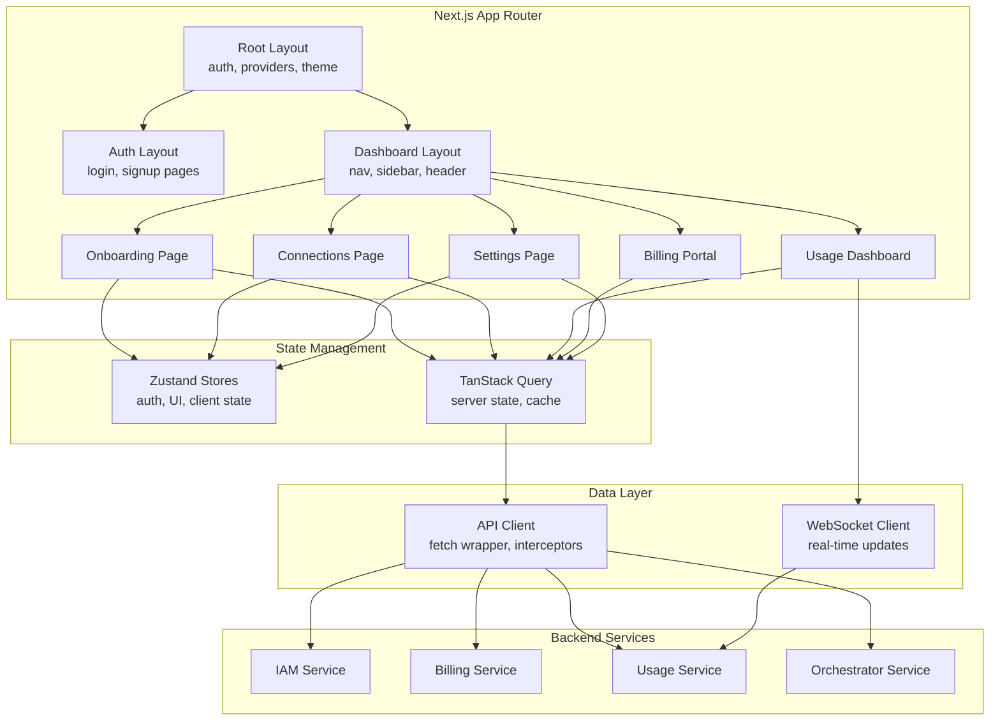
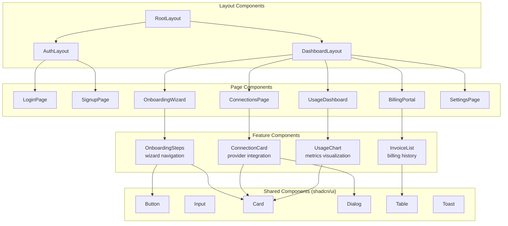
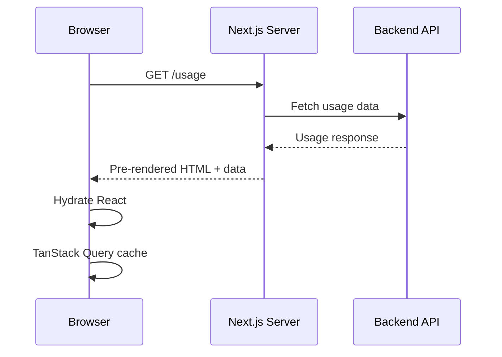
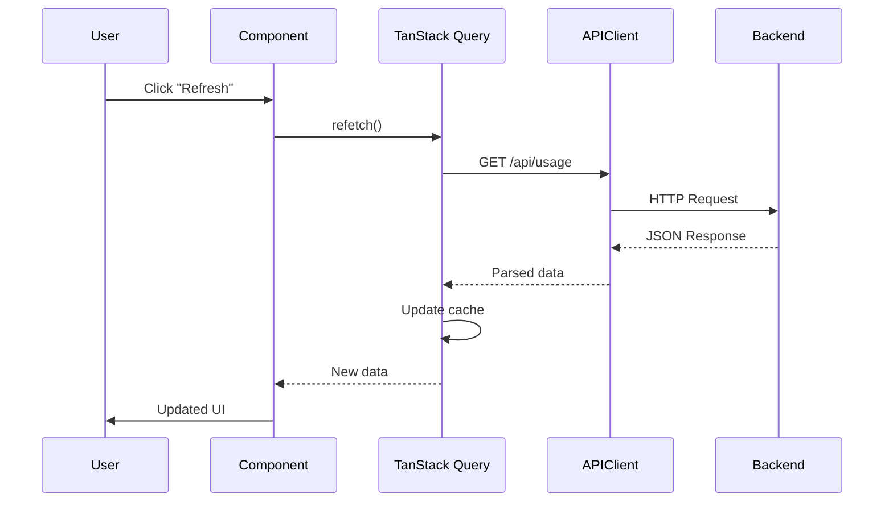
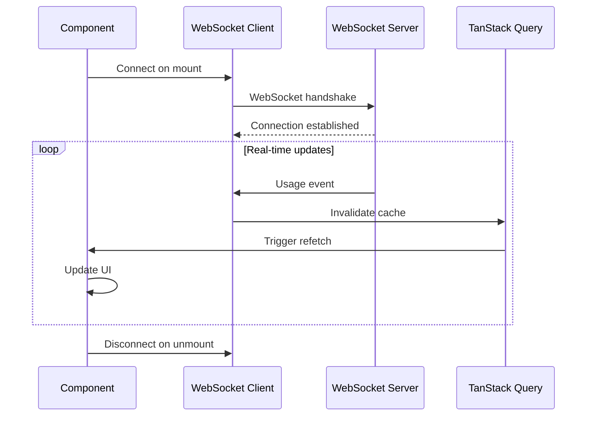

# Portal UI Component — Overview

**Tracker**: Issue #155  
**Related**: [IAM Component](../iam/README.md), [Billing-Usage Component](../billing-usage/README.md), [Payments Component](../payments/README.md)

## Purpose

The Portal UI Component provides the customer-facing web application for the Max AI platform. Built on Next.js 14 with App Router, it delivers a responsive, accessible interface for client onboarding, connection management, usage monitoring, billing, and account settings.

This document defines the architectural approach, component hierarchy, design system integration, and performance strategy for the portal application.

---

## Design Philosophy

### 1. **Progressive Enhancement**
- Server-first rendering with strategic client hydration
- Core functionality works without JavaScript
- Enhanced interactivity layers on top
- Graceful degradation for older browsers

### 2. **Accessibility First**
- WCAG 2.1 AA compliance as baseline
- Semantic HTML structure
- Keyboard navigation support
- Screen reader optimized
- Color contrast validation
- Focus management

### 3. **Performance Budget**
- First Contentful Paint (FCP) < 1.5s
- Time to Interactive (TTI) < 3.5s
- Lighthouse Performance Score ≥ 90
- Core Web Vitals targets:
  - LCP (Largest Contentful Paint) < 2.5s
  - FID (First Input Delay) < 100ms
  - CLS (Cumulative Layout Shift) < 0.1

### 4. **Design System Consistency**
- shadcn/ui component library for base components
- Tailwind CSS for utility-first styling
- Consistent spacing, typography, color system
- Reusable composition patterns
- Theme support (light/dark mode)

### 5. **Type Safety**
- TypeScript 5.x for all code
- Zod schemas for runtime validation
- Type-safe API contracts (DTOs aligned with backend)
- Props interfaces for all components

### 6. **Testability**
- Component isolation for unit testing
- Mock-friendly architecture
- E2E testing support with Playwright
- Accessibility testing with axe-core

---

## Architecture Overview



**Explanation**:
- **Next.js App Router**: File-based routing with nested layouts for auth vs authenticated experiences
- **State Management**: Zustand for client-side state (UI, forms), TanStack Query for server state (data fetching, caching)
- **Data Layer**: Centralized API client with interceptors for auth/errors; WebSocket for live usage metrics
- **Backend Services**: REST APIs for IAM, Billing, Usage, Orchestrator

---

## Component Hierarchy



**Hierarchy Principles**:
- **Layouts**: Provide shared structure (auth shell vs dashboard shell)
- **Pages**: Map to routes, compose feature components
- **Feature Components**: Business logic, data fetching, state management
- **Shared Components**: Reusable UI primitives from shadcn/ui + custom compositions

---

## Layout Structure

### Root Layout (`app/layout.tsx`)
**Responsibilities**:
- Global HTML structure (`<html>`, `<body>`)
- Theme provider (light/dark mode)
- Auth context provider (NextAuth.js session)
- TanStack Query provider (QueryClientProvider)
- Toast notification container
- Global CSS imports

**Example Structure**:
```tsx
export default function RootLayout({ children }: { children: React.ReactNode }) {
  return (
    <html lang="en" suppressHydrationWarning>
      <body className={inter.className}>
        <ThemeProvider attribute="class" defaultTheme="system" enableSystem>
          <AuthProvider>
            <QueryClientProvider client={queryClient}>
              <Toaster />
              {children}
            </QueryClientProvider>
          </AuthProvider>
        </ThemeProvider>
      </body>
    </html>
  )
}
```

### Auth Layout (`app/(auth)/layout.tsx`)
**Responsibilities**:
- Unauthenticated pages (login, signup, password reset)
- Centered card layout with branding
- Redirects authenticated users to dashboard

**Route Group**: `(auth)` — groups routes without affecting URL structure

**Pages**:
- `/login` → `app/(auth)/login/page.tsx`
- `/signup` → `app/(auth)/signup/page.tsx`
- `/forgot-password` → `app/(auth)/forgot-password/page.tsx`

### Dashboard Layout (`app/(dashboard)/layout.tsx`)
**Responsibilities**:
- Authenticated pages (onboarding, connections, usage, billing, settings)
- Navigation sidebar (collapsible on mobile)
- Top header with user menu, notifications
- Breadcrumbs for navigation context
- Auth guard (redirect to login if unauthenticated)

**Route Group**: `(dashboard)` — groups authenticated routes

**Pages**:
- `/onboarding` → `app/(dashboard)/onboarding/page.tsx`
- `/connections` → `app/(dashboard)/connections/page.tsx`
- `/usage` → `app/(dashboard)/usage/page.tsx`
- `/billing` → `app/(dashboard)/billing/page.tsx`
- `/settings` → `app/(dashboard)/settings/page.tsx`

**Layout Example**:
```tsx
export default function DashboardLayout({ children }: { children: React.ReactNode }) {
  return (
    <div className="flex h-screen">
      <Sidebar /> {/* Navigation menu */}
      <div className="flex-1 flex flex-col overflow-hidden">
        <Header /> {/* User menu, notifications */}
        <main className="flex-1 overflow-y-auto p-6">
          <Breadcrumbs />
          {children}
        </main>
      </div>
    </div>
  )
}
```

---

## Design System Integration

### shadcn/ui Component Library
**Philosophy**: Copy components into codebase (not npm dependency) for full customization

**Core Components Used**:
- **Forms**: Button, Input, Select, Checkbox, Radio, Textarea, Label
- **Layout**: Card, Separator, ScrollArea, Sheet (drawer)
- **Feedback**: Alert, Toast, Dialog, Popover, Tooltip
- **Data**: Table, DataTable (with sorting/filtering), Pagination
- **Navigation**: Tabs, Breadcrumbs, Command (search)

**Customization**:
- All components in `src/components/ui/`
- Tailwind variants configured in `tailwind.config.js`
- CSS variables for theming in `globals.css`

### Tailwind CSS Utility Classes
**Spacing Scale**: 4px base unit (e.g., `p-4` = 16px padding)

**Breakpoints**:
- `sm`: 640px (mobile landscape)
- `md`: 768px (tablet)
- `lg`: 1024px (desktop)
- `xl`: 1280px (wide desktop)
- `2xl`: 1536px (ultra-wide)

**Color System**:
- Semantic colors: `primary`, `secondary`, `accent`, `destructive`, `muted`
- CSS variables allow theme switching (light/dark)
- Contrast-checked for WCAG AA compliance

**Typography**:
- Font family: Inter (sans-serif)
- Scale: `text-xs`, `text-sm`, `text-base`, `text-lg`, `text-xl`, `text-2xl`, etc.
- Line height: `leading-tight`, `leading-normal`, `leading-relaxed`

### Theme Support
**Implementation**: `next-themes` library with Tailwind dark mode

**Toggle Mechanism**:
- User preference stored in localStorage
- System preference detection (`prefers-color-scheme`)
- Theme switcher in user menu

**CSS Variables**:
```css
:root {
  --background: 0 0% 100%;
  --foreground: 222.2 84% 4.9%;
  --primary: 221.2 83.2% 53.3%;
  /* ... */
}

.dark {
  --background: 222.2 84% 4.9%;
  --foreground: 210 40% 98%;
  --primary: 217.2 91.2% 59.8%;
  /* ... */
}
```

---

## Responsive Design Strategy

### Mobile-First Approach
- Base styles target mobile (< 640px)
- Progressive enhancement for larger screens
- Touch-friendly targets (min 44px tap area)

### Breakpoint Strategy
- **Mobile (< 768px)**:
  - Single-column layouts
  - Collapsible sidebar (hamburger menu)
  - Stacked cards
  - Simplified charts (smaller datasets)
  
- **Tablet (768px - 1024px)**:
  - Two-column layouts where appropriate
  - Persistent sidebar (narrow)
  - Grid layouts for cards
  
- **Desktop (> 1024px)**:
  - Multi-column layouts
  - Full sidebar with labels
  - Rich data visualizations
  - Side-by-side forms

### Adaptive Components
**Sidebar**: 
- Mobile: Drawer overlay (Sheet component)
- Tablet/Desktop: Persistent sidebar

**Tables**: 
- Mobile: Card-based layout (stacked rows)
- Desktop: Traditional table with columns

**Charts**: 
- Mobile: Simplified single-metric views
- Desktop: Multi-metric dashboards with comparisons

---

## Performance Optimization

### Server-Side Rendering (SSR)
**Default Behavior**: Next.js App Router renders all components on server by default

**Use Cases**:
- Initial page load for SEO
- Auth-protected routes (session verification on server)
- Data-heavy pages (prefetch on server, stream to client)

**Implementation**: 
- Server Components by default (no `"use client"` directive)
- Async components fetch data directly (no loading states)

### Client-Side Hydration
**Use Cases**:
- Interactive components (forms, modals, dropdowns)
- State management (Zustand stores)
- Real-time updates (WebSocket connections)

**Implementation**: 
- Add `"use client"` directive to interactive components
- Minimize client bundle size (tree-shaking, code splitting)

### Code Splitting
**Automatic**:
- Route-based splitting (each page is a separate chunk)
- Dynamic imports for heavy components

**Manual**:
```tsx
const HeavyChart = dynamic(() => import('@/components/HeavyChart'), {
  loading: () => <ChartSkeleton />,
  ssr: false, // Skip SSR for client-only charts
})
```

### Image Optimization
**Next.js Image Component**:
- Automatic format conversion (WebP, AVIF)
- Responsive sizes with `srcset`
- Lazy loading by default
- Blur placeholder for smoother loading

**Implementation**:
```tsx
<Image
  src="/logo.png"
  alt="Company Logo"
  width={200}
  height={50}
  priority // For above-fold images
/>
```

### Caching Strategy
**TanStack Query**:
- Stale-while-revalidate pattern
- Background refetching
- Cache invalidation on mutations
- Optimistic updates for better UX

**Cache Times**:
- User profile: 5 minutes
- Usage metrics: 1 minute (real-time-ish)
- Billing invoices: 10 minutes
- Connection status: 30 seconds

**Example**:
```tsx
const { data: usageMetrics } = useQuery({
  queryKey: ['usage', clientId, period],
  queryFn: () => fetchUsageMetrics(clientId, period),
  staleTime: 60_000, // 1 minute
  refetchInterval: 60_000, // Refresh every minute
})
```

### Bundle Size Optimization
**Strategies**:
- Tree-shaking unused dependencies
- Dynamic imports for heavy libraries (charts, editors)
- Lazy load below-the-fold components
- Use `next/dynamic` for client-only components

**Monitoring**:
- `@next/bundle-analyzer` for bundle inspection
- Lighthouse CI in pull requests
- Core Web Vitals tracking in production

---

## Data Flow Patterns

### Server → Client Data Flow


**Explanation**:
1. User navigates to `/usage`
2. Next.js server fetches data from backend API
3. Server renders HTML with data embedded
4. Browser receives fully-rendered page (fast FCP)
5. React hydrates interactive components
6. TanStack Query initializes cache with server data

### Client-Side Data Flow


**Explanation**:
1. User triggers data refresh
2. Component calls TanStack Query `refetch()`
3. TanStack Query uses API client to fetch data
4. API client adds auth headers, makes request
5. Backend responds with JSON
6. TanStack Query updates cache and notifies component
7. Component re-renders with new data

### Real-Time Updates (WebSocket)


**Explanation**:
1. Component mounts, establishes WebSocket connection
2. Server pushes usage events in real-time
3. WebSocket client invalidates TanStack Query cache
4. Component refetches latest data
5. UI updates with minimal delay (< 1 second)

---

## Error Handling Architecture

### Error Boundaries
**Purpose**: Catch React errors in component tree, prevent full-page crashes

**Implementation**:
```tsx
// app/error.tsx (route-level error boundary)
'use client'

export default function Error({
  error,
  reset,
}: {
  error: Error & { digest?: string }
  reset: () => void
}) {
  return (
    <div className="flex flex-col items-center justify-center min-h-screen">
      <h2 className="text-2xl font-bold mb-4">Something went wrong</h2>
      <Button onClick={() => reset()}>Try again</Button>
    </div>
  )
}
```

### API Error Handling
**Centralized in API Client**:
- 401 Unauthorized → Redirect to login
- 403 Forbidden → Show permission error
- 404 Not Found → Show not found page
- 429 Too Many Requests → Show rate limit message
- 500 Server Error → Show generic error, log to monitoring

**Retry Strategy**:
- Network errors: 3 retries with exponential backoff
- 5xx errors: 2 retries (server might be recovering)
- 4xx errors: No retries (client error, fix required)

### Form Validation Errors
**React Hook Form + Zod**:
- Client-side validation before submission
- Server-side validation errors displayed inline
- Accessible error messages (aria-describedby)

**Example**:
```tsx
const schema = z.object({
  email: z.string().email('Invalid email address'),
  password: z.string().min(8, 'Password must be at least 8 characters'),
})

const { register, handleSubmit, formState: { errors } } = useForm({
  resolver: zodResolver(schema),
})
```

### Toast Notifications
**User Feedback**:
- Success: "Connection added successfully"
- Error: "Failed to update settings. Please try again."
- Warning: "Your trial ends in 3 days"
- Info: "New usage data available"

**Implementation**: shadcn/ui Toast component with `useToast` hook

---

## Security Considerations

### Authentication Flow
- NextAuth.js with JWT strategy
- HTTP-only cookies (no localStorage for tokens)
- CSRF protection via double-submit cookie
- Session expiration: 7 days (configurable)

### Authorization Guards
**Middleware** (`middleware.ts`):
- Verify JWT on every request to protected routes
- Redirect unauthenticated users to `/login`
- Check RBAC permissions for admin routes

**Component-Level**:
- Conditional rendering based on user roles
- API calls include JWT in `Authorization` header

### Content Security Policy (CSP)
**Next.js Config**:
```js
const securityHeaders = [
  {
    key: 'Content-Security-Policy',
    value: "default-src 'self'; script-src 'self' 'unsafe-eval' 'unsafe-inline'; style-src 'self' 'unsafe-inline';",
  },
]
```

### XSS Prevention
- React auto-escapes user input
- Use `dangerouslySetInnerHTML` sparingly (sanitize with DOMPurify if needed)
- Validate all user inputs with Zod schemas

---

## Observability

### Logging
**Client-Side**:
- Error logs sent to monitoring service (e.g., Sentry)
- Performance metrics (Core Web Vitals) tracked
- User actions logged for analytics (opt-in)

**Server-Side**:
- Structured logs with correlation IDs
- Request/response logging in API routes
- Error stack traces captured

### Monitoring
**Metrics**:
- Page load times (FCP, LCP, TTI)
- API response times
- Error rates by route
- User session duration

**Tools**:
- Vercel Analytics (built-in with Next.js deployment)
- Google Analytics (optional, privacy-conscious setup)
- Custom dashboards (Grafana for ops team)

### Feature Flags
**Implementation**: TBD (see Issue #9 for Feature Flags Framework)

**Use Cases**:
- Gradual rollout of new features
- A/B testing for UI changes
- Emergency kill switch for problematic features

---

## Accessibility Standards

### WCAG 2.1 AA Compliance
**Requirements**:
- Color contrast ratio ≥ 4.5:1 for normal text
- Color contrast ratio ≥ 3:1 for large text (18px+)
- All interactive elements keyboard accessible
- Focus indicators visible and clear
- Form labels and error messages associated with inputs
- Alternative text for images
- ARIA attributes where appropriate

### Keyboard Navigation
**Focus Management**:
- Logical tab order (top to bottom, left to right)
- Skip navigation links for screen readers
- Trapped focus in modals/dialogs
- Escape key closes overlays

**Shortcuts** (optional future enhancement):
- `Ctrl+K`: Open command palette
- `Alt+N`: Navigate to next page
- `Alt+P`: Navigate to previous page

### Screen Reader Support
**ARIA Landmarks**:
- `<nav>`: Navigation menus
- `<main>`: Main content area
- `<aside>`: Sidebar
- `<header>`: Page header
- `<footer>`: Page footer

**Live Regions**:
- Toast notifications: `aria-live="polite"`
- Urgent alerts: `aria-live="assertive"`
- Loading states: `aria-busy="true"`

### Testing
**Automated**:
- axe-core integration in Playwright tests
- Lighthouse accessibility audits in CI

**Manual**:
- Keyboard-only navigation testing
- Screen reader testing (NVDA, JAWS, VoiceOver)
- Color blindness simulation

---

## Non-Functional Requirements (NFRs)

### Performance
- **FCP** (First Contentful Paint): < 1.5s
- **LCP** (Largest Contentful Paint): < 2.5s
- **TTI** (Time to Interactive): < 3.5s
- **FID** (First Input Delay): < 100ms
- **CLS** (Cumulative Layout Shift): < 0.1
- **Lighthouse Score**: ≥ 90 (Performance, Accessibility, Best Practices, SEO)

### Scalability
- Handle 10,000 concurrent users
- Graceful degradation under load (cache stale data)
- CDN for static assets
- Edge rendering for global low latency

### Reliability
- Uptime: 99.9% (excluding planned maintenance)
- Error rate: < 0.1% of requests
- Automatic retries for transient failures
- Graceful error messages (no stack traces to users)

### Security
- HTTPS-only (redirect HTTP to HTTPS)
- HTTP-only cookies for session tokens
- CSRF protection on all mutations
- Rate limiting on auth endpoints
- Input validation on all forms

### Browser Support
- **Modern Browsers** (full support):
  - Chrome/Edge (last 2 versions)
  - Firefox (last 2 versions)
  - Safari (last 2 versions)
- **Legacy Browsers** (graceful degradation):
  - IE11: Not supported (show upgrade message)

---

## Related Documentation

- [Portal UI Features](./features.md) — Detailed feature specifications
- [State Management](./state-management.md) — Zustand and TanStack Query strategies
- [Routing](./routing.md) — App Router structure and auth guards
- [Integration](./integration.md) — API client and backend communication
- [IAM Component](../iam/README.md) — Authentication and authorization backend
- [Billing-Usage Component](../billing-usage/README.md) — Usage metrics backend
- [Payments Component](../payments/README.md) — Billing and invoicing backend

---

**Next Steps**:
1. Review and approve architecture approach
2. Define detailed feature specifications in `features.md`
3. Implement state management patterns in `state-management.md`
4. Document routing structure in `routing.md`
5. Specify API integration patterns in `integration.md`
