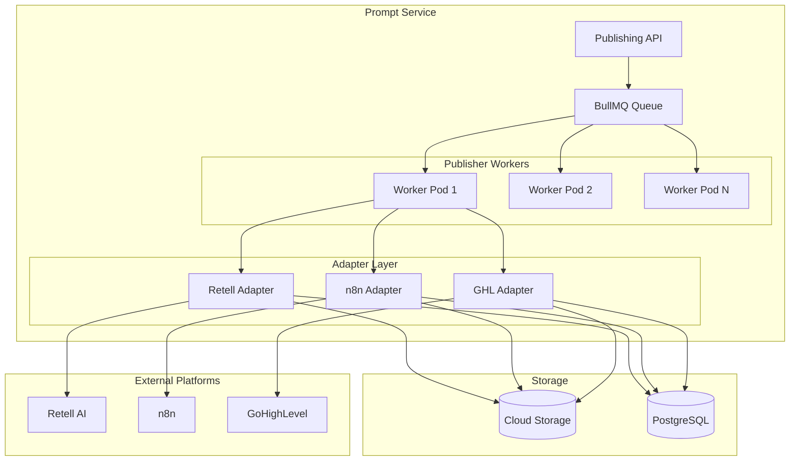
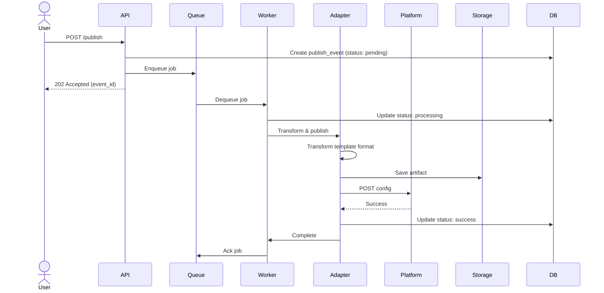

# Prompt Service - Adapter Publishing

**Version**: 1.0  
**Last Updated**: 2025-10-21  
**Status**: Specification  

## Purpose

This document defines the delivery mechanisms for publishing prompt templates to external platforms (Retell AI, n8n, GoHighLevel).

## Architecture Overview



## Publishing Flow

### High-Level Process



### Detailed Steps

**1. Initiation (API Layer)**
```typescript
async publishTemplate(
  templateId: string,
  version: string,
  platform: string,
  config: PlatformConfig
): Promise<PublishEvent> {
  // Validate inputs
  await this.validatePublishRequest(templateId, version, platform);
  
  // Create publish event record
  const event = await this.db.publishEvents.create({
    versionId: version.id,
    platform,
    status: 'pending',
    platformConfig: config,
    publishedBy: currentUser.id
  });
  
  // Enqueue async job
  await this.queue.add('publish-template', {
    eventId: event.id,
    templateId,
    version,
    platform,
    config
  });
  
  return event;
}
```

**2. Job Processing (Worker Layer)**
```typescript
async processPublishJob(job: Job): Promise<void> {
  const { eventId, templateId, version, platform, config } = job.data;
  
  try {
    // Update status
    await this.db.publishEvents.update(eventId, { status: 'processing' });
    
    // Get template data
    const template = await this.templateService.getVersion(templateId, version);
    
    // Select adapter
    const adapter = this.getAdapter(platform);
    
    // Execute publish
    const result = await adapter.publish(template, config);
    
    // Save artifact
    const artifactUrl = await this.storage.save(
      `templates/${templateId}/${version}/${platform}.json`,
      result.artifact
    );
    
    // Update success
    await this.db.publishEvents.update(eventId, {
      status: 'success',
      artifactUrl
    });
    
  } catch (error) {
    // Handle failure
    await this.db.publishEvents.update(eventId, {
      status: 'failed',
      errorDetails: {
        code: error.code,
        message: error.message,
        stack: error.stack
      }
    });
    
    throw error;  // Re-throw for retry mechanism
  }
}
```

**3. Adapter Transformation (Adapter Layer)**
```typescript
interface PublishAdapter {
  platform: string;
  publish(template: TemplateVersion, config: PlatformConfig): Promise<PublishResult>;
  validate(template: TemplateVersion, config: PlatformConfig): Promise<ValidationResult>;
  rollback(eventId: string): Promise<void>;
}

class RetellAdapter implements PublishAdapter {
  async publish(template: TemplateVersion, config: PlatformConfig): Promise<PublishResult> {
    // Transform template to Retell format
    const retellConfig = this.transformToRetellFormat(template, config);
    
    // Validate before sending
    await this.validate(template, config);
    
    // Call Retell API
    const response = await this.retellClient.updateAgent(
      config.agentId,
      retellConfig
    );
    
    return {
      platformId: response.agentId,
      artifact: retellConfig,
      metadata: response
    };
  }
  
  private transformToRetellFormat(template: TemplateVersion, config: PlatformConfig): RetellConfig {
    return {
      agent_id: config.agentId,
      llm_id: config.llmId,
      general_prompt: template.content.systemPrompt,
      task_prompt: template.content.userPrompt,
      voice: config.voice,
      temperature: config.temperature || 0.7,
      max_tokens: config.maxTokens || 500,
      // ... more Retell-specific fields
    };
  }
}
```

## Platform Adapters

### Retell AI Adapter

**Purpose**: Publish voice agent prompts to Retell platform

**Configuration Schema**:
```typescript
interface RetellConfig {
  agentId: string;           // Retell agent ID
  llmId: string;             // LLM model ID (e.g., "gpt-4")
  voice: {
    provider: string;        // "elevenlabs", "azure", "deepgram"
    voiceId: string;         // Voice ID from provider
    speed?: number;          // 0.5 - 2.0
    temperature?: number;    // 0.0 - 1.0
  };
  temperature?: number;      // LLM temperature (default: 0.7)
  maxTokens?: number;        // Max response tokens (default: 500)
  endCallThreshold?: number; // Silence threshold in ms
}
```

**Transformation Logic**:
```typescript
function transformToRetell(template: TemplateVersion, config: RetellConfig): RetellAgentConfig {
  return {
    agent_id: config.agentId,
    llm_id: config.llmId,
    
    // Combine system + user prompts
    general_prompt: template.content.systemPrompt,
    task_prompt: template.content.userPrompt || "",
    
    // Add constraints as rules
    rules: template.content.constraints || [],
    
    // Add examples as few-shot
    few_shot_examples: template.content.examples?.map(ex => ({
      user: ex.user,
      assistant: ex.assistant
    })) || [],
    
    // Voice configuration
    voice: {
      voice_id: config.voice.voiceId,
      provider: config.voice.provider,
      speed: config.voice.speed || 1.0,
      emotion: inferEmotionFromTone(template.content.tone)
    },
    
    // LLM settings
    llm_settings: {
      temperature: config.temperature || 0.7,
      max_tokens: config.maxTokens || 500
    },
    
    // Call settings
    end_call_after_silence_ms: config.endCallThreshold || 3000
  };
}
```

**API Endpoint**:
```
POST https://api.retellai.com/v1/agents/{agent_id}/update
Authorization: Bearer {api_key}
Content-Type: application/json
```

**Error Handling**:
- `400`: Invalid agent config → Retry with validation
- `401`: Invalid API key → Alert admin
- `404`: Agent not found → Return error to user
- `429`: Rate limited → Exponential backoff
- `503`: Service unavailable → Retry with backoff

### n8n Adapter

**Purpose**: Publish workflow templates to n8n automation platform

**Configuration Schema**:
```typescript
interface N8NConfig {
  workflowId: string;        // n8n workflow ID
  nodeId: string;            // Specific node to update (AI Agent node)
  credentials: {
    apiKey: string;
    baseUrl: string;
  };
  deployment?: {
    environment: string;     // "production", "staging"
    autoActivate: boolean;   // Auto-activate after update
  };
}
```

**Transformation Logic**:
```typescript
function transformToN8N(template: TemplateVersion, config: N8NConfig): N8NWorkflowUpdate {
  return {
    id: config.workflowId,
    nodes: [
      {
        id: config.nodeId,
        type: "n8n-nodes-base.openAI",
        parameters: {
          operation: "chat",
          text: template.content.systemPrompt,
          options: {
            temperature: 0.7,
            maxTokens: 500,
            topP: 1,
            // Inject variables as dynamic expressions
            systemMessage: interpolateVariables(
              template.content.systemPrompt,
              template.variables
            )
          }
        }
      }
    ],
    settings: {
      executionOrder: "v1"
    }
  };
}
```

**API Endpoint**:
```
PUT https://{n8n-instance}/api/v1/workflows/{workflow_id}
X-N8N-API-KEY: {api_key}
Content-Type: application/json
```

### GoHighLevel Adapter

**Purpose**: Publish conversation flows to GHL CRM

**Configuration Schema**:
```typescript
interface GHLConfig {
  locationId: string;        // GHL location ID
  conversationProviderId: string; // Conversation provider ID
  webhookUrl?: string;       // Webhook for status updates
  settings?: {
    enableSms: boolean;
    enableEmail: boolean;
    enableChat: boolean;
  };
}
```

**Transformation Logic**:
```typescript
function transformToGHL(template: TemplateVersion, config: GHLConfig): GHLConversationConfig {
  return {
    locationId: config.locationId,
    conversationProviderId: config.conversationProviderId,
    
    // GHL expects a flat prompt structure
    prompt: {
      system: template.content.systemPrompt,
      initial: template.content.userPrompt || "Hello! How can I help you today?",
      rules: template.content.constraints || []
    },
    
    // Channel settings
    channels: {
      sms: config.settings?.enableSms ?? true,
      email: config.settings?.enableEmail ?? true,
      chat: config.settings?.enableChat ?? true
    },
    
    // Webhook for delivery status
    webhooks: config.webhookUrl ? {
      url: config.webhookUrl,
      events: ["message.sent", "message.failed"]
    } : undefined
  };
}
```

**API Endpoint**:
```
POST https://services.leadconnectorhq.com/conversations/providers/{provider_id}/config
Authorization: Bearer {api_key}
Version: 2021-07-28
Content-Type: application/json
```

## Retry & Error Handling

### Retry Strategy

**Exponential Backoff**:
```typescript
const retryConfig = {
  attempts: 5,
  backoff: {
    type: 'exponential',
    delay: 1000,  // 1s, 2s, 4s, 8s, 16s
  },
  retryableErrors: [
    'ECONNREFUSED',
    'ETIMEDOUT',
    'PLATFORM_503',
    'PLATFORM_429'
  ]
};
```

**Retry Logic**:
```typescript
async publishWithRetry(job: Job): Promise<void> {
  let attempt = 0;
  
  while (attempt < retryConfig.attempts) {
    try {
      await this.adapter.publish(job.data);
      return;  // Success
      
    } catch (error) {
      attempt++;
      
      if (!isRetryableError(error) || attempt >= retryConfig.attempts) {
        throw error;  // Give up
      }
      
      const delay = retryConfig.backoff.delay * Math.pow(2, attempt - 1);
      await sleep(delay);
    }
  }
}
```

### Error Classification

| Error Type | Retryable | Action |
|------------|-----------|--------|
| **Network timeout** | ✅ Yes | Retry with backoff |
| **Rate limit (429)** | ✅ Yes | Retry after rate limit reset |
| **Service unavailable (503)** | ✅ Yes | Retry with backoff |
| **Authentication (401)** | ❌ No | Alert admin, fail job |
| **Not found (404)** | ❌ No | Return error to user |
| **Validation (400)** | ❌ No | Return validation errors |
| **Internal error (500)** | ⚠️ Maybe | Retry once, then fail |

### Dead Letter Queue

Failed jobs after max retries go to DLQ:

```typescript
const dlqQueue = new Queue('publish-dlq', {
  defaultJobOptions: {
    removeOnComplete: false,  // Keep for analysis
    removeOnFail: false
  }
});

// Move to DLQ after max retries
job.on('failed', async (job, error) => {
  if (job.attemptsMade >= retryConfig.attempts) {
    await dlqQueue.add('failed-publish', {
      originalJob: job.data,
      error: {
        message: error.message,
        stack: error.stack,
        attempts: job.attemptsMade
      },
      failedAt: new Date()
    });
  }
});
```

## Artifact Storage

### Storage Structure

```
cloud-storage://templates/
├── {template-id}/
│   ├── {version}/
│   │   ├── retell.json       # Retell-formatted artifact
│   │   ├── n8n.json          # n8n-formatted artifact
│   │   ├── ghl.json          # GHL-formatted artifact
│   │   └── metadata.json     # Publish metadata
```

### Artifact Contents

**Example: Retell Artifact**
```json
{
  "platform": "retell",
  "templateId": "uuid",
  "version": "1.2.0",
  "publishedAt": "2025-10-21T10:18:30Z",
  "config": {
    "agent_id": "retell-agent-123",
    "llm_id": "gpt-4",
    "general_prompt": "You are an empathetic customer support agent...",
    "task_prompt": "Customer: {{customerMessage}}",
    "voice": {
      "voice_id": "21m00Tcm4TlvDq8ikWAM",
      "provider": "elevenlabs",
      "speed": 1.0
    },
    "llm_settings": {
      "temperature": 0.7,
      "max_tokens": 500
    }
  },
  "checksum": "sha256:abc123..."
}
```

### Storage Lifecycle

- **Retention**: Indefinite (artifacts are immutable)
- **Versioning**: Enabled (S3/GCS versioning)
- **Access**: Read-only after creation
- **Cleanup**: Never (audit trail requirement)

## Monitoring & Observability

### Metrics

**Publishing Metrics**:
- `publish_jobs_queued_total` - Total jobs queued
- `publish_jobs_processing_total` - Jobs currently processing
- `publish_jobs_success_total` - Successful publishes
- `publish_jobs_failed_total` - Failed publishes
- `publish_duration_seconds` - Publish duration histogram
- `publish_retry_count` - Retry attempts histogram

**Platform-Specific Metrics**:
- `platform_api_requests_total{platform="retell"}` - API calls per platform
- `platform_api_errors_total{platform="retell"}` - API errors per platform
- `platform_api_latency_seconds{platform="retell"}` - API latency per platform

### Logging

**Log Events**:
```json
{
  "level": "info",
  "message": "Publishing template to platform",
  "templateId": "uuid",
  "version": "1.2.0",
  "platform": "retell",
  "eventId": "uuid",
  "attempt": 1,
  "timestamp": "2025-10-21T10:18:30Z"
}
```

**Error Logs**:
```json
{
  "level": "error",
  "message": "Failed to publish template",
  "templateId": "uuid",
  "version": "1.2.0",
  "platform": "retell",
  "eventId": "uuid",
  "attempt": 3,
  "error": {
    "code": "PLATFORM_API_ERROR",
    "message": "Retell API returned 503",
    "statusCode": 503
  },
  "timestamp": "2025-10-21T10:20:15Z"
}
```

### Alerts

**Critical Alerts**:
- DLQ size > 10 items
- Platform API error rate > 5% (5min window)
- Queue depth > 100 jobs (sustained)
- Publishing latency > 30s (p95)

**Warning Alerts**:
- Retry rate > 20%
- Platform API latency > 5s (p95)
- Queue depth > 50 jobs

## Testing Strategy

### Unit Tests

**Adapter Transformation Tests**:
```typescript
describe('RetellAdapter', () => {
  it('transforms template to Retell format', () => {
    const template = createMockTemplate();
    const config = createMockRetellConfig();
    
    const result = retellAdapter.transformToRetellFormat(template, config);
    
    expect(result.agent_id).toBe(config.agentId);
    expect(result.general_prompt).toBe(template.content.systemPrompt);
    expect(result.voice.voice_id).toBe(config.voice.voiceId);
  });
});
```

### Integration Tests

**End-to-End Publishing Tests**:
```typescript
describe('Publishing Flow', () => {
  it('publishes template to Retell successfully', async () => {
    const template = await createTestTemplate();
    const config = {
      agentId: 'test-agent-123',
      llmId: 'gpt-4',
      voice: { provider: 'elevenlabs', voiceId: 'test-voice' }
    };
    
    const event = await publishingService.publish(
      template.id,
      template.currentVersion,
      'retell',
      config
    );
    
    // Wait for async job completion
    await waitForJobCompletion(event.id);
    
    // Verify publish event
    const updatedEvent = await getPublishEvent(event.id);
    expect(updatedEvent.status).toBe('success');
    expect(updatedEvent.artifactUrl).toBeDefined();
    
    // Verify artifact in storage
    const artifact = await storage.get(updatedEvent.artifactUrl);
    expect(artifact).toBeDefined();
  });
});
```

### Mock Platform APIs

For testing without hitting real platform APIs:

```typescript
class MockRetellClient implements RetellClient {
  async updateAgent(agentId: string, config: RetellConfig): Promise<RetellResponse> {
    // Simulate API delay
    await sleep(100);
    
    // Return mock success
    return {
      agentId,
      status: 'updated',
      updatedAt: new Date()
    };
  }
}
```

## Security Considerations

### API Key Management

- Store platform API keys in secret manager (GCP Secret Manager, AWS Secrets Manager)
- Rotate keys quarterly
- Use separate keys per environment (dev, staging, prod)
- Never log API keys

### Artifact Security

- Artifacts may contain sensitive prompt logic
- Restrict access to authorized users only
- Enable audit logging on storage bucket
- Encrypt artifacts at rest (cloud storage default encryption)

### Rate Limiting

- Respect platform rate limits
- Implement circuit breaker pattern
- Queue requests during rate limit periods

## Related Documentation

- [Overview](./overview.md) - Component architecture
- [Data Model](./data-model.md) - publish_events schema
- [API Contracts](./api-contracts.md) - Publishing endpoints
- [Versioning](./versioning.md) - Version management
- [Validation](./validation.md) - Pre-publish validation
