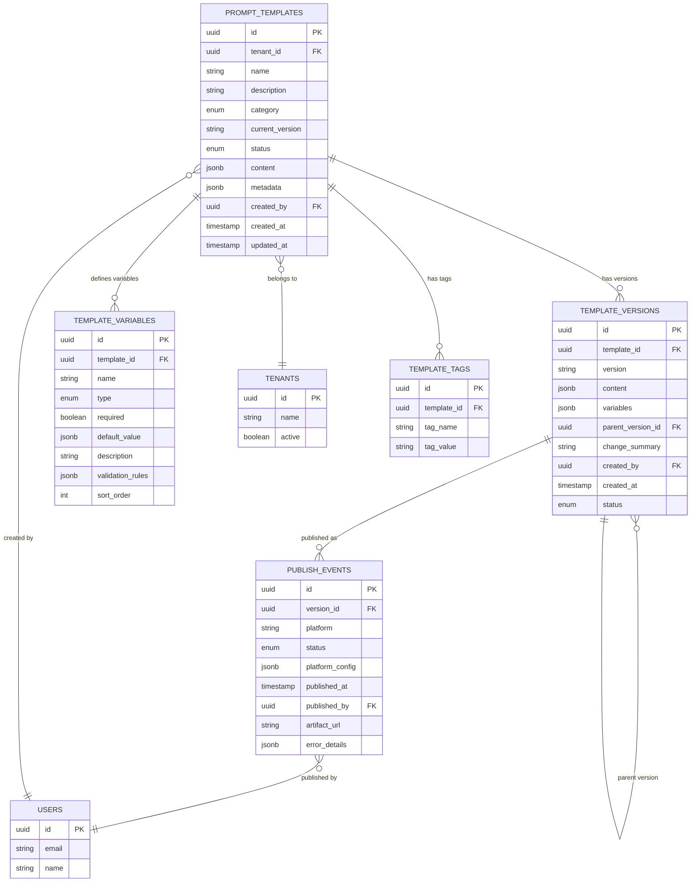

# Prompt Service - Data Model

**Version**: 1.0  
**Last Updated**: 2025-10-21  
**Status**: Specification  

## Purpose

This document defines the database schema, entity relationships, and data access patterns for the Prompt Service component.

## Entity Relationship Diagram



## Table Specifications

### prompt_templates

**Purpose**: Master table for prompt templates

| Column | Type | Constraints | Description |
|--------|------|-------------|-------------|
| id | UUID | PK, NOT NULL | Unique template identifier |
| tenant_id | UUID | FK, NOT NULL, INDEX | Multi-tenancy isolation |
| name | VARCHAR(255) | NOT NULL | Human-readable template name |
| description | TEXT | NULL | Purpose and usage description |
| category | ENUM | NOT NULL, INDEX | system, campaign, support, sales |
| current_version | VARCHAR(20) | NOT NULL | Active semantic version (e.g., "1.2.3") |
| status | ENUM | NOT NULL, INDEX | draft, active, archived |
| content | JSONB | NOT NULL | Current template content |
| metadata | JSONB | NULL | Tags, labels, custom fields |
| created_by | UUID | FK, NOT NULL | User who created template |
| created_at | TIMESTAMP | NOT NULL, DEFAULT NOW() | Creation timestamp |
| updated_at | TIMESTAMP | NOT NULL, DEFAULT NOW() | Last update timestamp |

**Indexes**:
- PRIMARY KEY (id)
- INDEX idx_tenant_status ON (tenant_id, status)
- INDEX idx_category ON (category)
- INDEX idx_created_at ON (created_at DESC)
- UNIQUE INDEX idx_tenant_name ON (tenant_id, name) WHERE status != 'archived'

**Content JSON Schema**:
```json
{
  "systemPrompt": "string (required)",
  "userPrompt": "string (optional)",
  "assistantPrompt": "string (optional)",
  "examples": [
    {
      "user": "string",
      "assistant": "string"
    }
  ],
  "constraints": ["string"],
  "tone": "string (professional, friendly, formal, casual)"
}
```

### template_versions

**Purpose**: Version history for templates

| Column | Type | Constraints | Description |
|--------|------|-------------|-------------|
| id | UUID | PK, NOT NULL | Unique version identifier |
| template_id | UUID | FK, NOT NULL, INDEX | Parent template |
| version | VARCHAR(20) | NOT NULL | Semantic version (major.minor.patch) |
| content | JSONB | NOT NULL | Template content snapshot |
| variables | JSONB | NOT NULL | Variable definitions snapshot |
| parent_version_id | UUID | FK, NULL | Previous version (for diff) |
| change_summary | TEXT | NULL | Human-readable changes |
| created_by | UUID | FK, NOT NULL | User who created version |
| created_at | TIMESTAMP | NOT NULL, DEFAULT NOW() | Version creation timestamp |
| status | ENUM | NOT NULL | draft, published, deprecated |

**Indexes**:
- PRIMARY KEY (id)
- UNIQUE INDEX idx_template_version ON (template_id, version)
- INDEX idx_parent_version ON (parent_version_id)
- INDEX idx_created_at ON (created_at DESC)

**Variables JSON Schema**:
```json
[
  {
    "name": "string",
    "type": "string | number | boolean | date | object",
    "required": boolean,
    "defaultValue": "any",
    "description": "string",
    "validationRules": {
      "minLength": number,
      "maxLength": number,
      "pattern": "regex",
      "enum": ["value1", "value2"]
    }
  }
]
```

### template_variables

**Purpose**: Variable definitions for templates

| Column | Type | Constraints | Description |
|--------|------|-------------|-------------|
| id | UUID | PK, NOT NULL | Unique variable identifier |
| template_id | UUID | FK, NOT NULL, INDEX | Parent template |
| name | VARCHAR(100) | NOT NULL | Variable name (camelCase) |
| type | ENUM | NOT NULL | string, number, boolean, date, object |
| required | BOOLEAN | NOT NULL, DEFAULT false | Is this variable mandatory? |
| default_value | JSONB | NULL | Default value if not provided |
| description | TEXT | NULL | Human-readable description |
| validation_rules | JSONB | NULL | JSON schema validation |
| sort_order | INTEGER | NOT NULL, DEFAULT 0 | Display order in UI |

**Indexes**:
- PRIMARY KEY (id)
- UNIQUE INDEX idx_template_variable_name ON (template_id, name)
- INDEX idx_template_id ON (template_id)

**Validation Rules JSON Schema**:
```json
{
  "minLength": number,
  "maxLength": number,
  "pattern": "regex string",
  "min": number,
  "max": number,
  "enum": ["value1", "value2"],
  "format": "email | url | uuid | date-time"
}
```

### publish_events

**Purpose**: Audit trail of template publishing

| Column | Type | Constraints | Description |
|--------|------|-------------|-------------|
| id | UUID | PK, NOT NULL | Unique event identifier |
| version_id | UUID | FK, NOT NULL, INDEX | Template version published |
| platform | VARCHAR(50) | NOT NULL, INDEX | retell, n8n, gohighlevel |
| status | ENUM | NOT NULL, INDEX | pending, success, failed |
| platform_config | JSONB | NULL | Platform-specific config |
| published_at | TIMESTAMP | NOT NULL, DEFAULT NOW() | Publish timestamp |
| published_by | UUID | FK, NOT NULL | User who triggered publish |
| artifact_url | TEXT | NULL | Cloud storage URL |
| error_details | JSONB | NULL | Error info if failed |

**Indexes**:
- PRIMARY KEY (id)
- INDEX idx_version_platform ON (version_id, platform)
- INDEX idx_status ON (status)
- INDEX idx_published_at ON (published_at DESC)

**Platform Config JSON Schema** (Retell example):
```json
{
  "agentId": "string",
  "llmId": "string",
  "voice": {
    "provider": "elevenlabs",
    "voiceId": "string"
  },
  "temperature": number,
  "maxTokens": number
}
```

### template_tags

**Purpose**: Flexible tagging system for templates

| Column | Type | Constraints | Description |
|--------|------|-------------|-------------|
| id | UUID | PK, NOT NULL | Unique tag identifier |
| template_id | UUID | FK, NOT NULL, INDEX | Parent template |
| tag_name | VARCHAR(100) | NOT NULL, INDEX | Tag namespace (e.g., "env", "team") |
| tag_value | VARCHAR(255) | NOT NULL | Tag value (e.g., "production", "sales") |

**Indexes**:
- PRIMARY KEY (id)
- UNIQUE INDEX idx_template_tag ON (template_id, tag_name, tag_value)
- INDEX idx_tag_name_value ON (tag_name, tag_value)

## Query Patterns

### 1. List Active Templates by Category
```sql
SELECT 
  pt.id,
  pt.name,
  pt.description,
  pt.category,
  pt.current_version,
  pt.updated_at,
  u.name as created_by_name
FROM prompt_templates pt
INNER JOIN users u ON pt.created_by = u.id
WHERE pt.tenant_id = :tenantId
  AND pt.status = 'active'
  AND pt.category = :category
ORDER BY pt.updated_at DESC
LIMIT 20 OFFSET :offset;
```

**Index Used**: `idx_tenant_status`

### 2. Get Template with Current Version
```sql
SELECT 
  pt.*,
  tv.content as version_content,
  tv.variables,
  tv.created_at as version_created_at
FROM prompt_templates pt
INNER JOIN template_versions tv 
  ON pt.template_id = tv.template_id 
  AND tv.version = pt.current_version
WHERE pt.id = :templateId
  AND pt.tenant_id = :tenantId;
```

**Index Used**: `PRIMARY KEY (id)`, `idx_template_version`

### 3. Get Version History
```sql
SELECT 
  tv.id,
  tv.version,
  tv.change_summary,
  tv.created_at,
  tv.status,
  u.name as created_by_name,
  COUNT(pe.id) as publish_count
FROM template_versions tv
INNER JOIN users u ON tv.created_by = u.id
LEFT JOIN publish_events pe ON tv.id = pe.version_id
WHERE tv.template_id = :templateId
GROUP BY tv.id, tv.version, tv.change_summary, tv.created_at, tv.status, u.name
ORDER BY tv.created_at DESC;
```

**Index Used**: `idx_template_version`, `idx_version_platform`

### 4. Get Publishing History by Platform
```sql
SELECT 
  pe.id,
  pe.platform,
  pe.status,
  pe.published_at,
  pe.artifact_url,
  pe.error_details,
  tv.version,
  u.name as published_by_name
FROM publish_events pe
INNER JOIN template_versions tv ON pe.version_id = tv.id
INNER JOIN users u ON pe.published_by = u.id
WHERE tv.template_id = :templateId
  AND pe.platform = :platform
ORDER BY pe.published_at DESC
LIMIT 50;
```

**Index Used**: `idx_version_platform`, `idx_published_at`

### 5. Search Templates by Tag
```sql
SELECT DISTINCT
  pt.id,
  pt.name,
  pt.description,
  pt.category,
  pt.current_version
FROM prompt_templates pt
INNER JOIN template_tags tt ON pt.id = tt.template_id
WHERE pt.tenant_id = :tenantId
  AND pt.status = 'active'
  AND tt.tag_name = :tagName
  AND tt.tag_value = :tagValue
ORDER BY pt.name ASC;
```

**Index Used**: `idx_tenant_status`, `idx_tag_name_value`

### 6. Get Template with Variables
```sql
SELECT 
  pt.id,
  pt.name,
  pt.content,
  json_agg(
    json_build_object(
      'name', tv.name,
      'type', tv.type,
      'required', tv.required,
      'defaultValue', tv.default_value,
      'description', tv.description,
      'validationRules', tv.validation_rules
    ) ORDER BY tv.sort_order
  ) as variables
FROM prompt_templates pt
LEFT JOIN template_variables tv ON pt.id = tv.template_id
WHERE pt.id = :templateId
  AND pt.tenant_id = :tenantId
GROUP BY pt.id, pt.name, pt.content;
```

**Index Used**: `PRIMARY KEY (id)`, `idx_template_id`

### 7. Failed Publishing Events (Retry Queue)
```sql
SELECT 
  pe.id,
  pe.version_id,
  pe.platform,
  pe.published_at,
  pe.error_details,
  pt.name as template_name,
  tv.version
FROM publish_events pe
INNER JOIN template_versions tv ON pe.version_id = tv.id
INNER JOIN prompt_templates pt ON tv.template_id = pt.id
WHERE pe.status = 'failed'
  AND pe.published_at > NOW() - INTERVAL '24 hours'
ORDER BY pe.published_at ASC
LIMIT 100;
```

**Index Used**: `idx_status`, `idx_published_at`

## Migration Strategy

### Phase 1: Initial Schema (v1.0.0)
```sql
-- Create tables in dependency order
CREATE TABLE prompt_templates (...);
CREATE TABLE template_versions (...);
CREATE TABLE template_variables (...);
CREATE TABLE publish_events (...);
CREATE TABLE template_tags (...);

-- Create indexes
CREATE INDEX ...;

-- Create foreign keys
ALTER TABLE template_versions 
  ADD CONSTRAINT fk_template 
  FOREIGN KEY (template_id) 
  REFERENCES prompt_templates(id) 
  ON DELETE CASCADE;
```

### Phase 2: Add Partitioning (v2.0.0)
```sql
-- Partition publish_events by month
ALTER TABLE publish_events 
  PARTITION BY RANGE (published_at);

CREATE TABLE publish_events_2025_10 
  PARTITION OF publish_events
  FOR VALUES FROM ('2025-10-01') TO ('2025-11-01');

-- Auto-create partitions via cron or partition manager
```

### Phase 3: Add Soft Delete (v3.0.0)
```sql
-- Add deleted_at columns
ALTER TABLE prompt_templates 
  ADD COLUMN deleted_at TIMESTAMP NULL;

ALTER TABLE template_versions 
  ADD COLUMN deleted_at TIMESTAMP NULL;

-- Update indexes to exclude deleted
CREATE INDEX idx_tenant_status_active 
  ON prompt_templates(tenant_id, status) 
  WHERE deleted_at IS NULL;
```

## Data Retention Policy

| Entity | Retention Period | Strategy |
|--------|------------------|----------|
| **Active Templates** | Indefinite | Keep until explicitly deleted |
| **Archived Templates** | 2 years | Soft delete, purge after 2 years |
| **Template Versions** | All versions | Keep all (immutable) |
| **Publish Events** | 7 years | Partition by month, archive old partitions |
| **Template Tags** | Tied to template | Cascade delete with template |

## Cache Strategy

### Redis Cache Keys
```
prompt:template:{tenantId}:{templateId}          # TTL: 5 minutes
prompt:version:{templateId}:{version}            # TTL: 1 hour (immutable)
prompt:variables:{templateId}                    # TTL: 10 minutes
prompt:list:{tenantId}:{category}:{status}:page:{n}  # TTL: 2 minutes
```

### Cache Invalidation
- **On template update**: Invalidate `prompt:template:*`, `prompt:list:*`
- **On version create**: No invalidation (new key)
- **On variable change**: Invalidate `prompt:variables:*`
- **On publish**: No cache impact (write-only event)

### Cache-Aside Pattern
```typescript
async getTemplate(tenantId: string, templateId: string): Promise<Template> {
  const cacheKey = `prompt:template:${tenantId}:${templateId}`;
  
  // Try cache first
  const cached = await redis.get(cacheKey);
  if (cached) return JSON.parse(cached);
  
  // Cache miss - query database
  const template = await db.query(...);
  
  // Store in cache
  await redis.setex(cacheKey, 300, JSON.stringify(template));
  
  return template;
}
```

## Backup & Recovery

### Backup Strategy
- **PostgreSQL**: Daily full backups, 15-minute WAL archiving
- **Point-in-Time Recovery**: 30-day window
- **Cloud Storage**: Versioned artifacts (no expiration)

### Disaster Recovery
- **RTO**: 4 hours (restore from backup)
- **RPO**: 15 minutes (WAL archives)
- **Procedure**:
  1. Restore PostgreSQL from latest backup
  2. Replay WAL archives to target point
  3. Verify data integrity
  4. Reconnect application

## Performance Optimization

### Index Tuning
- Monitor slow queries via `pg_stat_statements`
- Add indexes for common filter combinations
- Avoid over-indexing (write penalty)

### Query Optimization
- Use `EXPLAIN ANALYZE` for query plans
- Avoid N+1 queries (use joins or batch loading)
- Paginate large result sets

### Connection Pooling
- PgBouncer or TypeORM connection pool
- Pool size: 10-20 connections per instance
- Idle timeout: 60 seconds

## Related Documentation

- [Overview](./overview.md) - Component architecture
- [API Contracts](./api-contracts.md) - REST endpoints
- [Versioning](./versioning.md) - Version strategy
- [Publishing](./adapter-publishing.md) - Delivery mechanisms
- [Validation](./validation.md) - Template validation
