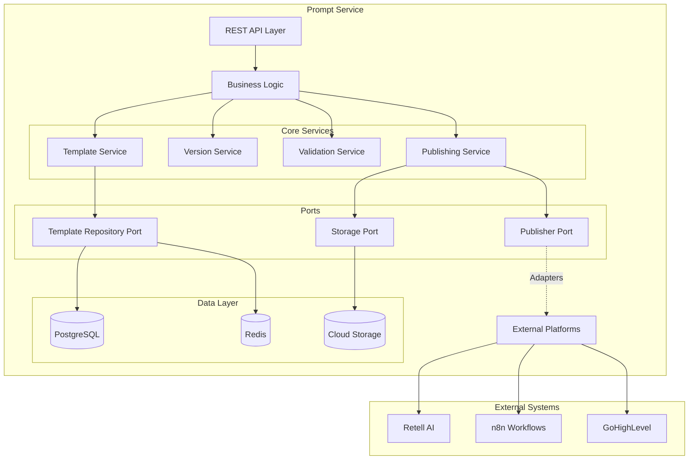
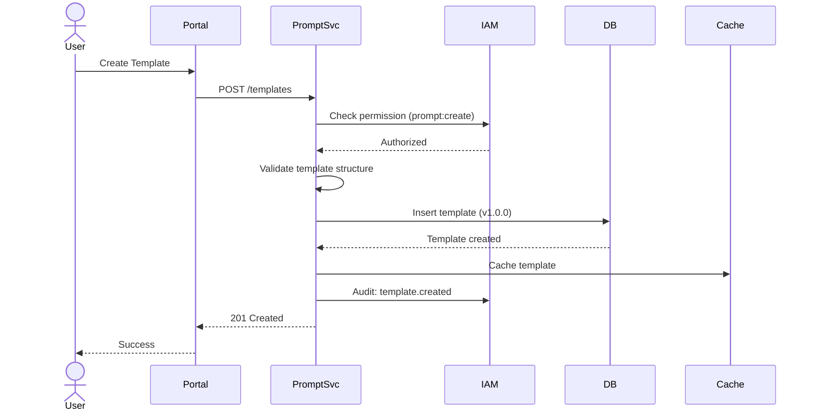
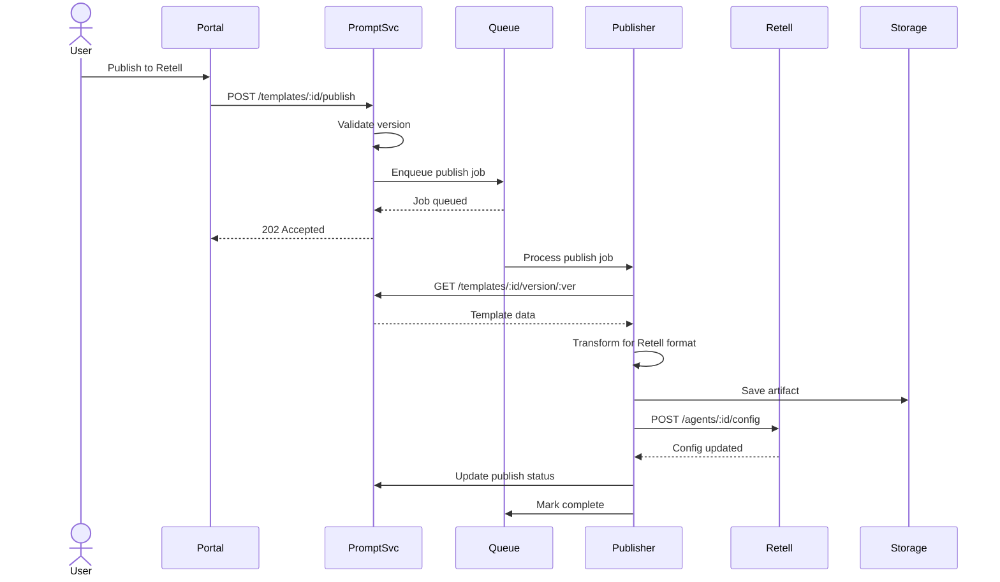

# Prompt Service - Component Overview

**Version**: 1.0  
**Last Updated**: 2025-10-21  
**Status**: Specification  

## Purpose

The Prompt Service manages declarative prompt templates that define AI agent behavior and conversation flows. It provides versioned template management, variable substitution, and delivery mechanisms to external platforms (Retell AI, n8n, GoHighLevel).

## Component Architecture



## Component Responsibilities

### Template Service
**Responsibility**: Manage prompt template lifecycle

**Capabilities**:
- Create, read, update, delete (CRUD) prompt templates
- Template categorization (system, campaign, support, sales)
- Template metadata management (name, description, tags)
- Template search and filtering
- Template duplication and cloning

**Dependencies**:
- Template Repository Port
- Validation Service (for template validation)
- IAM Service (for permission checks)

### Version Service
**Responsibility**: Manage template versioning and history

**Capabilities**:
- Semantic versioning (major.minor.patch)
- Version creation and tagging
- Version comparison and diff generation
- Rollback to previous versions
- Version history tracking
- Draft/staging/production promotion

**Dependencies**:
- Template Repository Port
- Storage Port (for version artifacts)

### Validation Service
**Responsibility**: Validate template structure and variables

**Capabilities**:
- JSON schema validation
- Variable reference validation
- Required field validation
- Type checking
- Circular dependency detection
- Variable substitution testing

**Dependencies**:
- Template Repository Port (for variable lookup)

### Publishing Service
**Responsibility**: Deliver templates to external platforms

**Capabilities**:
- Platform-specific formatting
- Batch publishing
- Rollout management (canary, blue-green)
- Publishing verification
- Rollback capabilities
- Delivery audit trail

**Dependencies**:
- Publisher Port (adapters for each platform)
- Storage Port (for artifacts)
- Audit Service (via IAM)

## Technology Stack

| Layer | Technology | Purpose |
|-------|-----------|---------|
| **Runtime** | Node.js 18+ | JavaScript runtime |
| **Framework** | NestJS | Application framework, DI, middleware |
| **Language** | TypeScript 5+ | Type-safe development |
| **Database** | PostgreSQL 15+ | Primary data store |
| **ORM** | TypeORM | Entity mapping, migrations |
| **Cache** | Redis 7+ | Template caching, session cache |
| **Queue** | BullMQ | Async publishing jobs |
| **Storage** | GCS/S3 | Template artifacts, version snapshots |
| **API** | REST (JSON) | External API interface |
| **Validation** | JSON Schema, Joi | Input/template validation |

## Integration Points

### Inbound Dependencies

| Source | Purpose | Protocol |
|--------|---------|----------|
| **Portal UI** | Template management interface | REST API |
| **IAM Service** | Authentication, authorization | REST API |
| **Orchestrator** | Template retrieval for flow execution | REST API, Event |

### Outbound Dependencies

| Target | Purpose | Protocol |
|--------|---------|----------|
| **Retell AI** | Publish voice agent prompts | REST API |
| **n8n** | Publish workflow templates | REST API |
| **GoHighLevel** | Publish conversation flows | REST API, Webhook |
| **PostgreSQL** | Data persistence | TCP (5432) |
| **Redis** | Caching | TCP (6379) |
| **Cloud Storage** | Artifact storage | HTTPS (API) |
| **IAM Service** | Audit trail | REST API |

## Data Flow Diagrams

### Template Creation Flow



### Template Publishing Flow



## Template Structure

### Template Entity Schema
```typescript
interface PromptTemplate {
  id: string;                    // UUID
  tenantId: string;              // Multi-tenancy
  name: string;                  // Human-readable name
  description: string;           // Purpose description
  category: TemplateCategory;    // system | campaign | support | sales
  version: string;               // Semantic version (major.minor.patch)
  status: TemplateStatus;        // draft | active | archived
  content: TemplateContent;      // Actual prompt content
  variables: VariableDefinition[]; // Variable metadata
  metadata: Record<string, any>; // Tags, labels, custom fields
  createdAt: Date;
  updatedAt: Date;
  createdBy: string;             // User ID
  publishedAt?: Date;
  publishedBy?: string;
}

interface TemplateContent {
  systemPrompt: string;          // Base system instructions
  userPrompt?: string;           // User-facing prompt template
  assistantPrompt?: string;      // Assistant response template
  examples?: ConversationExample[]; // Few-shot examples
  constraints?: string[];        // Behavioral constraints
  tone?: string;                 // Conversation tone guidance
}

interface VariableDefinition {
  name: string;                  // Variable name (e.g., "customerName")
  type: VariableType;            // string | number | boolean | date | object
  required: boolean;             // Is this variable mandatory?
  defaultValue?: any;            // Default if not provided
  description?: string;          // Human-readable description
  validationRules?: ValidationRule[]; // JSON schema rules
}
```

## Non-Functional Requirements

| Aspect | Target | Measurement |
|--------|--------|-------------|
| **Availability** | 99.9% | Uptime monitoring |
| **Latency (Read)** | p95 < 100ms | Template retrieval |
| **Latency (Write)** | p95 < 500ms | Template creation/update |
| **Latency (Publish)** | p95 < 5s | Async publishing job |
| **Throughput** | 100 req/s | Template operations |
| **Cache Hit Rate** | > 90% | Redis metrics |
| **Storage** | < 1MB per template | Size limits |
| **Concurrent Users** | 100+ | Portal users |

## Security & Compliance

### Authentication & Authorization
- **Authentication**: OAuth 2.0 via IAM Service (session tokens)
- **Authorization**: RBAC with template-level permissions
  - `prompt:read` - View templates
  - `prompt:create` - Create templates
  - `prompt:update` - Edit templates
  - `prompt:delete` - Delete templates
  - `prompt:publish` - Publish to external platforms
  - `prompt:version` - Manage versions

### Data Protection
- **Encryption at Rest**: PostgreSQL TDE, Cloud Storage encryption
- **Encryption in Transit**: TLS 1.3 for all API calls
- **PII Handling**: Template content may contain PII variables; mask in logs
- **Secret Management**: API keys for external platforms in secret manager

### Audit Trail
- Template lifecycle events (create, update, delete, publish)
- Version changes and rollbacks
- Publishing events (platform, version, timestamp)
- Access logs (who viewed/modified which templates)
- Retention: 7 years (per audit.md requirements)

## Observability

### Logging
- **Structured Logs**: JSON format with correlation IDs
- **Log Levels**: DEBUG (variable substitution), INFO (lifecycle), WARN (validation), ERROR (failures)
- **Key Events**:
  - Template CRUD operations
  - Version creation/rollback
  - Validation failures
  - Publishing successes/failures

### Metrics
- Template count by status (draft, active, archived)
- Version count per template
- Publish success/failure rates
- Cache hit/miss rates
- API latency (p50, p95, p99)
- Queue depth (pending publish jobs)

### Tracing
- Distributed tracing with OpenTelemetry
- Trace template retrieval through variable substitution
- Trace publishing flow across adapters

## Error Handling

| Error Scenario | HTTP Status | Recovery Strategy |
|---------------|-------------|-------------------|
| Template not found | 404 | Return structured error |
| Validation failed | 400 | Return validation errors |
| Unauthorized | 403 | Redirect to IAM |
| Version conflict | 409 | Return current version |
| External platform error | 502 | Retry with exponential backoff |
| Storage unavailable | 503 | Queue for later, return accepted |

## Scalability Considerations

### Horizontal Scaling
- **Stateless API**: Scale API pods independently
- **Queue Workers**: Scale publisher workers based on queue depth
- **Cache**: Redis cluster for distributed caching

### Database Optimization
- **Indexes**: tenant_id, version, status, category
- **Partitioning**: By tenant_id for large installations
- **Read Replicas**: For high read workloads

### Caching Strategy
- **Template Cache**: TTL 5 minutes, invalidate on update
- **Version Cache**: TTL 1 hour, immutable once published
- **Variable Cache**: TTL 10 minutes

## Deployment Architecture

### Development Environment
- Single pod
- PostgreSQL (shared dev instance)
- Redis (shared dev instance)

### Production Environment
- 3+ API pods (auto-scaling)
- 2+ publisher worker pods
- PostgreSQL cluster (primary + replica)
- Redis cluster (3-node)
- Cloud Storage bucket

## Migration Strategy

### Phase 1: MVP
- Core template CRUD
- Version management (basic)
- Single publisher (Retell AI)
- File-based storage

### Phase 2: Enhanced
- Multi-platform publishing (n8n, GHL)
- Advanced versioning (diffs, rollback)
- Cloud storage migration
- Enhanced caching

### Phase 3: Enterprise
- Template marketplace
- Collaboration features
- A/B testing
- Analytics integration

## Related Documentation

- [Data Model](./data-model.md) - Database schema, ERD, relationships
- [API Contracts](./api-contracts.md) - REST endpoints, request/response schemas
- [Versioning](./versioning.md) - Version strategy, rollout, diff management
- [Publishing](./adapter-publishing.md) - Delivery to external platforms
- [Validation](./validation.md) - Template validation rules
- [Implementation Spec](../impl/phase-1/prompt-svc.md) - Phase 1 implementation
