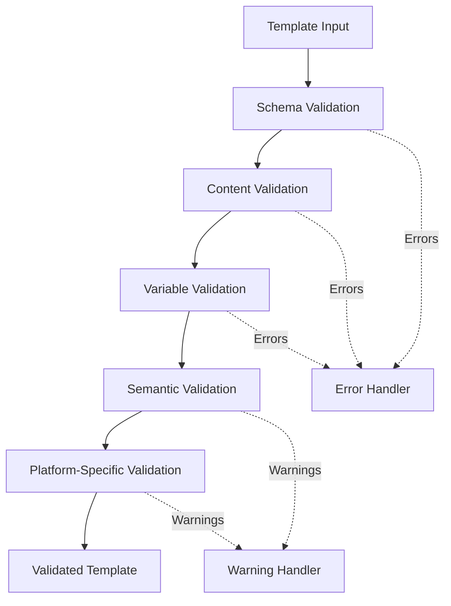

# Prompt Service - Validation Rules

**Version**: 1.0  
**Last Updated**: 2025-10-21  
**Status**: Specification  

## Purpose

This document defines template validation rules, variable substitution logic, and quality checks for prompt templates.

## Validation Layers



## Layer 1: Schema Validation

### Template Schema

**JSON Schema** for template structure:

```json
{
  "$schema": "http://json-schema.org/draft-07/schema#",
  "type": "object",
  "required": ["name", "category", "content"],
  "properties": {
    "name": {
      "type": "string",
      "minLength": 3,
      "maxLength": 255,
      "pattern": "^[a-zA-Z0-9 -]+$"
    },
    "description": {
      "type": "string",
      "maxLength": 1000
    },
    "category": {
      "type": "string",
      "enum": ["system", "campaign", "support", "sales"]
    },
    "content": {
      "type": "object",
      "required": ["systemPrompt"],
      "properties": {
        "systemPrompt": {
          "type": "string",
          "minLength": 10,
          "maxLength": 10000
        },
        "userPrompt": {
          "type": "string",
          "maxLength": 5000
        },
        "assistantPrompt": {
          "type": "string",
          "maxLength": 1000
        },
        "examples": {
          "type": "array",
          "maxItems": 20,
          "items": {
            "type": "object",
            "required": ["user", "assistant"],
            "properties": {
              "user": {"type": "string", "maxLength": 500},
              "assistant": {"type": "string", "maxLength": 1000}
            }
          }
        },
        "constraints": {
          "type": "array",
          "maxItems": 50,
          "items": {"type": "string", "maxLength": 500}
        },
        "tone": {
          "type": "string",
          "enum": ["professional", "friendly", "formal", "casual"]
        }
      }
    },
    "variables": {
      "type": "array",
      "maxItems": 50,
      "items": {
        "type": "object",
        "required": ["name", "type"],
        "properties": {
          "name": {
            "type": "string",
            "pattern": "^[a-zA-Z][a-zA-Z0-9]*$"
          },
          "type": {
            "type": "string",
            "enum": ["string", "number", "boolean", "date", "object"]
          },
          "required": {"type": "boolean"},
          "defaultValue": {},
          "description": {"type": "string", "maxLength": 500},
          "validationRules": {"type": "object"}
        }
      }
    }
  }
}
```

### Validation Implementation

```typescript
import Ajv from 'ajv';

class SchemaValidator {
  private ajv: Ajv;
  
  constructor() {
    this.ajv = new Ajv({
      allErrors: true,
      strict: true,
      validateFormats: true
    });
  }
  
  validate(template: any): ValidationResult {
    const valid = this.ajv.validate(TEMPLATE_SCHEMA, template);
    
    if (!valid) {
      return {
        valid: false,
        errors: this.ajv.errors.map(err => ({
          field: err.instancePath || err.schemaPath,
          message: err.message,
          severity: 'error'
        }))
      };
    }
    
    return { valid: true, errors: [] };
  }
}
```

## Layer 2: Content Validation

### Rules

#### Rule 1: Prompt Length Limits

**Purpose**: Ensure prompts fit within platform token limits

```typescript
const CONTENT_LIMITS = {
  systemPrompt: {
    min: 10,
    max: 10000,
    softMax: 5000,  // Warning threshold
    reason: 'System prompts should be concise yet complete'
  },
  userPrompt: {
    min: 0,
    max: 5000,
    softMax: 2000
  },
  totalTokens: {
    max: 8000,  // Approximate (4 chars ≈ 1 token)
    reason: 'Total content must fit within LLM context window'
  }
};

function validateContentLength(content: TemplateContent): ValidationIssue[] {
  const issues: ValidationIssue[] = [];
  
  // System prompt length
  if (content.systemPrompt.length > CONTENT_LIMITS.systemPrompt.softMax) {
    issues.push({
      field: 'content.systemPrompt',
      message: `System prompt is ${content.systemPrompt.length} characters (recommended < ${CONTENT_LIMITS.systemPrompt.softMax})`,
      severity: 'warning'
    });
  }
  
  // Estimate total tokens
  const totalChars = content.systemPrompt.length + 
                     (content.userPrompt?.length || 0) +
                     (content.assistantPrompt?.length || 0);
  const estimatedTokens = Math.ceil(totalChars / 4);
  
  if (estimatedTokens > CONTENT_LIMITS.totalTokens.max) {
    issues.push({
      field: 'content',
      message: `Estimated ${estimatedTokens} tokens exceeds limit of ${CONTENT_LIMITS.totalTokens.max}`,
      severity: 'error'
    });
  }
  
  return issues;
}
```

#### Rule 2: Required Sections

**Purpose**: Ensure templates have essential components

```typescript
function validateRequiredSections(content: TemplateContent, category: TemplateCategory): ValidationIssue[] {
  const issues: ValidationIssue[] = [];
  
  // System prompt always required
  if (!content.systemPrompt || content.systemPrompt.trim().length === 0) {
    issues.push({
      field: 'content.systemPrompt',
      message: 'System prompt is required',
      severity: 'error'
    });
  }
  
  // Category-specific requirements
  if (category === 'support' && !content.constraints?.length) {
    issues.push({
      field: 'content.constraints',
      message: 'Support templates should define behavioral constraints',
      severity: 'warning'
    });
  }
  
  if (category === 'sales' && !content.examples?.length) {
    issues.push({
      field: 'content.examples',
      message: 'Sales templates benefit from conversation examples',
      severity: 'warning'
    });
  }
  
  return issues;
}
```

#### Rule 3: Prohibited Content

**Purpose**: Prevent harmful or policy-violating content

```typescript
const PROHIBITED_PATTERNS = [
  { pattern: /\b(hack|exploit|jailbreak)\b/i, reason: 'Security concerns' },
  { pattern: /\b(ignore previous|forget instructions)\b/i, reason: 'Prompt injection attempt' },
  { pattern: /\bPII\b.*\b(log|store|save)\b/i, reason: 'PII handling violation' },
  { pattern: /\b(racist|sexist|discriminat)/i, reason: 'Discriminatory content' }
];

function validateProhibitedContent(content: TemplateContent): ValidationIssue[] {
  const issues: ValidationIssue[] = [];
  const allText = JSON.stringify(content);
  
  for (const { pattern, reason } of PROHIBITED_PATTERNS) {
    if (pattern.test(allText)) {
      issues.push({
        field: 'content',
        message: `Prohibited content detected: ${reason}`,
        severity: 'error'
      });
    }
  }
  
  return issues;
}
```

## Layer 3: Variable Validation

### Variable Reference Validation

**Purpose**: Ensure all variable references are defined

```typescript
function extractVariableReferences(text: string): string[] {
  const regex = /\{\{([a-zA-Z][a-zA-Z0-9]*)\}\}/g;
  const matches = [...text.matchAll(regex)];
  return matches.map(m => m[1]);
}

function validateVariableReferences(
  content: TemplateContent,
  variables: VariableDefinition[]
): ValidationIssue[] {
  const issues: ValidationIssue[] = [];
  const definedVars = new Set(variables.map(v => v.name));
  
  // Extract all variable references
  const allText = [
    content.systemPrompt,
    content.userPrompt || '',
    content.assistantPrompt || '',
    ...(content.examples?.flatMap(ex => [ex.user, ex.assistant]) || [])
  ].join(' ');
  
  const referencedVars = new Set(extractVariableReferences(allText));
  
  // Check for undefined variables
  for (const varName of referencedVars) {
    if (!definedVars.has(varName)) {
      issues.push({
        field: 'content',
        message: `Variable '{{${varName}}}' is referenced but not defined`,
        severity: 'error'
      });
    }
  }
  
  // Check for unused variables
  for (const variable of variables) {
    if (!referencedVars.has(variable.name)) {
      issues.push({
        field: `variables.${variable.name}`,
        message: `Variable '${variable.name}' is defined but never used`,
        severity: 'warning'
      });
    }
  }
  
  return issues;
}
```

### Variable Definition Validation

**Purpose**: Validate variable configuration

```typescript
function validateVariableDefinitions(variables: VariableDefinition[]): ValidationIssue[] {
  const issues: ValidationIssue[] = [];
  const names = new Set<string>();
  
  for (const variable of variables) {
    // Check for duplicate names
    if (names.has(variable.name)) {
      issues.push({
        field: `variables.${variable.name}`,
        message: `Duplicate variable name: ${variable.name}`,
        severity: 'error'
      });
    }
    names.add(variable.name);
    
    // Validate naming convention (camelCase)
    if (!/^[a-z][a-zA-Z0-9]*$/.test(variable.name)) {
      issues.push({
        field: `variables.${variable.name}`,
        message: `Variable name must be camelCase: ${variable.name}`,
        severity: 'error'
      });
    }
    
    // Validate default value type
    if (variable.defaultValue !== undefined) {
      const expectedType = variable.type;
      const actualType = typeof variable.defaultValue;
      
      if (!isTypeCompatible(expectedType, actualType, variable.defaultValue)) {
        issues.push({
          field: `variables.${variable.name}.defaultValue`,
          message: `Default value type mismatch: expected ${expectedType}, got ${actualType}`,
          severity: 'error'
        });
      }
    }
    
    // Required variables should not have defaults
    if (variable.required && variable.defaultValue !== undefined) {
      issues.push({
        field: `variables.${variable.name}`,
        message: `Required variable should not have a default value`,
        severity: 'warning'
      });
    }
  }
  
  return issues;
}

function isTypeCompatible(expectedType: string, actualType: string, value: any): boolean {
  switch (expectedType) {
    case 'string':
      return actualType === 'string';
    case 'number':
      return actualType === 'number' && !isNaN(value);
    case 'boolean':
      return actualType === 'boolean';
    case 'date':
      return actualType === 'string' && !isNaN(Date.parse(value));
    case 'object':
      return actualType === 'object' && value !== null;
    default:
      return false;
  }
}
```

### Validation Rules

**Purpose**: Validate variable-specific rules

```typescript
function validateVariableRules(variables: VariableDefinition[]): ValidationIssue[] {
  const issues: ValidationIssue[] = [];
  
  for (const variable of variables) {
    if (!variable.validationRules) continue;
    
    const rules = variable.validationRules;
    
    // String-specific rules
    if (variable.type === 'string') {
      if (rules.minLength && rules.maxLength && rules.minLength > rules.maxLength) {
        issues.push({
          field: `variables.${variable.name}.validationRules`,
          message: 'minLength cannot be greater than maxLength',
          severity: 'error'
        });
      }
      
      // Validate regex pattern
      if (rules.pattern) {
        try {
          new RegExp(rules.pattern);
        } catch (e) {
          issues.push({
            field: `variables.${variable.name}.validationRules.pattern`,
            message: `Invalid regex pattern: ${e.message}`,
            severity: 'error'
          });
        }
      }
    }
    
    // Number-specific rules
    if (variable.type === 'number') {
      if (rules.min !== undefined && rules.max !== undefined && rules.min > rules.max) {
        issues.push({
          field: `variables.${variable.name}.validationRules`,
          message: 'min cannot be greater than max',
          severity: 'error'
        });
      }
    }
  }
  
  return issues;
}
```

## Layer 4: Semantic Validation

### Tone Consistency

**Purpose**: Ensure content matches declared tone

```typescript
const TONE_KEYWORDS = {
  professional: ['ensure', 'regarding', 'assistance', 'thank you'],
  friendly: ['hey', 'awesome', 'love', 'happy to help'],
  formal: ['kindly', 'sincerely', 'respectfully', 'pursuant'],
  casual: ['yeah', 'cool', 'no worries', 'btw']
};

function validateToneConsistency(content: TemplateContent): ValidationIssue[] {
  const issues: ValidationIssue[] = [];
  
  if (!content.tone) return issues;
  
  const allText = content.systemPrompt.toLowerCase();
  const expectedKeywords = TONE_KEYWORDS[content.tone];
  const otherTones = Object.entries(TONE_KEYWORDS)
    .filter(([tone]) => tone !== content.tone);
  
  // Check for conflicting tone keywords
  for (const [tone, keywords] of otherTones) {
    const conflictCount = keywords.filter(kw => allText.includes(kw)).length;
    
    if (conflictCount > 2) {
      issues.push({
        field: 'content.tone',
        message: `Content contains ${tone} tone keywords, but tone is set to ${content.tone}`,
        severity: 'warning'
      });
    }
  }
  
  return issues;
}
```

### Example Quality

**Purpose**: Validate conversation examples

```typescript
function validateExamples(examples: ConversationExample[]): ValidationIssue[] {
  const issues: ValidationIssue[] = [];
  
  for (let i = 0; i < examples.length; i++) {
    const example = examples[i];
    
    // Check for empty examples
    if (!example.user.trim() || !example.assistant.trim()) {
      issues.push({
        field: `content.examples[${i}]`,
        message: 'Example has empty user or assistant message',
        severity: 'error'
      });
    }
    
    // Check for overly long examples
    if (example.user.length > 200 || example.assistant.length > 300) {
      issues.push({
        field: `content.examples[${i}]`,
        message: 'Example is too long (keep examples concise)',
        severity: 'warning'
      });
    }
    
    // Check for variable references in examples
    const userVars = extractVariableReferences(example.user);
    const assistantVars = extractVariableReferences(example.assistant);
    
    if (userVars.length > 0 || assistantVars.length > 0) {
      issues.push({
        field: `content.examples[${i}]`,
        message: 'Examples should use concrete values, not variable references',
        severity: 'warning'
      });
    }
  }
  
  return issues;
}
```

## Layer 5: Platform-Specific Validation

### Retell AI Validation

```typescript
function validateForRetell(template: TemplateVersion, config: RetellConfig): ValidationIssue[] {
  const issues: ValidationIssue[] = [];
  
  // Voice-specific constraints
  if (template.content.systemPrompt.length > 4000) {
    issues.push({
      field: 'content.systemPrompt',
      message: 'Retell AI recommends system prompts < 4000 characters for voice',
      severity: 'warning'
    });
  }
  
  // Check for text-only features in voice context
  const hasFormatting = /\*\*|__|~~/.test(template.content.systemPrompt);
  if (hasFormatting) {
    issues.push({
      field: 'content.systemPrompt',
      message: 'Markdown formatting not supported in voice agents',
      severity: 'warning'
    });
  }
  
  return issues;
}
```

### n8n Validation

```typescript
function validateForN8N(template: TemplateVersion, config: N8NConfig): ValidationIssue[] {
  const issues: ValidationIssue[] = [];
  
  // Check for n8n expression syntax conflicts
  const hasN8NExpressions = /\{\{\$.*?\}\}/.test(template.content.systemPrompt);
  if (hasN8NExpressions) {
    issues.push({
      field: 'content',
      message: 'Template contains n8n expression syntax ({{$...}}), may cause conflicts',
      severity: 'warning'
    });
  }
  
  return issues;
}
```

## Variable Substitution

### Substitution Engine

```typescript
class VariableSubstitution {
  substitute(
    text: string,
    variables: Record<string, any>,
    definitions: VariableDefinition[]
  ): SubstitutionResult {
    let result = text;
    const missingVars: string[] = [];
    const unusedVars: string[] = [];
    const usedVars = new Set<string>();
    
    // Extract all variable references
    const regex = /\{\{([a-zA-Z][a-zA-Z0-9]*)\}\}/g;
    
    result = result.replace(regex, (match, varName) => {
      usedVars.add(varName);
      
      // Check if variable is provided
      if (!(varName in variables)) {
        // Try to use default value
        const definition = definitions.find(v => v.name === varName);
        if (definition?.defaultValue !== undefined) {
          return String(definition.defaultValue);
        }
        
        // Missing required variable
        missingVars.push(varName);
        return match;  // Keep original placeholder
      }
      
      // Substitute with provided value
      const value = variables[varName];
      return this.formatValue(value, definitions.find(v => v.name === varName));
    });
    
    // Check for unused variables
    for (const varName of Object.keys(variables)) {
      if (!usedVars.has(varName)) {
        unusedVars.push(varName);
      }
    }
    
    return {
      text: result,
      missingVariables: missingVars,
      unusedVariables: unusedVars
    };
  }
  
  private formatValue(value: any, definition?: VariableDefinition): string {
    if (definition?.type === 'date' && value instanceof Date) {
      return value.toLocaleDateString();
    }
    
    if (definition?.type === 'object') {
      return JSON.stringify(value);
    }
    
    return String(value);
  }
}
```

### Substitution Testing

**Endpoint**: `POST /templates/:id/test-substitution`

```typescript
async testSubstitution(
  templateId: string,
  version: string,
  variableValues: Record<string, any>
): Promise<SubstitutionTestResult> {
  const template = await this.getVersion(templateId, version);
  const substitution = new VariableSubstitution();
  
  // Test all content sections
  const results = {
    systemPrompt: substitution.substitute(
      template.content.systemPrompt,
      variableValues,
      template.variables
    ),
    userPrompt: template.content.userPrompt
      ? substitution.substitute(
          template.content.userPrompt,
          variableValues,
          template.variables
        )
      : null,
    assistantPrompt: template.content.assistantPrompt
      ? substitution.substitute(
          template.content.assistantPrompt,
          variableValues,
          template.variables
        )
      : null
  };
  
  // Aggregate issues
  const allMissing = new Set([
    ...results.systemPrompt.missingVariables,
    ...(results.userPrompt?.missingVariables || []),
    ...(results.assistantPrompt?.missingVariables || [])
  ]);
  
  return {
    rendered: {
      systemPrompt: results.systemPrompt.text,
      userPrompt: results.userPrompt?.text,
      assistantPrompt: results.assistantPrompt?.text
    },
    missingVariables: Array.from(allMissing),
    unusedVariables: results.systemPrompt.unusedVariables
  };
}
```

## Validation Report

### Report Structure

```typescript
interface ValidationReport {
  valid: boolean;
  summary: {
    errorCount: number;
    warningCount: number;
    infoCount: number;
  };
  issues: ValidationIssue[];
  metadata: {
    validatedAt: Date;
    validatorVersion: string;
    templateId: string;
    version: string;
  };
}

interface ValidationIssue {
  field: string;           // e.g., "content.systemPrompt"
  message: string;         // Human-readable error
  severity: 'error' | 'warning' | 'info';
  code?: string;           // Machine-readable code (e.g., "VAR_UNDEFINED")
  suggestion?: string;     // How to fix
}
```

### Example Report

```json
{
  "valid": false,
  "summary": {
    "errorCount": 2,
    "warningCount": 1,
    "infoCount": 0
  },
  "issues": [
    {
      "field": "content.systemPrompt",
      "message": "Variable '{{invalidVar}}' is referenced but not defined",
      "severity": "error",
      "code": "VAR_UNDEFINED",
      "suggestion": "Add 'invalidVar' to variables array or remove reference"
    },
    {
      "field": "variables.customerEmail.defaultValue",
      "message": "Default value type mismatch: expected string, got number",
      "severity": "error",
      "code": "TYPE_MISMATCH"
    },
    {
      "field": "content.examples",
      "message": "Sales templates benefit from conversation examples",
      "severity": "warning",
      "code": "MISSING_EXAMPLES"
    }
  ],
  "metadata": {
    "validatedAt": "2025-10-21T10:30:00Z",
    "validatorVersion": "1.0.0",
    "templateId": "uuid",
    "version": "1.2.0"
  }
}
```

## Related Documentation

- [Overview](./overview.md) - Component architecture
- [Data Model](./data-model.md) - Variable schema
- [API Contracts](./api-contracts.md) - Validation endpoints
- [Versioning](./versioning.md) - Version validation
- [Publishing](./adapter-publishing.md) - Platform validation
