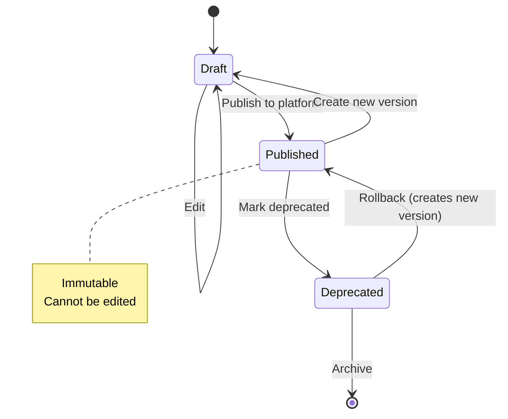

# Prompt Service - Versioning Strategy

**Version**: 1.0  
**Last Updated**: 2025-10-21  
**Status**: Specification  

## Purpose

This document defines the versioning strategy, rollout mechanisms, and diff management for prompt templates.

## Versioning Philosophy

### Semantic Versioning

Prompt templates use **semantic versioning** (SemVer): `MAJOR.MINOR.PATCH`

**Version Increment Rules**:
- **MAJOR** (X.0.0): Breaking changes that require external platform reconfig
  - Change in required variables
  - Removal of variables
  - Complete prompt rewrite
  - Change in template category/purpose
  
- **MINOR** (x.Y.0): Backward-compatible enhancements
  - Addition of optional variables
  - New examples or constraints
  - Refinement of prompts (without changing intent)
  - New tags or metadata
  
- **PATCH** (x.y.Z): Bug fixes and minor corrections
  - Typo corrections
  - Grammar improvements
  - Minor wording adjustments
  - Metadata updates

**Examples**:
```
1.0.0 → 1.0.1  # Fixed typo in system prompt
1.0.1 → 1.1.0  # Added optional "preferredLanguage" variable
1.1.0 → 2.0.0  # Removed "customerEmail" variable (breaking)
```

### Immutability Principle

**Once published, versions are immutable.**

- Published versions **cannot be edited**
- Changes require creating a **new version**
- Historical versions remain accessible indefinitely
- Rollback creates a **new version** (not revert)

**Rationale**: Ensures audit trail, reproducibility, and debugging capability.

## Version Lifecycle



### Lifecycle States

| State | Description | Allowed Operations |
|-------|-------------|-------------------|
| **Draft** | Work in progress | Edit, delete, publish |
| **Published** | Active in production | View, publish to more platforms, deprecate |
| **Deprecated** | Phasing out | View, rollback (creates new version) |
| **Archived** | Historical record | View only (read-only) |

## Version Creation Workflow

### 1. Automatic Version Creation

When updating a template, the system **automatically creates a new version**:

**User Action**:
```http
PUT /templates/{id}
{
  "content": {
    "systemPrompt": "Updated prompt..."
  },
  "changeSummary": "Enhanced empathy in responses"
}
```

**System Behavior**:
1. Validate changes against current version
2. Determine version increment (MAJOR/MINOR/PATCH) via analysis
3. Create new version record
4. Update template's `currentVersion` pointer
5. Keep previous version immutable

**Response**:
```json
{
  "currentVersion": "1.2.0",
  "previousVersion": "1.1.0",
  "incrementType": "MINOR",
  "changeSummary": "Enhanced empathy in responses"
}
```

### 2. Version Increment Detection

The system analyzes changes to determine increment type:

**Detection Logic**:
```typescript
function detectVersionIncrement(
  oldVersion: TemplateVersion,
  newContent: TemplateContent,
  newVariables: Variable[]
): IncrementType {
  // MAJOR: Breaking changes
  if (hasRemovedVariables(oldVersion.variables, newVariables)) {
    return 'MAJOR';
  }
  if (hasChangedRequiredVariables(oldVersion.variables, newVariables)) {
    return 'MAJOR';
  }
  if (hasChangedVariableTypes(oldVersion.variables, newVariables)) {
    return 'MAJOR';
  }
  
  // MINOR: Non-breaking additions
  if (hasAddedVariables(oldVersion.variables, newVariables)) {
    return 'MINOR';
  }
  if (hasSignificantContentChange(oldVersion.content, newContent)) {
    return 'MINOR';
  }
  
  // PATCH: Minor corrections
  return 'PATCH';
}
```

### 3. Manual Version Override

Users can override automatic detection:

**Request**:
```http
PUT /templates/{id}
{
  "content": {...},
  "changeSummary": "Complete rewrite for different use case",
  "forceVersion": "2.0.0"  // Override automatic detection
}
```

**Validation**:
- New version must be higher than current
- Must follow SemVer rules
- Must justify increment type (via `changeSummary`)

## Version Comparison & Diffs

### Diff Generation

The system generates structured diffs between versions:

**Request**:
```http
GET /templates/{id}/versions/1.1.0/compare/1.2.0
```

**Response**:
```json
{
  "baseVersion": "1.1.0",
  "targetVersion": "1.2.0",
  "summary": {
    "incrementType": "MINOR",
    "breakingChanges": false,
    "totalChanges": 3
  },
  "diff": {
    "content": {
      "systemPrompt": {
        "type": "modified",
        "before": "You are a helpful customer support agent...",
        "after": "You are an empathetic customer support agent...",
        "highlightedDiff": "You are a <ins>empathetic</ins> <del>helpful</del> customer support agent..."
      },
      "constraints": {
        "type": "added",
        "added": [
          "Express empathy before offering solutions"
        ]
      }
    },
    "variables": {
      "preferredLanguage": {
        "type": "added",
        "details": {
          "name": "preferredLanguage",
          "type": "string",
          "required": false,
          "defaultValue": "en"
        }
      }
    },
    "metadata": {
      "tags": {
        "type": "unchanged"
      }
    }
  }
}
```

### Diff Algorithms

**Text Diff**: Uses Myers diff algorithm
**JSON Diff**: Deep object comparison with path tracking
**Variable Diff**: Structural comparison (name, type, required status)

## Rollout Strategies

### Strategy 1: Instant Rollout (Default)

**Use Case**: Low-risk updates, non-production environments

**Behavior**:
- Publish new version immediately
- All future requests use new version
- Previous version remains accessible (for debugging)

**Request**:
```http
POST /templates/{id}/publish
{
  "version": "1.2.0",
  "platform": "retell",
  "strategy": "instant"
}
```

### Strategy 2: Canary Rollout

**Use Case**: High-risk changes, production deployments

**Behavior**:
- Route small percentage of traffic to new version
- Monitor metrics (error rates, latency, user feedback)
- Gradually increase percentage if stable
- Rollback if issues detected

**Request**:
```http
POST /templates/{id}/publish
{
  "version": "1.2.0",
  "platform": "retell",
  "strategy": "canary",
  "canaryConfig": {
    "initialPercentage": 5,
    "incrementPercentage": 10,
    "incrementInterval": "1h",
    "successCriteria": {
      "errorRate": "< 1%",
      "p95Latency": "< 2s"
    }
  }
}
```

**Canary State Tracking**:
```json
{
  "publishEventId": "uuid",
  "status": "canary-in-progress",
  "canaryState": {
    "currentPercentage": 15,
    "targetPercentage": 100,
    "startedAt": "2025-10-21T10:00:00Z",
    "nextIncrementAt": "2025-10-21T11:00:00Z",
    "metrics": {
      "errorRate": "0.3%",
      "p95Latency": "1.2s"
    },
    "health": "healthy"
  }
}
```

### Strategy 3: Blue-Green Rollout

**Use Case**: Zero-downtime migrations, A/B testing

**Behavior**:
- Maintain two environments (blue=current, green=new)
- Route traffic to blue while green warms up
- Instant switch when ready
- Instant rollback if needed

**Request**:
```http
POST /templates/{id}/publish
{
  "version": "1.2.0",
  "platform": "retell",
  "strategy": "blue-green",
  "blueGreenConfig": {
    "warmupDuration": "5m",
    "switchTrigger": "manual"  // or "automatic"
  }
}
```

### Strategy 4: Scheduled Rollout

**Use Case**: Coordinated releases, maintenance windows

**Request**:
```http
POST /templates/{id}/publish
{
  "version": "1.2.0",
  "platform": "retell",
  "strategy": "scheduled",
  "scheduledAt": "2025-10-22T02:00:00Z"
}
```

## Rollback Mechanisms

### 1. Version Rollback

**Scenario**: New version has critical issues in production

**Process**:
1. Identify stable previous version
2. Create **new version** with old content
3. Publish new version
4. Deprecate problematic version

**Request**:
```http
POST /templates/{id}/rollback
{
  "targetVersion": "1.1.0",
  "changeSummary": "Rollback to stable version due to high error rates in 1.2.0",
  "deprecateVersion": "1.2.0"
}
```

**Result**:
- Creates version **1.3.0** with content from 1.1.0
- Marks 1.2.0 as `deprecated`
- Publishes 1.3.0 to all platforms using 1.2.0

**Audit Trail**:
```json
{
  "version": "1.3.0",
  "changeSummary": "Rollback to stable version due to high error rates in 1.2.0",
  "metadata": {
    "rollbackFrom": "1.2.0",
    "rollbackTo": "1.1.0",
    "reason": "High error rates detected"
  }
}
```

### 2. Platform-Specific Rollback

**Scenario**: Issue only affects one platform

**Request**:
```http
POST /templates/{id}/publish
{
  "version": "1.1.0",
  "platform": "retell",
  "reason": "Rollback Retell to stable version"
}
```

**Result**:
- Retell uses 1.1.0
- Other platforms continue using 1.2.0

### 3. Emergency Rollback

**Scenario**: Critical production incident

**Process**:
1. Instant rollback to last known good version
2. Skip approval workflows
3. Send alerts to on-call team
4. Post-incident review required

**Request**:
```http
POST /templates/{id}/emergency-rollback
{
  "targetVersion": "1.1.0",
  "incident": "INC-2025-1021-001",
  "authCode": "emergency-override-token"
}
```

## Version History & Audit

### Version Timeline View

**Request**:
```http
GET /templates/{id}/timeline
```

**Response**:
```json
{
  "templateId": "uuid",
  "timeline": [
    {
      "version": "1.3.0",
      "type": "rollback",
      "timestamp": "2025-10-21T14:30:00Z",
      "author": "John Doe",
      "changeSummary": "Rollback to stable version",
      "publishEvents": [
        {
          "platform": "retell",
          "status": "success",
          "publishedAt": "2025-10-21T14:31:00Z"
        }
      ]
    },
    {
      "version": "1.2.0",
      "type": "update",
      "timestamp": "2025-10-21T10:00:00Z",
      "author": "Jane Smith",
      "changeSummary": "Enhanced empathy",
      "publishEvents": [
        {
          "platform": "retell",
          "status": "deprecated",
          "publishedAt": "2025-10-21T10:05:00Z"
        }
      ]
    },
    {
      "version": "1.1.0",
      "type": "update",
      "timestamp": "2025-10-20T14:00:00Z",
      "author": "John Doe",
      "changeSummary": "Added examples",
      "publishEvents": [...]
    }
  ]
}
```

### Change Log Generation

Automatic changelog generation from version history:

**Output** (Markdown):
```markdown
# Changelog: Customer Support Agent

## [1.3.0] - 2025-10-21

### Rollback
- Rolled back to stable version 1.1.0 due to high error rates in 1.2.0

## [1.2.0] - 2025-10-21 [DEPRECATED]

### Added
- New variable: `preferredLanguage` (optional, default: "en")
- Constraint: "Express empathy before offering solutions"

### Changed
- System prompt: Enhanced empathy in agent responses

## [1.1.0] - 2025-10-20

### Added
- 3 new conversation examples

### Changed
- Updated tone from "professional" to "friendly"
```

## Best Practices

### 1. Meaningful Change Summaries
✅ **Good**: "Added error handling for null customer names"  
❌ **Bad**: "Updated template"

### 2. Test Before Publishing
- Use `/test-substitution` endpoint
- Verify all variables resolve
- Test in staging environment

### 3. Gradual Rollouts
- Use canary for production changes
- Monitor metrics during rollout
- Set conservative success criteria

### 4. Document Breaking Changes
- Clearly mark MAJOR version bumps
- Provide migration guide in `changeSummary`
- Notify affected platform owners

### 5. Retain Version History
- Never delete published versions
- Archive instead of delete
- Maintain 7-year retention for audit

## Performance Considerations

### Version Storage
- **Current version**: Cached in Redis (5-min TTL)
- **Historical versions**: PostgreSQL (indexed by template + version)
- **Artifacts**: Cloud Storage (immutable)

### Diff Calculation
- Pre-compute diffs during version creation
- Store diffs in `template_versions.diff_from_parent` (JSONB)
- Avoid real-time diff generation for old versions

### Cleanup Strategy
- Soft delete deprecated versions after 90 days
- Archive to cold storage after 1 year
- Keep audit records for 7 years (compliance)

## Related Documentation

- [Overview](./overview.md) - Component architecture
- [Data Model](./data-model.md) - Version storage schema
- [API Contracts](./api-contracts.md) - Version endpoints
- [Publishing](./adapter-publishing.md) - Platform delivery
- [Validation](./validation.md) - Version validation rules
