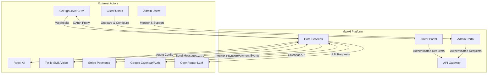

# System Architecture Overview

**Status**: Active  
**Version**: 1.0  
**Last Updated**: 2025-10-20  
**Owner**: architect.morgan-lee

## Purpose

Define the high-level architecture for the MaxAI Platform - a multi-tenant AI-Employee services platform with platform-agnostic integrations, declarative orchestration, and payment gateway-agnostic billing.

## System Context

The MaxAI Platform enables businesses to deploy AI-powered communication agents integrated with their existing CRM, calendar, voice, and payment systems.

## Core Principles

### 1. Multi-Tenancy
- **Tenant Isolation**: Each organization is a tenant with isolated data
- **Client Hierarchy**: Tenants contain multiple clients (sub-accounts)
- **Resource Attribution**: All usage/costs attributed to tenant → client → agent

### 2. Platform-Agnostic Integrations
- **Ports & Adapters Pattern**: Define interfaces (ports), implement adapters
- **Swappable Providers**: CRM, Calendar, Payments, Voice, LLM providers
- **Configuration-Based**: Bindings managed per tenant/client via orchestrator

### 3. Declarative Orchestration
- **Flow-Based**: Triggers → Steps → Adapters defined declaratively
- **Visual Fallback**: Complex flows delegate to n8n for visual editing
- **Versioned Artifacts**: Prompts, flows, configs stored with audit trails

### 4. Security & Compliance
- **OAuth Proxy Pattern**: Server-side token storage, no client exposure
- **RBAC Enforcement**: Gateway + service layer policy checks
- **Audit Everything**: Sensitive actions logged with correlation IDs
- **Compliance Ready**: HIPAA-like safeguards, PCI SAQ-A posture

## Technology Stack

### Frontend
- **Framework**: Next.js 14 (App Router)
- **UI Components**: shadcn/ui (Radix UI + Tailwind)
- **State Management**: Zustand (client), TanStack Query (server)
- **Type Safety**: TypeScript 5.x

### Backend Services
- **Framework**: NestJS (Node.js/TypeScript)
- **API Pattern**: REST + JSON (OpenAPI/Swagger specs)
- **Validation**: class-validator + JSON Schemas
- **Ports/Adapters**: Dependency injection for swappable integrations

### Data Layer
- **Database**: PostgreSQL (primary), portability layer for multi-DB
- **ORM**: Prisma or TypeORM (ANSI-first SQL)
- **Caching**: Redis (sessions, feature flags, rate limits)
- **Queue**: BullMQ/Redis (job processing)

### Infrastructure
- **Orchestration**: Docker + Kubernetes (GKE/EKS)
- **Messaging**: n8n (visual workflows), BullMQ (jobs)
- **Observability**: Structured logs (Pino), Prometheus metrics, OpenTelemetry traces
- **Secrets**: GCP Secret Manager / AWS Secrets Manager

## Key Design Decisions

See ADRs for detailed rationale:

- [ADR-0001: Multi-Tenant Architecture](../adr/adr-0001-multi-tenant-architecture.md)
- [ADR-0002: Ports and Adapters Pattern](../adr/adr-0002-ports-adapters.md)
- [ADR-0003: OAuth Proxy for External APIs](../adr/adr-0003-oauth-proxy.md)
- [ADR-0004: Declarative Orchestration](../adr/adr-0004-declarative-orchestration.md)
- [ADR-0007: Feature Flags Framework](../adr/adr-0007-feature-flags.md)

## Non-Functional Requirements

| Category | Requirement | Target |
|----------|-------------|--------|
| **Availability** | System uptime | ≥ 99.9% |
| **Performance** | API P95 latency | < 200ms |
| **Performance** | Policy check P95 | < 20ms |
| **Scalability** | Concurrent tenants | 1000+ |
| **Security** | Authentication | OAuth 2.0 + JWT |
| **Security** | Encryption | TLS 1.3, at-rest AES-256 |
| **Compliance** | Audit retention | 7 years |
| **Quality** | Test coverage | ≥ 95% line/branch |
| **Quality** | Lint policy | Zero warnings (ESLint) |

## System Boundaries

### What's In Scope
- Multi-tenant identity & access management (IAM)
- Prompt template management & versioning
- Webhook ingress & normalization
- Declarative orchestration engine
- Platform-agnostic integration adapters
- Usage tracking & billing aggregation
- Payment processing abstraction
- Client & admin portals

### What's Out of Scope
- LLM model training (use external providers)
- Direct CRM data storage (proxy only)
- Custom voice AI training (use Retell)
- Email marketing campaigns (integrate via adapters)
- Custom mobile apps (API available for future)

## Related Documentation

### Architecture Details
- [Container Architecture](./container-architecture.md) - All services & communication
- [Deployment Architecture](./deployment-architecture.md) - Infrastructure & environments

### Component Specifications
- [IAM](./iam/) - Identity, auth, RBAC
- [Prompt Service](./prompt-service/) - Template management
- [Orchestrator](./orchestrator/) - Declarative flows
- [Webhook Ingress](./webhook-ingress/) - Event normalization
- [Payments](./payments/) - Gateway-agnostic billing
- [Billing-Usage](./billing-usage/) - Usage tracking
- [Portal UI](./portal-ui/) - Client portal
- [Integration Adapters](./integrations/) - Ports & adapters

### Implementation
- [Phase 1 Implementation](./impl/phase-1/) - MVP features
- [Release Plan](../release/phase-1.md) - Rollout strategy

## Revision History

| Date | Version | Changes | Author |
|------|---------|---------|--------|
| 2025-10-20 | 1.0 | Initial system overview with context diagram | architect.morgan-lee |

---

**Related Issues**: #148  
**Spec Tracker**: ops/tracker/specs/ARCH-DOC-01.md
