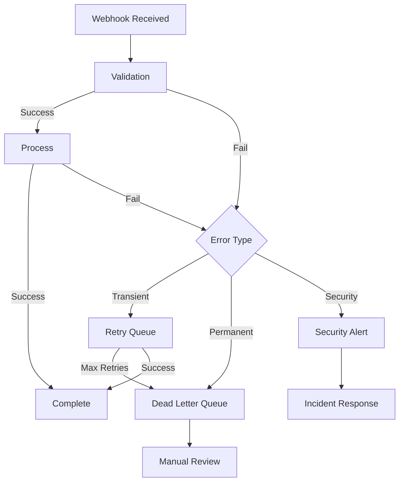

# Webhook Ingress - Error Handling

**Version**: 1.0  
**Last Updated**: 2025-10-21  
**Status**: Specification  

## Purpose

This document defines error handling, retry strategies, dead letter queue management, and idempotency guarantees for the Webhook Ingress component.

## Error Handling Architecture



## Error Classification

### Transient Errors (Retryable)

**Characteristics**: Temporary failures that may succeed on retry

**Examples**:
- Network timeouts
- Destination service temporarily unavailable (503)
- Database connection errors
- Rate limit exceeded (429)
- Circuit breaker open

**Response**:
- Retry with exponential backoff
- Max 3 attempts
- Move to DLQ after max retries

**HTTP Status**: 
- Return `202 Accepted` immediately (webhook queued)
- Process asynchronously with retries

### Permanent Errors (Non-Retryable)

**Characteristics**: Errors that won't be fixed by retrying

**Examples**:
- Invalid signature (401)
- Schema validation failure (400)
- Malformed JSON
- Unknown webhook source
- Invalid routing destination

**Response**:
- Do NOT retry
- Move directly to DLQ
- Log error details for debugging

**HTTP Status**:
- `401 Unauthorized` - Invalid signature
- `400 Bad Request` - Schema validation failure
- `200 OK` - Duplicate webhook (idempotency)

### Security Errors

**Characteristics**: Potential security threats

**Examples**:
- Repeated signature failures from same source
- Replay attack detected
- Rate limit abuse
- Suspicious webhook patterns

**Response**:
- Log security event
- Alert security team
- Block source IP if pattern continues
- Do NOT retry

**HTTP Status**:
- `401 Unauthorized`
- `429 Too Many Requests`

## Retry Strategy

### Exponential Backoff

```typescript
interface RetryConfig {
  max_attempts: number;         // Default: 3
  initial_delay_ms: number;     // Default: 1000 (1s)
  max_delay_ms: number;         // Default: 30000 (30s)
  backoff_multiplier: number;   // Default: 2
  jitter: boolean;              // Default: true
}

class RetryStrategy {
  calculateDelay(attempt: number, config: RetryConfig): number {
    const { initial_delay_ms, max_delay_ms, backoff_multiplier, jitter } = config;
    
    // Exponential backoff: delay = initial * (multiplier ^ attempt)
    let delay = initial_delay_ms * Math.pow(backoff_multiplier, attempt - 1);
    
    // Cap at max delay
    delay = Math.min(delay, max_delay_ms);
    
    // Add jitter to prevent thundering herd
    if (jitter) {
      const jitterAmount = delay * 0.1; // ±10% jitter
      delay += (Math.random() - 0.5) * 2 * jitterAmount;
    }
    
    return Math.floor(delay);
  }
  
  getDelaySequence(config: RetryConfig): number[] {
    const delays: number[] = [];
    
    for (let attempt = 1; attempt <= config.max_attempts; attempt++) {
      delays.push(this.calculateDelay(attempt, config));
    }
    
    return delays;
  }
}
```

**Example Delay Sequence**:
```
Attempt 1: 1000ms   (1 second)
Attempt 2: 2000ms   (2 seconds)
Attempt 3: 4000ms   (4 seconds)
Total: 7 seconds before DLQ
```

### Retry Queue

```typescript
@Injectable()
export class WebhookRetryQueue {
  constructor(
    private queue: Bull.Queue,
    private retryStrategy: RetryStrategy
  ) {
    this.setupQueue();
  }
  
  private setupQueue(): void {
    this.queue = new Bull('webhook-retry', {
      redis: {
        host: process.env.REDIS_HOST,
        port: parseInt(process.env.REDIS_PORT || '6379')
      },
      defaultJobOptions: {
        attempts: 3,
        backoff: {
          type: 'exponential',
          delay: 1000
        },
        removeOnComplete: true,
        removeOnFail: false
      }
    });
    
    this.queue.process(async (job) => {
      return this.processWebhook(job.data);
    });
    
    this.queue.on('failed', async (job, error) => {
      await this.handleFailed(job, error);
    });
  }
  
  async enqueue(
    event: CanonicalWebhookEvent,
    config?: RetryConfig
  ): Promise<void> {
    await this.queue.add('process-webhook', event, {
      attempts: config?.max_attempts || 3,
      backoff: {
        type: 'exponential',
        delay: config?.initial_delay_ms || 1000
      }
    });
  }
  
  private async processWebhook(event: CanonicalWebhookEvent): Promise<any> {
    // Attempt to route webhook
    const router = this.getRouter();
    return router.route(event);
  }
  
  private async handleFailed(job: Bull.Job, error: Error): Promise<void> {
    const event = job.data as CanonicalWebhookEvent;
    
    logger.error('Webhook processing failed after retries', {
      event_id: event.event_id,
      source: event.source,
      event_type: event.event_type,
      attempts: job.attemptsMade,
      error: error.message
    });
    
    // Move to DLQ
    await this.deadLetterQueue.add(event, error);
  }
}
```

## Dead Letter Queue (DLQ)

### DLQ Management

```typescript
@Injectable()
export class DeadLetterQueue {
  constructor(
    private db: Database,
    private alerting: AlertingService
  ) {}
  
  async add(
    event: CanonicalWebhookEvent,
    error: Error,
    metadata?: any
  ): Promise<void> {
    const dlqEntry = {
      id: generateUUID(),
      event_id: event.event_id,
      source: event.source,
      event_type: event.event_type,
      tenant_id: event.tenant_id,
      payload: event,
      error_message: error.message,
      error_stack: error.stack,
      retry_count: metadata?.retry_count || 0,
      created_at: new Date(),
      status: 'pending'  // pending | investigating | resolved | discarded
    };
    
    await this.db.insert('webhook_dlq', dlqEntry);
    
    logger.warn('Webhook moved to DLQ', {
      event_id: event.event_id,
      dlq_id: dlqEntry.id,
      error: error.message
    });
    
    // Alert on DLQ additions
    await this.alerting.sendAlert({
      severity: 'warning',
      title: 'Webhook moved to DLQ',
      message: `Source: ${event.source}, Type: ${event.event_type}`,
      details: {
        event_id: event.event_id,
        error: error.message
      }
    });
  }
  
  async list(filters?: DLQFilters): Promise<DLQEntry[]> {
    let query = 'SELECT * FROM webhook_dlq WHERE 1=1';
    const params: any[] = [];
    
    if (filters?.source) {
      query += ' AND source = ?';
      params.push(filters.source);
    }
    
    if (filters?.status) {
      query += ' AND status = ?';
      params.push(filters.status);
    }
    
    if (filters?.since) {
      query += ' AND created_at >= ?';
      params.push(filters.since);
    }
    
    query += ' ORDER BY created_at DESC LIMIT ?';
    params.push(filters?.limit || 100);
    
    return this.db.query(query, params);
  }
  
  async retry(dlqId: string): Promise<void> {
    const entry = await this.db.findById('webhook_dlq', dlqId);
    
    if (!entry) {
      throw new Error(`DLQ entry not found: ${dlqId}`);
    }
    
    logger.info('Retrying webhook from DLQ', {
      dlq_id: dlqId,
      event_id: entry.event_id
    });
    
    // Re-enqueue for processing
    await this.retryQueue.enqueue(entry.payload, {
      max_attempts: 1  // Single retry attempt
    });
    
    // Update DLQ status
    await this.db.update('webhook_dlq', dlqId, {
      status: 'retried',
      retried_at: new Date()
    });
  }
  
  async resolve(dlqId: string, resolution: string): Promise<void> {
    await this.db.update('webhook_dlq', dlqId, {
      status: 'resolved',
      resolution,
      resolved_at: new Date()
    });
  }
  
  async discard(dlqId: string, reason: string): Promise<void> {
    await this.db.update('webhook_dlq', dlqId, {
      status: 'discarded',
      discard_reason: reason,
      discarded_at: new Date()
    });
  }
  
  async getStats(): Promise<DLQStats> {
    const stats = await this.db.query(`
      SELECT 
        COUNT(*) as total,
        COUNT(CASE WHEN status = 'pending' THEN 1 END) as pending,
        COUNT(CASE WHEN status = 'investigating' THEN 1 END) as investigating,
        COUNT(CASE WHEN status = 'resolved' THEN 1 END) as resolved,
        COUNT(CASE WHEN status = 'discarded' THEN 1 END) as discarded,
        source,
        DATE(created_at) as date
      FROM webhook_dlq
      WHERE created_at >= DATE_SUB(NOW(), INTERVAL 7 DAY)
      GROUP BY source, DATE(created_at)
    `);
    
    return this.aggregateStats(stats);
  }
}

interface DLQEntry {
  id: string;
  event_id: string;
  source: string;
  event_type: string;
  tenant_id?: string;
  payload: CanonicalWebhookEvent;
  error_message: string;
  error_stack?: string;
  retry_count: number;
  status: 'pending' | 'investigating' | 'resolved' | 'discarded' | 'retried';
  created_at: Date;
  retried_at?: Date;
  resolved_at?: Date;
  discarded_at?: Date;
  resolution?: string;
  discard_reason?: string;
}

interface DLQFilters {
  source?: string;
  status?: string;
  since?: Date;
  limit?: number;
}
```

### DLQ Monitoring Dashboard

```typescript
@Controller('admin/dlq')
export class DLQDashboardController {
  constructor(
    private dlq: DeadLetterQueue
  ) {}
  
  @Get()
  async getDashboard(): Promise<DLQDashboardData> {
    const stats = await this.dlq.getStats();
    const recent = await this.dlq.list({ limit: 20 });
    
    return {
      stats,
      recent_entries: recent,
      alerts: this.getActiveAlerts(stats)
    };
  }
  
  @Post(':id/retry')
  async retryEntry(@Param('id') id: string): Promise<void> {
    return this.dlq.retry(id);
  }
  
  @Post(':id/resolve')
  async resolveEntry(
    @Param('id') id: string,
    @Body('resolution') resolution: string
  ): Promise<void> {
    return this.dlq.resolve(id, resolution);
  }
  
  @Post(':id/discard')
  async discardEntry(
    @Param('id') id: string,
    @Body('reason') reason: string
  ): Promise<void> {
    return this.dlq.discard(id, reason);
  }
  
  private getActiveAlerts(stats: DLQStats): Alert[] {
    const alerts: Alert[] = [];
    
    // Alert if > 10 pending entries in last hour
    if (stats.pending_last_hour > 10) {
      alerts.push({
        severity: 'high',
        message: `${stats.pending_last_hour} webhooks in DLQ (last hour)`,
        threshold: 10
      });
    }
    
    // Alert if specific source has high failure rate
    for (const [source, count] of Object.entries(stats.by_source)) {
      if (count > 5) {
        alerts.push({
          severity: 'medium',
          message: `${source} has ${count} failed webhooks`,
          source
        });
      }
    }
    
    return alerts;
  }
}
```

## Idempotency

### Idempotency Key Strategy

```typescript
@Injectable()
export class IdempotencyService {
  constructor(
    private cache: RedisCache,
    private db: Database
  ) {}
  
  async checkIdempotency(
    eventId: string,
    ttlSeconds: number = 86400  // 24 hours
  ): Promise<IdempotencyResult> {
    const key = `webhook:idempotency:${eventId}`;
    
    // Check if already processed
    const cached = await this.cache.get(key);
    
    if (cached) {
      const result = JSON.parse(cached);
      
      logger.info('Duplicate webhook detected (idempotency)', {
        event_id: eventId,
        first_processed_at: result.processed_at
      });
      
      return {
        is_duplicate: true,
        previous_result: result
      };
    }
    
    return {
      is_duplicate: false
    };
  }
  
  async recordProcessed(
    eventId: string,
    result: any,
    ttlSeconds: number = 86400
  ): Promise<void> {
    const key = `webhook:idempotency:${eventId}`;
    
    const record = {
      event_id: eventId,
      processed_at: new Date().toISOString(),
      result
    };
    
    // Store in cache
    await this.cache.setex(
      key,
      ttlSeconds,
      JSON.stringify(record)
    );
    
    // Also store in database for audit
    await this.db.insert('webhook_idempotency', {
      event_id: eventId,
      processed_at: new Date(),
      result: JSON.stringify(result)
    });
  }
}

interface IdempotencyResult {
  is_duplicate: boolean;
  previous_result?: any;
}
```

### Idempotency Middleware

```typescript
@Injectable()
export class IdempotencyMiddleware implements NestMiddleware {
  constructor(
    private idempotencyService: IdempotencyService
  ) {}
  
  async use(req: Request, res: Response, next: NextFunction) {
    const eventId = this.extractEventId(req);
    
    if (!eventId) {
      // No event ID, cannot enforce idempotency
      return next();
    }
    
    const check = await this.idempotencyService.checkIdempotency(eventId);
    
    if (check.is_duplicate) {
      // Return cached result
      return res.status(200).json({
        message: 'Webhook already processed',
        result: check.previous_result
      });
    }
    
    // Store result after processing
    res.on('finish', async () => {
      if (res.statusCode === 200 || res.statusCode === 202) {
        await this.idempotencyService.recordProcessed(
          eventId,
          res.locals.result
        );
      }
    });
    
    next();
  }
  
  private extractEventId(req: Request): string | null {
    const body = req.body;
    
    // Platform-specific event ID extraction
    return body.id || 
           body.event_id || 
           body.MessageSid || 
           body.CallSid || 
           body.call_id ||
           null;
  }
}
```

## Error Response Formats

### HTTP Response Codes

```typescript
class WebhookResponseHandler {
  handleSuccess(event: CanonicalWebhookEvent): Response {
    return {
      status: 202,  // Accepted (async processing)
      body: {
        message: 'Webhook accepted for processing',
        event_id: event.event_id
      }
    };
  }
  
  handleDuplicate(event: CanonicalWebhookEvent): Response {
    return {
      status: 200,  // OK (already processed)
      body: {
        message: 'Webhook already processed',
        event_id: event.event_id
      }
    };
  }
  
  handleValidationError(errors: string[]): Response {
    return {
      status: 400,  // Bad Request
      body: {
        error: 'Validation failed',
        details: errors
      }
    };
  }
  
  handleUnauthorized(message: string): Response {
    return {
      status: 401,  // Unauthorized
      body: {
        error: 'Unauthorized',
        message
      }
    };
  }
  
  handleRateLimit(retryAfter: number): Response {
    return {
      status: 429,  // Too Many Requests
      headers: {
        'Retry-After': retryAfter.toString()
      },
      body: {
        error: 'Rate limit exceeded',
        retry_after: retryAfter
      }
    };
  }
  
  handleInternalError(error: Error): Response {
    logger.error('Internal webhook processing error', {
      error: error.message,
      stack: error.stack
    });
    
    return {
      status: 500,  // Internal Server Error
      body: {
        error: 'Internal server error'
        // Do NOT expose internal error details to external platforms
      }
    };
  }
}
```

## Monitoring & Alerting

### Error Metrics

```typescript
class ErrorMetrics {
  // Error rate by source and type
  recordError(
    source: string,
    error_type: string,
    is_retryable: boolean
  ): void {
    metrics.increment('webhook.error', {
      source,
      error_type,
      retryable: is_retryable.toString()
    });
  }
  
  // DLQ size
  recordDLQSize(count: number): void {
    metrics.gauge('webhook.dlq.size', count);
  }
  
  // Retry attempts
  recordRetry(source: string, attempt: number): void {
    metrics.increment('webhook.retry', {
      source,
      attempt: attempt.toString()
    });
  }
  
  // Idempotency hits
  recordIdempotencyHit(source: string): void {
    metrics.increment('webhook.idempotency.hit', { source });
  }
}
```

### Alert Rules

```typescript
class ErrorAlertRules {
  // Alert if error rate > 10% in last 5 minutes
  checkErrorRate(source: string, errorRate: number): void {
    if (errorRate > 0.1) {
      alerting.sendAlert({
        severity: 'high',
        title: `High webhook error rate for ${source}`,
        message: `Error rate: ${(errorRate * 100).toFixed(1)}%`,
        threshold: 0.1
      });
    }
  }
  
  // Alert if DLQ growing rapidly
  checkDLQGrowth(currentSize: number, previousSize: number): void {
    const growth = currentSize - previousSize;
    
    if (growth > 50) {  // More than 50 new DLQ entries
      alerting.sendAlert({
        severity: 'critical',
        title: 'DLQ growing rapidly',
        message: `${growth} new entries in DLQ`,
        current_size: currentSize
      });
    }
  }
  
  // Alert on repeated signature failures (potential attack)
  checkSignatureFailures(source: string, failureCount: number): void {
    if (failureCount > 10) {
      alerting.sendAlert({
        severity: 'critical',
        title: 'Possible webhook signature attack',
        message: `${failureCount} signature failures for ${source}`,
        action_required: 'Investigate and potentially block source'
      });
    }
  }
}
```

## Recovery Procedures

### Manual Replay from DLQ

```bash
# List DLQ entries
curl -X GET https://platform.example.com/admin/dlq?status=pending

# Retry specific entry
curl -X POST https://platform.example.com/admin/dlq/{id}/retry

# Bulk retry by source
curl -X POST https://platform.example.com/admin/dlq/bulk-retry \
  -d '{"source": "ghl", "status": "pending", "limit": 100}'
```

### Emergency Circuit Breaker

```typescript
class EmergencyCircuitBreaker {
  async disableSource(source: string, reason: string): Promise<void> {
    // Disable all webhooks from source
    await this.cache.set(`webhook:disabled:${source}`, reason, 3600);
    
    logger.warn('Webhook source disabled', { source, reason });
    
    alerting.sendAlert({
      severity: 'critical',
      title: `Webhook source disabled: ${source}`,
      message: reason
    });
  }
  
  async enableSource(source: string): Promise<void> {
    await this.cache.del(`webhook:disabled:${source}`);
    
    logger.info('Webhook source re-enabled', { source });
  }
  
  async isDisabled(source: string): Promise<boolean> {
    return await this.cache.exists(`webhook:disabled:${source}`);
  }
}
```

## Best Practices

### 1. Always Return 200/202 Quickly
```typescript
// ✅ GOOD - Return immediately, process async
app.post('/webhooks/ghl', async (req, res) => {
  await queue.add('process-webhook', req.body);
  res.status(202).json({ message: 'Accepted' });
});

// ❌ BAD - Wait for processing
app.post('/webhooks/ghl', async (req, res) => {
  const result = await processWebhook(req.body);  // May timeout
  res.status(200).json(result);
});
```

### 2. Log Errors Comprehensively
```typescript
logger.error('Webhook processing failed', {
  event_id: event.event_id,
  source: event.source,
  event_type: event.event_type,
  error: error.message,
  stack: error.stack,
  retry_count: retryCount,
  payload: redactSensitiveData(event.original)
});
```

### 3. Use Idempotency Keys
Always check for duplicate webhooks before processing.

### 4. Monitor DLQ Size
Alert when DLQ grows beyond threshold.

### 5. Classify Errors Correctly
Don't retry permanent errors.

## Related Documentation

- [Overview](./overview.md) - Component architecture
- [Webhook Sources](./webhook-sources.md) - Platform-specific schemas
- [Validation](./validation.md) - Security and schema validation
- [Routing](./routing.md) - Event routing logic
