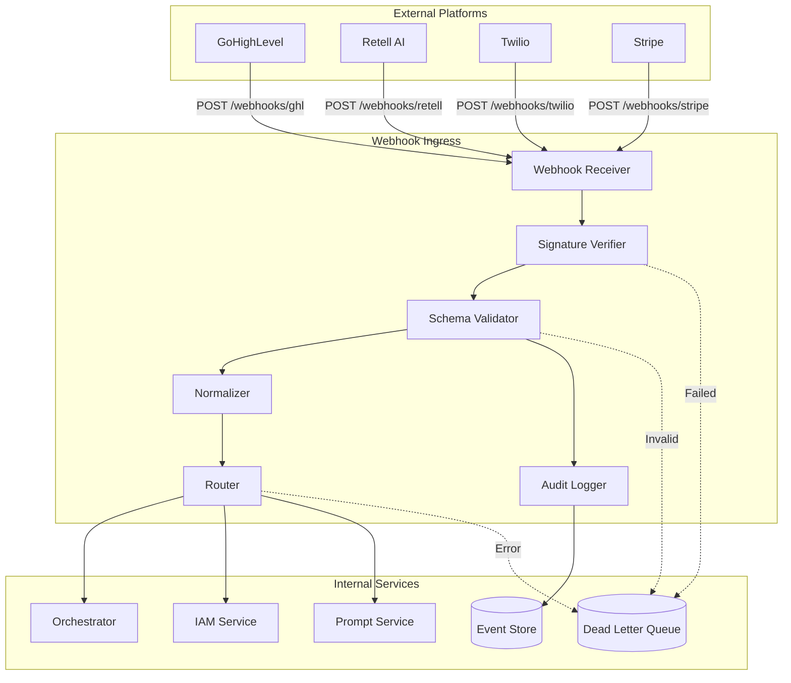
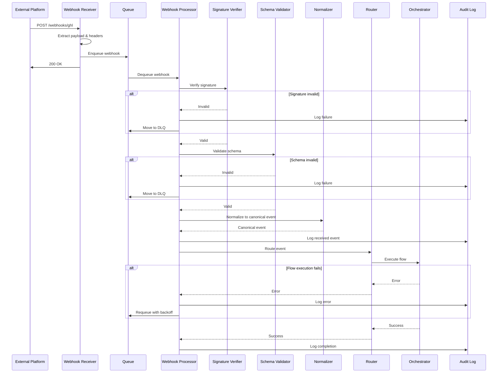

# Webhook Ingress - Overview

**Version**: 1.0  
**Last Updated**: 2025-10-21  
**Status**: Specification  

## Purpose

The Webhook Ingress component provides a secure, reliable, and performant entry point for external platform webhooks, normalizing diverse webhook formats into canonical platform events.

## Architecture



## Design Philosophy

### 1. Security First
- **Signature Verification**: Verify all webhooks using platform-specific signature schemes (HMAC, JWT, custom headers)
- **Replay Protection**: Prevent replay attacks using timestamp validation and idempotency keys
- **Rate Limiting**: Protect against webhook flooding

### 2. Platform Agnostic
- **Normalization**: Convert platform-specific formats to canonical event schemas
- **Extensibility**: Easy to add new webhook sources without changing core logic
- **Decoupling**: Internal services don't need to understand external webhook formats

### 3. Resilience
- **Async Processing**: Queue webhooks for resilient async processing
- **Retries**: Automatic retries with exponential backoff for transient failures
- **Dead Letter Queue**: Capture unprocessable webhooks for manual review
- **Graceful Degradation**: Continue processing valid webhooks even if one source fails

### 4. Observability
- **Audit Trail**: Log all webhook events for compliance and debugging
- **Metrics**: Track webhook volume, latency, errors by source
- **Tracing**: Distributed tracing from webhook receipt to final processing

## Component Responsibilities

### Webhook Receiver

**Purpose**: HTTP endpoint layer for receiving webhooks

**Responsibilities**:
- Expose platform-specific endpoints (`/webhooks/ghl`, `/webhooks/retell`, etc.)
- Extract webhook payload and headers
- Return immediate HTTP response (200 OK) to avoid timeouts
- Queue webhook for async processing

**Technology**:
- NestJS controllers with platform-specific routes
- Request validation middleware
- Response formatting

**Code Structure**:
```
src/webhook-ingress/
  controllers/
    ghl-webhook.controller.ts
    retell-webhook.controller.ts
    twilio-webhook.controller.ts
    stripe-webhook.controller.ts
```

### Signature Verifier

**Purpose**: Verify webhook authenticity

**Responsibilities**:
- Extract signature from headers (platform-specific locations)
- Reconstruct signature using shared secret
- Compare signatures with timing-safe comparison
- Reject invalid signatures immediately

**Technology**:
- crypto module for HMAC verification
- Platform SDKs where available (stripe, twilio)
- Timing-safe comparison to prevent timing attacks

**Code Structure**:
```
src/webhook-ingress/
  verification/
    signature-verifier.service.ts
    ghl-signature-verifier.ts
    retell-signature-verifier.ts
    twilio-signature-verifier.ts
    stripe-signature-verifier.ts
```

### Schema Validator

**Purpose**: Validate webhook structure

**Responsibilities**:
- Load JSON Schema for webhook source
- Validate payload against schema
- Collect validation errors
- Reject invalid payloads

**Technology**:
- Ajv (JSON Schema validator)
- Platform-specific schemas in JSON Schema format
- Detailed error reporting

**Code Structure**:
```
src/webhook-ingress/
  validation/
    schema-validator.service.ts
  schemas/
    ghl-webhook.schema.json
    retell-webhook.schema.json
    twilio-webhook.schema.json
    stripe-webhook.schema.json
```

### Normalizer

**Purpose**: Convert platform webhooks to canonical events

**Responsibilities**:
- Map platform-specific fields to canonical event schema
- Extract common fields (tenant_id, customer_id, timestamp)
- Preserve original payload for audit
- Enrich with platform metadata

**Technology**:
- Strategy pattern for platform-specific normalizers
- TypeScript DTOs for canonical events
- Transformation utilities

**Code Structure**:
```
src/webhook-ingress/
  normalization/
    normalizer.service.ts
    ghl-normalizer.ts
    retell-normalizer.ts
    twilio-normalizer.ts
    stripe-normalizer.ts
  dto/
    canonical-webhook-event.dto.ts
```

**Canonical Event Schema**:
```typescript
interface CanonicalWebhookEvent {
  // Metadata
  event_id: string;           // UUID
  source: 'ghl' | 'retell' | 'twilio' | 'stripe';
  event_type: string;         // Normalized event type
  received_at: string;        // ISO timestamp
  processed_at?: string;      // ISO timestamp
  
  // Context
  tenant_id?: string;         // If identifiable
  customer_id?: string;       // If identifiable
  
  // Payload
  data: {
    // Normalized fields
    [key: string]: any;
  };
  
  // Original webhook (for audit)
  original: {
    headers: Record<string, string>;
    body: any;
  };
  
  // Processing metadata
  metadata: {
    signature_verified: boolean;
    schema_valid: boolean;
    retry_count?: number;
    error?: string;
  };
}
```

### Router

**Purpose**: Route normalized events to internal services

**Responsibilities**:
- Determine destination based on event type
- Invoke Orchestrator flows for workflow-based events
- Call internal services directly for simple events
- Handle routing failures

**Technology**:
- Event-driven architecture
- Orchestrator adapter for flow invocation
- Service adapters for direct calls

**Code Structure**:
```
src/webhook-ingress/
  routing/
    router.service.ts
    routing-rules.ts
```

**Routing Rules**:
```typescript
const ROUTING_RULES: RoutingRule[] = [
  {
    source: 'ghl',
    event_type: 'contact.created',
    destination: {
      type: 'orchestrator',
      flow_id: 'ghl-contact-sync'
    }
  },
  {
    source: 'retell',
    event_type: 'call.ended',
    destination: {
      type: 'orchestrator',
      flow_id: 'call-post-processing'
    }
  },
  {
    source: 'stripe',
    event_type: 'payment.succeeded',
    destination: {
      type: 'service',
      service_id: 'billing',
      method: 'processPayment'
    }
  }
];
```

### Audit Logger

**Purpose**: Maintain audit trail of all webhooks

**Responsibilities**:
- Log webhook receipt with full payload
- Track processing status
- Enable compliance reporting
- Support debugging and replay

**Technology**:
- PostgreSQL for structured audit log
- Indexed by tenant_id, source, event_type, timestamp
- Retention policy (90 days default)

**Code Structure**:
```
src/webhook-ingress/
  audit/
    audit-logger.service.ts
  entities/
    webhook-audit-log.entity.ts
```

**Audit Log Schema**:
```sql
CREATE TABLE webhook_audit_log (
  id UUID PRIMARY KEY,
  event_id VARCHAR(255) UNIQUE NOT NULL,
  source VARCHAR(50) NOT NULL,
  event_type VARCHAR(100) NOT NULL,
  tenant_id UUID,
  customer_id UUID,
  received_at TIMESTAMPTZ NOT NULL,
  processed_at TIMESTAMPTZ,
  status VARCHAR(50) NOT NULL,  -- received|processing|completed|failed
  signature_verified BOOLEAN,
  schema_valid BOOLEAN,
  retry_count INTEGER DEFAULT 0,
  error_message TEXT,
  headers JSONB NOT NULL,
  payload JSONB NOT NULL,
  normalized_event JSONB,
  created_at TIMESTAMPTZ DEFAULT NOW(),
  updated_at TIMESTAMPTZ DEFAULT NOW()
);

CREATE INDEX idx_webhook_audit_tenant ON webhook_audit_log(tenant_id);
CREATE INDEX idx_webhook_audit_source ON webhook_audit_log(source);
CREATE INDEX idx_webhook_audit_received ON webhook_audit_log(received_at);
CREATE INDEX idx_webhook_audit_status ON webhook_audit_log(status);
```

## Request Flow



## Integration Points

### Upstream (External Platforms)

**GoHighLevel (GHL)**:
- **Endpoint**: `POST /webhooks/ghl`
- **Authentication**: HMAC signature in `X-GHL-Signature` header
- **Events**: contact.created, contact.updated, opportunity.status_changed, etc.
- **Documentation**: [GHL Webhooks](https://highlevel.stoplight.io/docs/integrations/0443d7d1a4bd0-overview)

**Retell AI**:
- **Endpoint**: `POST /webhooks/retell`
- **Authentication**: API key in `Authorization` header or custom signature
- **Events**: call.started, call.ended, call.recording_ready, etc.
- **Documentation**: [Retell Webhooks](https://docs.retellai.com/)

**Twilio**:
- **Endpoint**: `POST /webhooks/twilio`
- **Authentication**: X-Twilio-Signature header (request signing)
- **Events**: message.sent, message.delivered, call.initiated, etc.
- **Documentation**: [Twilio Webhooks](https://www.twilio.com/docs/usage/webhooks)

**Stripe**:
- **Endpoint**: `POST /webhooks/stripe`
- **Authentication**: Stripe-Signature header (webhook signatures)
- **Events**: payment_intent.succeeded, customer.subscription.updated, etc.
- **Documentation**: [Stripe Webhooks](https://stripe.com/docs/webhooks)

### Downstream (Internal Services)

**Orchestrator**:
- **Interface**: `IOrchestrator.executeFlow(flow_id, params)`
- **Use**: Workflow-based event processing
- **Example**: Contact sync, call post-processing

**IAM Service**:
- **Interface**: `IIAMService.createUser(data)`, `IIAMService.updatePermissions(user_id, permissions)`
- **Use**: User/permission management events
- **Example**: Contact created → create user

**Prompt Service**:
- **Interface**: `IPromptService.publishTemplate(template_id, platform)`
- **Use**: Prompt publishing events
- **Example**: Template updated → publish to platforms

**Billing Service**:
- **Interface**: `IBillingService.processPayment(payment_data)`
- **Use**: Payment events
- **Example**: Stripe payment succeeded → update subscription

## Non-Functional Requirements

### Performance

**Latency**:
- Webhook receipt → 200 OK: < 100ms (p95)
- Queue → Processing start: < 500ms (p95)
- Processing → Routing: < 1s (p95)

**Throughput**:
- Target: 1000 webhooks/minute sustained
- Peak: 5000 webhooks/minute burst

**Resource Usage**:
- CPU: < 50% at sustained load
- Memory: < 512MB per worker
- Queue depth: < 100 messages under normal load

### Reliability

**Availability**: 99.9% uptime (4.3 hours downtime/month)

**Durability**: No webhook loss once 200 OK returned (queue persistence)

**Idempotency**: Duplicate webhooks detected via event_id

**Retries**:
- Transient errors: 3 retries with exponential backoff
- Permanent errors: Move to DLQ after max retries

### Security

**Authentication**: All webhooks verified via signature

**Authorization**: Tenant isolation enforced

**Data Protection**: 
- Webhook payloads encrypted at rest in audit log
- PII redacted from logs

**Rate Limiting**: 
- Per-source: 100 req/min default
- Per-tenant: 500 req/min default

### Observability

**Metrics** (tracked per source, event_type):
- `webhook.received.count` - Total webhooks received
- `webhook.signature.verified.count` - Signature verification success/failure
- `webhook.schema.valid.count` - Schema validation success/failure
- `webhook.processed.count` - Processing success/failure
- `webhook.latency.histogram` - End-to-end processing time
- `webhook.dlq.count` - Dead letter queue entries

**Logs** (structured JSON):
- Request received (headers, source, event_type)
- Signature verification (result, timestamp)
- Schema validation (result, errors)
- Normalization (input → output mapping)
- Routing (destination, result)
- Processing completion (duration, status)

**Traces**:
- Distributed tracing from webhook receipt to final destination
- Correlation ID propagated through all processing steps

## Error Scenarios

### Signature Verification Failure

**Cause**: Invalid signature, expired timestamp, wrong secret

**Response**:
- HTTP 401 Unauthorized
- Log security event
- Alert on repeated failures (potential attack)
- Do NOT retry

### Schema Validation Failure

**Cause**: Malformed payload, missing required fields, wrong types

**Response**:
- Move to DLQ
- Log validation errors
- Alert if high failure rate (platform API change?)
- Manual review required

### Routing Failure

**Cause**: Destination service down, network error, timeout

**Response**:
- Retry with exponential backoff (3 attempts)
- Move to DLQ after max retries
- Alert on persistent failures

### Processing Failure

**Cause**: Orchestrator flow error, service exception

**Response**:
- Return error to caller (if sync)
- Retry if transient (queue down, timeout)
- Move to DLQ if permanent (invalid data)

## Deployment Architecture

**Horizontal Scaling**:
- Webhook receivers: Multiple instances behind load balancer
- Queue workers: Auto-scale based on queue depth

**Queue Configuration**:
- Redis Bull queue with persistence
- Separate queues per source for isolation
- Priority queues for critical sources

**Database**:
- PostgreSQL for audit log
- Read replicas for analytics queries
- Partitioning by date for retention management

## Related Documentation

- [Webhook Sources](./webhook-sources.md) - Platform-specific schemas
- [Validation](./validation.md) - Security and schema validation
- [Routing](./routing.md) - Event routing logic
- [Error Handling](./error-handling.md) - Resilience strategies
