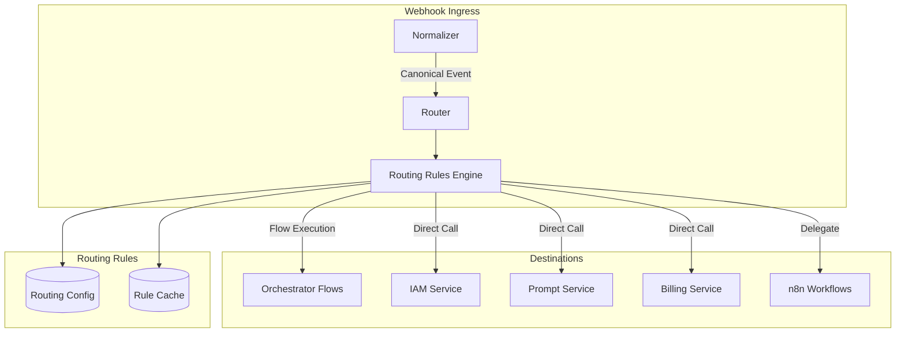
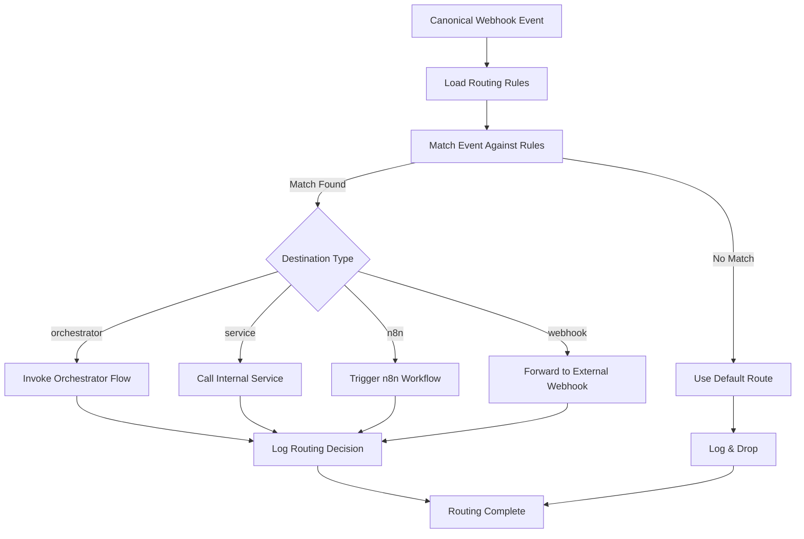

# Webhook Ingress - Routing

**Version**: 1.0  
**Last Updated**: 2025-10-21  
**Status**: Specification  

## Purpose

This document defines how validated and normalized webhook events are routed to internal services (Orchestrator flows, direct service calls, or external systems).

## Routing Architecture



## Routing Decision Tree



## Routing Rules

### Rule Structure

```typescript
interface RoutingRule {
  id: string;
  priority: number;           // Lower = higher priority
  enabled: boolean;
  
  // Match conditions
  conditions: {
    source?: string[];        // ['ghl', 'retell']
    event_type?: string[];    // ['contact.created', 'call.ended']
    tenant_id?: string[];     // Filter by tenant
    data_filter?: string;     // JSONPath or custom expression
  };
  
  // Routing destination
  destination: 
    | OrchestratorDestination
    | ServiceDestination
    | N8NDestination
    | WebhookDestination;
  
  // Behavior
  async?: boolean;            // Async invocation (default: true)
  timeout_ms?: number;        // Timeout for destination call
  retry?: RetryConfig;
  
  metadata?: {
    description?: string;
    created_by?: string;
    created_at?: string;
  };
}

interface OrchestratorDestination {
  type: 'orchestrator';
  flow_id: string;
  params_mapping?: Record<string, string>;  // Map event fields to flow params
}

interface ServiceDestination {
  type: 'service';
  service_id: string;
  method: string;
  params_mapping?: Record<string, string>;
}

interface N8NDestination {
  type: 'n8n';
  workflow_id: string;
  wait_for_completion?: boolean;
}

interface WebhookDestination {
  type: 'webhook';
  url: string;
  method: 'POST' | 'PUT';
  headers?: Record<string, string>;
  auth?: {
    type: 'bearer' | 'basic' | 'api_key';
    credentials: string;
  };
}
```

### Rule Examples

**Contact Created → Orchestrator Flow**:
```typescript
const rule: RoutingRule = {
  id: 'ghl-contact-created-sync',
  priority: 10,
  enabled: true,
  conditions: {
    source: ['ghl'],
    event_type: ['contact.created']
  },
  destination: {
    type: 'orchestrator',
    flow_id: 'ghl-contact-sync',
    params_mapping: {
      'data.contact.id': 'contact_id',
      'data.contact.email': 'email',
      'data.contact.phone': 'phone',
      'tenant_id': 'tenant_id'
    }
  },
  async: true,
  timeout_ms: 30000,
  metadata: {
    description: 'Sync GHL contacts to platform',
    created_by: 'architect',
    created_at: '2025-10-21T10:00:00Z'
  }
};
```

**Call Ended → Direct Service Call**:
```typescript
const rule: RoutingRule = {
  id: 'retell-call-ended-transcript',
  priority: 20,
  enabled: true,
  conditions: {
    source: ['retell'],
    event_type: ['call.ended']
  },
  destination: {
    type: 'service',
    service_id: 'call_analytics',
    method: 'processTranscript',
    params_mapping: {
      'data.call_id': 'call_id',
      'data.transcript': 'transcript',
      'data.duration_seconds': 'duration'
    }
  },
  async: true,
  timeout_ms: 60000
};
```

**Payment Succeeded → Billing Service**:
```typescript
const rule: RoutingRule = {
  id: 'stripe-payment-succeeded-billing',
  priority: 5,  // High priority for financial events
  enabled: true,
  conditions: {
    source: ['stripe'],
    event_type: ['payment.succeeded']
  },
  destination: {
    type: 'service',
    service_id: 'billing',
    method: 'processPayment',
    params_mapping: {
      'data.resource.id': 'payment_intent_id',
      'data.resource.amount': 'amount',
      'data.resource.currency': 'currency',
      'data.resource.customer': 'customer_id',
      'tenant_id': 'tenant_id'
    }
  },
  async: false,  // Synchronous for payment confirmation
  timeout_ms: 10000,
  retry: {
    attempts: 3,
    backoff: 'exponential'
  }
};
```

**Complex Data Processing → n8n**:
```typescript
const rule: RoutingRule = {
  id: 'ghl-opportunity-enrichment',
  priority: 30,
  enabled: true,
  conditions: {
    source: ['ghl'],
    event_type: ['opportunity.status_changed'],
    data_filter: '$.data.opportunity.status == "won"'
  },
  destination: {
    type: 'n8n',
    workflow_id: 'opportunity-enrichment-v2',
    wait_for_completion: false
  },
  async: true
};
```

## Routing Rules Engine

### Rules Loader

```typescript
@Injectable()
export class RoutingRulesLoader {
  private rules: RoutingRule[] = [];
  private rulesCache: Map<string, RoutingRule[]> = new Map();
  
  constructor(
    private db: Database,
    private cache: RedisCache
  ) {}
  
  async loadRules(): Promise<void> {
    // Load from database
    const dbRules = await this.db.query<RoutingRule[]>(
      'SELECT * FROM routing_rules WHERE enabled = true ORDER BY priority ASC'
    );
    
    this.rules = dbRules;
    
    // Build cache by source for fast lookup
    this.buildCache();
    
    logger.info('Routing rules loaded', {
      total_rules: this.rules.length
    });
  }
  
  private buildCache(): void {
    this.rulesCache.clear();
    
    for (const rule of this.rules) {
      const sources = rule.conditions.source || ['*'];
      
      for (const source of sources) {
        if (!this.rulesCache.has(source)) {
          this.rulesCache.set(source, []);
        }
        
        this.rulesCache.get(source)!.push(rule);
      }
    }
  }
  
  getRulesForSource(source: string): RoutingRule[] {
    // Get source-specific rules + wildcard rules
    const sourceRules = this.rulesCache.get(source) || [];
    const wildcardRules = this.rulesCache.get('*') || [];
    
    return [...sourceRules, ...wildcardRules].sort(
      (a, b) => a.priority - b.priority
    );
  }
}
```

### Rule Matcher

```typescript
@Injectable()
export class RoutingRuleMatcher {
  constructor(
    private expressionEvaluator: ExpressionEvaluator
  ) {}
  
  match(
    event: CanonicalWebhookEvent,
    rules: RoutingRule[]
  ): RoutingRule | null {
    for (const rule of rules) {
      if (this.matchesConditions(event, rule.conditions)) {
        logger.debug('Routing rule matched', {
          rule_id: rule.id,
          event_type: event.event_type,
          source: event.source
        });
        
        return rule;
      }
    }
    
    logger.warn('No routing rule matched', {
      event_type: event.event_type,
      source: event.source
    });
    
    return null;
  }
  
  private matchesConditions(
    event: CanonicalWebhookEvent,
    conditions: RoutingRule['conditions']
  ): boolean {
    // Check source
    if (conditions.source && !conditions.source.includes(event.source)) {
      return false;
    }
    
    // Check event_type
    if (conditions.event_type && !conditions.event_type.includes(event.event_type)) {
      return false;
    }
    
    // Check tenant_id
    if (conditions.tenant_id && event.tenant_id) {
      if (!conditions.tenant_id.includes(event.tenant_id)) {
        return false;
      }
    }
    
    // Check data filter (JSONPath or expression)
    if (conditions.data_filter) {
      const result = this.expressionEvaluator.evaluate(
        conditions.data_filter,
        { data: event.data }
      );
      
      if (!result) {
        return false;
      }
    }
    
    return true;
  }
}
```

### Router Service

```typescript
@Injectable()
export class WebhookRouterService {
  constructor(
    private rulesLoader: RoutingRulesLoader,
    private ruleMatcher: RoutingRuleMatcher,
    private orchestratorAdapter: OrchestratorAdapter,
    private serviceInvoker: ServiceInvoker,
    private n8nAdapter: N8NAdapter,
    private webhookForwarder: WebhookForwarder,
    private metrics: MetricsService
  ) {}
  
  async route(event: CanonicalWebhookEvent): Promise<RoutingResult> {
    const startTime = Date.now();
    
    try {
      // Get rules for event source
      const rules = this.rulesLoader.getRulesForSource(event.source);
      
      // Find matching rule
      const rule = this.ruleMatcher.match(event, rules);
      
      if (!rule) {
        return this.handleNoMatch(event);
      }
      
      // Route to destination
      const result = await this.routeToDestination(event, rule);
      
      // Record metrics
      this.metrics.recordRouting(event.source, event.event_type, rule.id, true);
      
      logger.info('Webhook routed successfully', {
        event_id: event.event_id,
        rule_id: rule.id,
        destination_type: rule.destination.type,
        duration_ms: Date.now() - startTime
      });
      
      return result;
      
    } catch (error) {
      this.metrics.recordRouting(event.source, event.event_type, null, false);
      
      logger.error('Webhook routing failed', {
        event_id: event.event_id,
        error: error.message,
        duration_ms: Date.now() - startTime
      });
      
      throw error;
    }
  }
  
  private async routeToDestination(
    event: CanonicalWebhookEvent,
    rule: RoutingRule
  ): Promise<RoutingResult> {
    const { destination } = rule;
    
    switch (destination.type) {
      case 'orchestrator':
        return this.routeToOrchestrator(event, destination, rule);
        
      case 'service':
        return this.routeToService(event, destination, rule);
        
      case 'n8n':
        return this.routeToN8N(event, destination, rule);
        
      case 'webhook':
        return this.routeToWebhook(event, destination, rule);
        
      default:
        throw new Error(`Unknown destination type: ${(destination as any).type}`);
    }
  }
  
  private async routeToOrchestrator(
    event: CanonicalWebhookEvent,
    destination: OrchestratorDestination,
    rule: RoutingRule
  ): Promise<RoutingResult> {
    // Map event fields to flow parameters
    const params = this.mapParams(event, destination.params_mapping);
    
    // Invoke orchestrator flow
    const result = await this.orchestratorAdapter.executeFlow(
      destination.flow_id,
      params,
      {
        async: rule.async !== false,
        timeout_ms: rule.timeout_ms || 30000,
        correlation_id: event.event_id
      }
    );
    
    return {
      success: true,
      destination_type: 'orchestrator',
      destination_id: destination.flow_id,
      result
    };
  }
  
  private async routeToService(
    event: CanonicalWebhookEvent,
    destination: ServiceDestination,
    rule: RoutingRule
  ): Promise<RoutingResult> {
    const params = this.mapParams(event, destination.params_mapping);
    
    const result = await this.serviceInvoker.invoke(
      destination.service_id,
      destination.method,
      params,
      {
        timeout_ms: rule.timeout_ms || 30000,
        retry: rule.retry
      }
    );
    
    return {
      success: true,
      destination_type: 'service',
      destination_id: `${destination.service_id}.${destination.method}`,
      result
    };
  }
  
  private async routeToN8N(
    event: CanonicalWebhookEvent,
    destination: N8NDestination,
    rule: RoutingRule
  ): Promise<RoutingResult> {
    const result = await this.n8nAdapter.trigger({
      workflow_id: destination.workflow_id,
      payload: event.data,
      wait_for_completion: destination.wait_for_completion || false
    });
    
    return {
      success: true,
      destination_type: 'n8n',
      destination_id: destination.workflow_id,
      result
    };
  }
  
  private async routeToWebhook(
    event: CanonicalWebhookEvent,
    destination: WebhookDestination,
    rule: RoutingRule
  ): Promise<RoutingResult> {
    const result = await this.webhookForwarder.forward(
      destination.url,
      event,
      {
        method: destination.method,
        headers: destination.headers,
        auth: destination.auth,
        timeout_ms: rule.timeout_ms || 30000
      }
    );
    
    return {
      success: true,
      destination_type: 'webhook',
      destination_id: destination.url,
      result
    };
  }
  
  private mapParams(
    event: CanonicalWebhookEvent,
    mapping?: Record<string, string>
  ): any {
    if (!mapping) {
      return event.data;
    }
    
    const params: any = {};
    
    for (const [sourcePath, targetKey] of Object.entries(mapping)) {
      const value = this.getValueByPath(event, sourcePath);
      params[targetKey] = value;
    }
    
    return params;
  }
  
  private getValueByPath(obj: any, path: string): any {
    return path.split('.').reduce((current, key) => current?.[key], obj);
  }
  
  private handleNoMatch(event: CanonicalWebhookEvent): RoutingResult {
    logger.warn('No routing rule matched, using default behavior', {
      event_id: event.event_id,
      source: event.source,
      event_type: event.event_type
    });
    
    // Default: log and drop
    return {
      success: true,
      destination_type: 'none',
      destination_id: 'default',
      result: null
    };
  }
}

interface RoutingResult {
  success: boolean;
  destination_type: string;
  destination_id: string;
  result: any;
  error?: string;
}
```

## Dynamic Rule Management

### API for Rule Management

```typescript
@Controller('routing-rules')
export class RoutingRulesController {
  constructor(
    private rulesService: RoutingRulesService
  ) {}
  
  @Post()
  async createRule(@Body() rule: CreateRoutingRuleDto): Promise<RoutingRule> {
    return this.rulesService.create(rule);
  }
  
  @Put(':id')
  async updateRule(
    @Param('id') id: string,
    @Body() rule: UpdateRoutingRuleDto
  ): Promise<RoutingRule> {
    return this.rulesService.update(id, rule);
  }
  
  @Delete(':id')
  async deleteRule(@Param('id') id: string): Promise<void> {
    return this.rulesService.delete(id);
  }
  
  @Post(':id/enable')
  async enableRule(@Param('id') id: string): Promise<void> {
    return this.rulesService.enable(id);
  }
  
  @Post(':id/disable')
  async disableRule(@Param('id') id: string): Promise<void> {
    return this.rulesService.disable(id);
  }
  
  @Get()
  async listRules(
    @Query('source') source?: string,
    @Query('enabled') enabled?: boolean
  ): Promise<RoutingRule[]> {
    return this.rulesService.list({ source, enabled });
  }
}
```

### Hot Reload

```typescript
@Injectable()
export class RoutingRulesService {
  constructor(
    private db: Database,
    private rulesLoader: RoutingRulesLoader,
    private eventBus: EventBus
  ) {}
  
  async create(dto: CreateRoutingRuleDto): Promise<RoutingRule> {
    const rule = await this.db.insert('routing_rules', dto);
    
    // Reload rules
    await this.reload Rules();
    
    return rule;
  }
  
  async update(id: string, dto: UpdateRoutingRuleDto): Promise<RoutingRule> {
    const rule = await this.db.update('routing_rules', id, dto);
    
    // Reload rules
    await this.reloadRules();
    
    return rule;
  }
  
  async delete(id: string): Promise<void> {
    await this.db.delete('routing_rules', id);
    
    // Reload rules
    await this.reloadRules();
  }
  
  private async reloadRules(): Promise<void> {
    await this.rulesLoader.loadRules();
    
    // Emit event for distributed cache invalidation
    this.eventBus.emit('routing.rules.reloaded');
    
    logger.info('Routing rules reloaded');
  }
}
```

## Routing Metrics

```typescript
class RoutingMetrics {
  // Route by source and event type
  recordRouting(
    source: string,
    event_type: string,
    rule_id: string | null,
    success: boolean
  ): void {
    metrics.increment('webhook.routed', {
      source,
      event_type,
      rule_id: rule_id || 'no_match',
      success: success.toString()
    });
  }
  
  // Destination type distribution
  recordDestination(destination_type: string): void {
    metrics.increment('webhook.destination', {
      type: destination_type
    });
  }
  
  // Routing latency
  recordLatency(duration_ms: number, destination_type: string): void {
    metrics.histogram('webhook.routing.duration', duration_ms, {
      destination_type
    });
  }
}
```

## Related Documentation

- [Overview](./overview.md) - Component architecture
- [Webhook Sources](./webhook-sources.md) - Platform-specific schemas
- [Validation](./validation.md) - Security and schema validation
- [Error Handling](./error-handling.md) - Resilience strategies
