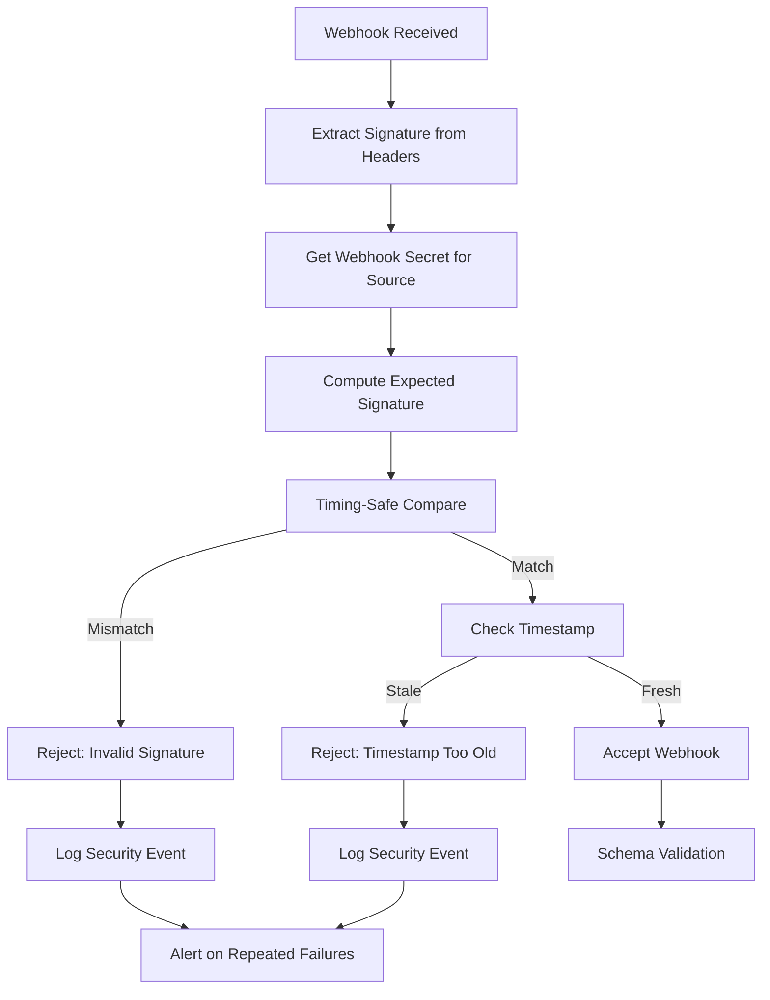
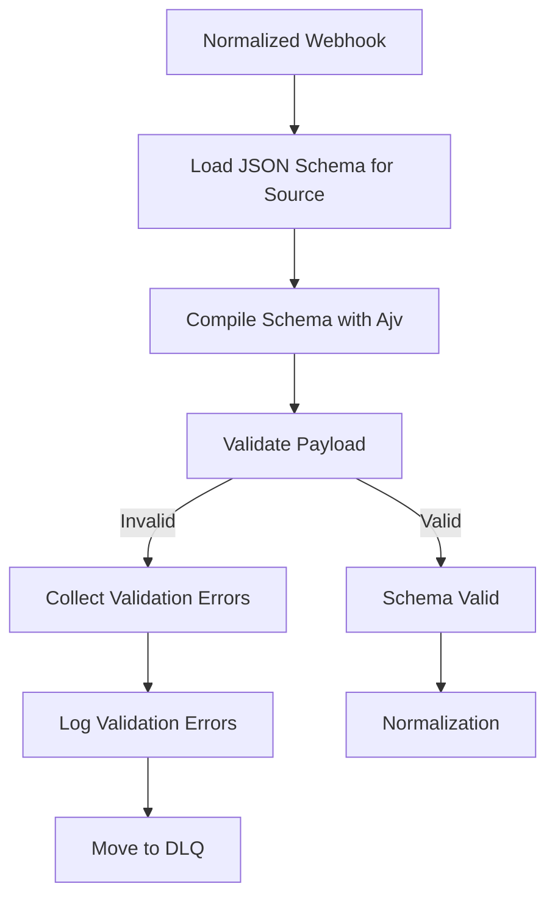

# Webhook Ingress - Validation

**Version**: 1.0  
**Last Updated**: 2025-10-21  
**Status**: Specification  

## Purpose

This document defines security validation (signature verification) and data validation (schema validation) for incoming webhooks.

## Security Validation

### Signature Verification Flow



### Timing-Safe Comparison

**Purpose**: Prevent timing attacks by using constant-time comparison

```typescript
import crypto from 'crypto';

function timingSafeCompare(a: string, b: string): boolean {
  // Ensure both strings are same length (prevents length-based timing attacks)
  if (a.length !== b.length) {
    // Compare against dummy value to maintain constant time
    crypto.timingSafeEqual(
      Buffer.from(a),
      Buffer.from(a)
    );
    return false;
  }
  
  return crypto.timingSafeEqual(
    Buffer.from(a),
    Buffer.from(b)
  );
}
```

### Platform-Specific Verification

#### GoHighLevel

```typescript
class GHLSignatureVerifier {
  constructor(private secret: string) {}
  
  verify(payload: string, signature: string): boolean {
    const expectedSignature = crypto
      .createHmac('sha256', this.secret)
      .update(payload)
      .digest('hex');
    
    return timingSafeCompare(signature, expectedSignature);
  }
}
```

**Usage**:
```typescript
const verifier = new GHLSignatureVerifier(process.env.GHL_WEBHOOK_SECRET);
const signature = req.headers['x-ghl-signature'];
const payload = JSON.stringify(req.body);

if (!verifier.verify(payload, signature)) {
  throw new UnauthorizedError('Invalid signature');
}
```

#### Retell AI

```typescript
class RetellSignatureVerifier {
  constructor(private apiKey: string) {}
  
  verify(authHeader: string): boolean {
    const expectedAuth = `Bearer ${this.apiKey}`;
    return timingSafeCompare(authHeader, expectedAuth);
  }
}
```

**Usage**:
```typescript
const verifier = new RetellSignatureVerifier(process.env.RETELL_API_KEY);
const authHeader = req.headers['authorization'];

if (!verifier.verify(authHeader)) {
  throw new UnauthorizedError('Invalid API key');
}
```

#### Twilio

```typescript
import { validateRequest } from 'twilio';

class TwilioSignatureVerifier {
  constructor(
    private authToken: string,
    private webhookUrl: string
  ) {}
  
  verify(signature: string, params: Record<string, string>): boolean {
    return validateRequest(
      this.authToken,
      signature,
      this.webhookUrl,
      params
    );
  }
}
```

**Usage**:
```typescript
const verifier = new TwilioSignatureVerifier(
  process.env.TWILIO_AUTH_TOKEN,
  'https://platform.example.com/webhooks/twilio'
);

const signature = req.headers['x-twilio-signature'];
const params = req.body;

if (!verifier.verify(signature, params)) {
  throw new UnauthorizedError('Invalid Twilio signature');
}
```

#### Stripe

```typescript
import Stripe from 'stripe';

class StripeSignatureVerifier {
  constructor(
    private webhookSecret: string,
    private stripe: Stripe
  ) {}
  
  verify(payload: string | Buffer, signature: string): Stripe.Event {
    try {
      return this.stripe.webhooks.constructEvent(
        payload,
        signature,
        this.webhookSecret
      );
    } catch (error) {
      throw new UnauthorizedError(`Stripe signature verification failed: ${error.message}`);
    }
  }
}
```

**Usage**:
```typescript
const stripe = new Stripe(process.env.STRIPE_SECRET_KEY);
const verifier = new StripeSignatureVerifier(
  process.env.STRIPE_WEBHOOK_SECRET,
  stripe
);

const signature = req.headers['stripe-signature'];
const payload = req.body; // Raw body, not parsed

const event = verifier.verify(payload, signature);
// event is now a verified Stripe.Event
```

### Timestamp Validation

**Purpose**: Prevent replay attacks using stale webhooks

```typescript
interface WebhookTimestamp {
  timestamp: number;  // Unix timestamp
  tolerance: number;  // Seconds
}

class TimestampValidator {
  constructor(private toleranceSeconds: number = 300) {}  // 5 minutes default
  
  validate(timestamp: number): boolean {
    const now = Math.floor(Date.now() / 1000);
    const age = now - timestamp;
    
    if (age < 0) {
      // Timestamp is in the future
      throw new ValidationError('Webhook timestamp is in the future');
    }
    
    if (age > this.toleranceSeconds) {
      throw new ValidationError(
        `Webhook timestamp too old: ${age}s (max: ${this.toleranceSeconds}s)`
      );
    }
    
    return true;
  }
}
```

**Integration**:
```typescript
// GHL includes timestamp in signature, validated implicitly
// Stripe includes timestamp in Stripe-Signature header
const stripeTimestamp = parseInt(
  req.headers['stripe-signature'].split(',')[0].split('=')[1]
);

const timestampValidator = new TimestampValidator(300);
timestampValidator.validate(stripeTimestamp);
```

### Replay Protection

**Purpose**: Prevent duplicate processing of same webhook

```typescript
class ReplayProtectionService {
  constructor(private cache: RedisCache) {}
  
  async checkAndRecord(
    eventId: string,
    ttlSeconds: number = 3600
  ): Promise<boolean> {
    const key = `webhook:processed:${eventId}`;
    
    // Check if already processed
    const exists = await this.cache.exists(key);
    
    if (exists) {
      throw new DuplicateWebhookError(`Webhook ${eventId} already processed`);
    }
    
    // Record as processed
    await this.cache.setex(key, ttlSeconds, '1');
    
    return true;
  }
}
```

**Usage**:
```typescript
const replayProtection = new ReplayProtectionService(redisCache);

// Use platform-specific event ID
const eventId = webhook.id || webhook.event_id || webhook.MessageSid || webhook.call_id;

await replayProtection.checkAndRecord(eventId);
```

## Schema Validation

### Validation Pipeline



### JSON Schema Validator

```typescript
import Ajv from 'ajv';
import addFormats from 'ajv-formats';

class SchemaValidator {
  private ajv: Ajv;
  private schemas: Map<string, any> = new Map();
  
  constructor() {
    this.ajv = new Ajv({
      allErrors: true,
      strict: false,
      verbose: true
    });
    
    addFormats(this.ajv);
    
    // Load schemas
    this.loadSchemas();
  }
  
  private loadSchemas(): void {
    // Load platform-specific schemas
    this.schemas.set('ghl', require('../schemas/ghl-webhook.schema.json'));
    this.schemas.set('retell', require('../schemas/retell-webhook.schema.json'));
    this.schemas.set('twilio', require('../schemas/twilio-webhook.schema.json'));
    // Stripe uses TypeScript types, not JSON Schema
  }
  
  validate(source: string, payload: any): ValidationResult {
    const schema = this.schemas.get(source);
    
    if (!schema) {
      throw new Error(`No schema found for source: ${source}`);
    }
    
    const valid = this.ajv.validate(schema, payload);
    
    if (!valid) {
      return {
        valid: false,
        errors: this.ajv.errors || []
      };
    }
    
    return { valid: true, errors: [] };
  }
  
  formatErrors(errors: any[]): string[] {
    return errors.map(err => {
      const path = err.instancePath || '/';
      return `${path}: ${err.message}`;
    });
  }
}

interface ValidationResult {
  valid: boolean;
  errors: any[];
}
```

**Usage**:
```typescript
const validator = new SchemaValidator();
const result = validator.validate('ghl', webhookPayload);

if (!result.valid) {
  const errorMessages = validator.formatErrors(result.errors);
  
  logger.error('Webhook schema validation failed', {
    source: 'ghl',
    errors: errorMessages,
    payload: webhookPayload
  });
  
  throw new SchemaValidationError('Invalid webhook payload', errorMessages);
}
```

### Custom Validation Rules

Beyond JSON Schema, apply business-specific validation:

```typescript
class CustomWebhookValidator {
  // Validate tenant exists and is active
  async validateTenant(tenantId: string): Promise<void> {
    const tenant = await this.tenantRepo.findById(tenantId);
    
    if (!tenant) {
      throw new ValidationError(`Tenant not found: ${tenantId}`);
    }
    
    if (tenant.status !== 'active') {
      throw new ValidationError(`Tenant not active: ${tenantId}`);
    }
  }
  
  // Validate phone number format
  validatePhoneNumber(phone: string): void {
    const e164Regex = /^\+[1-9]\d{1,14}$/;
    
    if (!e164Regex.test(phone)) {
      throw new ValidationError(`Invalid phone number format: ${phone}`);
    }
  }
  
  // Validate email
  validateEmail(email: string): void {
    const emailRegex = /^[^\s@]+@[^\s@]+\.[^\s@]+$/;
    
    if (!emailRegex.test(email)) {
      throw new ValidationError(`Invalid email format: ${email}`);
    }
  }
  
  // Validate amount (financial webhooks)
  validateAmount(amount: number, currency: string): void {
    if (amount < 0) {
      throw new ValidationError('Amount cannot be negative');
    }
    
    if (amount === 0) {
      throw new ValidationError('Amount cannot be zero');
    }
    
    // Currency-specific validation
    const minAmounts = {
      'usd': 50,    // 50 cents minimum
      'eur': 50,
      'gbp': 30
    };
    
    const minAmount = minAmounts[currency.toLowerCase()] || 1;
    
    if (amount < minAmount) {
      throw new ValidationError(
        `Amount too low for ${currency}: ${amount} (min: ${minAmount})`
      );
    }
  }
}
```

### Validation Middleware

```typescript
@Injectable()
export class WebhookValidationMiddleware implements NestMiddleware {
  constructor(
    private signatureVerifier: SignatureVerificationService,
    private schemaValidator: SchemaValidator,
    private customValidator: CustomWebhookValidator,
    private replayProtection: ReplayProtectionService,
    private auditLogger: AuditLoggerService
  ) {}
  
  async use(req: Request, res: Response, next: NextFunction) {
    const source = this.extractSource(req.path);
    const startTime = Date.now();
    
    try {
      // 1. Signature verification
      await this.verifySignature(req, source);
      
      // 2. Timestamp validation (if applicable)
      await this.validateTimestamp(req, source);
      
      // 3. Replay protection
      const eventId = this.extractEventId(req.body, source);
      await this.replayProtection.checkAndRecord(eventId);
      
      // 4. Schema validation
      const schemaResult = this.schemaValidator.validate(source, req.body);
      
      if (!schemaResult.valid) {
        throw new SchemaValidationError(
          'Schema validation failed',
          this.schemaValidator.formatErrors(schemaResult.errors)
        );
      }
      
      // 5. Custom business validation
      await this.applyCustomValidation(req.body, source);
      
      // 6. Audit log success
      await this.auditLogger.logWebhookReceived({
        event_id: eventId,
        source,
        event_type: req.body.type || req.body.event,
        signature_verified: true,
        schema_valid: true,
        duration_ms: Date.now() - startTime
      });
      
      next();
      
    } catch (error) {
      // Audit log failure
      await this.auditLogger.logWebhookFailed({
        source,
        error: error.message,
        signature_verified: error instanceof UnauthorizedError ? false : true,
        schema_valid: error instanceof SchemaValidationError ? false : true,
        duration_ms: Date.now() - startTime
      });
      
      // Determine HTTP status
      if (error instanceof UnauthorizedError) {
        res.status(401).json({ error: 'Unauthorized' });
      } else if (error instanceof SchemaValidationError) {
        res.status(400).json({ 
          error: 'Invalid payload',
          details: error.details
        });
      } else if (error instanceof DuplicateWebhookError) {
        res.status(200).json({ message: 'Already processed' });
      } else {
        res.status(500).json({ error: 'Internal server error' });
      }
    }
  }
  
  private extractSource(path: string): string {
    // /webhooks/ghl -> ghl
    return path.split('/').pop();
  }
  
  private extractEventId(payload: any, source: string): string {
    const idMap = {
      'ghl': payload.id,
      'retell': payload.call_id,
      'twilio': payload.MessageSid || payload.CallSid,
      'stripe': payload.id
    };
    
    return idMap[source] || generateUUID();
  }
  
  private async verifySignature(req: Request, source: string): Promise<void> {
    const verifiers = {
      'ghl': () => this.signatureVerifier.verifyGHL(req),
      'retell': () => this.signatureVerifier.verifyRetell(req),
      'twilio': () => this.signatureVerifier.verifyTwilio(req),
      'stripe': () => this.signatureVerifier.verifyStripe(req)
    };
    
    const verifier = verifiers[source];
    
    if (!verifier) {
      throw new Error(`No signature verifier for source: ${source}`);
    }
    
    await verifier();
  }
  
  private async validateTimestamp(req: Request, source: string): Promise<void> {
    // Platform-specific timestamp validation
    if (source === 'stripe') {
      const timestamp = this.extractStripeTimestamp(req.headers['stripe-signature']);
      const validator = new TimestampValidator(300);
      validator.validate(timestamp);
    }
  }
  
  private async applyCustomValidation(payload: any, source: string): Promise<void> {
    // Apply source-specific custom validation
    if (source === 'ghl' && payload.contact?.email) {
      this.customValidator.validateEmail(payload.contact.email);
    }
    
    if (source === 'stripe' && payload.data?.object?.amount) {
      this.customValidator.validateAmount(
        payload.data.object.amount,
        payload.data.object.currency
      );
    }
  }
}
```

## Rate Limiting

**Purpose**: Prevent webhook flooding attacks

```typescript
@Injectable()
export class WebhookRateLimiter {
  constructor(private cache: RedisCache) {}
  
  async checkRateLimit(
    source: string,
    tenantId?: string
  ): Promise<void> {
    // Per-source rate limit
    const sourceKey = `rate_limit:webhook:source:${source}`;
    const sourceLimit = 100; // 100 req/min
    
    const sourceCount = await this.incrementCounter(sourceKey, 60);
    
    if (sourceCount > sourceLimit) {
      throw new RateLimitError(`Rate limit exceeded for source: ${source}`);
    }
    
    // Per-tenant rate limit (if identifiable)
    if (tenantId) {
      const tenantKey = `rate_limit:webhook:tenant:${tenantId}`;
      const tenantLimit = 500; // 500 req/min
      
      const tenantCount = await this.incrementCounter(tenantKey, 60);
      
      if (tenantCount > tenantLimit) {
        throw new RateLimitError(`Rate limit exceeded for tenant: ${tenantId}`);
      }
    }
  }
  
  private async incrementCounter(key: string, ttl: number): Promise<number> {
    const count = await this.cache.incr(key);
    
    if (count === 1) {
      await this.cache.expire(key, ttl);
    }
    
    return count;
  }
}
```

## Validation Metrics

```typescript
class ValidationMetrics {
  // Signature verification metrics
  recordSignatureVerification(source: string, success: boolean): void {
    metrics.increment('webhook.signature.verified', {
      source,
      success: success.toString()
    });
  }
  
  // Schema validation metrics
  recordSchemaValidation(source: string, success: boolean): void {
    metrics.increment('webhook.schema.validated', {
      source,
      success: success.toString()
    });
  }
  
  // Replay detection metrics
  recordReplayAttempt(source: string): void {
    metrics.increment('webhook.replay.detected', { source });
  }
  
  // Rate limit metrics
  recordRateLimit(source: string, tenantId?: string): void {
    metrics.increment('webhook.rate_limit.exceeded', {
      source,
      tenant_id: tenantId || 'unknown'
    });
  }
}
```

## Security Best Practices

### 1. Never Log Secrets
```typescript
// ❌ BAD - Logs signature and secret
logger.debug('Verifying signature', {
  signature,
  secret: this.webhookSecret
});

// ✅ GOOD - Logs only verification result
logger.debug('Signature verification', {
  verified: true,
  source: 'ghl'
});
```

### 2. Use Constant-Time Comparison
```typescript
// ❌ BAD - Timing attack vulnerable
if (receivedSignature === expectedSignature) {
  return true;
}

// ✅ GOOD - Timing-safe comparison
return crypto.timingSafeEqual(
  Buffer.from(receivedSignature),
  Buffer.from(expectedSignature)
);
```

### 3. Validate Before Processing
```typescript
// ❌ BAD - Process before validation
const result = await this.processWebhook(payload);
this.verifySignature(payload);

// ✅ GOOD - Validate first
await this.verifySignature(payload);
await this.validateSchema(payload);
const result = await this.processWebhook(payload);
```

### 4. Rate Limit Aggressively
```typescript
// Set conservative rate limits
const RATE_LIMITS = {
  per_source: 100,    // 100 req/min per platform
  per_tenant: 500,    // 500 req/min per tenant
  global: 5000        // 5000 req/min total
};
```

### 5. Monitor Security Events
```typescript
// Alert on suspicious patterns
if (signatureFailureRate > 0.1) {  // > 10% failure rate
  alerting.sendAlert({
    severity: 'high',
    message: `High signature failure rate for ${source}`,
    rate: signatureFailureRate
  });
}
```

## Related Documentation

- [Overview](./overview.md) - Component architecture
- [Webhook Sources](./webhook-sources.md) - Platform-specific schemas
- [Routing](./routing.md) - Event routing logic
- [Error Handling](./error-handling.md) - Resilience strategies
