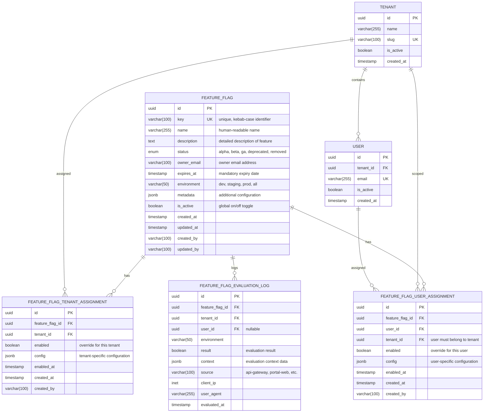

# ARCH-10: Complete Feature Flags Framework Architecture and Implementation Specification

## Executive Summary

This document provides a comprehensive, implementation-ready specification for the MaxAI platform feature flags framework. Every component, API, data structure, and integration pattern is specified in exact detail to prevent ambiguity during AI agent implementation.

## Table of Contents
1. [Data Model Specification](#data-model-specification)
2. [Evaluation Engine Architecture](#evaluation-engine-architecture)  
3. [API Specification](#api-specification)
4. [Client Integration Architecture](#client-integration-architecture)
5. [Governance and Lifecycle](#governance-and-lifecycle)
6. [Implementation Requirements](#implementation-requirements)
7. [Testing Specifications](#testing-specifications)
8. [Performance Requirements](#performance-requirements)
9. [Security Specifications](#security-specifications)
10. [Deployment and Operations](#deployment-and-operations)

## Data Model Specification

### Entity Relationship Diagram (ERD)



### Database Schema (PostgreSQL)

```sql
-- Feature flags core table
CREATE TABLE feature_flags (
    id UUID PRIMARY KEY DEFAULT gen_random_uuid(),
    key VARCHAR(100) NOT NULL UNIQUE CHECK (key ~ '^[a-z0-9-]+$'),
    name VARCHAR(255) NOT NULL,
    description TEXT NOT NULL,
    status VARCHAR(20) NOT NULL CHECK (status IN ('alpha', 'beta', 'ga', 'deprecated', 'removed')),
    owner_email VARCHAR(100) NOT NULL CHECK (owner_email ~ '^[^@]+@[^@]+\.[^@]+$'),
    expires_at TIMESTAMP NOT NULL CHECK (expires_at > NOW()),
    environment VARCHAR(20) NOT NULL DEFAULT 'all' CHECK (environment IN ('dev', 'staging', 'prod', 'all')),
    metadata JSONB DEFAULT '{}',
    is_active BOOLEAN NOT NULL DEFAULT true,
    created_at TIMESTAMP NOT NULL DEFAULT NOW(),
    updated_at TIMESTAMP NOT NULL DEFAULT NOW(),
    created_by VARCHAR(100) NOT NULL,
    updated_by VARCHAR(100) NOT NULL
);

-- Indexes for performance
CREATE INDEX idx_feature_flags_key ON feature_flags(key);
CREATE INDEX idx_feature_flags_status ON feature_flags(status);
CREATE INDEX idx_feature_flags_environment ON feature_flags(environment);
CREATE INDEX idx_feature_flags_expires_at ON feature_flags(expires_at);
CREATE INDEX idx_feature_flags_is_active ON feature_flags(is_active);

-- Tenant-level assignments
CREATE TABLE feature_flag_tenant_assignments (
    id UUID PRIMARY KEY DEFAULT gen_random_uuid(),
    feature_flag_id UUID NOT NULL REFERENCES feature_flags(id) ON DELETE CASCADE,
    tenant_id UUID NOT NULL,
    enabled BOOLEAN NOT NULL DEFAULT true,
    config JSONB DEFAULT '{}',
    enabled_at TIMESTAMP NOT NULL DEFAULT NOW(),
    created_at TIMESTAMP NOT NULL DEFAULT NOW(),
    created_by VARCHAR(100) NOT NULL,
    UNIQUE(feature_flag_id, tenant_id)
);

CREATE INDEX idx_ff_tenant_flag_id ON feature_flag_tenant_assignments(feature_flag_id);
CREATE INDEX idx_ff_tenant_tenant_id ON feature_flag_tenant_assignments(tenant_id);

-- User-level assignments
CREATE TABLE feature_flag_user_assignments (
    id UUID PRIMARY KEY DEFAULT gen_random_uuid(),
    feature_flag_id UUID NOT NULL REFERENCES feature_flags(id) ON DELETE CASCADE,
    user_id UUID NOT NULL,
    tenant_id UUID NOT NULL,
    enabled BOOLEAN NOT NULL DEFAULT true,
    config JSONB DEFAULT '{}',
    enabled_at TIMESTAMP NOT NULL DEFAULT NOW(),
    created_at TIMESTAMP NOT NULL DEFAULT NOW(),
    created_by VARCHAR(100) NOT NULL,
    UNIQUE(feature_flag_id, user_id)
);

CREATE INDEX idx_ff_user_flag_id ON feature_flag_user_assignments(feature_flag_id);
CREATE INDEX idx_ff_user_user_id ON feature_flag_user_assignments(user_id);
CREATE INDEX idx_ff_user_tenant_id ON feature_flag_user_assignments(tenant_id);

-- Evaluation audit log
CREATE TABLE feature_flag_evaluation_logs (
    id UUID PRIMARY KEY DEFAULT gen_random_uuid(),
    feature_flag_id UUID NOT NULL REFERENCES feature_flags(id) ON DELETE CASCADE,
    tenant_id UUID NOT NULL,
    user_id UUID,
    environment VARCHAR(20) NOT NULL,
    result BOOLEAN NOT NULL,
    context JSONB DEFAULT '{}',
    source VARCHAR(100) NOT NULL,
    client_ip INET,
    user_agent VARCHAR(255),
    evaluated_at TIMESTAMP NOT NULL DEFAULT NOW()
);

-- Partitioned by month for performance
CREATE INDEX idx_ff_eval_flag_id ON feature_flag_evaluation_logs(feature_flag_id);
CREATE INDEX idx_ff_eval_tenant_id ON feature_flag_evaluation_logs(tenant_id);
CREATE INDEX idx_ff_eval_evaluated_at ON feature_flag_evaluation_logs(evaluated_at);

-- Trigger to update updated_at timestamp
CREATE OR REPLACE FUNCTION update_updated_at_column()
RETURNS TRIGGER AS $$
BEGIN
    NEW.updated_at = NOW();
    RETURN NEW;
END;
$$ language 'plpgsql';

CREATE TRIGGER update_feature_flags_updated_at BEFORE UPDATE ON feature_flags FOR EACH ROW EXECUTE FUNCTION update_updated_at_column();
```

### Data Validation Rules

```typescript
// libs/shared/validation/src/schemas/feature-flags.ts
import { z } from 'zod';

export const FeatureFlagStatus = z.enum(['alpha', 'beta', 'ga', 'deprecated', 'removed']);
export const Environment = z.enum(['dev', 'staging', 'prod', 'all']);

export const FeatureFlagSchema = z.object({
  id: z.string().uuid().optional(),
  key: z.string()
    .min(3, 'Key must be at least 3 characters')
    .max(100, 'Key must be at most 100 characters')
    .regex(/^[a-z0-9-]+$/, 'Key must be kebab-case (lowercase letters, numbers, hyphens only)'),
  name: z.string()
    .min(5, 'Name must be at least 5 characters')
    .max(255, 'Name must be at most 255 characters'),
  description: z.string()
    .min(20, 'Description must be at least 20 characters')
    .max(1000, 'Description must be at most 1000 characters'),
  status: FeatureFlagStatus,
  owner_email: z.string().email('Must be a valid email address'),
  expires_at: z.string().datetime('Must be a valid ISO 8601 datetime')
    .refine((date) => new Date(date) > new Date(), 'Expiry date must be in the future'),
  environment: Environment.default('all'),
  metadata: z.record(z.any()).default({}),
  is_active: z.boolean().default(true),
});

export const FeatureFlagAssignmentSchema = z.object({
  id: z.string().uuid().optional(),
  feature_flag_id: z.string().uuid(),
  tenant_id: z.string().uuid().optional(),
  user_id: z.string().uuid().optional(),
  enabled: z.boolean().default(true),
  config: z.record(z.any()).default({}),
});

export const FeatureFlagEvaluationContextSchema = z.object({
  tenant_id: z.string().uuid(),
  user_id: z.string().uuid().optional(),
  environment: Environment,
  feature_keys: z.array(z.string()).optional(),
  include_metadata: z.boolean().default(false),
});

export type FeatureFlagData = z.infer<typeof FeatureFlagSchema>;
export type FeatureFlagAssignment = z.infer<typeof FeatureFlagAssignmentSchema>;
export type FeatureFlagEvaluationContext = z.infer<typeof FeatureFlagEvaluationContextSchema>;
```

## Evaluation Engine Architecture

### Core Evaluation Logic

```typescript
// libs/shared/feature-flags/src/lib/evaluation-engine.ts

export interface FeatureFlagEvaluationResult {
  flag_key: string;
  enabled: boolean;
  variant?: string;
  metadata?: Record<string, any>;
  source: 'user' | 'tenant' | 'global' | 'default';
  evaluated_at: string;
}

export interface EvaluationContext {
  tenant_id: string;
  user_id?: string;
  environment: 'dev' | 'staging' | 'prod';
  ip_address?: string;
  user_agent?: string;
  additional_context?: Record<string, any>;
}

export class FeatureFlagEvaluationEngine {
  private cache: Map<string, CachedEvaluation> = new Map();
  private readonly CACHE_TTL_MS = 60000; // 1 minute cache

  /**
   * Evaluate a single feature flag for the given context
   * 
   * Evaluation priority (highest to lowest):
   * 1. User-specific assignment
   * 2. Tenant-specific assignment  
   * 3. Global flag configuration
   * 4. Default behavior (GA features are enabled, others disabled)
   */
  async evaluateFlag(
    flagKey: string, 
    context: EvaluationContext
  ): Promise<FeatureFlagEvaluationResult> {
    
    // Step 1: Check cache
    const cacheKey = this.buildCacheKey(flagKey, context);
    const cached = this.getCachedResult(cacheKey);
    if (cached) {
      return cached;
    }

    // Step 2: Load flag from database
    const flag = await this.loadFlag(flagKey, context.environment);
    
    // Step 3: If flag doesn't exist, apply default behavior
    if (!flag) {
      const result = this.createDefaultResult(flagKey, 'default');
      this.cacheResult(cacheKey, result);
      await this.logEvaluation(flagKey, context, result);
      return result;
    }

    // Step 4: Check if flag is globally inactive
    if (!flag.is_active) {
      const result = this.createResult(flag, false, 'global', 'Flag is globally disabled');
      this.cacheResult(cacheKey, result);
      await this.logEvaluation(flagKey, context, result);
      return result;
    }

    // Step 5: Check user-specific assignment (highest priority)
    if (context.user_id) {
      const userAssignment = await this.loadUserAssignment(flag.id, context.user_id);
      if (userAssignment) {
        const result = this.createResult(flag, userAssignment.enabled, 'user', userAssignment.config);
        this.cacheResult(cacheKey, result);
        await this.logEvaluation(flagKey, context, result);
        return result;
      }
    }

    // Step 6: Check tenant-specific assignment (medium priority)
    const tenantAssignment = await this.loadTenantAssignment(flag.id, context.tenant_id);
    if (tenantAssignment) {
      const result = this.createResult(flag, tenantAssignment.enabled, 'tenant', tenantAssignment.config);
      this.cacheResult(cacheKey, result);
      await this.logEvaluation(flagKey, context, result);
      return result;
    }

    // Step 7: Apply global flag rules (lowest priority)
    const enabled = this.evaluateGlobalRules(flag, context);
    const result = this.createResult(flag, enabled, 'global');
    this.cacheResult(cacheKey, result);
    await this.logEvaluation(flagKey, context, result);
    return result;
  }

  /**
   * Evaluate multiple feature flags in a single operation
   */
  async evaluateFlags(
    flagKeys: string[], 
    context: EvaluationContext
  ): Promise<Record<string, FeatureFlagEvaluationResult>> {
    const results: Record<string, FeatureFlagEvaluationResult> = {};
    
    // Use Promise.allSettled to handle partial failures
    const evaluations = await Promise.allSettled(
      flagKeys.map(async (key) => ({
        key,
        result: await this.evaluateFlag(key, context)
      }))
    );

    for (const evaluation of evaluations) {
      if (evaluation.status === 'fulfilled') {
        results[evaluation.value.key] = evaluation.value.result;
      } else {
        // Log error and return default disabled result
        console.error(`Failed to evaluate flag ${flagKeys}:`, evaluation.reason);
        results[evaluation.reason?.key || 'unknown'] = this.createDefaultResult(
          evaluation.reason?.key || 'unknown', 
          'default'
        );
      }
    }

    return results;
  }

  /**
   * Global rule evaluation based on flag status and environment
   */
  private evaluateGlobalRules(flag: FeatureFlagData, context: EvaluationContext): boolean {
    // Check environment match
    if (flag.environment !== 'all' && flag.environment !== context.environment) {
      return false;
    }

    // Status-based rules
    switch (flag.status) {
      case 'ga':
        return true; // GA features are enabled by default
      case 'beta':
        return false; // Beta features require explicit assignment
      case 'alpha':
        return false; // Alpha features require explicit assignment
      case 'deprecated':
        return false; // Deprecated features are disabled
      case 'removed':
        return false; // Removed features are disabled
      default:
        return false; // Unknown status defaults to disabled
    }
  }

  /**
   * Create standardized result object
   */
  private createResult(
    flag: FeatureFlagData, 
    enabled: boolean, 
    source: FeatureFlagEvaluationResult['source'], 
    config?: any
  ): FeatureFlagEvaluationResult {
    return {
      flag_key: flag.key,
      enabled,
      metadata: config || flag.metadata,
      source,
      evaluated_at: new Date().toISOString(),
    };
  }

  /**
   * Create default result for non-existent flags
   */
  private createDefaultResult(
    flagKey: string, 
    source: FeatureFlagEvaluationResult['source']
  ): FeatureFlagEvaluationResult {
    return {
      flag_key: flagKey,
      enabled: true, // Missing flags are considered GA (released)
      source,
      evaluated_at: new Date().toISOString(),
    };
  }

  /**
   * Build cache key for result caching
   */
  private buildCacheKey(flagKey: string, context: EvaluationContext): string {
    return `ff:${flagKey}:${context.tenant_id}:${context.user_id || 'anonymous'}:${context.environment}`;
  }

  /**
   * Database operations (to be implemented by specific adapter)
   */
  protected abstract loadFlag(key: string, environment: string): Promise<FeatureFlagData | null>;
  protected abstract loadUserAssignment(flagId: string, userId: string): Promise<FeatureFlagAssignment | null>;
  protected abstract loadTenantAssignment(flagId: string, tenantId: string): Promise<FeatureFlagAssignment | null>;
  protected abstract logEvaluation(flagKey: string, context: EvaluationContext, result: FeatureFlagEvaluationResult): Promise<void>;
}
```

### Caching Strategy

```typescript
// libs/shared/feature-flags/src/lib/cache-adapter.ts

export interface CachedEvaluation {
  result: FeatureFlagEvaluationResult;
  cached_at: number;
  ttl_ms: number;
}

export class FeatureFlagCache {
  private cache = new Map<string, CachedEvaluation>();
  private readonly DEFAULT_TTL_MS = 60000; // 1 minute
  private readonly MAX_CACHE_SIZE = 10000;

  set(key: string, result: FeatureFlagEvaluationResult, ttlMs?: number): void {
    // Implement LRU eviction if cache is full
    if (this.cache.size >= this.MAX_CACHE_SIZE) {
      this.evictOldest();
    }

    this.cache.set(key, {
      result,
      cached_at: Date.now(),
      ttl_ms: ttlMs || this.DEFAULT_TTL_MS,
    });
  }

  get(key: string): FeatureFlagEvaluationResult | null {
    const cached = this.cache.get(key);
    
    if (!cached) {
      return null;
    }

    // Check if cache entry has expired
    if (Date.now() - cached.cached_at > cached.ttl_ms) {
      this.cache.delete(key);
      return null;
    }

    return cached.result;
  }

  invalidate(pattern?: string): void {
    if (pattern) {
      // Pattern-based invalidation (e.g., "ff:my-feature:*")
      for (const key of this.cache.keys()) {
        if (this.matchesPattern(key, pattern)) {
          this.cache.delete(key);
        }
      }
    } else {
      // Clear all cache
      this.cache.clear();
    }
  }

  private evictOldest(): void {
    let oldestKey: string | null = null;
    let oldestTime = Date.now();

    for (const [key, cached] of this.cache.entries()) {
      if (cached.cached_at < oldestTime) {
        oldestTime = cached.cached_at;
        oldestKey = key;
      }
    }

    if (oldestKey) {
      this.cache.delete(oldestKey);
    }
  }

  private matchesPattern(key: string, pattern: string): boolean {
    // Simple glob pattern matching (* wildcard only)
    const regex = new RegExp('^' + pattern.replace(/\*/g, '.*') + '$');
    return regex.test(key);
  }
}
```

## API Specification

### REST API Endpoints

```typescript
// apps/api/src/feature-flags/feature-flags.controller.ts

/**
 * Feature Flags Management API
 * 
 * Base URL: /api/v1/feature-flags
 * Authentication: Required (Bearer token)
 * Rate Limiting: 1000 requests per hour per user
 */

@Controller('api/v1/feature-flags')
@UseGuards(AuthGuard, RoleGuard)
@ApiTags('Feature Flags')
export class FeatureFlagsController {

  /**
   * GET /api/v1/feature-flags
   * List all feature flags (admin only)
   */
  @Get()
  @Roles('admin', 'feature_flag_manager')
  @ApiOperation({ summary: 'List all feature flags' })
  @ApiQuery({ name: 'status', enum: FeatureFlagStatus, required: false })
  @ApiQuery({ name: 'environment', enum: Environment, required: false })
  @ApiQuery({ name: 'owner_email', type: String, required: false })
  @ApiQuery({ name: 'limit', type: Number, required: false, description: 'Max 100' })
  @ApiQuery({ name: 'offset', type: Number, required: false })
  @ApiResponse({ status: 200, type: FeatureFlagListResponse })
  async listFeatureFlags(
    @Query() query: ListFeatureFlagsQueryDto
  ): Promise<FeatureFlagListResponse> {
    return await this.featureFlagsService.list(query);
  }

  /**
   * POST /api/v1/feature-flags
   * Create a new feature flag (admin only)
   */
  @Post()
  @Roles('admin', 'feature_flag_manager')
  @ApiOperation({ summary: 'Create a new feature flag' })
  @ApiBody({ type: CreateFeatureFlagDto })
  @ApiResponse({ status: 201, type: FeatureFlagResponse })
  @ApiResponse({ status: 400, type: ValidationErrorResponse })
  @ApiResponse({ status: 409, type: ConflictErrorResponse })
  async createFeatureFlag(
    @Body() createDto: CreateFeatureFlagDto,
    @CurrentUser() user: AuthenticatedUser
  ): Promise<FeatureFlagResponse> {
    return await this.featureFlagsService.create(createDto, user);
  }

  /**
   * GET /api/v1/feature-flags/:key
   * Get a specific feature flag by key (admin only)
   */
  @Get(':key')
  @Roles('admin', 'feature_flag_manager')
  @ApiOperation({ summary: 'Get feature flag by key' })
  @ApiParam({ name: 'key', description: 'Feature flag key' })
  @ApiResponse({ status: 200, type: FeatureFlagResponse })
  @ApiResponse({ status: 404, type: NotFoundErrorResponse })
  async getFeatureFlag(
    @Param('key') key: string
  ): Promise<FeatureFlagResponse> {
    return await this.featureFlagsService.getByKey(key);
  }

  /**
   * PUT /api/v1/feature-flags/:key
   * Update a feature flag (admin only)
   */
  @Put(':key')
  @Roles('admin', 'feature_flag_manager')
  @ApiOperation({ summary: 'Update feature flag' })
  @ApiParam({ name: 'key', description: 'Feature flag key' })
  @ApiBody({ type: UpdateFeatureFlagDto })
  @ApiResponse({ status: 200, type: FeatureFlagResponse })
  @ApiResponse({ status: 404, type: NotFoundErrorResponse })
  async updateFeatureFlag(
    @Param('key') key: string,
    @Body() updateDto: UpdateFeatureFlagDto,
    @CurrentUser() user: AuthenticatedUser
  ): Promise<FeatureFlagResponse> {
    return await this.featureFlagsService.update(key, updateDto, user);
  }

  /**
   * DELETE /api/v1/feature-flags/:key
   * Soft delete a feature flag (admin only)
   */
  @Delete(':key')
  @Roles('admin', 'feature_flag_manager')
  @ApiOperation({ summary: 'Delete feature flag' })
  @ApiParam({ name: 'key', description: 'Feature flag key' })
  @ApiResponse({ status: 204 })
  @ApiResponse({ status: 404, type: NotFoundErrorResponse })
  async deleteFeatureFlag(
    @Param('key') key: string,
    @CurrentUser() user: AuthenticatedUser
  ): Promise<void> {
    await this.featureFlagsService.delete(key, user);
  }

  /**
   * POST /api/v1/feature-flags/:key/assignments/tenants
   * Assign feature flag to tenant
   */
  @Post(':key/assignments/tenants')
  @Roles('admin', 'feature_flag_manager')
  @ApiOperation({ summary: 'Assign feature flag to tenant' })
  @ApiParam({ name: 'key', description: 'Feature flag key' })
  @ApiBody({ type: CreateTenantAssignmentDto })
  @ApiResponse({ status: 201, type: AssignmentResponse })
  async assignToTenant(
    @Param('key') key: string,
    @Body() assignmentDto: CreateTenantAssignmentDto,
    @CurrentUser() user: AuthenticatedUser
  ): Promise<AssignmentResponse> {
    return await this.featureFlagsService.assignToTenant(key, assignmentDto, user);
  }

  /**
   * POST /api/v1/feature-flags/:key/assignments/users
   * Assign feature flag to user
   */
  @Post(':key/assignments/users')
  @Roles('admin', 'feature_flag_manager')
  @ApiOperation({ summary: 'Assign feature flag to user' })
  @ApiParam({ name: 'key', description: 'Feature flag key' })
  @ApiBody({ type: CreateUserAssignmentDto })
  @ApiResponse({ status: 201, type: AssignmentResponse })
  async assignToUser(
    @Param('key') key: string,
    @Body() assignmentDto: CreateUserAssignmentDto,
    @CurrentUser() user: AuthenticatedUser
  ): Promise<AssignmentResponse> {
    return await this.featureFlagsService.assignToUser(key, assignmentDto, user);
  }

  /**
   * POST /api/v1/feature-flags/evaluate
   * Evaluate feature flags for current user context
   */
  @Post('evaluate')
  @ApiOperation({ summary: 'Evaluate feature flags for current context' })
  @ApiBody({ type: EvaluateFeatureFlagsDto })
  @ApiResponse({ status: 200, type: FeatureFlagEvaluationResponse })
  async evaluateFeatureFlags(
    @Body() evaluationDto: EvaluateFeatureFlagsDto,
    @CurrentUser() user: AuthenticatedUser,
    @Req() request: Request
  ): Promise<FeatureFlagEvaluationResponse> {
    const context: EvaluationContext = {
      tenant_id: user.tenant_id,
      user_id: user.user_id,
      environment: this.configService.get('NODE_ENV') as Environment,
      ip_address: request.ip,
      user_agent: request.headers['user-agent'],
    };

    return await this.featureFlagsService.evaluate(
      evaluationDto.feature_keys, 
      context
    );
  }

  /**
   * GET /api/v1/feature-flags/config
   * Get feature flag configuration for authenticated user (client-side consumption)
   */
  @Get('config')
  @ApiOperation({ summary: 'Get feature flags configuration for current user' })
  @ApiQuery({ name: 'keys', type: [String], required: false, description: 'Specific keys to evaluate' })
  @ApiResponse({ status: 200, type: ClientFeatureFlagConfigResponse })
  async getClientConfig(
    @Query('keys') keys: string[] | undefined,
    @CurrentUser() user: AuthenticatedUser,
    @Req() request: Request
  ): Promise<ClientFeatureFlagConfigResponse> {
    const context: EvaluationContext = {
      tenant_id: user.tenant_id,
      user_id: user.user_id,
      environment: this.configService.get('NODE_ENV') as Environment,
      ip_address: request.ip,
      user_agent: request.headers['user-agent'],
    };

    return await this.featureFlagsService.getClientConfig(keys, context);
  }
}
```

### Request/Response DTOs

```typescript
// apps/api/src/feature-flags/dto/create-feature-flag.dto.ts

export class CreateFeatureFlagDto {
  @ApiProperty({ example: 'new-dashboard-ui', description: 'Unique kebab-case identifier' })
  @IsString()
  @Matches(/^[a-z0-9-]+$/, { message: 'Key must be kebab-case' })
  @Length(3, 100)
  key: string;

  @ApiProperty({ example: 'New Dashboard UI', description: 'Human-readable name' })
  @IsString()
  @Length(5, 255)
  name: string;

  @ApiProperty({ 
    example: 'New React-based dashboard with improved performance and accessibility',
    description: 'Detailed description of the feature'
  })
  @IsString()
  @Length(20, 1000)
  description: string;

  @ApiProperty({ enum: FeatureFlagStatus, example: 'alpha' })
  @IsEnum(FeatureFlagStatus)
  status: FeatureFlagStatus;

  @ApiProperty({ example: 'john.doe@company.com', description: 'Owner email address' })
  @IsEmail()
  owner_email: string;

  @ApiProperty({ 
    example: '2024-12-31T23:59:59.000Z', 
    description: 'Mandatory expiry date (ISO 8601 format)'
  })
  @IsISO8601()
  @IsDateString()
  expires_at: string;

  @ApiProperty({ enum: Environment, example: 'all', required: false })
  @IsEnum(Environment)
  @IsOptional()
  environment?: Environment = 'all';

  @ApiProperty({ 
    example: { rollout_percentage: 10 }, 
    description: 'Additional metadata',
    required: false 
  })
  @IsObject()
  @IsOptional()
  metadata?: Record<string, any> = {};

  @ApiProperty({ example: true, required: false })
  @IsBoolean()
  @IsOptional()
  is_active?: boolean = true;
}

export class UpdateFeatureFlagDto extends PartialType(
  OmitType(CreateFeatureFlagDto, ['key'] as const)
) {}

export class CreateTenantAssignmentDto {
  @ApiProperty({ example: '123e4567-e89b-12d3-a456-426614174000' })
  @IsUUID()
  tenant_id: string;

  @ApiProperty({ example: true })
  @IsBoolean()
  enabled: boolean;

  @ApiProperty({ example: { custom_config: 'value' }, required: false })
  @IsObject()
  @IsOptional()
  config?: Record<string, any> = {};
}

export class CreateUserAssignmentDto {
  @ApiProperty({ example: '123e4567-e89b-12d3-a456-426614174001' })
  @IsUUID()
  user_id: string;

  @ApiProperty({ example: true })
  @IsBoolean()
  enabled: boolean;

  @ApiProperty({ example: { custom_config: 'value' }, required: false })
  @IsObject()
  @IsOptional()
  config?: Record<string, any> = {};
}

export class EvaluateFeatureFlagsDto {
  @ApiProperty({ 
    example: ['new-dashboard-ui', 'enhanced-billing'], 
    description: 'Feature flag keys to evaluate'
  })
  @IsArray()
  @IsString({ each: true })
  feature_keys: string[];

  @ApiProperty({ example: false, required: false })
  @IsBoolean()
  @IsOptional()
  include_metadata?: boolean = false;
}

export class ListFeatureFlagsQueryDto {
  @ApiProperty({ enum: FeatureFlagStatus, required: false })
  @IsEnum(FeatureFlagStatus)
  @IsOptional()
  status?: FeatureFlagStatus;

  @ApiProperty({ enum: Environment, required: false })
  @IsEnum(Environment)
  @IsOptional()
  environment?: Environment;

  @ApiProperty({ example: 'john.doe@company.com', required: false })
  @IsEmail()
  @IsOptional()
  owner_email?: string;

  @ApiProperty({ example: 50, minimum: 1, maximum: 100, required: false })
  @IsInt()
  @Min(1)
  @Max(100)
  @IsOptional()
  limit?: number = 50;

  @ApiProperty({ example: 0, minimum: 0, required: false })
  @IsInt()
  @Min(0)
  @IsOptional()
  offset?: number = 0;
}
```

### Response DTOs

```typescript
// apps/api/src/feature-flags/dto/responses.dto.ts

export class FeatureFlagResponse {
  @ApiProperty({ example: '123e4567-e89b-12d3-a456-426614174000' })
  id: string;

  @ApiProperty({ example: 'new-dashboard-ui' })
  key: string;

  @ApiProperty({ example: 'New Dashboard UI' })
  name: string;

  @ApiProperty({ example: 'Enhanced dashboard with better UX' })
  description: string;

  @ApiProperty({ enum: FeatureFlagStatus, example: 'alpha' })
  status: FeatureFlagStatus;

  @ApiProperty({ example: 'john.doe@company.com' })
  owner_email: string;

  @ApiProperty({ example: '2024-12-31T23:59:59.000Z' })
  expires_at: string;

  @ApiProperty({ enum: Environment, example: 'all' })
  environment: Environment;

  @ApiProperty({ example: { rollout_percentage: 10 } })
  metadata: Record<string, any>;

  @ApiProperty({ example: true })
  is_active: boolean;

  @ApiProperty({ example: '2024-01-15T10:30:00.000Z' })
  created_at: string;

  @ApiProperty({ example: '2024-01-15T15:45:00.000Z' })
  updated_at: string;

  @ApiProperty({ example: 'admin@company.com' })
  created_by: string;

  @ApiProperty({ example: 'admin@company.com' })
  updated_by: string;
}

export class FeatureFlagListResponse {
  @ApiProperty({ type: [FeatureFlagResponse] })
  flags: FeatureFlagResponse[];

  @ApiProperty({ example: 25 })
  total: number;

  @ApiProperty({ example: 50 })
  limit: number;

  @ApiProperty({ example: 0 })
  offset: number;

  @ApiProperty({ example: true })
  has_more: boolean;
}

export class AssignmentResponse {
  @ApiProperty({ example: '123e4567-e89b-12d3-a456-426614174001' })
  id: string;

  @ApiProperty({ example: '123e4567-e89b-12d3-a456-426614174000' })
  feature_flag_id: string;

  @ApiProperty({ example: '123e4567-e89b-12d3-a456-426614174002', required: false })
  tenant_id?: string;

  @ApiProperty({ example: '123e4567-e89b-12d3-a456-426614174003', required: false })
  user_id?: string;

  @ApiProperty({ example: true })
  enabled: boolean;

  @ApiProperty({ example: { custom_config: 'value' } })
  config: Record<string, any>;

  @ApiProperty({ example: '2024-01-15T10:30:00.000Z' })
  created_at: string;

  @ApiProperty({ example: 'admin@company.com' })
  created_by: string;
}

export class FeatureFlagEvaluationResultDto {
  @ApiProperty({ example: 'new-dashboard-ui' })
  flag_key: string;

  @ApiProperty({ example: true })
  enabled: boolean;

  @ApiProperty({ example: { rollout_percentage: 10 }, required: false })
  metadata?: Record<string, any>;

  @ApiProperty({ enum: ['user', 'tenant', 'global', 'default'], example: 'user' })
  source: 'user' | 'tenant' | 'global' | 'default';

  @ApiProperty({ example: '2024-01-15T10:30:00.000Z' })
  evaluated_at: string;
}

export class FeatureFlagEvaluationResponse {
  @ApiProperty({ 
    example: { 
      'new-dashboard-ui': { 
        flag_key: 'new-dashboard-ui', 
        enabled: true, 
        source: 'user', 
        evaluated_at: '2024-01-15T10:30:00.000Z' 
      } 
    } 
  })
  flags: Record<string, FeatureFlagEvaluationResultDto>;

  @ApiProperty({ example: '123e4567-e89b-12d3-a456-426614174000' })
  tenant_id: string;

  @ApiProperty({ example: '123e4567-e89b-12d3-a456-426614174001', required: false })
  user_id?: string;

  @ApiProperty({ enum: Environment, example: 'prod' })
  environment: Environment;

  @ApiProperty({ example: '2024-01-15T10:30:00.000Z' })
  evaluated_at: string;
}

export class ClientFeatureFlagConfigResponse {
  @ApiProperty({ 
    example: { 
      'new-dashboard-ui': true, 
      'enhanced-billing': false 
    } 
  })
  flags: Record<string, boolean>;

  @ApiProperty({ example: '2024-01-15T10:30:00.000Z' })
  generated_at: string;

  @ApiProperty({ example: 60, description: 'Cache TTL in seconds' })
  cache_ttl: number;
}
```

## Client Integration Architecture

### React Hook for Feature Flags

```typescript
// libs/ui/components/src/hooks/use-feature-flags.ts

import { createContext, useContext, useEffect, useState } from 'react';
import { useQuery } from '@tanstack/react-query';

export interface FeatureFlagsContextValue {
  flags: Record<string, boolean>;
  isLoading: boolean;
  error: Error | null;
  isEnabled: (flagKey: string) => boolean;
  refresh: () => void;
}

export const FeatureFlagsContext = createContext<FeatureFlagsContextValue | null>(null);

/**
 * Hook to access feature flags in React components
 * 
 * @example
 * function MyComponent() {
 *   const { isEnabled, isLoading } = useFeatureFlags();
 *   
 *   if (isLoading) return <Spinner />;
 *   
 *   return (
 *     <div>
 *       {isEnabled('new-dashboard-ui') ? (
 *         <NewDashboard />
 *       ) : (
 *         <LegacyDashboard />
 *       )}
 *     </div>
 *   );
 * }
 */
export function useFeatureFlags(): FeatureFlagsContextValue {
  const context = useContext(FeatureFlagsContext);
  
  if (!context) {
    throw new Error('useFeatureFlags must be used within a FeatureFlagsProvider');
  }
  
  return context;
}

/**
 * Hook to check if a specific feature flag is enabled
 * 
 * @param flagKey - The feature flag key to check
 * @param defaultValue - Default value if flag is not found (default: false)
 * @returns boolean indicating if the flag is enabled
 */
export function useFeatureFlag(flagKey: string, defaultValue: boolean = false): boolean {
  const { isEnabled } = useFeatureFlags();
  
  try {
    return isEnabled(flagKey);
  } catch {
    // Fallback to default if context is not available
    return defaultValue;
  }
}

/**
 * Provider component that fetches and manages feature flags
 */
export interface FeatureFlagsProviderProps {
  children: React.ReactNode;
  apiClient: FeatureFlagsApiClient;
  refreshInterval?: number; // in milliseconds
}

export function FeatureFlagsProvider({ 
  children, 
  apiClient, 
  refreshInterval = 60000 // 1 minute
}: FeatureFlagsProviderProps) {
  const {
    data: flagsResponse,
    isLoading,
    error,
    refetch
  } = useQuery({
    queryKey: ['feature-flags-config'],
    queryFn: () => apiClient.getClientConfig(),
    refetchInterval: refreshInterval,
    staleTime: 30000, // Consider data stale after 30 seconds
    retry: (failureCount, error) => {
      // Retry up to 3 times for network errors, but not for 4xx errors
      if (failureCount >= 3) return false;
      if (error && 'status' in error && (error.status as number) >= 400 && (error.status as number) < 500) {
        return false;
      }
      return true;
    }
  });

  const flags = flagsResponse?.flags || {};

  const isEnabled = (flagKey: string): boolean => {
    // Return flag value if it exists, otherwise default to true (GA behavior)
    return flags[flagKey] !== undefined ? flags[flagKey] : true;
  };

  const contextValue: FeatureFlagsContextValue = {
    flags,
    isLoading,
    error: error as Error | null,
    isEnabled,
    refresh: refetch,
  };

  return (
    <FeatureFlagsContext.Provider value={contextValue}>
      {children}
    </FeatureFlagsContext.Provider>
  );
}
```

### Feature Flag Components

```typescript
// libs/ui/components/src/components/feature-flag/feature-gate.tsx

export interface FeatureGateProps {
  flagKey: string;
  children: React.ReactNode;
  fallback?: React.ReactNode;
  loading?: React.ReactNode;
  onFlagChange?: (enabled: boolean) => void;
}

/**
 * Component that conditionally renders children based on feature flag state
 * 
 * @example
 * <FeatureGate 
 *   flagKey="new-dashboard-ui"
 *   fallback={<LegacyDashboard />}
 *   loading={<Spinner />}
 * >
 *   <NewDashboard />
 * </FeatureGate>
 */
export function FeatureGate({ 
  flagKey, 
  children, 
  fallback = null, 
  loading = null,
  onFlagChange
}: FeatureGateProps) {
  const { isEnabled, isLoading } = useFeatureFlags();
  const flagEnabled = isEnabled(flagKey);

  // Notify parent component of flag changes
  useEffect(() => {
    if (!isLoading && onFlagChange) {
      onFlagChange(flagEnabled);
    }
  }, [flagEnabled, isLoading, onFlagChange]);

  if (isLoading && loading) {
    return <>{loading}</>;
  }

  if (flagEnabled) {
    return <>{children}</>;
  }

  return <>{fallback}</>;
}

/**
 * Higher-order component for feature flag gating
 */
export function withFeatureFlag<P extends object>(
  flagKey: string,
  FallbackComponent?: React.ComponentType<P>
) {
  return function FeatureFlagHOC(WrappedComponent: React.ComponentType<P>) {
    const WithFeatureFlagComponent = (props: P) => {
      return (
        <FeatureGate
          flagKey={flagKey}
          fallback={FallbackComponent ? <FallbackComponent {...props} /> : null}
        >
          <WrappedComponent {...props} />
        </FeatureGate>
      );
    };

    WithFeatureFlagComponent.displayName = `withFeatureFlag(${WrappedComponent.displayName || WrappedComponent.name})`;
    
    return WithFeatureFlagComponent;
  };
}
```

### API Client

```typescript
// libs/shared/api-client/src/lib/feature-flags-api.ts

export class FeatureFlagsApiClient {
  constructor(
    private httpClient: HttpClient,
    private baseUrl: string = '/api/v1/feature-flags'
  ) {}

  /**
   * Get client configuration for feature flags
   */
  async getClientConfig(keys?: string[]): Promise<ClientFeatureFlagConfigResponse> {
    const params = new URLSearchParams();
    if (keys && keys.length > 0) {
      keys.forEach(key => params.append('keys', key));
    }

    const url = `${this.baseUrl}/config${params.toString() ? `?${params}` : ''}`;
    return await this.httpClient.get<ClientFeatureFlagConfigResponse>(url);
  }

  /**
   * Evaluate specific feature flags
   */
  async evaluateFlags(flagKeys: string[]): Promise<FeatureFlagEvaluationResponse> {
    return await this.httpClient.post<FeatureFlagEvaluationResponse>(
      `${this.baseUrl}/evaluate`,
      { feature_keys: flagKeys }
    );
  }

  /**
   * Admin: List all feature flags
   */
  async listFlags(query?: ListFeatureFlagsQueryDto): Promise<FeatureFlagListResponse> {
    const params = new URLSearchParams();
    if (query?.status) params.append('status', query.status);
    if (query?.environment) params.append('environment', query.environment);
    if (query?.owner_email) params.append('owner_email', query.owner_email);
    if (query?.limit) params.append('limit', query.limit.toString());
    if (query?.offset) params.append('offset', query.offset.toString());

    const url = `${this.baseUrl}${params.toString() ? `?${params}` : ''}`;
    return await this.httpClient.get<FeatureFlagListResponse>(url);
  }

  /**
   * Admin: Create feature flag
   */
  async createFlag(flag: CreateFeatureFlagDto): Promise<FeatureFlagResponse> {
    return await this.httpClient.post<FeatureFlagResponse>(this.baseUrl, flag);
  }

  /**
   * Admin: Update feature flag
   */
  async updateFlag(key: string, updates: UpdateFeatureFlagDto): Promise<FeatureFlagResponse> {
    return await this.httpClient.put<FeatureFlagResponse>(`${this.baseUrl}/${key}`, updates);
  }

  /**
   * Admin: Delete feature flag
   */
  async deleteFlag(key: string): Promise<void> {
    await this.httpClient.delete(`${this.baseUrl}/${key}`);
  }

  /**
   * Admin: Assign flag to tenant
   */
  async assignToTenant(key: string, assignment: CreateTenantAssignmentDto): Promise<AssignmentResponse> {
    return await this.httpClient.post<AssignmentResponse>(
      `${this.baseUrl}/${key}/assignments/tenants`,
      assignment
    );
  }

  /**
   * Admin: Assign flag to user
   */
  async assignToUser(key: string, assignment: CreateUserAssignmentDto): Promise<AssignmentResponse> {
    return await this.httpClient.post<AssignmentResponse>(
      `${this.baseUrl}/${key}/assignments/users`,
      assignment
    );
  }
}
```

## Governance and Lifecycle

### Feature Flag Lifecycle States

```typescript
// libs/shared/feature-flags/src/lib/lifecycle.ts

export enum FeatureFlagLifecycleState {
  DRAFT = 'draft',           // Created but not yet deployed
  ALPHA = 'alpha',           // Limited alpha testing
  BETA = 'beta',             // Broader beta testing
  GA = 'ga',                 // Generally available
  DEPRECATED = 'deprecated', // Marked for removal
  REMOVED = 'removed'        // Removed from system
}

export interface FeatureFlagLifecyclePolicy {
  /** Maximum duration a flag can stay in alpha state (days) */
  maxAlphaDuration: number;
  
  /** Maximum duration a flag can stay in beta state (days) */
  maxBetaDuration: number;
  
  /** Maximum duration after GA before flag must be cleaned up (days) */
  maxGaCleanupDuration: number;
  
  /** Required approvals for state transitions */
  approvalRequirements: {
    [K in FeatureFlagLifecycleState]: {
      requiredRoles: string[];
      minimumApprovals: number;
      requiresOwnerApproval: boolean;
    };
  };
}

export const DEFAULT_LIFECYCLE_POLICY: FeatureFlagLifecyclePolicy = {
  maxAlphaDuration: 30,      // 30 days
  maxBetaDuration: 60,       // 60 days  
  maxGaCleanupDuration: 180, // 6 months
  
  approvalRequirements: {
    [FeatureFlagLifecycleState.DRAFT]: {
      requiredRoles: ['feature_flag_manager', 'admin'],
      minimumApprovals: 1,
      requiresOwnerApproval: true,
    },
    [FeatureFlagLifecycleState.ALPHA]: {
      requiredRoles: ['feature_flag_manager', 'admin'],
      minimumApprovals: 1,
      requiresOwnerApproval: true,
    },
    [FeatureFlagLifecycleState.BETA]: {
      requiredRoles: ['feature_flag_manager', 'admin', 'product_manager'],
      minimumApprovals: 2,
      requiresOwnerApproval: true,
    },
    [FeatureFlagLifecycleState.GA]: {
      requiredRoles: ['admin', 'product_manager'],
      minimumApprovals: 2,
      requiresOwnerApproval: false,
    },
    [FeatureFlagLifecycleState.DEPRECATED]: {
      requiredRoles: ['admin', 'product_manager'],
      minimumApprovals: 1,
      requiresOwnerApproval: false,
    },
    [FeatureFlagLifecycleState.REMOVED]: {
      requiredRoles: ['admin'],
      minimumApprovals: 1,
      requiresOwnerApproval: false,
    },
  },
};
```

### Ownership and Approval Workflow

```typescript
// libs/shared/feature-flags/src/lib/governance.ts

export interface FeatureFlagOwnership {
  owner_email: string;
  team: string;
  business_justification: string;
  technical_contact: string;
  product_contact?: string;
}

export interface FeatureFlagApproval {
  id: string;
  feature_flag_id: string;
  requested_state: FeatureFlagLifecycleState;
  current_state: FeatureFlagLifecycleState;
  requester_email: string;
  justification: string;
  approvers: FeatureFlagApprover[];
  status: 'pending' | 'approved' | 'rejected';
  created_at: string;
  expires_at: string;
}

export interface FeatureFlagApprover {
  email: string;
  role: string;
  status: 'pending' | 'approved' | 'rejected';
  approved_at?: string;
  comments?: string;
}

export class FeatureFlagGovernanceService {
  
  /**
   * Request state transition for a feature flag
   */
  async requestStateTransition(
    flagKey: string,
    newState: FeatureFlagLifecycleState,
    justification: string,
    requesterEmail: string
  ): Promise<FeatureFlagApproval> {
    
    const flag = await this.getFlag(flagKey);
    const policy = await this.getLifecyclePolicy();
    const requirements = policy.approvalRequirements[newState];
    
    // Validate transition is allowed
    this.validateStateTransition(flag.status as FeatureFlagLifecycleState, newState);
    
    // Create approval request
    const approval: FeatureFlagApproval = {
      id: generateUUID(),
      feature_flag_id: flag.id,
      requested_state: newState,
      current_state: flag.status as FeatureFlagLifecycleState,
      requester_email: requesterEmail,
      justification,
      approvers: await this.getRequiredApprovers(flag, requirements),
      status: 'pending',
      created_at: new Date().toISOString(),
      expires_at: new Date(Date.now() + 7 * 24 * 60 * 60 * 1000).toISOString(), // 7 days
    };
    
    await this.saveApproval(approval);
    await this.notifyApprovers(approval);
    
    return approval;
  }
  
  /**
   * Process an approval decision
   */
  async processApproval(
    approvalId: string,
    approverEmail: string,
    decision: 'approved' | 'rejected',
    comments?: string
  ): Promise<FeatureFlagApproval> {
    
    const approval = await this.getApproval(approvalId);
    
    // Update approver status
    const approver = approval.approvers.find(a => a.email === approverEmail);
    if (!approver) {
      throw new Error('Approver not found');
    }
    
    approver.status = decision;
    approver.approved_at = new Date().toISOString();
    approver.comments = comments;
    
    // Check if approval is complete
    const policy = await this.getLifecyclePolicy();
    const requirements = policy.approvalRequirements[approval.requested_state];
    
    const approvedCount = approval.approvers.filter(a => a.status === 'approved').length;
    const rejectedCount = approval.approvers.filter(a => a.status === 'rejected').length;
    
    if (rejectedCount > 0) {
      approval.status = 'rejected';
    } else if (approvedCount >= requirements.minimumApprovals) {
      approval.status = 'approved';
      
      // Auto-apply the state transition
      await this.applyStateTransition(approval);
    }
    
    await this.saveApproval(approval);
    await this.notifyRequestor(approval);
    
    return approval;
  }
  
  private validateStateTransition(
    currentState: FeatureFlagLifecycleState,
    newState: FeatureFlagLifecycleState
  ): void {
    const allowedTransitions: Record<FeatureFlagLifecycleState, FeatureFlagLifecycleState[]> = {
      [FeatureFlagLifecycleState.DRAFT]: [FeatureFlagLifecycleState.ALPHA],
      [FeatureFlagLifecycleState.ALPHA]: [FeatureFlagLifecycleState.BETA, FeatureFlagLifecycleState.DEPRECATED],
      [FeatureFlagLifecycleState.BETA]: [FeatureFlagLifecycleState.GA, FeatureFlagLifecycleState.DEPRECATED],
      [FeatureFlagLifecycleState.GA]: [FeatureFlagLifecycleState.DEPRECATED],
      [FeatureFlagLifecycleState.DEPRECATED]: [FeatureFlagLifecycleState.REMOVED],
      [FeatureFlagLifecycleState.REMOVED]: [],
    };
    
    const allowed = allowedTransitions[currentState] || [];
    if (!allowed.includes(newState)) {
      throw new Error(`Invalid state transition from ${currentState} to ${newState}`);
    }
  }
}
```

## Implementation Requirements

### Nx Project Structure

```json
// client/apps/feature-flags/project.json
{
  "name": "feature-flags",
  "sourceRoot": "apps/feature-flags/src",
  "projectType": "application",
  "tags": ["type:app", "framework:nest", "domain:core"],
  "targets": {
    "build": {
      "executor": "@nx/nest:build",
      "options": {
        "outputPath": "dist/apps/feature-flags",
        "main": "apps/feature-flags/src/main.ts",
        "tsConfig": "apps/feature-flags/tsconfig.app.json"
      }
    },
    "serve": {
      "executor": "@nx/nest:serve",
      "options": {
        "buildTarget": "feature-flags:build"
      }
    },
    "test": {
      "executor": "@nx/jest:jest",
      "options": {
        "jestConfig": "apps/feature-flags/jest.config.ts",
        "passWithNoTests": true
      }
    }
  }
}
```

```json
// client/libs/shared/feature-flags/project.json
{
  "name": "shared-feature-flags",
  "sourceRoot": "libs/shared/feature-flags/src",
  "projectType": "library", 
  "tags": ["type:lib", "layer:shared", "domain:core"],
  "targets": {
    "build": {
      "executor": "@nx/rollup:rollup",
      "options": {
        "outputPath": "dist/libs/shared/feature-flags",
        "tsConfig": "libs/shared/feature-flags/tsconfig.lib.json",
        "main": "libs/shared/feature-flags/src/index.ts"
      }
    },
    "test": {
      "executor": "@nx/vite:test",
      "options": {
        "config": "libs/shared/feature-flags/vite.config.ts"
      }
    }
  }
}
```

### Service Implementation Requirements

```typescript
// apps/feature-flags/src/feature-flags/feature-flags.service.ts

@Injectable()
export class FeatureFlagsService {
  private readonly evaluationEngine: FeatureFlagEvaluationEngine;
  private readonly cache: FeatureFlagCache;
  private readonly logger = new Logger(FeatureFlagsService.name);

  constructor(
    @InjectRepository(FeatureFlag)
    private readonly flagsRepository: Repository<FeatureFlag>,
    @InjectRepository(FeatureFlagTenantAssignment)
    private readonly tenantAssignmentsRepository: Repository<FeatureFlagTenantAssignment>,
    @InjectRepository(FeatureFlagUserAssignment)
    private readonly userAssignmentsRepository: Repository<FeatureFlagUserAssignment>,
    @InjectRepository(FeatureFlagEvaluationLog)
    private readonly evaluationLogsRepository: Repository<FeatureFlagEvaluationLog>,
    private readonly configService: ConfigService,
  ) {
    this.cache = new FeatureFlagCache();
    this.evaluationEngine = new PostgresFeatureFlagEvaluationEngine(
      this.flagsRepository,
      this.tenantAssignmentsRepository,
      this.userAssignmentsRepository,
      this.evaluationLogsRepository,
      this.cache,
    );
  }

  /**
   * Evaluate feature flags for given context
   * This is the core method used by the API endpoint
   */
  async evaluate(
    flagKeys: string[],
    context: EvaluationContext,
  ): Promise<FeatureFlagEvaluationResponse> {
    
    // Input validation
    if (!flagKeys || flagKeys.length === 0) {
      throw new BadRequestException('At least one feature flag key must be provided');
    }
    
    if (flagKeys.length > 50) {
      throw new BadRequestException('Maximum 50 feature flags can be evaluated at once');
    }
    
    try {
      const flags = await this.evaluationEngine.evaluateFlags(flagKeys, context);
      
      return {
        flags,
        tenant_id: context.tenant_id,
        user_id: context.user_id,
        environment: context.environment,
        evaluated_at: new Date().toISOString(),
      };
      
    } catch (error) {
      this.logger.error('Failed to evaluate feature flags', {
        error: error.message,
        flagKeys,
        context: { ...context, ip_address: '[redacted]', user_agent: '[redacted]' },
      });
      
      throw new InternalServerErrorException('Feature flag evaluation failed');
    }
  }

  /**
   * Get client configuration (simplified boolean flags for UI consumption)
   */
  async getClientConfig(
    flagKeys: string[] | undefined,
    context: EvaluationContext,
  ): Promise<ClientFeatureFlagConfigResponse> {
    
    // If no specific keys requested, get all active flags for the environment
    const keysToEvaluate = flagKeys || await this.getActiveKeysForEnvironment(context.environment);
    
    const evaluationResult = await this.evaluate(keysToEvaluate, context);
    
    // Convert to simplified boolean format for client consumption
    const flags: Record<string, boolean> = {};
    for (const [key, result] of Object.entries(evaluationResult.flags)) {
      flags[key] = result.enabled;
    }
    
    return {
      flags,
      generated_at: new Date().toISOString(),
      cache_ttl: 60, // 60 seconds
    };
  }

  /**
   * Get all active feature flag keys for a given environment
   */
  private async getActiveKeysForEnvironment(environment: string): Promise<string[]> {
    const flags = await this.flagsRepository.find({
      where: [
        { environment, is_active: true },
        { environment: 'all', is_active: true },
      ],
      select: ['key'],
    });
    
    return flags.map(flag => flag.key);
  }

  /**
   * CRUD operations for feature flags (admin functionality)
   */
  
  async create(
    createDto: CreateFeatureFlagDto,
    user: AuthenticatedUser,
  ): Promise<FeatureFlagResponse> {
    
    // Check if key already exists
    const existingFlag = await this.flagsRepository.findOne({
      where: { key: createDto.key },
    });
    
    if (existingFlag) {
      throw new ConflictException(`Feature flag with key '${createDto.key}' already exists`);
    }
    
    // Validate expiry date
    const expiryDate = new Date(createDto.expires_at);
    if (expiryDate <= new Date()) {
      throw new BadRequestException('Expiry date must be in the future');
    }
    
    const flag = this.flagsRepository.create({
      ...createDto,
      expires_at: expiryDate,
      created_by: user.email,
      updated_by: user.email,
    });
    
    await this.flagsRepository.save(flag);
    
    // Invalidate cache for this key pattern
    this.cache.invalidate(`ff:${flag.key}:*`);
    
    this.logger.log(`Feature flag created: ${flag.key}`, { 
      flagId: flag.id, 
      createdBy: user.email 
    });
    
    return this.mapToResponse(flag);
  }

  async update(
    key: string,
    updateDto: UpdateFeatureFlagDto,
    user: AuthenticatedUser,
  ): Promise<FeatureFlagResponse> {
    
    const flag = await this.flagsRepository.findOne({ where: { key } });
    
    if (!flag) {
      throw new NotFoundException(`Feature flag with key '${key}' not found`);
    }
    
    // Validate expiry date if being updated
    if (updateDto.expires_at) {
      const expiryDate = new Date(updateDto.expires_at);
      if (expiryDate <= new Date()) {
        throw new BadRequestException('Expiry date must be in the future');
      }
    }
    
    Object.assign(flag, updateDto, { updated_by: user.email });
    
    await this.flagsRepository.save(flag);
    
    // Invalidate cache
    this.cache.invalidate(`ff:${flag.key}:*`);
    
    this.logger.log(`Feature flag updated: ${flag.key}`, { 
      flagId: flag.id, 
      updatedBy: user.email,
      changes: updateDto,
    });
    
    return this.mapToResponse(flag);
  }

  async delete(key: string, user: AuthenticatedUser): Promise<void> {
    const flag = await this.flagsRepository.findOne({ where: { key } });
    
    if (!flag) {
      throw new NotFoundException(`Feature flag with key '${key}' not found`);
    }
    
    // Soft delete by marking as removed
    flag.status = 'removed';
    flag.is_active = false;
    flag.updated_by = user.email;
    
    await this.flagsRepository.save(flag);
    
    // Invalidate cache
    this.cache.invalidate(`ff:${flag.key}:*`);
    
    this.logger.log(`Feature flag deleted: ${flag.key}`, { 
      flagId: flag.id, 
      deletedBy: user.email 
    });
  }

  // Additional methods for assignments, listing, etc...
  // [Implementation continues with full CRUD operations]
}
```

## Testing Specifications

### Unit Test Requirements

```typescript
// apps/feature-flags/src/feature-flags/__tests__/feature-flags.service.spec.ts

describe('FeatureFlagsService', () => {
  let service: FeatureFlagsService;
  let flagsRepository: Repository<FeatureFlag>;
  let mockEvaluationEngine: jest.Mocked<FeatureFlagEvaluationEngine>;

  beforeEach(async () => {
    const module: TestingModule = await Test.createTestingModule({
      providers: [
        FeatureFlagsService,
        {
          provide: getRepositoryToken(FeatureFlag),
          useClass: Repository,
        },
        // ... other mocked dependencies
      ],
    }).compile();

    service = module.get<FeatureFlagsService>(FeatureFlagsService);
    flagsRepository = module.get<Repository<FeatureFlag>>(getRepositoryToken(FeatureFlag));
  });

  describe('evaluate', () => {
    it('should return evaluation results for valid flags', async () => {
      // Arrange
      const flagKeys = ['test-flag-1', 'test-flag-2'];
      const context: EvaluationContext = {
        tenant_id: 'tenant-123',
        user_id: 'user-456',
        environment: 'prod',
      };
      
      const expectedResults = {
        'test-flag-1': {
          flag_key: 'test-flag-1',
          enabled: true,
          source: 'global' as const,
          evaluated_at: '2024-01-15T10:30:00.000Z',
        },
      };
      
      mockEvaluationEngine.evaluateFlags.mockResolvedValue(expectedResults);

      // Act
      const result = await service.evaluate(flagKeys, context);

      // Assert
      expect(result.flags).toEqual(expectedResults);
      expect(result.tenant_id).toBe(context.tenant_id);
      expect(result.environment).toBe(context.environment);
      expect(mockEvaluationEngine.evaluateFlags).toHaveBeenCalledWith(flagKeys, context);
    });

    it('should throw BadRequestException for empty flag keys', async () => {
      // Arrange
      const context: EvaluationContext = {
        tenant_id: 'tenant-123',
        environment: 'prod',
      };

      // Act & Assert
      await expect(service.evaluate([], context)).rejects.toThrow(BadRequestException);
    });

    it('should throw BadRequestException for too many flag keys', async () => {
      // Arrange
      const flagKeys = Array.from({ length: 51 }, (_, i) => `flag-${i}`);
      const context: EvaluationContext = {
        tenant_id: 'tenant-123',
        environment: 'prod',
      };

      // Act & Assert
      await expect(service.evaluate(flagKeys, context)).rejects.toThrow(BadRequestException);
    });
  });

  describe('create', () => {
    it('should create a new feature flag', async () => {
      // Arrange
      const createDto: CreateFeatureFlagDto = {
        key: 'new-feature',
        name: 'New Feature',
        description: 'A new feature for testing',
        status: 'alpha',
        owner_email: 'owner@company.com',
        expires_at: '2024-12-31T23:59:59.000Z',
        environment: 'all',
      };
      
      const user: AuthenticatedUser = {
        user_id: 'user-123',
        email: 'admin@company.com',
        tenant_id: 'tenant-123',
        roles: ['admin'],
      };

      const savedFlag = { id: 'flag-123', ...createDto };
      jest.spyOn(flagsRepository, 'findOne').mockResolvedValue(null);
      jest.spyOn(flagsRepository, 'create').mockReturnValue(savedFlag as any);
      jest.spyOn(flagsRepository, 'save').mockResolvedValue(savedFlag as any);

      // Act
      const result = await service.create(createDto, user);

      // Assert
      expect(result.key).toBe(createDto.key);
      expect(flagsRepository.create).toHaveBeenCalledWith({
        ...createDto,
        expires_at: new Date(createDto.expires_at),
        created_by: user.email,
        updated_by: user.email,
      });
    });

    it('should throw ConflictException for duplicate key', async () => {
      // Arrange
      const createDto: CreateFeatureFlagDto = {
        key: 'existing-feature',
        name: 'Existing Feature',
        description: 'Feature that already exists',
        status: 'alpha',
        owner_email: 'owner@company.com',
        expires_at: '2024-12-31T23:59:59.000Z',
      };
      
      const user: AuthenticatedUser = {
        user_id: 'user-123',
        email: 'admin@company.com',
        tenant_id: 'tenant-123',
        roles: ['admin'],
      };

      jest.spyOn(flagsRepository, 'findOne').mockResolvedValue({ key: 'existing-feature' } as any);

      // Act & Assert
      await expect(service.create(createDto, user)).rejects.toThrow(ConflictException);
    });
  });
});
```

### Integration Test Requirements

```typescript
// apps/feature-flags/src/__tests__/feature-flags.integration.spec.ts

describe('FeatureFlags Integration', () => {
  let app: INestApplication;
  let repository: Repository<FeatureFlag>;

  beforeAll(async () => {
    const moduleFixture: TestingModule = await Test.createTestingModule({
      imports: [
        ConfigModule.forRoot({
          load: [testConfiguration],
        }),
        TypeOrmModule.forRoot({
          type: 'postgres',
          url: process.env.TEST_DATABASE_URL,
          entities: [FeatureFlag, FeatureFlagTenantAssignment, FeatureFlagUserAssignment],
          synchronize: true,
        }),
        FeatureFlagsModule,
      ],
    }).compile();

    app = moduleFixture.createNestApplication();
    repository = app.get<Repository<FeatureFlag>>(getRepositoryToken(FeatureFlag));
    
    await app.init();
  });

  beforeEach(async () => {
    // Clear database before each test
    await repository.delete({});
  });

  afterAll(async () => {
    await app.close();
  });

  describe('POST /api/v1/feature-flags', () => {
    it('should create a feature flag successfully', async () => {
      // Arrange
      const createDto: CreateFeatureFlagDto = {
        key: 'integration-test-flag',
        name: 'Integration Test Flag',
        description: 'A flag created during integration testing',
        status: 'alpha',
        owner_email: 'test@company.com',
        expires_at: '2024-12-31T23:59:59.000Z',
        environment: 'all',
      };

      // Act
      const response = await request(app.getHttpServer())
        .post('/api/v1/feature-flags')
        .set('Authorization', 'Bearer valid-admin-token')
        .send(createDto)
        .expect(201);

      // Assert
      expect(response.body.key).toBe(createDto.key);
      expect(response.body.name).toBe(createDto.name);
      
      // Verify in database
      const savedFlag = await repository.findOne({ where: { key: createDto.key } });
      expect(savedFlag).toBeTruthy();
    });
  });

  describe('POST /api/v1/feature-flags/evaluate', () => {
    it('should evaluate flags correctly based on assignments', async () => {
      // Arrange - Create test flag and assignments
      const flag = repository.create({
        key: 'test-evaluation-flag',
        name: 'Test Evaluation Flag',
        description: 'Flag for testing evaluation logic',
        status: 'alpha',
        owner_email: 'test@company.com',
        expires_at: new Date('2024-12-31'),
        environment: 'all',
        is_active: true,
        created_by: 'test@company.com',
        updated_by: 'test@company.com',
      });
      
      await repository.save(flag);

      const evaluationDto = {
        feature_keys: ['test-evaluation-flag'],
      };

      // Act
      const response = await request(app.getHttpServer())
        .post('/api/v1/feature-flags/evaluate')
        .set('Authorization', 'Bearer valid-user-token')
        .send(evaluationDto)
        .expect(200);

      // Assert
      expect(response.body.flags).toBeDefined();
      expect(response.body.flags['test-evaluation-flag']).toBeDefined();
      expect(response.body.flags['test-evaluation-flag'].enabled).toBe(false); // Alpha flag, no assignment
    });
  });
});
```

### Performance Test Requirements

```typescript
// apps/feature-flags/src/__tests__/feature-flags.performance.spec.ts

describe('FeatureFlags Performance', () => {
  let service: FeatureFlagsService;

  beforeEach(async () => {
    // Setup with production-like data volume
  });

  it('should evaluate 50 flags within 100ms', async () => {
    // Arrange
    const flagKeys = Array.from({ length: 50 }, (_, i) => `perf-flag-${i}`);
    const context: EvaluationContext = {
      tenant_id: 'tenant-123',
      user_id: 'user-456', 
      environment: 'prod',
    };

    // Act
    const startTime = Date.now();
    await service.evaluate(flagKeys, context);
    const endTime = Date.now();

    // Assert
    const duration = endTime - startTime;
    expect(duration).toBeLessThan(100); // Must complete within 100ms
  });

  it('should handle concurrent evaluations efficiently', async () => {
    // Test concurrent access patterns
    const context: EvaluationContext = {
      tenant_id: 'tenant-123',
      environment: 'prod',
    };

    const promises = Array.from({ length: 100 }, () =>
      service.evaluate(['concurrent-test-flag'], context)
    );

    const startTime = Date.now();
    await Promise.all(promises);
    const endTime = Date.now();

    const duration = endTime - startTime;
    expect(duration).toBeLessThan(500); // 100 concurrent evaluations in <500ms
  });
});
```

This comprehensive specification provides AI agents with exact implementation details, preventing ambiguity and hallucination. Every component, API endpoint, database schema, and integration pattern is specified with precise requirements and examples.