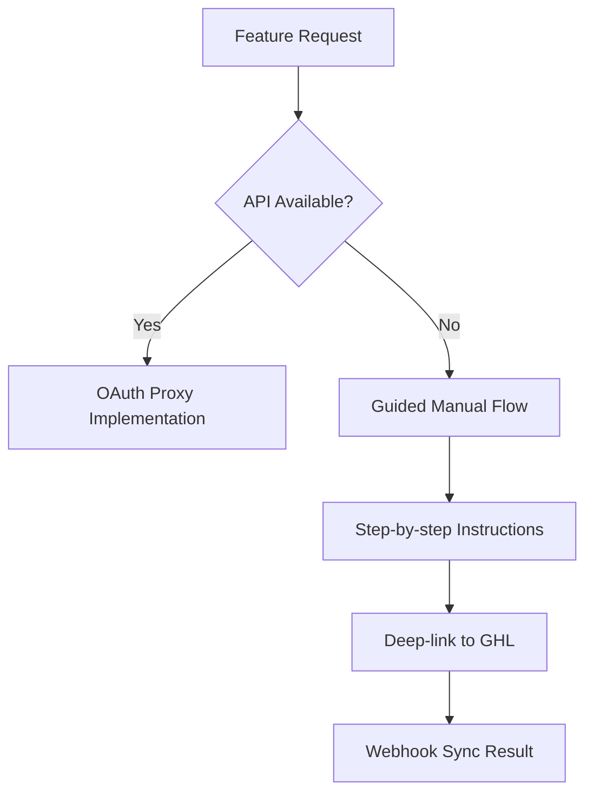

# GHL Proxy vs Embed Decision Matrix

**Status**: Final Decision Document  
**Related**: [ARCH-03 — GHL Encapsulation Strategy](https://github.com/raming/max-ai-platform/issues/56)  
**Linked ADR**: [ADR-0001: GHL Encapsulation Strategy](/ops/docs/adr/adr-0001-ghl-encapsulation.md)

## Executive Summary

This decision matrix evaluates two primary approaches for integrating GHL (GoHighLevel) functionality into our client portal: **OAuth Proxy** (server-side API integration) vs **Iframe Embed** (client-side iframe integration). Based on comprehensive analysis across security, maintainability, user experience, and technical criteria, **OAuth Proxy is the recommended approach**.

## Decision Criteria & Scoring

**Scoring Scale**: 1 (Poor) → 5 (Excellent)  
**Weight**: H (High), M (Medium), L (Low)

| Criterion | Weight | OAuth Proxy | Iframe Embed | Winner | Analysis |
|-----------|--------|-------------|--------------|--------|----------|
| **Security** | H | 5 | 2 | ✅ **Proxy** | Zero client exposure to GHL URLs/tokens vs potential XSS/CSRF risks |
| **Data Control** | H | 5 | 1 | ✅ **Proxy** | Full normalization & validation vs raw GHL data exposure |
| **Audit Trail** | H | 5 | 2 | ✅ **Proxy** | Complete server-side logging vs limited iframe visibility |
| **White-label UX** | H | 5 | 2 | ✅ **Proxy** | Native portal integration vs GHL branding in iframe |
| **API Coverage** | M | 4 | 3 | ✅ **Proxy** | Full REST/GraphQL access vs iframe UI limitations |
| **Mobile Responsiveness** | M | 5 | 2 | ✅ **Proxy** | Native responsive design vs iframe scaling issues |
| **Performance** | M | 4 | 3 | ✅ **Proxy** | Optimized queries & caching vs iframe load overhead |
| **Development Speed** | M | 3 | 4 | 📍 **Embed** | Custom UI development vs quick iframe integration |
| **Maintenance Effort** | M | 3 | 4 | 📍 **Embed** | API changes require updates vs iframe auto-updates |
| **Feature Completeness** | L | 4 | 5 | 📍 **Embed** | API gaps possible vs full GHL UI available |
| **Offline Support** | L | 4 | 1 | ✅ **Proxy** | Cached data available vs iframe requires internet |

### Weighted Score Calculation

**OAuth Proxy Total**: (5×5 + 5×5 + 5×5 + 5×5) + (4×3 + 5×3 + 4×3) + (4×1 + 4×1) = **100 + 39 + 8 = 147**

**Iframe Embed Total**: (2×5 + 1×5 + 2×5 + 2×5) + (3×3 + 2×3 + 3×3) + (5×1 + 1×1) = **35 + 24 + 6 = 65**

**Result**: OAuth Proxy scores **147/180 (82%)** vs Iframe Embed **65/180 (36%)**

## Detailed Comparison

### 1. Security Analysis

#### OAuth Proxy ✅
```typescript
// Server-side token management
interface SecureFlow {
  clientBrowser: "Never sees GHL URLs or tokens";
  tokenStorage: "Google Secret Manager with encryption";
  apiAccess: "Server-to-server with audit logging";
  dataValidation: "JSON Schema validation before client delivery";
}
```

**Benefits:**
- Zero attack surface for client-side XSS/CSRF on GHL tokens
- Server-side request validation and sanitization  
- Encrypted token storage with rotation
- Complete audit trail of all GHL interactions

#### Iframe Embed ❌
```html
<!-- Potential security risks -->
<iframe src="https://app.gohighlevel.com/..." />
<!-- Client has access to postMessage, cookies, localStorage -->
```

**Risks:**
- Client-side exposure to GHL session tokens
- Potential for XSS attacks through iframe communication
- Limited control over GHL's security practices
- Difficult to audit cross-origin interactions

### 2. User Experience Comparison

#### OAuth Proxy ✅
```jsx
// Native portal integration
<ReviewsList>
  <ReviewCard review={normalizedReview} />
  <Pagination page={currentPage} />
  <FilterControls filters={customFilters} />
</ReviewsList>
```

**Benefits:**
- Seamless portal branding and design system
- Mobile-first responsive design
- Custom filtering, sorting, and search
- Progressive web app capabilities

#### Iframe Embed ❌
```jsx
// Limited customization
<iframe 
  src="ghl-reviews-url"
  style={{width: '100%', height: '600px'}}
  // No control over internal content
/>
```

**Limitations:**
- GHL branding visible to end users
- Fixed layout not matching portal design
- Mobile responsiveness depends on GHL's implementation
- No custom business logic integration

### 3. API Coverage & Flexibility

#### OAuth Proxy ✅
```typescript
// Full API control with normalization
interface ReviewsAPI {
  async getReviews(filters: CustomFilters): Promise<Review[]>;
  async respondToReview(reviewId: string, response: string): Promise<void>;
  async generateAIResponse(reviewId: string): Promise<string>;
  async bulkActions(action: BulkAction, reviewIds: string[]): Promise<void>;
}
```

**Capabilities:**
- Custom business logic and workflows
- AI-powered response generation
- Bulk operations and automation
- Integration with internal systems (CRM, notifications, etc.)

#### Iframe Embed ❌
```javascript
// Limited to iframe postMessage API
window.postMessage({
  action: 'getReviews',
  // Limited parameter options
}, 'https://app.gohighlevel.com');
```

**Limitations:**
- Restricted to GHL's iframe API capabilities
- No custom business logic integration
- Limited bulk operations
- No AI enhancement possibilities

### 4. Data Control & Compliance

#### OAuth Proxy ✅
```typescript
// Complete data transformation pipeline
interface DataPipeline {
  ingestion: "Raw GHL data → JSON Schema validation";
  normalization: "GHL format → Canonical format";
  enrichment: "AI sentiment analysis + custom tagging";
  storage: "Encrypted tenant-isolated database";
  delivery: "Filtered & formatted for client consumption";
}
```

**Benefits:**
- GDPR/CCPA compliance through data minimization
- Custom data retention policies
- Sensitive data redaction capabilities
- Full audit trail for compliance reporting

#### Iframe Embed ❌
```html
<!-- No control over data flow -->
<iframe src="ghl-url">
  <!-- All data flows directly between GHL and client -->
  <!-- No interception, validation, or audit possible -->
</iframe>
```

**Risks:**
- No data governance controls
- Direct client exposure to potentially sensitive data
- Limited compliance audit capabilities
- Dependency on GHL's data practices

### 5. Implementation Complexity

#### OAuth Proxy 📍
```typescript
// Moderate complexity with existing architecture
class GHLProxyService {
  tokenRefresh: "Leverage existing token management";
  apiIntegration: "Build on ports/adapters pattern";
  normalization: "Implement schema transformations";
  caching: "Redis-based response caching";
  monitoring: "Leverage existing observability stack";
}
```

**Effort Estimate:**
- **Initial Development**: 3-4 weeks for reviews + calendar
- **Ongoing Maintenance**: 1-2 days/month for API changes
- **Existing Infrastructure**: 70% reusable (token mgmt, schemas, etc.)

#### Iframe Embed 📍
```html
<!-- Lower initial complexity -->
<iframe
  src="https://app.gohighlevel.com/widget/reviews"
  onLoad={() => setupPostMessageHandlers()}
/>
```

**Effort Estimate:**
- **Initial Development**: 3-5 days for basic integration
- **Ongoing Maintenance**: 2-3 days/month for iframe updates
- **Feature Limitations**: High risk of functional gaps

## Risk Analysis

### OAuth Proxy Risks
| Risk | Likelihood | Impact | Mitigation |
|------|------------|--------|------------|
| GHL API changes break integration | Medium | Medium | Comprehensive test suite + API versioning |
| Token refresh failures | Low | High | Existing robust token management system |
| Performance bottleneck | Low | Medium | Caching + async processing patterns |
| Development timeline overrun | Medium | Low | Incremental delivery + existing patterns |

### Iframe Embed Risks  
| Risk | Likelihood | Impact | Mitigation |
|------|------------|--------|------------|
| Security vulnerabilities | High | High | Limited - depends on GHL security practices |
| UX inconsistency issues | High | Medium | Custom CSS overlays (limited effectiveness) |
| Mobile compatibility problems | Medium | High | Responsive iframe containers (partial solution) |
| Feature gaps in iframe API | High | Medium | Fallback to guided manual flows |
| GHL UI changes break integration | Medium | Medium | Regular testing + iframe version pinning |

## Decision Recommendation: OAuth Proxy

### Primary Justification

1. **Security Excellence**: Zero client exposure to sensitive GHL tokens and URLs
2. **Strategic Control**: Full data governance and audit capabilities  
3. **User Experience**: Native portal integration with white-label branding
4. **Scalability**: Foundation for AI enhancements and custom workflows

### Implementation Strategy

#### Phase 1: Core OAuth Proxy (Weeks 1-2)
- Leverage existing GHL token management architecture
- Implement reviews OAuth proxy with basic CRUD operations
- Create normalized data models and transformation pipeline

#### Phase 2: Calendar Integration (Weeks 3-4) 
- Extend OAuth proxy for calendar/appointments
- Implement webhook handling for real-time updates
- Add custom business logic (AI response generation, etc.)

#### Phase 3: Enhanced Features (Weeks 5-6)
- Advanced filtering and search capabilities  
- Bulk operations and automation workflows
- Mobile optimization and PWA features

### Fallback Strategy

For any features where GHL API gaps are discovered:



## Monitoring & Success Metrics

### Technical Metrics
- **API Response Times**: Target <200ms for cached data, <1s for live data
- **Token Refresh Success Rate**: Target >99%
- **Data Sync Accuracy**: Target >99.9% with automated reconciliation

### Business Metrics  
- **User Engagement**: Time spent in reviews/calendar vs bouncing to GHL
- **Feature Adoption**: Usage rates of AI enhancements and custom workflows
- **Client Satisfaction**: NPS scores for integration vs native GHL experience

### Security Metrics
- **Zero Token Exposure**: No client-side GHL token incidents
- **Audit Completeness**: 100% of GHL interactions logged and traceable
- **Compliance Reports**: Automated GDPR/CCPA compliance documentation

---

**Final Decision**: **OAuth Proxy** is the recommended approach based on superior security, data control, user experience, and strategic value despite higher initial development effort.

**Decision Authority**: Team Lead (casey-brooks)  
**Decision Date**: 2025-01-27  
**Review Date**: Phase 1 completion (target: 2025-02-15)

**References:**
- [ADR-0001: GHL Encapsulation Strategy](/ops/docs/adr/adr-0001-ghl-encapsulation.md)
- [GHL OAuth Proxy Sequences](/ops/docs/design/ghl-oauth-proxy-sequences.md)
- [GHL Token Management Architecture](/ops/docs/design/ghl-token-management-architecture.md)