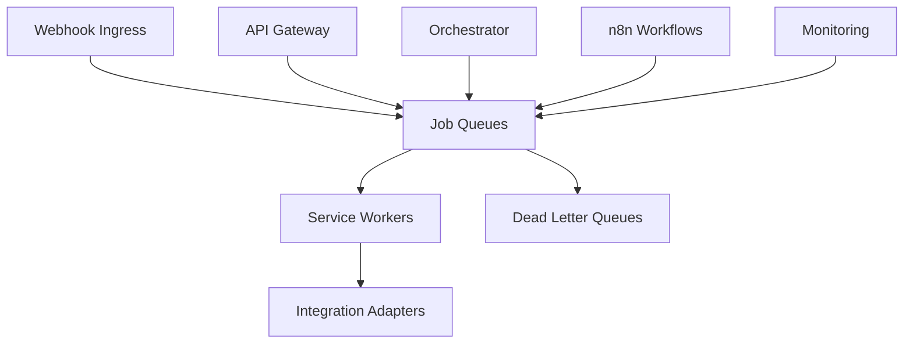
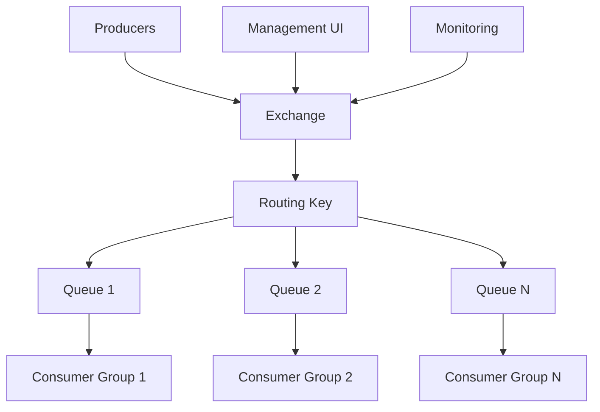

# Messaging Backbone Architecture Specification

## Purpose

This document provides a comprehensive architecture specification for the MaxAI Platform messaging backbone, centered on BullMQ/Redis for reliable asynchronous processing with clear escalation criteria for enterprise message brokers in future phases.

## Architecture Overview

### Core Design Principles

1. **Separation of Concerns**: Clear boundaries between job queues (BullMQ), workflow engines (n8n), and message brokers (future)
2. **Progressive Complexity**: Start simple with BullMQ, evolve to RabbitMQ/Kafka only when scale demands
3. **Reliability First**: Comprehensive retry strategies, dead letter queues, and monitoring
4. **Multi-Tenant Isolation**: Queue isolation and resource limits per tenant
5. **Observability**: Full tracing, metrics, and audit trails

### System Context



## BullMQ Architecture Design

### Queue Topology

#### Primary Queues

**1. Ingress Processing Queue** (`ingress-events`)
- **Purpose**: Process incoming webhook events from external providers
- **Priority**: High (critical path)
- **Concurrency**: 20 workers
- **Max Memory**: 256MB per worker

**2. Orchestration Queue** (`orchestration-flows`) 
- **Purpose**: Execute declarative flow steps and adapter calls
- **Priority**: High (business logic)
- **Concurrency**: 15 workers
- **Max Memory**: 512MB per worker

**3. Integration Queue** (`integration-tasks`)
- **Purpose**: External API calls and adapter operations
- **Priority**: Medium (external dependencies)
- **Concurrency**: 10 workers
- **Max Memory**: 128MB per worker

**4. Notification Queue** (`notifications`)
- **Purpose**: Email, SMS, and internal notifications
- **Priority**: Medium (user experience)
- **Concurrency**: 8 workers
- **Max Memory**: 64MB per worker

**5. Analytics Queue** (`analytics-events`)
- **Purpose**: Usage collection, billing aggregation, reporting
- **Priority**: Low (batch processing)
- **Concurrency**: 5 workers
- **Max Memory**: 256MB per worker

#### Queue Configuration Standards

```typescript
interface QueueConfig {
  name: string;
  redis: Redis.RedisOptions;
  defaultJobOptions: {
    removeOnComplete: number;    // Keep last 100 completed jobs
    removeOnFail: number;        // Keep last 50 failed jobs
    attempts: number;            // Retry attempts
    backoff: {
      type: 'exponential';
      delay: number;             // Initial delay in ms
    };
    delay: number;               // Initial delay for scheduled jobs
  };
  settings: {
    stalledInterval: number;     // 30 seconds
    maxStalledCount: number;     // 1 (move to failed immediately)
  };
}
```

### Retry and Backoff Strategy

#### Exponential Backoff Configuration

**Standard Retry Pattern**:
- **Initial Delay**: 5 seconds
- **Multiplier**: 2x
- **Max Attempts**: 5
- **Max Delay**: 300 seconds (5 minutes)
- **Jitter**: ±25% randomization to prevent thundering herd

**Queue-Specific Overrides**:

```typescript
const retryStrategies: Record<string, RetryConfig> = {
  'ingress-events': {
    attempts: 5,
    backoff: { type: 'exponential', delay: 2000 },
    // Critical path - shorter delays
  },
  'orchestration-flows': {
    attempts: 3, 
    backoff: { type: 'exponential', delay: 5000 },
    // Business logic - moderate retries
  },
  'integration-tasks': {
    attempts: 7,
    backoff: { type: 'exponential', delay: 10000 },
    // External APIs - longer retries for transient failures
  },
  'notifications': {
    attempts: 5,
    backoff: { type: 'exponential', delay: 30000 },
    // User notifications - delayed but persistent
  },
  'analytics-events': {
    attempts: 3,
    backoff: { type: 'exponential', delay: 60000 },
    // Analytics - can tolerate delays
  }
};
```

### Dead Letter Queue (DLQ) Architecture

#### DLQ Configuration

**Automatic DLQ Routing**: Jobs automatically move to DLQ after max retry attempts exceeded
**DLQ Naming**: `{original-queue}-dlq` (e.g., `ingress-events-dlq`)
**Retention**: 30 days for forensic analysis
**Alerting**: Immediate notification on DLQ job arrival

#### DLQ Processing Strategy

```typescript
interface DLQProcessor {
  // Analyze failed jobs for patterns
  analyzeFailed(jobs: FailedJob[]): AnalysisReport;
  
  // Attempt manual reprocessing with fixes
  reprocess(jobId: string, fixes?: JobFix[]): Promise<boolean>;
  
  // Generate alerts for operational team
  createAlert(pattern: FailurePattern): Promise<void>;
  
  // Purge old DLQ entries
  cleanup(olderThan: Date): Promise<number>;
}
```

### Idempotency Strategy

#### Idempotency Key Generation

**Format**: `{tenant_id}:{job_type}:{content_hash}:{timestamp_window}`
**Content Hash**: SHA-256 of critical job data fields
**Timestamp Window**: 5-minute windows to handle duplicate events
**Storage**: Redis hash with 24-hour TTL

#### Implementation Pattern

```typescript
interface IdempotentJob {
  jobId: string;
  idempotencyKey: string;
  tenantId: string;
  data: Record<string, any>;
  metadata: {
    correlationId: string;
    userId?: string;
    source: string;
    createdAt: Date;
  };
}

class IdempotencyManager {
  async processWithIdempotency(job: IdempotentJob): Promise<ProcessResult> {
    const key = this.generateKey(job);
    const existingResult = await this.redis.hget('idempotency', key);
    
    if (existingResult) {
      return JSON.parse(existingResult);
    }
    
    const result = await this.processJob(job);
    await this.redis.hsetex('idempotency', 86400, key, JSON.stringify(result));
    
    return result;
  }
}
```

## Queue Management and Operations

### Queue Monitoring

#### Key Metrics

**Performance Metrics**:
- Jobs processed per second (by queue)
- Average processing time per job type
- Queue depth and wait times
- Worker utilization rates
- Memory usage per worker

**Reliability Metrics**:
- Job success rate (by queue)
- Retry rates and patterns
- DLQ arrival rates
- Idempotency hit rates
- Error distribution by type

**Business Metrics**:
- End-to-end flow completion rates
- SLA compliance (processing within time bounds)
- Tenant resource consumption
- Cost attribution per job type

#### Monitoring Implementation

```typescript
interface QueueMetrics {
  // Real-time metrics
  activeCounts: Record<string, number>;
  waitingCounts: Record<string, number>;
  completedCounts: Record<string, number>;
  failedCounts: Record<string, number>;
  
  // Performance metrics
  avgProcessingTime: Record<string, number>;
  throughputPerSecond: Record<string, number>;
  
  // Health metrics
  workerUtilization: Record<string, number>;
  memoryUsage: Record<string, number>;
}

class MetricsCollector {
  async collectMetrics(): Promise<QueueMetrics> {
    // Aggregate metrics from all queues
    // Export to Prometheus/DataDog
    // Trigger alerts on thresholds
  }
}
```

### Queue Administration

#### Administrative Operations

**Queue Management**:
- Pause/resume queues for maintenance
- Adjust worker concurrency dynamically
- Drain queues for graceful shutdowns
- Monitor queue health and resource usage

**Job Management**:
- Retry failed jobs manually
- Cancel stuck jobs
- Inspect job data and processing logs
- Bulk operations on job sets

**Performance Tuning**:
- Adjust retry parameters based on patterns
- Optimize queue priorities
- Scale workers based on load
- Configure memory limits per job type

#### Admin Interface Design

```typescript
interface QueueAdmin {
  // Queue Operations
  pauseQueue(queueName: string): Promise<void>;
  resumeQueue(queueName: string): Promise<void>;
  drainQueue(queueName: string, timeout?: number): Promise<void>;
  
  // Job Operations
  retryJob(jobId: string): Promise<boolean>;
  cancelJob(jobId: string): Promise<boolean>;
  getJobLogs(jobId: string): Promise<JobLog[]>;
  
  // Bulk Operations
  retryFailedJobs(queueName: string, filter?: JobFilter): Promise<number>;
  purgeCompletedJobs(queueName: string, olderThan: Date): Promise<number>;
  
  // Performance
  scaleWorkers(queueName: string, workerCount: number): Promise<void>;
  updateJobOptions(queueName: string, options: JobOptions): Promise<void>;
}
```

## Multi-Tenant Architecture

### Tenant Isolation

#### Queue-Level Isolation

**Approach**: Tenant-specific queue prefixes for critical workloads
**Pattern**: `tenant-{tenant_id}-{queue_name}`
**Use Cases**: High-volume tenants, compliance requirements, SLA guarantees

#### Job-Level Isolation  

**Standard Approach**: Shared queues with tenant identification
**Tenant Context**: Every job includes `tenantId` in metadata
**Resource Limits**: Per-tenant memory and CPU quotas
**Priority Handling**: Tenant-based job prioritization

### Resource Management

#### Per-Tenant Limits

```typescript
interface TenantLimits {
  tenantId: string;
  limits: {
    maxConcurrentJobs: number;        // Max simultaneous jobs
    maxJobsPerMinute: number;         // Rate limiting
    maxMemoryPerJob: number;          // Memory constraints
    maxProcessingTime: number;        // Timeout limits
    priorityWeight: number;           // Queue priority (1-10)
  };
  quotas: {
    dailyJobLimit?: number;          // Jobs per day limit
    monthlyProcessingMinutes?: number; // CPU time quota
    storageQuotaMB?: number;         // Data storage limit
  };
}
```

#### Resource Enforcement

```typescript
class TenantResourceManager {
  async checkLimits(tenantId: string, jobType: string): Promise<boolean> {
    const limits = await this.getLimits(tenantId);
    const current = await this.getCurrentUsage(tenantId);
    
    return this.validateLimits(limits, current, jobType);
  }
  
  async enforceQuotas(tenantId: string): Promise<QuotaStatus> {
    // Check daily/monthly quotas
    // Apply throttling if limits exceeded
    // Generate quota notifications
  }
}
```

## Integration Patterns

### Service Integration

#### Producer Patterns

**Webhook Ingress Integration**:
```typescript
class WebhookIngressProducer {
  async processWebhook(event: WebhookEvent): Promise<void> {
    const job = {
      id: `webhook-${event.id}`,
      data: {
        provider: event.provider,
        eventType: event.type,
        payload: event.payload,
        tenantId: event.tenantId,
        receivedAt: new Date()
      },
      opts: {
        priority: this.getEventPriority(event.type),
        delay: 0,
        attempts: 5
      }
    };
    
    await this.ingressQueue.add('process-webhook', job.data, job.opts);
  }
}
```

**Orchestrator Integration**:
```typescript
class OrchestrationProducer {
  async executeFlow(flowSpec: FlowSpecification): Promise<string> {
    const jobId = `flow-${flowSpec.id}-${Date.now()}`;
    
    await this.orchestrationQueue.add('execute-flow', {
      flowId: flowSpec.id,
      tenantId: flowSpec.tenantId,
      steps: flowSpec.steps,
      bindings: flowSpec.bindings,
      context: flowSpec.context
    }, {
      jobId,
      priority: flowSpec.priority || 5,
      attempts: 3
    });
    
    return jobId;
  }
}
```

#### Consumer Patterns

**Generic Worker Template**:
```typescript
abstract class BaseWorker {
  protected abstract processJob(job: Job): Promise<void>;
  
  async initialize(queueName: string, concurrency: number): Promise<void> {
    this.worker = new Worker(queueName, async (job) => {
      const startTime = Date.now();
      const correlationId = job.data.correlationId || uuid();
      
      try {
        // Add correlation context
        this.logger.setContext({ correlationId, tenantId: job.data.tenantId });
        
        // Process job with timeout
        await this.processWithTimeout(job);
        
        // Record metrics
        this.metrics.recordSuccess(queueName, Date.now() - startTime);
        
      } catch (error) {
        this.logger.error('Job processing failed', { error, jobId: job.id });
        this.metrics.recordFailure(queueName, error.message);
        throw error; // Let BullMQ handle retries
      }
    }, {
      concurrency,
      connection: this.redis
    });
  }
}
```

### n8n Integration

#### Workflow Delegation

**Pattern**: BullMQ jobs trigger n8n workflows for complex processing
**Use Cases**: Multi-step workflows, human-in-the-loop, visual flow design
**Data Flow**: BullMQ → n8n Webhook → n8n Workflow → BullMQ Response

```typescript
class N8nWorkflowAdapter {
  async delegateToWorkflow(workflowId: string, data: any): Promise<WorkflowResult> {
    // Add to integration queue for n8n execution
    const jobId = `n8n-${workflowId}-${Date.now()}`;
    
    await this.integrationQueue.add('execute-n8n-workflow', {
      workflowId,
      inputData: data,
      callbackQueue: 'orchestration-flows',
      callbackJobId: `${jobId}-callback`
    }, {
      jobId,
      attempts: 3,
      priority: 7 // Higher priority for delegated workflows
    });
    
    return { jobId, status: 'delegated' };
  }
  
  async handleWorkflowCallback(result: N8nWorkflowResult): Promise<void> {
    // Process n8n workflow completion
    // Continue orchestration flow if needed
    // Handle errors and retries
  }
}
```

## Performance and Scaling

### Performance Requirements

#### Throughput Targets

**Production Scale Targets**:
- **Ingress Queue**: 1,000 jobs/minute sustained
- **Orchestration Queue**: 500 flows/minute sustained
- **Integration Queue**: 2,000 API calls/minute sustained
- **Total Throughput**: 5,000+ jobs/minute across all queues

#### Latency Targets

**Processing Latency (P95)**:
- **Ingress Events**: < 30 seconds end-to-end
- **Simple Orchestration**: < 60 seconds end-to-end
- **Integration Calls**: < 15 seconds per call
- **Notifications**: < 120 seconds end-to-end

### Scaling Strategy

#### Horizontal Scaling

**Worker Scaling**:
- Container-based workers with auto-scaling
- CPU and memory-based scaling triggers
- Queue depth-based scaling decisions
- Multi-availability zone deployment

**Redis Scaling**:
- Redis Cluster for high availability
- Read replicas for metrics collection
- Memory optimization and eviction policies
- Backup and disaster recovery

#### Performance Optimization

```typescript
interface PerformanceConfig {
  // Worker optimization
  workerConcurrency: Record<string, number>;
  workerMemoryLimits: Record<string, number>;
  
  // Redis optimization
  redisMaxMemory: string;
  redisEvictionPolicy: 'allkeys-lru';
  redisConnectionPool: number;
  
  // Job optimization
  jobTimeouts: Record<string, number>;
  batchProcessing: boolean;
  prefetchCount: number;
}
```

## Migration and Upgrade Strategy

### BullMQ Version Management

#### Upgrade Process

**Version Compatibility**: Maintain compatibility across minor versions
**Rolling Updates**: Deploy new workers before updating producers
**Feature Flags**: Control new features via feature flag system
**Rollback Plan**: Quick rollback to previous stable version

#### Data Migration

```typescript
interface MigrationPlan {
  version: string;
  changes: MigrationStep[];
  rollbackSteps: RollbackStep[];
  validationQueries: string[];
}

class QueueMigrator {
  async migrateQueues(fromVersion: string, toVersion: string): Promise<MigrationResult> {
    // Pause job processing
    // Migrate job data structures
    // Update queue configurations
    // Resume with validation
  }
}
```

## Escalation Criteria to Enterprise Message Brokers

### RabbitMQ Migration Triggers

#### Scale Thresholds

**Message Volume**:
- \> 50,000 messages/minute sustained
- \> 10GB/day message throughput
- \> 100 concurrent producers

**Complexity Requirements**:
- Complex routing patterns needed
- Message TTL and expiration policies
- Publisher confirms and consumer acknowledgments
- Clustering and federation requirements

**Operational Requirements**:
- Advanced monitoring and management UI
- Message tracing and debugging tools
- Fine-grained access controls
- Integration with enterprise monitoring

#### RabbitMQ Architecture Design



**Migration Strategy**:
1. **Phase 1**: Parallel deployment (BullMQ + RabbitMQ)
2. **Phase 2**: Selective queue migration (high-volume first)
3. **Phase 3**: Complete migration and BullMQ decommission

### Kafka Migration Triggers

#### Event Streaming Requirements

**Use Cases**:
- Real-time analytics and reporting
- Event sourcing patterns
- Cross-service event broadcasting
- Audit log streaming
- Complex event processing

**Scale Thresholds**:
- \> 1 million events/hour
- \> 100GB/day event data
- \> 1,000 event consumers
- Long-term event retention (months/years)

#### Kafka Integration Architecture

```typescript
interface KafkaIntegration {
  // Event sourcing
  publishDomainEvent(event: DomainEvent): Promise<void>;
  
  // Stream processing
  createEventStream(topic: string, processor: StreamProcessor): Promise<void>;
  
  // Analytics integration
  streamToAnalytics(events: EventStream): Promise<void>;
  
  // Cross-service communication
  publishServiceEvent(service: string, event: ServiceEvent): Promise<void>;
}
```

### Migration Decision Framework

#### Evaluation Criteria

```typescript
interface MigrationEvaluation {
  currentMetrics: {
    averageThroughput: number;        // msgs/min
    peakThroughput: number;           // msgs/min
    averageLatency: number;           // ms
    errorRate: number;                // %
    operationalComplexity: number;    // 1-10 scale
  };
  
  requirements: {
    requiredThroughput: number;
    requiredLatency: number;
    durabilityRequirements: string[];
    routingComplexity: number;
    integrationNeeds: string[];
  };
  
  costs: {
    developmentEffort: number;        // person-weeks
    infrastructureCosts: number;      // $/month
    operationalOverhead: number;      // hours/week
    migrationRisk: number;            // 1-10 scale
  };
}
```

#### Decision Matrix

| Criteria | BullMQ/Redis | RabbitMQ | Kafka | Weight |
|----------|--------------|----------|-------|---------|
| Throughput (< 10K/min) | 9 | 8 | 6 | 25% |
| Latency (< 1min) | 9 | 8 | 7 | 20% |
| Operational Simplicity | 9 | 6 | 4 | 20% |
| Feature Richness | 6 | 9 | 8 | 15% |
| Ecosystem Integration | 7 | 8 | 9 | 10% |
| Cost Efficiency | 9 | 7 | 6 | 10% |

## Implementation Roadmap

### Phase 1: Foundation (Weeks 1-2)

#### Week 1: Core Infrastructure
- **Day 1-2**: Redis setup and BullMQ installation
- **Day 3-4**: Basic queue configuration and worker templates
- **Day 5**: Initial monitoring and logging integration

#### Week 2: Queue Implementation
- **Day 1-2**: Implement ingress and orchestration queues
- **Day 3-4**: Integration and notification queues
- **Day 5**: DLQ configuration and basic admin tools

### Phase 2: Production Features (Weeks 3-4)

#### Week 3: Advanced Features
- **Day 1-2**: Idempotency management implementation
- **Day 3-4**: Multi-tenant resource management
- **Day 5**: Performance optimization and tuning

#### Week 4: Operations and Monitoring
- **Day 1-2**: Comprehensive monitoring dashboard
- **Day 3-4**: Alerting and automated responses
- **Day 5**: Documentation and operational runbooks

### Phase 3: Scale and Optimize (Weeks 5-6)

#### Week 5: Performance and Scale Testing
- **Day 1-3**: Load testing and performance benchmarking
- **Day 4-5**: Optimization based on test results

#### Week 6: Production Readiness
- **Day 1-2**: Security review and hardening
- **Day 3-4**: Disaster recovery and backup procedures
- **Day 5**: Go-live preparation and final validation

## Success Metrics

### Technical Metrics

**Performance**:
- **Throughput**: > 5,000 jobs/minute sustained
- **Latency**: P95 < 60 seconds for business flows
- **Reliability**: > 99.9% job success rate
- **Recovery**: < 5 minutes to recover from failures

**Operational**:
- **Availability**: > 99.95% queue system uptime
- **Monitoring**: 100% job visibility and tracing
- **Alerting**: < 60 seconds alert time for critical issues
- **Administration**: < 10 minutes for routine operations

### Business Metrics

**User Experience**:
- **Flow Completion**: > 99% end-to-end flow success
- **Response Time**: < 30 seconds for user-facing operations
- **Error Recovery**: Automatic recovery for > 95% of failures

**Cost Efficiency**:
- **Infrastructure**: < $500/month for Phase 1 scale
- **Operations**: < 2 hours/week manual intervention
- **Scaling**: Linear cost scaling with load

## Security and Compliance

### Security Architecture

#### Data Protection

**Encryption**:
- **In Transit**: TLS 1.3 for all Redis connections
- **At Rest**: Redis encryption enabled
- **Job Data**: Sensitive data encryption at application level

**Access Control**:
- **Redis Auth**: Strong password authentication
- **Network Security**: VPC isolation and firewall rules
- **Service Authentication**: Mutual TLS between services

#### Audit and Compliance

```typescript
interface SecurityAuditLog {
  timestamp: Date;
  tenantId?: string;
  userId?: string;
  operation: string;          // job-created, job-processed, queue-paused
  queueName: string;
  jobId?: string;
  result: 'success' | 'failure';
  metadata: Record<string, any>;
  correlationId: string;
}
```

**Audit Requirements**:
- **Job Lifecycle**: Complete audit trail for all jobs
- **Administrative Actions**: Log all queue management operations
- **Access Patterns**: Monitor for anomalous access patterns
- **Retention**: 90-day audit log retention minimum

## References and Dependencies

### External Dependencies

**Runtime Dependencies**:
- **BullMQ**: ^5.0.0 (job queue framework)
- **Redis**: ^7.0.0 (message broker and cache)
- **ioredis**: ^5.0.0 (Redis client library)

**Development Dependencies**:
- **@types/bull**: TypeScript definitions
- **jest**: Testing framework
- **supertest**: API testing utilities

### Related Documentation

**Internal References**:
- [Architecture Overview](./architecture-overview.md)
- [ADR-0010: Messaging Backbone](../adr/adr-0010-messaging-backbone.md)
- [Phase 1 Release Plan](../release/phase-1.md)
- [Usage Aggregation ADR](../adr/adr-0002-usage-aggregation.md)
- [Declarative Flows ADR](../adr/adr-0005-declarative-flows.md)

**External References**:
- [BullMQ Documentation](https://docs.bullmq.io/)
- [Redis Documentation](https://redis.io/documentation)
- [Node.js Best Practices](https://github.com/goldbergyoni/nodebestpractices)

---

## Change History

- **2025-01-06**: Complete architecture specification and implementation guide
- **Initial**: Basic BullMQ proposal in ADR-0010